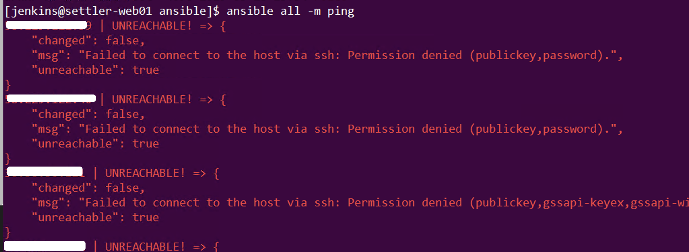

# 젠킨스로 앤서블(Ansible) 관리하기 - 신규 사용자 추가하기

## 1. 설치

Centos 6,7 관계 없이 yum repo에 기본적으로 등록 되어 있으니 바로 yum install 합니다.

```bash
sudo yum install ansible - y
```

## 2. 노드 설정

먼저 노드로 설정할 hosts를 등록합니다.  
root 권한이 필요하여 ```sudo```로 실행합니다.

```bash
sudo vim /etc/ansible/hosts
```

hosts 등록이 끝났다면 이제 ping 으로 간단하게 테스트를 해볼텐데요.  
  
이 포스팅의 목적이 젠킨스에서 관리하는 것이 목적인지라 젠킨스에서 ansible 실행을 목표로 합니다.  
그래서 모든 명령어 역시 젠킨스에서 실행하는 것을 가정하여 진행합니다.  
    
젠킨스 설치 후, 실행시 권한을 ```jenkins```로 했다면 **이 젠킨스는 스크립트를 jenkins 권한**으로 실행됩니다.


ansible 명령어 역시 같은 ```jenkins``` 권한으로 실행하는게 맞으니 아래와 같이 현재 사용자를 ```jenkins```로 변경하고 이후 과정을 진행합니다.

```
sudo -u jenkins /bin/bash
```

> ansible 명령어들은 대부분 755 권한을 갖고 있어 root가 아니여도 실행은 가능합니다.

변경이 되셨다면 아래와 같이 ping 테스트를 해봅니다.

```bash
ansible all -m ping
```

만약 아래와 같은 에러가 발생한다면 **공개키가 교환되지 않은 상태** 이기 때문입니다.  

```bash
호스트서버IP | FAILED! => {
    "failed": true, 
    "msg": "Using a SSH password instead of a key is not possible because Host Key checking is enabled and sshpass does not support this.  Please add this host's fingerprint to your known_hosts file to manage this host."
}
```

간단한 방법은 모두 ```yes```를 입력하는 것입니다.

```bash
The authenticity of host '호스트서버IP (호스트서버IP)' can't be established.
ECDSA key fingerprint is db:e7:b8:dc:e5:76:1a:18:9b:96:29:18:a1:90:1f:b7.
Are you sure you want to continue connecting (yes/no)? yes
호스트서버IP | UNREACHABLE! => {
    "changed": false, 
    "msg": "Failed to connect to the host via ssh: Permission denied (publickey,password).\r\n", 
    "unreachable": true
}
yes
호스트서버IP | UNREACHABLE! => {
    "changed": false, 
    "msg": "Failed to connect to the host via ssh: Permission denied (publickey,password).\r\n", 
    "unreachable": true
}
yes
호스트서버IP | UNREACHABLE! => {
    "changed": false, 
    "msg": "Failed to connect to the host via ssh: Permission denied (publickey,password).\r\n", 
    "unreachable": true
}
```

공개키 등록이 되었다면 아래 명령어로 ssh 비밀번호와 함께 ping 요청을 해봅니다.

```bash
ansible all -m ping -k
```
보통은 아래와 같이 권한 거부 에러가 발생합니다.



이는 hosts 로 등록된 서버들로 **ssh 접속시 password가 필요한데 입력하지 않아서** 발생한 것입니다.  
  
그래서 다음의 2가지 options을 추가합니다.

```bash
ansible all -m ping -k --user=모든호스트들이 공통으로 갖고 있는 계정
```

예를 들어 저 같은 경우 hosts로 등록된 모든 서버들은 ```dwlee```라는 계정이 있습니다.  
이 계정을 통해서 ansible 서버 -> hosts 서버들로 접근합니다.  

> Tip)
ansible 서버가 갖고 있는 사용자명이 아닙니다.  
각 hosts 서버 안에 생성되어있는 게정입니다.

만약 hosts로 등록된 서버들마다 갖고 있는 계정이 다르다면 아래와 같이 ```/etc/ansible/hosts```에 계정명을 함께 등록합니다.

```bash
호스트IP ansible_user=dwlee
```

> Tip)
여기서 각 **hosts 사용자의 비밀번호 역시 동일**하게 되어 있어야 합니다.  
host 마다 사용자/비밀번호가 다르면 host별로 명령어를 실행하거나 설정파일을 가지고 있어야 합니다.  
너무 번거로우니 웬만하면 **ansible 명령어를 수행해줄 사용자를 각 서버에 생성**하시는 것을 추천합니다.  
  
  
 ```--user``` 옵션까지 넣은뒤 다시 실행해보시면!

```bash
[jenkins@ansible서버 ansible-playbook]$ ansible all -m ping -k --user=dwlee
SSH password:
호스트1 | SUCCESS => {
    "changed": false,
    "ping": "pong"
}
호스트2 | SUCCESS => {
    "changed": false,
    "ping": "pong"
}
호스트3 | SUCCESS => {
    "changed": false,
    "ping": "pong"
}
...
```

정상적으로 결과가 출력 되는 것을 확인해볼 수 있습니다.  
  
 ```ping``` 외에 다른 모듈을 사용해보고 싶으시다면 ```shell```을 실행해봅니다.

```bash
ansible all -m shell -a "date" -k --user=dwlee
```

그럼 **전체 호스트의 date 스크립트 결과**가 출력 됩니다.

```bash
SSH password:
호스트1 | SUCCESS | rc=0 >>
2019. 07. 13. (토) 19:08:41 KST

호스트2 | SUCCESS | rc=0 >>
2019. 07. 13. (토) 19:08:41 KST

호스트3 | SUCCESS | rc=0 >>
2019. 07. 13. (토) 19:08:41 KST

...
```


### 사용자 임의로 추가해보기

간단하게 사용자를 하나 추가해보겠습니다.  
ansible에선 ```user```라는 모듈이 사용자 추가/삭제 기능을 지원하고 있습니다.  
이 모듈을 사용해서 다음과 같이 명령어를 수행하면 사용자가 생성됩니다.

```bash
ansible all -m user -a "name=jojoldu" -k --user=dwlee
```

만약 명령어 수행후 ```Permission denied``` 가 출력 된다면 현재 호스트 계정인 dwlee에 ```sudo``` 권한이 없기 때문인데요.  
  
그렇다고 ```dwlee``` 대신에 ```root``` 계정을 비밀번호와 함께 사용할 순 없습니다.  
그러니 이때는 명령어마다 ```sudo```를 줄 수 있게 ```ansible.cfg``` 에 옵션을 추가하면 됩니다.  
  
아래 명령어로 ```ansible.cfg``` 을 열어서

```bash
sudo vim /etc/ansible/ansible.cfg
```

아래와 같이 ```[privilege_escalation]``` 항목을 설정합니다.

```bash
[privilege_escalation]
become=True
become_method=sudo
become_user=root
#become_ask_pass=False
```

그리고 다시 사용자를 추가해보면!

```bash
[jenkins@ansible서버 ~]$ ansible all -m user -a "name=jojoldu" -k --user=dwlee
SSH password:
호스트1 | SUCCESS => {
    "append": false,
    "changed": true,
    "comment": "",
    "group": 514,
    "home": "/home/jojoldu",
    "move_home": false,
    "name": "jojoldu",
    "shell": "/bin/bash",
    "state": "present",
    "uid": 514
}
호스트2 | SUCCESS => {
    "append": false,
    "changed": true,
    "comment": "",
    "group": 515,
    "home": "/home/jojoldu",
    "move_home": false,
    "name": "jojoldu",
    "shell": "/bin/bash",
    "state": "present",
    "uid": 515
}
호스트3 | SUCCESS => {
    "append": false,
    "changed": true,
    "comment": "",
    "group": 515,
    "home": "/home/jojoldu",
    "move_home": false,
    "name": "jojoldu",
    "shell": "/bin/bash",
    "state": "present",
    "uid": 515
}
...
```

정상적으로 계정이 생성된 것을 확인할 수 있습니다.  
  
실제로 각 서버에 사용자가 추가되었는지도 ansible로 확인해봅니다.

```bash
ansible all -m shell -a "tail -n 1 /etc/passwd" -k --user=dwlee
```

그럼 다음과 같이 home 디렉토리에 사용자가 추가된 것을 확인할 수 있습니다.

```bash
호스트1 | SUCCESS | rc=0 >>
jojoldu:x:515:515::/home/jojoldu:/bin/bash

호스트2 | SUCCESS | rc=0 >>
jojoldu:x:515:515::/home/jojoldu:/bin/bash

호스트3 | SUCCESS | rc=0 >>
jojoldu:x:514:514::/home/jojoldu:/bin/bash

...
```

### 임의 추가된 사용자 삭제하기

삭제는 간단합니다.  
명령어에 ```state=absent``` 만 추가하면 됩니다.

```bash
ansible all -m user -a "name=jojoldu state=absent" -k --user=dwlee
```

다시 삭제되었는지 확인 해봅니다.

```bash
ansible all -m shell -a "tail -n 1 /etc/passwd" -k --user=dwlee
```

여기서 더이상 ```jojoldu``` 라는 사용자가 출력되지 않으면 삭제가 정상적으로 수행된 것을 알 수 있습니다.

### 패스워드 변경하기

파이썬의 암호화 모듈이 필요합니다.  

> 만약 pip가 설치되어 있지 않다면 (리눅스에서 파이썬2는 기본설치입니다.) ```yum install python-pip``` 로 설치해주세요.

```bash
yum install python-pip
```


```bash
ansible all -m user -a "name=jojoldu update_password=always password={{ '변경하고싶은 비밀번호' | password_hash('sha512') }}" -k --user=dwlee
```


```bash
echo 'jojoldu   ALL=(ALL)   NOPASSWD:ALL' > /etc/sudoers.d/jojoldu
```

```bash
ansible all -m shell -a "echo '$USER_NAME   ALL=(ALL)   NOPASSWD:ALL' > /etc/sudoers.d/$USER_NAME" -e "ansible_user=dwlee ansible_ssh_pass=비밀번호"
```

```bash
[web]
호스트1
호스트2

[db]
호스트3

[all:vars]
ansible_user=접속계정
ansible_ssh_pass=접속비밀번호
```


## 3. Playbook


ansible-playbook useradd.yml --extra-vars "USER_NAME=dwlee PASSWORD=패스워드