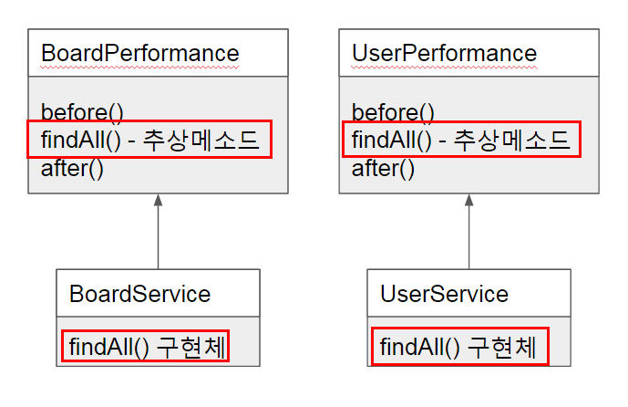
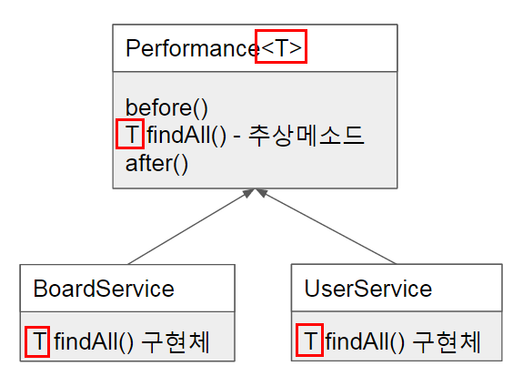
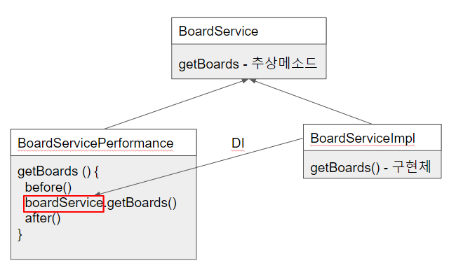
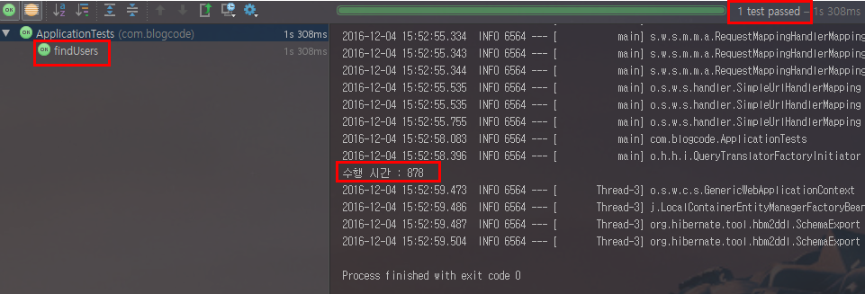
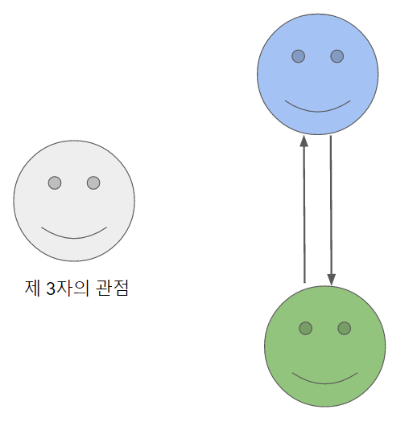
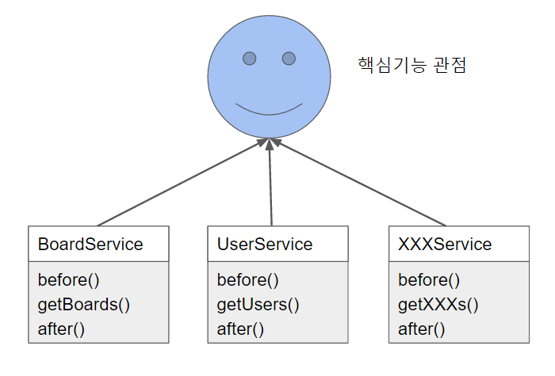
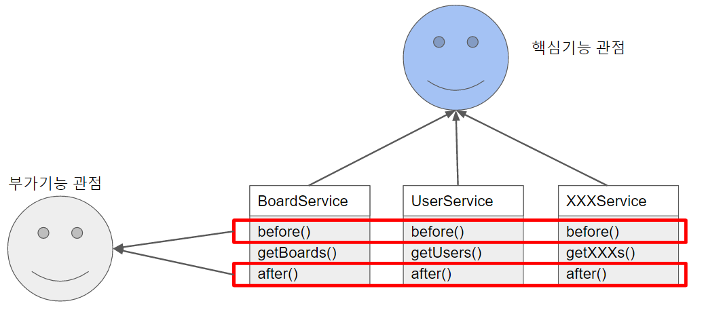

# AOP 시작하기
현재 신입사원 분들의 입사로 Spring에서 중요한 개념들에 대해 한번 정리하려고 작성하게 되었습니다. <br/>
Spring의 가장 중요한 개념 중 하나인 AOP를 제 나름의 이해로 정리할 예정입니다. 틀린 내용이 있다면 가감 없이 풀리퀘나 댓글 부탁드리겠습니다.<br/>
(공부한 내용을 정리하는 [Github](https://github.com/jojoldu/blog-code)와 세미나+책 후기를 정리하는 [Github](https://github.com/jojoldu/review)를 star 하시면 실시간으로 feed를 받을 수 있습니다.)
<br/>
Spring을 이해하는데 있어 최고는 토비님의 토비의 스프링을 읽어보는 것입니다. <br/>
제 블로그를 포함해서 대부분의 블로그의 내용들은 단발성에 지나지 않습니다. 이것만으로 Spring을 이해하는것은 사용만 하는것이지 이해한 것은 아니라고 개인적으로 생각하고 있습니다. <br/>
Spring의 이런 개념이 왜 나오게 된것인지, 어떻게 해결하고 해결하다보니 결국 이 형태가 된것인지 정말 상세하게 나오기 때문에 <br/>
객체지향과 Java를 좀 더 잘 이해하기 위해서라도 무조건 읽어보시길 추천드립니다. <br/>
### 문제 상황
하나의 게시판 서비스가 있다고 가정하겠습니다. <br/>
해당 게시판은 간단하게 구현하기 위해 SpringBoot + JPA + H2 + Gradle로 구현되었습니다. <br/>
**build.gradle**
```
buildscript {
	ext {
		springBootVersion = '1.4.2.RELEASE'
	}
	repositories {
		mavenCentral()
	}
	dependencies {
		classpath("org.springframework.boot:spring-boot-gradle-plugin:${springBootVersion}")
	}
}

apply plugin: 'java'
apply plugin: 'eclipse'
apply plugin: 'org.springframework.boot'

jar {
	baseName = 'aop'
	version = '0.0.1-SNAPSHOT'
}
sourceCompatibility = 1.8
targetCompatibility = 1.8

repositories {
	mavenCentral()
}


dependencies {
	compile('org.springframework.boot:spring-boot-starter-aop')
	compile('org.springframework.boot:spring-boot-starter-web')
	compile('org.springframework.boot:spring-boot-starter-data-jpa')

	runtime('org.springframework.boot:spring-boot-devtools')
	runtime('com.h2database:h2')

	testCompile('org.springframework.boot:spring-boot-starter-test')
}

```

**Board.java**
```
@Entity
public class Board {

    @Id
    @GeneratedValue
    private Long idx;

    @Column
    private String title;

    @Column
    private String content;

    public Board() {
    }

    public Board(String title, String content) {
        this.title = title;
        this.content = content;
    }

    public Long getIdx() {
        return idx;
    }

    public void setIdx(Long idx) {
        this.idx = idx;
    }

    public String getTitle() {
        return title;
    }

    public void setTitle(String title) {
        this.title = title;
    }

    public String getContent() {
        return content;
    }

    public void setContent(String content) {
        this.content = content;
    }
}
```

**BoardService.java**
```
@Service
public class BoardService {

    @Autowired
    private BoardRepository repository;

    public List<Board> getBoards() {
        return repository.findAll();
    }
}
```

**BoardRepository.java**
```
@Repository
public interface BoardRepository extends JpaRepository<Board, Long>{}
```
Board외에 User도 추가해보겠습니다.

**User.java**
```
@Entity
public class User {
    @Id
    @GeneratedValue
    private long idx;

    @Column
    private String email;

    @Column
    private String name;

    public User() {
    }

    public User(String email, String name) {
        this.email = email;
        this.name = name;
    }

    public long getIdx() {
        return idx;
    }

    public void setIdx(long idx) {
        this.idx = idx;
    }

    public String getEmail() {
        return email;
    }

    public void setEmail(String email) {
        this.email = email;
    }

    public String getName() {
        return name;
    }

    public void setName(String name) {
        this.name = name;
    }
}
```
**UserService.java**
```
@Service
public class UserService extends UserPerformance{

    @Autowired
    private UserRepository repository;

    @Override
    public List<User> getUsers() {
        return repository.findAll();
    }
}
```

**UserRepository.java**
```
@Repository
public interface UserRepository extends JpaRepository<User, Long>{
}

```

**Application.java**
```
@SpringBootApplication
@RestController
public class Application implements CommandLineRunner{

	@Autowired
	private BoardService boardService;

	@Autowired
	private BoardRepository boardRepository;

	@Autowired
	private UserService userService;

	@Autowired
	private UserRepository userRepository;

	@Override
	public void run(String... args) throws Exception {
		for(int i=1;i<=100;i++){
			boardRepository.save(new Board(i+"번째 게시글의 제목", i+"번째 게시글의 내용"));
			userRepository.save(new User(i+"@email.com", i+"번째 사용자"));
		}
	}

	@GetMapping("/boards")
	public List<Board> getBoards() {
		return boardService.getBoards();
	}

	@GetMapping("/users")
	public List<User> getUsers() {
		return userService.getUsers();
	}
	
	public static void main(String[] args) {
		SpringApplication.run(Application.class, args);
	}
}
```
게시글을 전체 조회, 단일 조회 기능이 있는 서비스입니다. 위와 같은 상황에서 각 기능별로 실행시간을 남겨야 하는 조건이 추가되었다고 가정해보겠습니다.<br/>
가장 쉬운 방법은 서비스 코드에서 직접 시간을 측정하여 남기는 것입니다. <br/>

**BoardService.java와 UserService.java**
```
    public List<Board> getBoards() {
        long start = System.currentTimeMillis();
        List<Board> boards = repository.findAll();
        long end = System.currentTimeMillis();

        System.out.println("수행 시간 : "+ (end - start));
        return boards;
    }
    
	public List<User> getUsers() {
	    long start = System.currentTimeMillis();
	    List<User> users = repository.findAll(); 
        long end = System.currentTimeMillis();

        System.out.println("수행 시간 : "+ (end - start));
		return users; 
	}
	
```
아주 쉽게 해결이 되었지만, 이게 정답일까요?? <br/>
현재 getXXX메소드들은 몇가지 문제가 있습니다. <br/>
* 각 메소드들이 본인의 역할에 집중하지 못한다.
  - 메소드들은 모두 **조회** 라는 기능을 위해 존재해야한다
  - 현재는 수행시간을 측정하고, 이를 출력하는것까지 포함되어 있다.
* 중복코드가 존재한다.
  - 수행시간 측정, 출력의 기능들이 중복되고 있다.

위와 같은 문제를 해결하려면 어떻게 해야할까요? <br/>
제일 먼저 떠올릴수 있는 것은 **상속** 인것 같습니다. <br/>
상속을 이용해서 한번 해결해보도록 하겠습니다. <br/>

### 문제해결하기 - 상속
이전시간에 이어 상속으로 문제를 해결해보도록 하겠습니다. <br/>

**BoardPerformance.java와 UserPerformance.java 추가**
```
public abstract class BoardPerformance {

    private long before() {
        return System.currentTimeMillis();
    }

    private void after(long start) {
        long end = System.currentTimeMillis();
        System.out.println("수행 시간 : "+ (end - start));
    }

    public List<Board> getBoards() {
        long start = before();
        List<Board> boards = findAll(); //구현은 자식 클래스에게 맡김
        after(start);

        return boards;
    }
    
    //추상메소드
    public abstract List<Board> findAll();
}

public abstract class UserPerformance {

    private long before() {
        return System.currentTimeMillis();
    }

    private void after(long start) {
        long end = System.currentTimeMillis();
        System.out.println("수행 시간 : "+ (end - start));
    }

    public List<User> getUsers() {
        long start = before();
        List<User> users = findAll(); //구현은 자식 클래스에게 맡김
        after(start);

        return users;
    }
    
    //추상메소드
    public abstract List<User> findAll();
}
```

**BoardService.java 와 UserService.java**
```
@Service
public class BoardService extends BoardPerformance {

    @Autowired
    private BoardRepository repository;

    @Override
    public List<Board> findAll() {
        return repository.findAll();
    }
}

@Service
public class UserService extends UserPerformance{

    @Autowired
    private UserRepository repository;

    @Override
    public List<User> findAll() {
        return repository.findAll();
    }
}
```



(구조도) <br/>
XXXPerformance 추상 클래스를 생성하여 메소드 실행순서를 강제하였습니다. <br/>
시작시간 (before) -> 실제 메소드 실행 -> 종료 및 출력으로 메소드가 실행될 것입니다. <br/>
자 이렇게 하고나니 각 Service 메소드들은 **본인의 역할에만 충실**할 수 있게 되었습니다. <br/>
하지만 아직 중복된 코드가 많이 남아있습니다. <br/>
이 부분은 **제네릭**을 통해 해결해보겠습니다. <br/>


(개편된 구조도) <br/>

**SuperPerformance.java**
```
public abstract class SuperPerformance<T> {
    private long before() {
        return System.currentTimeMillis();
    }

    private void after(long start) {
        long end = System.currentTimeMillis();
        System.out.println("수행 시간 : "+ (end - start));
    }

    public List<T> getDataAll() {
        long start = before();
        List<T> datas = findAll();
        after(start);

        return datas;
    }

    public abstract List<T> findAll();
}
```

**BoardService.java 와 UserService.java**
```
@Service
public class BoardService extends SuperPerformance<Board> {
    ....
}

@Service
public class UserService extends SuperPerformance<User> {
    ....
}
```

**Application.java**
```
	@GetMapping("/boards")
	public List<Board> getBoards() {
		return boardService.getDataAll();
	}

	@GetMapping("/users")
	public List<User> getUsers() {
		return userService.getDataAll();
	}
```
중복되던 before와 after의 문제를 해결하였습니다. <br/>
하지만 상속은 부모 클래스에 너무나 종속적인 문제 때문에 특별한 일이 있지 않는 이상 피하는 것이 좋습니다. ([이펙티브 자바](http://www.kyobobook.co.kr/product/detailViewKor.laf?barcode=9788966261161) 참고)<br/>
그래서 이 상속으로 범벅인 코드를 **DI (Dependency Injection)**으로 개선해보겠습니다. <br/>

### 문제해결하기 - DI
상속을 피하기 위해 이번시간엔 DI (Dependency Injection)를 통해 문제를 해결해보려고 합니다. <br/> 
제일 먼저 바꿀것은 BoardService 입니다. <br/>
전체적으로 바꿀 구조는 아래와 같습니다. <br/>



BoardService 인터페이스를 BoardServicePerformance와 BoardServiceImpl이 구현하였습니다. <br/>
대신 집중해야할 로직인 Board 리스트를 조회하는 것은 BoardServiceImpl이 담당하고, <br/>
기타옵션인 수행시간 측정은 BoardServicePerformance가 구현하되, 그 과정에서 BoardServiceImpl을 주입(Injection) 받도록 하였습니다. <br/>
이렇게 되면 BoardServiceImpl과 BoardServicePerformance는 **느슨한 관계**를 가지며, Board 리스트를 조회라는 기능은 BoardServiceImpl만 보면 되는 구조가 될 수 있습니다. <br/>
이를 직접 코드로 구현해보겠습니다. <br/>

**BoardService.java**

```
public interface BoardService {
    List<Board> getBoards();
}
```

**BoardServicePerformance.java**

```
@Service
@Primary
public class BoardServicePerformance implements BoardService{

    @Autowired
    @Qualifier("boardServiceImpl")
    private BoardService boardService;

    @Override
    public List<Board> getBoards() {
        long start = before();
        List<Board> boards = boardService.getBoards();
        after(start);

        return boards;
    }

    private long before() {
        return System.currentTimeMillis();
    }

    private void after(long start) {
        long end = System.currentTimeMillis();
        System.out.println("수행 시간 : "+ (end - start));
    }
}
```

**BoardServiceImpl.java**

```
@Service
public class BoardServiceImpl implements BoardService{

    @Autowired
    private BoardRepository repository;

    @Override
    public List<Board> getBoards() {
        return repository.findAll();
    }
}
```
지금부터는 테스트코드를 작성해서 테스트를 해보겠습니다. <br/>
지속적으로 결과를 확인하는데 있어서 브라우저에서 URL을 입력하며 확인하는 방식은 불편함이 많습니다. <br/>
테스트 코드를 통해 좀 더 수월하고 자동화된 테스트를 진행하겠습니다.

**ApplicationTests.java**
```
@RunWith(SpringRunner.class)
@SpringBootTest
public class ApplicationTests {

	@Autowired
	private BoardService boardService;

	@Test
	public void findBoards() throws Exception {
		assertThat(boardService.getBoards().size()).isEqualTo(100);
	}

}
```
자 이렇게 테스트 코드를 작성후에 코드가 잘 돌아가는지 확인해보겠습니다.


정상적으로 수행시간과 테스트결과가 통과되는 것을 확인하였습니다. <br/>
BoardService와 마찬가지고 UserService도 같은 구조로 코드를 작성해보겠습니다. <br/>
<br/>
**UserService.java**

```
public interface UserService {
    List<User> getUsers();
}

```

**UserServiceImpl.java**

```
@Service
public class UserServiceImpl implements UserService{

    @Autowired
    private UserRepository repository;

    @Override
    public List<User> getUsers() {
        return repository.findAll();
    }
}
```

**UserServicePerformance.java**
```
@Service
@Primary
public class UserServicePerformance implements UserService{

    @Autowired
    @Qualifier("userServiceImpl")
    private UserService userService;

    @Override
    public List<User> getUsers() {
        long start = before();
        List<User> users = userService.getUsers();
        after(start);
        return users;
    }

    private long before() {
        return System.currentTimeMillis();
    }

    private void after(long start) {
        long end = System.currentTimeMillis();
        System.out.println("수행 시간 : "+ (end - start));
    }
}
```
테스트를 위해 테스트 코드도 추가해보겠습니다.

**ApplicationTests.java**

```
	@Autowired
	private UserService userService;

	@Test
	public void findUsers() throws Exception {
		assertThat(userService.getUsers().size()).isEqualTo(100);
	}
```

테스트 코드를 작성후 실행해보면!



정상적으로 잘 되는 것을 확인할 수 있습니다. <br/>
기능은 정상적으로 잘되지만 코드가 깔끔하지 않고, 많은 관계가 필요한 상태입니다. <br/>
만약 getXXX외에 다른 메소드에도 이와 같은 수행시간출력 기능이 포함되어야된다면 코드는 어떻게 될까요? <br/>
Board와 User외에 다른 타입의 Service에 수행시간출력이 필요하면 어떻게 될까요? <br/>
실제 가장 중요한 비지니스 로직외에 **부가 기능**들에 대해서는 신경 쓰지 않도록 하려면 어떻게 해야할까요?? <br/>
이와 비슷한 경우로 메소드 실행전에 Connection을 open하고, 메소드가 정상적으로 실행완료 되면 commit을, 
예외 발생시엔 rollback을 처리하도록 하는 트랜잭션은 어떻게 처리되고 있기에 개발자가 비지니스 로직만 작성하면 될까요? <br/>
<br/>
이 의문에 대답하기 위해 AOP에 대해 학습을 시작해보겠습니다.

### AOP란?
Spring의 핵심 개념중 하나인 DI가 애플리케이션 모듈들 간의 결합도를 낮춰준다면, AOP는 **애플리케이션 전체에 걸쳐 사용되는 기능을 재사용**하도록 지원하는 것입니다. <br/>  
AOP (Aspect-Oriented Programming) 란 단어를 번역하면 **관점(관심) 지향 프로그래밍**으로 됩니다. <br/>
이 관점(관심)이란 단어가 잘 와닿지 않아 AOP를 이해하는데 있어 더 어려움을 일으킨다고 생각하였습니다. <br/>
쉽게 얘기하면 프로젝트 구조를 바라 보는 **관점**을 바꿔보자는 이야기입니다. <br/>
우리는 보통 제 3자의 관점에서 바라보자 라는 이야기를 합니다. <br/>



(제 3자의 관점) <br/>
즉, **대상을 바라보는 방향을 바꿔보자**라는 이야기입니다. <br/>



(핵심기능에서 바라본 관점) <br/>
각각의 Service는 핵심기능에서 바라보았을때는 Board 조회, User조회, XXX조회 등 **공통된 요소가 없습니다**. <br/>
이런 관점에서는 각각의 Service는 각자 코드를 구현하고 있다. 하지만, 이 관점을 돌려서 **부가기능** 이란 관점에서 바라보면 상황이 달라집니다. <br/>



(부가기능에서 바라본 관점)<br/>
부가기능의 관점에서 바라보면 각각의 Service는 수행시간 측정을 나타내는 before라는 메소드와 after라는 메소드가 공통되는 것을 알 수 있습니다. <br/>
AOP는 여기서부터 시작합니다. <br/>
기존에 OOP에서 바라보던 관점을 다르게 하여 부가기능적인 측면에서 보았을때 공통된 요소를 추출하자는 것입니다. <br/>
이때 가로(횡단) 영역의 공통된 부분을 잘라냈다고 하여, AOP를 크로스 컷팅(Cross-Cuttin) 이라고 불리기도 합니다. <br/>
요약하자면 아래와 같습니다. <br/>

* OOP : 비지니스 로직의 모듈화
  - 모듈화의 핵심 단위는 비지니스 로직
* AOP : 인프라 혹은 보조단위의 모듈화
  - 대표적 예 : 로깅, 트랜잭션, 보안 등
  - 각각의 모듈들의 주 목적 외에 필요한 부가적인 기능들 
  
AOP라고 해서 전에 없던 새로운 개념이 등장한것이 아닙니다. 결국은 **공통된 기능을 재사용하는 기법**입니다. <br/>
OOP에선 공통된 기능을 재사용하는 방법으로 상속이나 위임을 사용합니다. <br/>
하지만 전체 어플리케이션에서 여기저기에서 사용되는 **부가기능**들을 상속이나 위임으로 처리하기에는 깔끔하게 모듈화가 어렵습니다. <br/>
(위 수행시간출력에 대한 코드를 다시 확인해보셔도 좋고, 트랜잭션 기능에 대해 다시 떠올려보셔도 좋습니다.) <br/>
그래서 이문제를 해결하기 위해 AOP가 등장하게 됩니다. <br/>
AOP의 장점은 2가지입니다. <br/>

* 어플리케이션 전체에 흩어진 공통 기능이 하나의 장소에서 관리된다는 점
* 다른 서비스 모듈들이 본인의 목적에만 충실하고 그외 사항들은 신경쓰지 않아도 된다는 점

AOP에 대한 소개는 여기까지하고, 실제 AOP 사용에 대해 소개해보겠습니다. <br/>
(참고로 AOP가 어떻게 구현되어있는지 혹은 어떤 과정을 거쳐 오게되었는지 자세히 알고싶으시다면 토비님의 스프링 책을 꼭꼭! 읽어보시길 바랍니다. <br/>
DI와 IoC에 대한 개념이 갖춰져있다면 6장만 보셔도 충분히 이해하실 수 있으실것 같습니다.)<br/>

### AOP 용어
아래 용어들은 Spring에서만 사용되는 용어들이 아닌 AOP 프레임워크 전체에서 사용되는 공용어입니다. <br/>

**애스펙트 (Aspect)** <br/>

**어드바이스 (Advice)** <br/>
실질적으로 부가기능을 담은 클래스를 얘기합니다. <br/>
어드바이스의 경우 타겟 오프젝트에 종속되지 않기 때문에 순수하게 **부가기능에만 집중**할 수 있습니다. <br/>

**포인트컷 (PointCut)** <br/>
부가기능이 적용될 대상(메소드)를 선정하는 방법을 얘기합니다. <br/>

**조인포인트 (JoinPoint)** <br/>
어드바이스가 적용될 수 있는 위치를 얘기합니다. <br/>


**인트로덕션 (Introduction)** <br/>
**위빙 (Weaving)** <br/>
지정된 객체에 애스팩트를 적용해서 새로운 프록시 객체를 생성하는 과정을 얘기합니다. <br/>
예를 들면 A라는 객체에 트랜잭션 애스팩트가 지정되어 있다면, A라는 객체가 실행되기전 커넥션을 오픈하고 실행이 끝나면 커넥션을 종료하는 기능이 추가된 프록시 객체가 생성되고, 
이 프록시 객체가 앞으로 A 객체가 호출되는 시점에서 사용됩니다. 이때의 프록시객체가 생성되는 과정을 **위빙**이라 생각하시면 됩니다. <br/> 
컴파일 타임, 클래스로드 타임, 런타임과 같은 시점에서 실행되지만, Spring AOP는 런타임에서 프록시 객체가 생성 됩니다. <br/>

### Spring의 AOP
AOP 프레임워크는 스프링 외에도 여러가지가 있지만 Spring의 AOP를 사용할 것이니 Spring의 AOP에 대해서만 이야기하겠습니다. <br/>

* 런타임에 어드바이스를 생성
  - 프록시 객체는 타겟 객체로 위장해서 해당 메소드의 호출을 가초래고, 지정된 행위를 수행후, 타겟 객체로 호출을 전달
* Spring은 메소드 조인 포인트만 지원

### 실습
