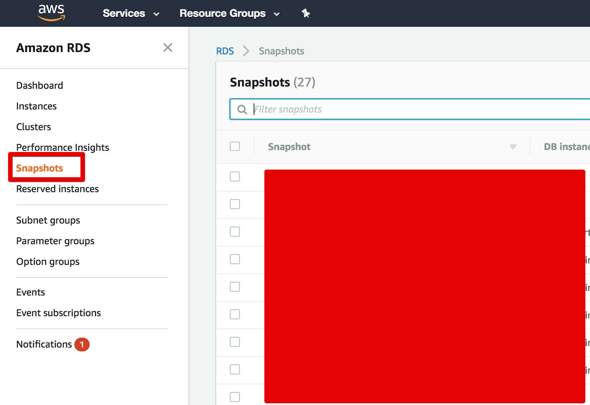
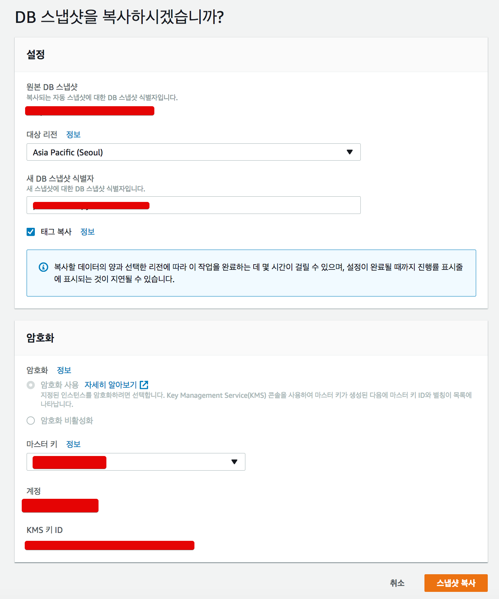
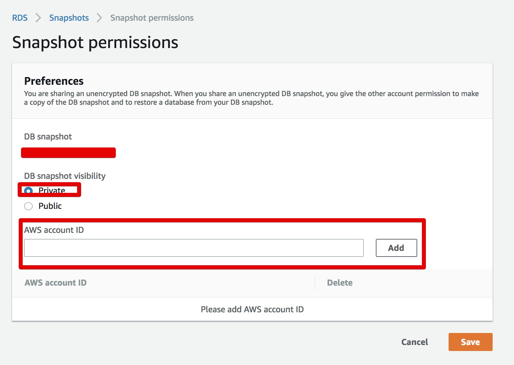

# 서로 다른 계정의 RDS에 대량 데이터 등록하기

다른 계정의 RDS 데이터를 대량으로 복사해야할 때가 있습니다.  
예를 들어 테스트를 위해 운영 DB의 데이터를 개발 DB로 복사해야하는 등의 일이 될수 있겠죠?  
이런 일이 있을때 해결할 수 있는 방법 2가지를 소개합니다.

## 1. 스냅샷으로 전체 백업하기

RDS간 데이터 복사에 가장 흔한 방법이 스냅샷을 이용하는 것입니다.  
여기선 좀 더 현실감있고, 이해하기 쉽게 **운영 RDS의 데이터를 개발 RDS로 복사**하는 과정이라고 하겠습니다.  
  
먼저 운영 RDS의 







복사할 계정의 RDS 스냅샷 페이지로 갑니다.





## 2. SQL 파일로 부분 복사하기

스냅샷으로 해결할 수 없는 문제가 생길 수 있습니다.  

* 기존 데이터는 그대로 둔채 일부분만 복사하고 싶은 경우
* 복사 대상이 RDS가 아닌 경우

등등 여러 경우에 스냅샷을 못쓸수 있습니다.  
이럴 경우 

### 2-1. Insert SQL 파일 생성하기

### S3 에서 파일 받기

```bash
aws s3 cp s3://버킷명/파일위치 저장하고싶은 로컬 위치
```

### Foreign Key 제약조건 해제

```bash
sed -i '1i set foreign_key_checks = 0;' sql파일위치
```

```bash
echo 'set foreign_key_checks = 1;' >> sql파일위치
```


### SQL 파일 실행

mysql client 설치

```bash
sudo yum install mysql
```

```bash
mysql -u DB사용자명 -p 패스워드 -h DB주소 < sql파일위치
```

