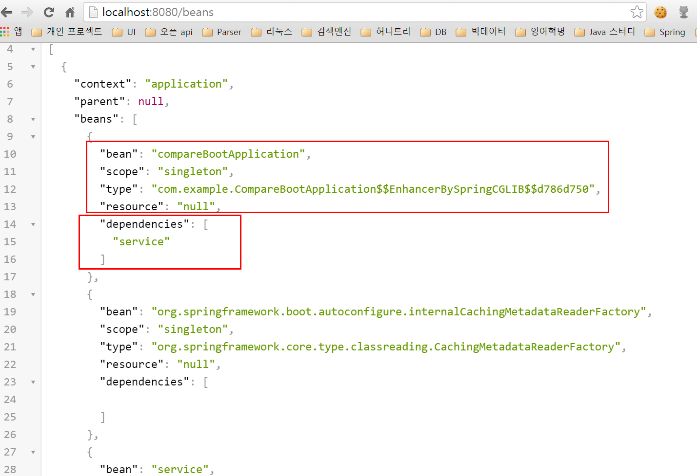
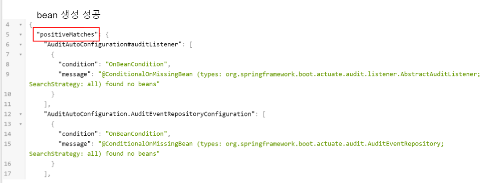
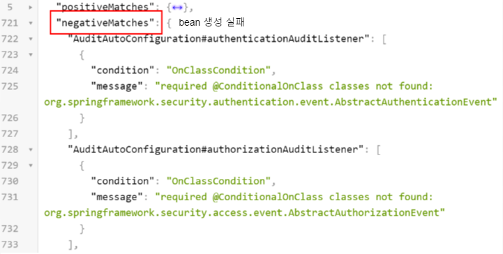
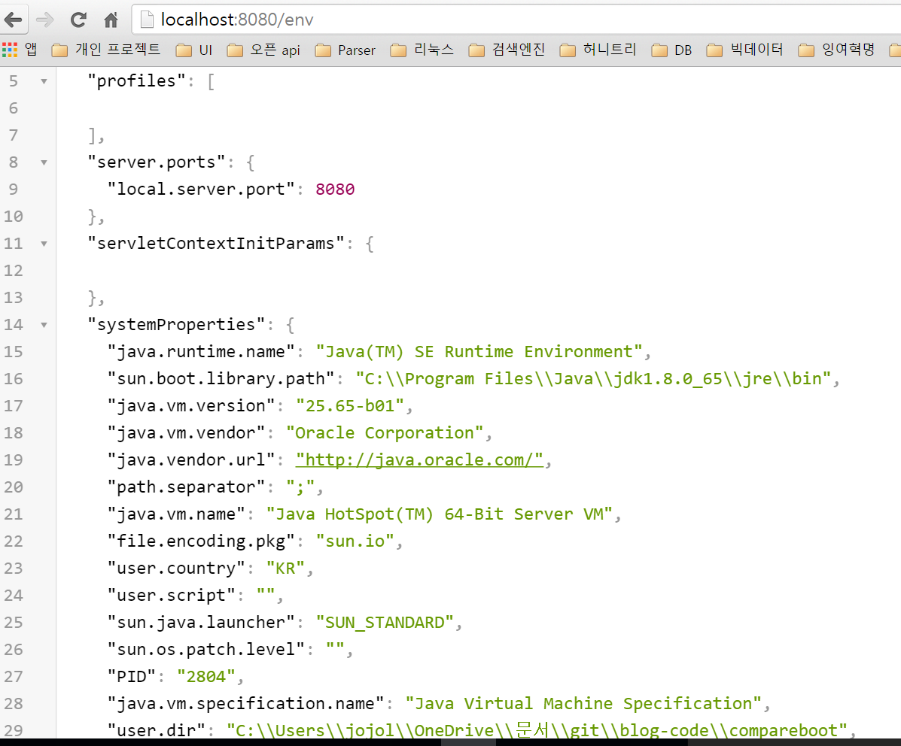
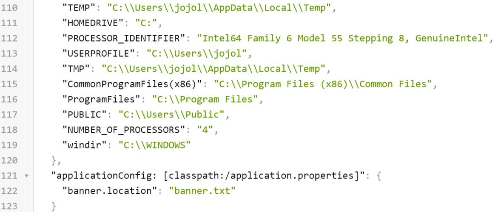

# 스프링부트의 깨알같은 팁 시리즈
<!-- TOC -->

- [소개](#소개)
	- [간편한 설정](#간편한-설정)
	- [간단한 배포서버 구축](#간단한-배포서버-구축)
	- [편리한 의존성 관리](#편리한-의존성-관리)
	- [오해](#misunderstanding)
- [Banner](#banner)
- [ViewResolver](#viewresolver)
- [Actuator](#actuator)

<!-- /TOC -->

## 소개


### 간편한 설정
 * 기존에 SpringFramework가 기본적으로 해야할 셋팅이 너무 많고 어려웠던 점을 해소하기 위해 나옴
   - RoR (Ruby On Rails)나 Express (Nodejs 웹프레임워크)를 사용해보니 그 차이가 더 심하게 느껴짐 (SpringFramework 으로 하루가 걸릴 CRUD 게시판이 express로 1~2시간만에 작성되니 멘붕)
   - 이런 이유로 이전까지 직접 하던 설정들 중 변경요소가 크지 않는 **많은 설정들을 기본적으로 지원**하도록 나온것이 Spring Boot이다. (흔히 이런 변경요소 없이 계속 사용되는 코드를 **보일러플레이트**라고 한다. 스크립트 언어쪽은 이런쪽이 엄청 잘되어 있다.)
   - 예를 들어, 템플릿엔진으로 Freemarker를 사용해야한다면 기존엔 ViewResolver를 Bean으로 등록하고, prefix, suffix를 설정해야한다. 하지만 boot의 경우 해당하는 의존성을 추가만 하면 별도로 설정이 필요 없다.

### 간단한 배포서버 구축
 * 간편한 설정외에도 부트의 최고장점으로 꼽는것이 단독 어플리케이션만으로 배포가 되도록 하는것이다.
   - 이전까지만 하더라도 서버가 새로 구축되면 해당 서버에 기존 프로젝트와 동일한 버전의 Tomcat을 설치하고, Tomcat의 여러 설정 xml값을 수정하고, maven/gradle같은 build 툴을 설치하는 등 서버 하나 확장하는것이 일이였다.
   - 하지만 Boot의 경우 JDK 설치하고, java -jar ~~~.jar로 실행시키면 웹서버 구축 끝이다. 이 얼마나 간단한가!
 * Make jar, Not War
   - Getting Started SpringBoot에서 나오는 대사로 war를 더이상 쓰지말고 jar를 사용하자는 주제가 나온다.
   - 관련 영상은 [여기](https://www.youtube.com/watch?v=sbPSjI4tt10)를 참고 (영어라서 해석이 조금 틀릴수도 있음..)

### 편리한 의존성 관리
 * 사용하고 싶은 의존성에 대해 호환성을 고려하지 않아도 된다.
   - SpringFramework 시절엔 Freemarker를 사용하기 위해선 freemarker의 몇 버전과 Spring의 몇 버전이 호환이 되는지, 추가로 어떤 의존성이 필요한지 확인하는 과정이 꼭 필요하였다.
   - SpringBoot의 의존성 시리즈인 starter의 경우엔 사용하고 싶은 의존성이 freemarker라면 spring-boot-starter-freemarker만 추가하면 그외에 어떤 의존성도 필요없다.
   - starter 시리즈의 의존성이 버전, 추가의존성에 대한 호환성을 모두 보장하기 때문이다.

### Misunderstanding (오해) 
 * 구 Spring프로젝트(2.x나 3.0)를 하다가 바로 Spring Boot로 넘어올 경우 오해하는것 중 하나가 Java 코드로 설정하는 것이다.
   - Java 코드로 설정하는 것은 **Boot에서만 되는것이 아니다.** SpringFramework 에서도 된다.
   - 다만 Boot는 Java code로 설정하는것조차 더욱 간단하게 application.properties/application.yml로 관리할수 있게 해준다.
   - [링크](http://docs.spring.io/spring-boot/docs/current/reference/html/common-application-properties.html)를 가보면 application.properties/application.yml로 어떤것들을 설정할수있는지 나오는데, 보면 Tomcat port부터 시작해서 웹 어플리케이션에 관련된 설정 전부를 다루고 있음을 확인할수 있다. 

 
## Banner


 * Boot 실행시 등장하는 아스키 배너는 다른 배너로 수정이 가능하다.
 * [이미지 to 아스키](http://picascii.com/) 에서 원하는 이미지를 아스키코드로 convert 한다.
 * src/main/resources에 추출한 아스키 코드를 banner.txt 파일에 복붙한다.
 * application.properties 혹은 application.yml에 banner.location=banner.txt로 등록하면 끝
 * 소속 팀장님 사진으로 등록하면 고과+@, 설현 사진으로 하면 코딩력+@
 
 
 
 (열심히 수강중^^)
 
## ViewResolver
 * JSP를 제외한 다른 템플릿 엔진의 경우 의존성만 추가하면 추가설정없이 바로 사용이 가능하다
   - 사용되는 의존성들은 spring-boot-starter-xxxx 의 이름을 가진다
   - 예를들어 본인이 freemarker를 사용한다면 spring-boot-starter-freemarker, thymeleaf를 사용한다면 spring-boot-starter-tyhmeleaf를 추가하면 된다.
   - 디폴트 설정은 prefix는 src/main/resources/templates 이며, suffix는 해당하는 템플릿의 확장자명이 된다.
 
 * freemarker를 예로 들면, 먼저 spring-boot-starter-freemarker 의존성을 추가한다.
  
   
  
 * src/main/resources/templates에 index.ftl을 만든다.
  
    
    
 * Controller에 return "index" 코드를 작성하고 확인
  
    
 
 * 개발자가 집중해야하는 코드에만 집중할 수 있도록 Spring Boot가 얼마나 강력하게 지원해주는지 확인할 수 있다.
 * **JSP는 이제 하지 말자**는 Spring 진영의 강력한 의지도 덤으로 볼 수 있다.
  
## Actuator
### 소개
 * SpringBoot의 가장 강력한 기능 중 하나
 * SpringBoot 어플리케이션의 상태를 실시간으로 확인할 수 있다. 
   - 현재 Context에 등록된 Bean 확인, 사용중인 Heap 사이즈, 최근 요청한 HTTP 상태 등등 관련한 모든 정보를 볼 수 있다.

 
 
 * 특히나 [헤로쿠](http://jojoldu.tistory.com/18)와 같은 PaaS 환경에서는 정말 유용하게 사용됨
 * spring-boot-starter-actuator 의존성을 pom.xml이나 build.gradle에 추가 후, 어플리케이션을 재시작하면 아래와 같은 로그를 확인할 수 있다.
 
 * 사용법 및 예제 작성중...

### 사용법
 * 아래 화면과 같이 브라우저에서 json 포멧팅이 된 화면을 보고싶다면 [크롬 플러그인](https://chrome.google.com/webstore/detail/json-viewer/gbmdgpbipfallnflgajpaliibnhdgobh?hl=ko) 설치를 권장한다
 * /beans
 
   - 해당 웹 어플리케이션 컨텍스트의 모든 bean과 각 bean의 java type, 주입 받은 bean 정보를 보여준다
   - bean : 해당 bean의 이름
   - scope : bean의 스코프 (기본은 singleton)
   - type : bean의 java type
   - resource : .class 파일의 위치이지만, 현재는 로컬에서 구동중이며 jar/war로 만들게 되면 위치를 알 수 있다.]
   - dependencies : 해당 bean에 주입된 bean들의 id목록

 * /autoconfig
 
 

   - bean을 왜 포함시켰는지, 포함시키지 않았는지를 표기
   - condition
   ```
   OnBeanCondition : Bean의 존재유무에 따라 Condition이 결정된다.
   OnClassCondition : Class의 존재유무에 따라 Condition이 결정된다.
   ```
   - message
   ```
   @ConditionalOnMissingBean : 해당하는 Bean이 없으면 생성하겠다
   @ConditionalOnBean : 해당하는 Bean이 존재할 경우 생성하겠다.
   @ConditionalOnClass : 해당하는 class가 있을 경우 생성하겠다.

   즉, 위 조건을 만족할 경우 생성, 하지 않을 경우 생성실패가 되는것이다.
   ```
 * /env
 
 
   - 사용유무와 관계없이, 해당 어플리케이션이 사용할 수 있는 모든 환경 프로퍼티의 목록을 보여준다.
   - 현재 구동중인 노트북의 환경변수를 포함해서 현재 프로젝트가 applicaton.properties에서 설정한 banner.location까지 포함되어서 노출되는것을 확인할 수 있다.
