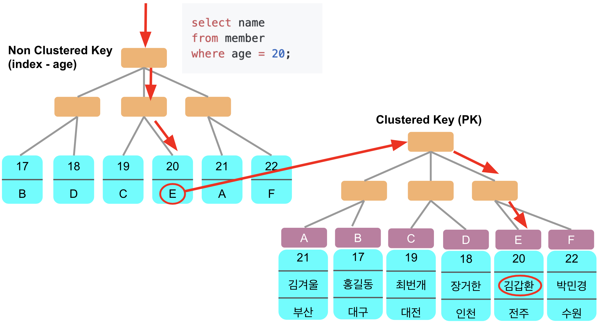

# 커버링 인덱스

일반적으로 인덱스를 설계한다고하면 ```WHERE```절에 대한 인덱스 설계를 이야기할 때가 많습니다.  
다만 이렇게 할 경우 인덱스 튜닝에 한계가 있으니 ```WHERE```뿐만 아니라 **쿼리 전체**에 대해 인덱스를 설계해야하는게 맞습니다.  
인덱스는 데이터를 효율적으로 찾는 방법이지만, MySQL의 경우 인덱스안에 포함된 데이터를 사용할 수 있으므로 실제 **데이터까지 접근할 필요가 전혀 없습니다**.  
  
이처럼 쿼리를 충족시키는 데 필요한 모든 데이터를 갖고 있는 인덱스를 **커버링 인덱스** (Covering Index 혹은 Covered Index) 라고합니다.

> 좀 더 쉽게 말씀드리면 SELECT, WHERE, ORDER BY, GROUP BY 등에 사용되는 모든 컬럼이 인덱스의 구성요소인 경우를 얘기합니다.


## 1. 커버링 인덱스의 장점

* EXPLAIN 결과의 Extra 필드에 "Using index" 표시


여기서 **type이 index** 인것과는 조금 차이가 있습니다.

|       | 표기        | 설명                               |
|-------|-------------|------------------------------------|
| Extra | Using index | 커버링 인덱스, 인덱스 range 스캔  |
| type  | index       | 인덱스 풀 스캔 (range 스캔이 아님) |

인덱스 풀 스캔 발생하는 경우

* range, const, ref와 같은 접근 방식으로 인덱스를 사용하지 못하는 경우
  * 위 조건과 더불어 아래 조건 중 하나가 동시 만족될 경우
    * 인덱스에 포함된 컬럼만으로 처리할 수 있는 쿼리인 경우 (즉, 데이터 파일을 안읽어도 되는 경우)
    * 인덱스를 이용해 정렬이나 그룹핑 작업이 가능한 경우 (즉, 별도의 정렬 작업을 피할 수 있는 경우)


## Clustered Key

* Clustered Key (PK) 의 값은 **모든 Non-Clustered Key에 포함**되어 있음
  * Clustered Key는 테이블당 1개만 존재한다.
  * PK가 없을 경우 유니크 키가 Clustered Key로
  * PK와 유니크키 둘다 없을 경우 6 byte의 Hidden Key를 생성 (rowid)
  * Non-Clustered Key에는 **데이터 블록의 위치가 없다**.
    * 즉, 인덱스외 다른 필드를 찾을때는 Non-Clustered Key에 있는 Clustered Key 값으로 데이터블록을 찾는 과정이 필요하다.



(index-age는 age순으로 정렬되어있고, pk는 id순으로 정렬되어있다.)  
  
* 즉, **인덱스 키 조합에는 Clustered Key가 항상 포함**되어 있다.
* 다만 PK를 사용할 경우 인덱스 탐색 시간이 없어지기 때문에 향상된 데이터 파일 접근이 가능하다


## 커버링 인덱스 적용 순서

* 커버링 인덱스 적용 순서
  * WHERE 조건에 있는 컬럼 최우선
  * ORDER BY / GROPU BY / HAVING 컬럼 그 다음
  * SELECT 에 있는 컬럼을 마지막

> ```Using temporary;```?  
> [공식 문서](https://dev.mysql.com/doc/refman/8.0/en/internal-temporary-tables.html) 에선 다음과 같은 조건에서 임시 테이블을 만들 수 있다고 합니다.  
> ORDER BY 절과 다른 GROUP BY 절이 있거나 ORDER BY 또는 GROUP BY에 조인 큐의 첫 번째 테이블 이외의 테이블의 열이 포함 된 경우 임시 테이블이 작성됩니다.
> ORDER BY와 결합된 DISTINCT에는 임시 테이블이 필요할 수 있습니다.
