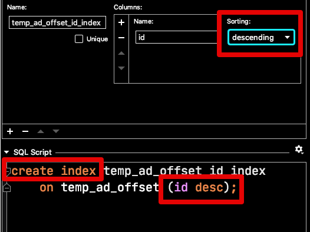

# 2. 커버링 인덱스 (ORDER BY / WHERE + ORDER BY + GROUP BY)

## 2-1. WHERE + ORDER BY

일반적으로 ORDER BY 의 인덱스 사용 방식은 GROUP BY와 유사합니다만, 한가지 차이점이 있습니다.  
바로 **정렬 기준**입니다.  
MySQL에서는 인덱스 생성시 **컬럼 마다 asc/desc 를 정할수 있는것 처럼** 보입니다.  



(젯브레인사의 DataGrip으로 인덱스 생성시 가능한 것처럼 보입니다만... 안됩니다.)  
  
하지만 **8.0 이전 버전까지는 지원하지 않습니다**.  
8.0 이전 버전까지는 **문법만 지원되고 실제로 Desc 인덱스가 지원되는 것은 아닙니다**.  
  
단지 Ascending index 으로 만들어진 인덱스를 앞에서부터 읽을 것인지 (```Forward index scan```), 뒤에서부터 읽을 것인지 (```Backward index scan```)의 차이만 있을 뿐입니다.  

> 좀 더 자세한 내용은 카카오 기술 블로그 [MySQL Ascending index vs Descending index](https://tech.kakao.com/2018/06/19/mysql-ascending-index-vs-descending-index/) 를 참고해주세요.

즉, **인덱스 컬럼 중 특정 컬럼만 Desc 로 할수는 없으며** 인덱스 컬럼 전체를 asc 혹은 desc 스캔만이 인덱스를 사용하는 방법입니다.  

ORDER BY 에서 인덱스가 적용 안되는 경우는 대표적으로 다음과 같습니다.  
(인덱스 (a,b,c) 인 경우)

* ```order by b, c```
  * 인덱스 첫번째 컬럼인 a가 누락되어 사용 불가
* ```order by a, c```
  * 인덱스에 포함된 b 컬럼이 a, c 사이에 포함되어 있지 않아 사용 불가
* ```order by a, c, b```
  * 인덱스 컬럼과 order by 컬럼간 **순서 불일치**로 사용 불가
* ```order by a, b desc, c```
  * b 컬럼의 ```desc``` 로 인해서 사용 불가
* ```order by a, b, c, d```
  * 인덱스에 존재하지 않는 컬럼 d로 인해 사용 불가


### 2-1.1. 인덱스가 적용 되는 경우 / 안되는 경우


### 2-1-2. WHERE가 동등 비교가 아닌 경우

```sql
select *
from temp_ad_offset
where offset_type = 'GIVE_OFFSET'
order by customer_id, base_date
limit 2000000, 100;
```

```sql
select *
from temp_ad_offset
where offset_type like 'GIVE%'
order by customer_id, base_date
limit 2000000, 100;
```

```sql
select offset_type, customer_id, base_date
from temp_ad_offset
where offset_type = 'GIVE_OFFSET'
order by customer_id, base_date
limit 2000000, 100;
```

## 2-2. ORDER BY + GROUP BY


## 2-3. WHERE + ORDER BY + GROUP BY


## 2-4. WHERE + ORDER BY + GROUP BY + HAVING

## 2-5. SELECT + WHERE + ORDER BY + GROUP BY + HAVING

* 커버링 인덱스 적용 순서
  * WHERE 조건에 있는 컬럼 최우선
  * ORDER BY / GROPU BY / HAVING 컬럼 그 다음
  * SELECT 에 있는 컬럼을 마지막

> ```Using temporary;```?  
> [공식 문서](https://dev.mysql.com/doc/refman/8.0/en/internal-temporary-tables.html) 에선 다음과 같은 조건에서 임시 테이블을 만들 수 있다고 합니다.  
> ORDER BY 절과 다른 GROUP BY 절이 있거나 ORDER BY 또는 GROUP BY에 조인 큐의 첫 번째 테이블 이외의 테이블의 열이 포함 된 경우 임시 테이블이 작성됩니다.
> ORDER BY와 결합된 DISTINCT에는 임시 테이블이 필요할 수 있습니다.
