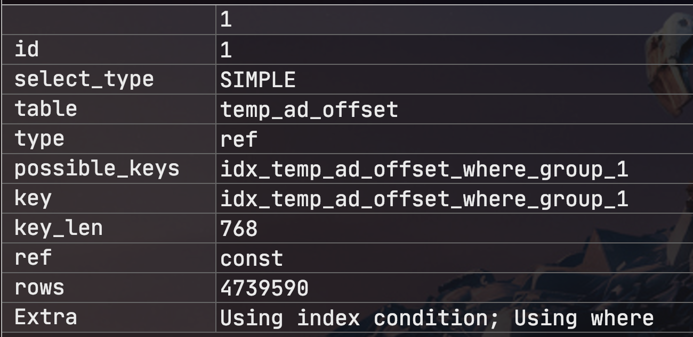
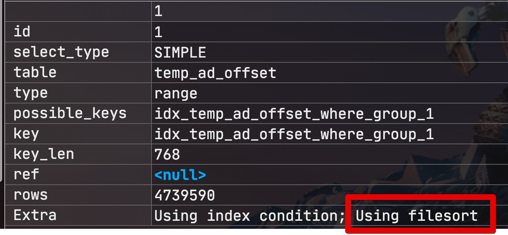
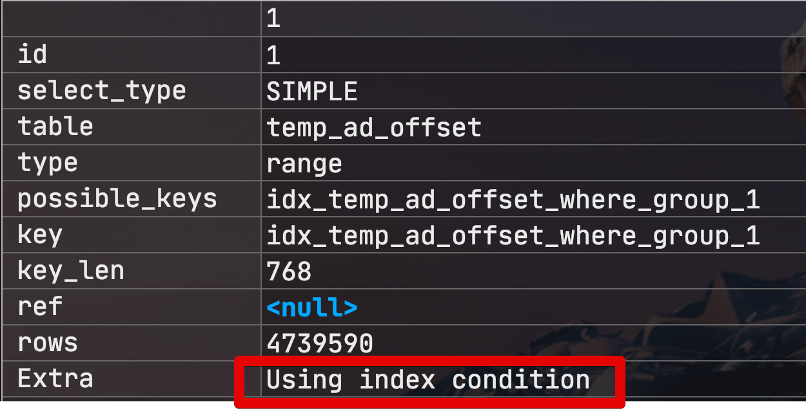
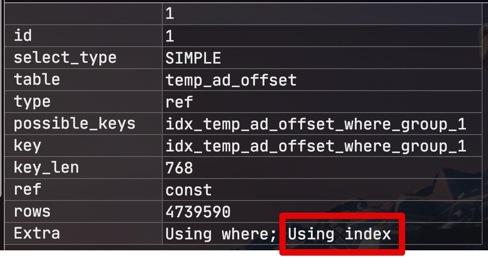
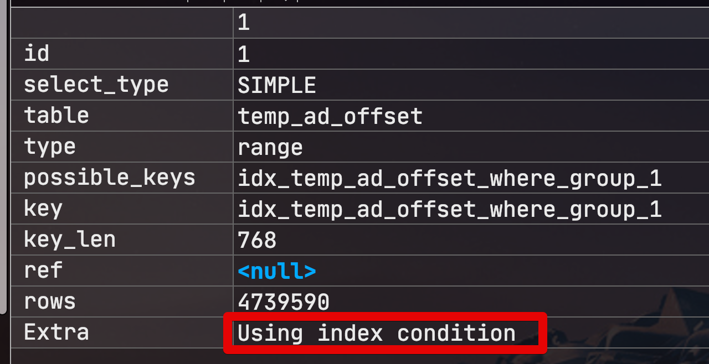
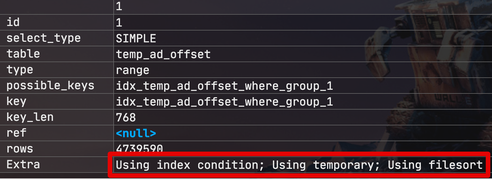

# 2. 커버링 인덱스 (WHERE + ORDER BY / GROUP BY + ORDER BY )

## 2-1. WHERE + ORDER BY

일반적으로 ORDER BY 의 인덱스 사용 방식은 GROUP BY와 유사합니다만, 한가지 차이점이 있습니다.  
바로 **정렬 기준**입니다.  
MySQL에서는 인덱스 생성시 **컬럼 마다 asc/desc 를 정할수 있는것 처럼** 보입니다.  


(젯브레인사의 DataGrip으로 인덱스 생성시 가능한 것처럼 보입니다만... 안됩니다.)  
  
하지만 **8.0 이전 버전까지는 지원하지 않습니다**.  
8.0 이전 버전까지는 **문법만 지원되고 실제로 Desc 인덱스가 지원되는 것은 아닙니다**.  
  
단지 Ascending index 으로 만들어진 인덱스를 앞에서부터 읽을 것인지 (```Forward index scan```), 뒤에서부터 읽을 것인지 (```Backward index scan```)의 차이만 있을 뿐입니다.  

> 좀 더 자세한 내용은 카카오 기술 블로그 [MySQL Ascending index vs Descending index](https://tech.kakao.com/2018/06/19/mysql-ascending-index-vs-descending-index/) 를 참고해주세요.

즉, **인덱스 컬럼 중 특정 컬럼만 Desc가 되지 않으며** 인덱스 컬럼 전체를 asc 혹은 desc 스캔 방법뿐입니다.  
  
그래서 ORDER BY 에서 인덱스가 적용 안되는 경우는 다음과 같습니다.  
(인덱스 **(a,b,c)** 인 경우)

* ```order by b, c```
  * 인덱스 첫번째 컬럼인 **a가 누락**되어 사용 불가
* ```order by a, c```
  * 인덱스에 포함된 **b 컬럼이 a, c 사이에 미포함**되어 사용 불가
* ```order by a, c, b```
  * 인덱스 컬럼과 order by 컬럼간 **순서 불일치**로 사용 불가
* ```order by a, b desc, c```
  * b 컬럼의 ```desc``` 로 인해서 사용 불가
* ```order by a, b, c, d```
  * 인덱스에 **존재하지 않는 컬럼** d로 인해 사용 불가

여기서 GROUP BY와 마찬가지로 ORDER BY 역시 아래의 쿼리는 **인덱스가 적용 가능**합니다.

```sql
WHERE a = 1 
ORDER BY b, c

WHERE a = 1 and b = 'b'
ORDER BY c
```

> 이게 가능한 이유는 위 쿼리가 실제로 ```WHERE a = 1 ORDER BY a, b, c``` 와 동일한 쿼리이기 때문입니다.  
> 옵티마이저가 적절하게 실행 계획을 결정해준다고 이해하시면 될것 같습니다.

자 그럼 GROUP BY 에서 했던 실험과 마찬가지로 **WHERE의 조건이 동등 비교가 아닌 경우**엔 어떻게 되는지 확인해보겠습니다.

### 2-1-1. WHERE가 동등 비교가 아닌 경우

먼저 동등 비교의 실행 계획을 확인해봅니다.
(인덱스 - offset_type, customer_id, base_date)

```sql
select *
from temp_ad_offset
where offset_type = 'GIVE_OFFSET'
order by customer_id, base_date
limit 2000000, 100;
```

해당 쿼리의 실행 계획은 아래와 같습니다.



GROUP BY와 마찬가지로 인덱스 컬럼 순서대로 진행되어서 별도로 ```Using filesort``` 가 없는 실행 계획이 나왔습니다.  
  
실제로 쿼리를 수행해보면


전체 수행 시간은 3.492초가 소요되었습니다.  
이 시간이 오래 걸린것인지 정확히 알 수 없으니, 바로 다음 실험으로 가보겠습니다.  
  
이번엔 WHERE의 조건만 ```like``` 로 변경해보겠습니다.
LIKE 조건은 인덱스가 가능하도록 ```%``` 를 검색어 뒤편에 두겠습니다.

> LIKE 검색에서 %가 검색어 앞에 있을 경우 인덱스를 타지 않습니다.  
> %가 뒤에 있을 경우 일반적으로는 인덱스를 탑니다.

```sql
select *
from temp_ad_offset
where offset_type like 'GIVE%'
order by customer_id, base_date
limit 2000000, 100;
```

해당 쿼리의 실행 계획은 아래와 같습니다.



그리고 실제로 실행해보면?


전체 수행 시간은 6.761초가 소요되었습니다.  
즉, 첫번째 쿼리에 비해 **약 2배**가 더 소요되었습니다.  
  
GROUP BY와 마찬가지로 ORDER BY 역시 **WHERE 에 사용된 인덱스 컬럼이 동등 비교가 아니면 ORDER BY 절은 인덱스가 수행되지 않습니다**  
(WHERE 절만 인덱스가 타게 됩니다.)  
   
그럼, WHERE절에 사용된 인덱스 컬럼이 동등 비교가 아니더라도, **ORDER BY에 모든 인덱스 컬럼이 포함되면** 어떻게 될까요?

```sql
select *
from temp_ad_offset
where offset_type like 'GIVE%'
order by offset_type, customer_id, base_date
limit 2000000, 100;
```

이 경우 실행 계획은 첫번째 쿼리 (WHERE 동등비교 + ORDER BY 에 나머지 인덱스 컬럼) 와 마찬가지로 **file sort가 없는** 실행 계획이 나옵니다.



실제로 실행해보면?  
수행 속도도 3.415초로 비슷한 성능이 발생합니다.


  
즉, WHERE가 동등 비교가 아닌 경우엔 ORDER BY에 차라리 인덱스 컬럼을 전부 선언하는게 더 낫습니다.  
(물론, 그렇게 해도 **조회 결과가 동일할때만** 해당 됩니다.)  
  

마지막으로 만약 커버링 인덱스를 사용한다면 얼마나 빨라질까요?  
(즉, **쿼리에 포함된 모든 컬럼이 하나의 인덱스에 포함된 컬럼인 경우**)  
  
아래의 쿼리는 SELECT, WHERE, ORDER BY 모두 **인덱스에 포함된 컬럼들** 입니다.  
(인덱스명 - idx_temp_ad_offset_where_group_1)  

```sql
select offset_type, customer_id, base_date
from temp_ad_offset
where offset_type = 'GIVE_OFFSET'
order by customer_id, base_date
limit 2000000, 100;
```

실행 계획을 확인해보면 ```using index```로 커버링 인덱스가 잘 적용되었음을 알 수 있습니다.  



실제로 쿼리를 실행해보면


1.090초라는 아주 개선된 성능을 확인할 수 있습니다.  
  
ORDER BY 역시 최대한 커버링 인덱스를 이용해야되겠죠?

## 2-2. WHERE + GROUP BY + ORDER BY

자 그럼 [이전 포스팅](https://jojoldu.tistory.com/476)에서 배워본 GROUP BY절과 조합된 ORDER BY에서는 어떻게 작동될까요?  
  
둘다 적용 가능해야만 한다.

```sql
select *
from temp_ad_offset
where offset_type like 'GIVE%'
group by offset_type, customer_id, base_date
order by offset_type, customer_id, base_date
limit 2000000, 100;
```




```sql
select *
from temp_ad_offset
where offset_type like 'GIVE%'
group by offset_type, customer_id, base_date
order by customer_id, base_date
limit 2000000, 100;
```

* Order by에서는 offset_type을 제거하여 인덱스를 못태우게 했습니다.





## 2-3. 마무리

이번 시간에 배운것들을 정리해보면 다음과 같습니다.

* ORDER BY에는 desc index가 적용되지 않는다 (MySQL 8.0 전까지)
  * 단지 scan 방식만 선택가능하다
  * 만들어진 index 블록을 앞에서 읽을지 / 뒤에서부터 읽을지
* ORDER BY 역시 GROUP BY와 마찬가지로 인덱스 순서대로 컬럼을 지정하면 인덱스를 사용할 수 있다
* GROUP BY와 함께 쓸때는 **둘다 인덱스를 적용할 수 있는 조건이어야 한다**
  * 그렇지 않을 경우 인덱스를 활용하지 못한다.