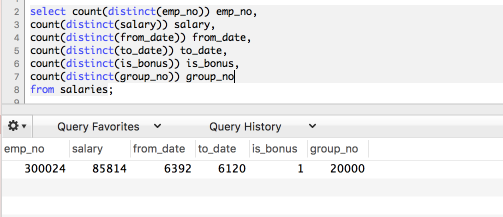

# MySQL 인덱스

MySQL 인덱스에 관해 정리를 하였습니다.  
MySQL을 잘 알아서 정리를 한것이 아니라, 잘 알고 싶어서 정리한 것이라 오류가 있을수도 있습니다.  

## 테스트 환경

### MySQL 설치 (Mac OS)

혹시나 해서, Mac에서 MySQL 설치는 공식홈페이지가 아닌 **Homebrew로 설치**하는게 좋습니다.  

> 삭제 과정이 굉장히 귀찮습니다.

[Homebrew로 설치하기](https://gist.github.com/nrollr/3f57fc15ded7dddddcc4e82fe137b58e)

Homebrew Ruby 업데이트

```bash
brew upgrade ruby
```

Homebrew 업데이트

```bash
brew update
```

[mysql root 계정 비밀번호 변경](http://withcoding.com/27)

> 참고로 root 계정의 기본 비밀번호는 없습니다.  
바로 엔터 치시면 됩니다.

### 샘플 코드

Real MySQL 교재의 예제를 토대로 진행합니다.

덤프 파일을 받아서 진행합니다.  
[파일 링크](https://github.com/wikibook/realmysql/archive/master.zip)

```sql
source employees.sql
```

```sql
source employees_schema_modification.sql
```


## 인덱스

실험을 통해 인덱스 사용법을 익히겠습니다.

### 데이터 구성

좀 더 극적인 비교를 위해 몇개의 컬럼을 추가하겠습니다.

```sql
-- group_no
update salaries
set group_no = emp_no % 100000;


-- is_bonus
update salaries
set is_bonus = true
where (emp_no % 2) = 0;
```

사용할 테이블인 salaries는 총 1660만 row를 가지고 있습니다.  

### 1. 인덱스란?

실제 데이터가 저장되는 공간은 
DBMS의 인덱스는 insert, update, delete (Command) 의 성능을 희생하고 그 대신 select (Query)의 성능을 높이는 기능입니다.  

### 2. 인덱스 키 값의 크기

InnoDB (MySQL)은 디스크에 데이터를 저장하는 가장 기본 단위를 페이지라고 하면, **인덱스 역시 페이지 단위로 관리** 됩니다.  
**페이지는 16KB 로 크기가 고정**되어 있습니다.  
  
만약 본인이 잡은 인덱스 키의 크기가 16 Byte 라고 하고, 자식노드의 주소가 담긴 크기가 12 Byte 정도로 잡으면, 16*1024 / (16+12) = 585로 인해 하나의 페이지에는 585개가 저장될 수 있습니다.  
그럼 여기서 만약 인덱스 키가 32 Byte로 커지면 어떻게 될까요?  
372개만 한 페이지에 저장할 수 있게 됩니다.  
그럼 500개의 row를 읽을때 16byte일때는 1개의 페이지에서 다 조회가 되지만, 32byte일때는 2개의 페이지를 읽어야 하므로 이는 성능 저하가 발행하게 됩니다.  

> 인덱스의 키는 길면 길수록 성능상 이슈가 있습니다.

### 인덱스 구성

본격적으로 인덱스에 대한 이야기를 하겠습니다.  
먼저 말씀드릴 것은 1개의 컬럼만 인덱스를 걸어야 한다면, 해당 컬럼은 **카디널리티(Cardinality)가 가장 높은 것**을 잡아야 한다는 점입니다.  

> 카디널리티(Cardinality)란 해당 컬럼의 **중복된 수치**를 나타냅니다.  
예를 들어 성별, 학년 등은 카디널리티가 낮다고 얘기합니다.  
반대로 주민등록번호, 계좌번호 등은 카디널리티가 높다고 얘기합니다.

하나의 컬럼에만 인덱스를 걸어야 한다면, 해당 인덱스로 많은 부분을 걸러내야 하기 때문입니다.  
만약 성별을 인덱스로 잡는다면, 남/녀 중 하나를 선택하기 때문에 인덱스를 통해 50%밖에 걸러내지 못합니다.  
하지만 주민등록번호나 계좌번호 같은 경우엔 **인덱스를 통해 데이터의 대부분을 걸러내기 때문에** 빠르게 검색이 가능합니다.  
  
자 그럼 여기서 궁금한 것이 있습니다.  
**여러 컬럼으로 인덱스를 잡는다면 어떤 순서로 인덱스를 구성**해야 할까요?  



```sql
CREATE INDEX IDX_SALARIES_EMPNO ON salaries (emp_no, from_date, is_bonus);

CREATE INDEX IDX_SALARIES_FROMDATE ON salaries (from_date, is_bonus, emp_no);

CREATE INDEX IDX_SALARIES_ISBONUS ON salaries (is_bonus, from_date, emp_no);
```

### 인덱스가 효과 없는 상황

ㄴ
### 인덱스 컬럼 순서와 조회 컬럼 순서

최근 RDBMS가 업데이트 되면서 이전과 같이 꼭 인덱스 순서와 조회 순서를 지킬 필요는 없습니다.  
단, 옵티마이저가 **조회 조건의 컬럼을 인덱스 컬럼 순서에 맞춰 재배열하는 과정이 추가**되기 때문에 특별한 이유가 없다면 인덱스 순서와 조회 컬럼 순서를 지켜주시면 더 좋을것 같습니다.

### 쿼리 프로파일링

```sql
show variables like 'profiling';
```

```sql
set profiling=1;
```

```sql
show profiles;

SELECT query_id, duration, state
FROM information_schema.profiling WHERE query_id = 쿼리ID;
```


## 참고

* [what-makes-a-good-mysql-index-part-2-cardinality](https://webmonkeyuk.wordpress.com/2010/09/27/what-makes-a-good-mysql-index-part-2-cardinality/)

* [mysql-indexes-multi-column-indexes-and-order-of-columns](http://www.ovaistariq.net/17/mysql-indexes-multi-column-indexes-and-order-of-columns/)

* [Real MySQL](http://egloos.zum.com/kwon37xi/v/4805538)

* [MySQL 5.0 한글 메뉴얼](http://www.mysqlkorea.com/sub.html?mcode=manual&scode=01&m_no=21436&cat1=7&cat2=0&cat3=0&lang=k)