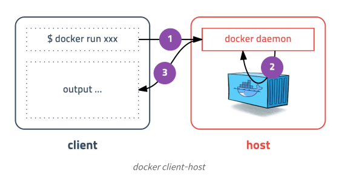
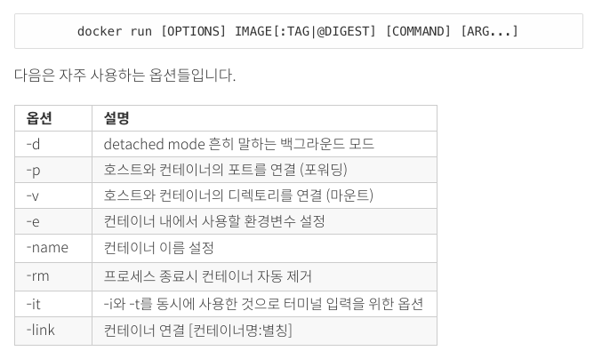
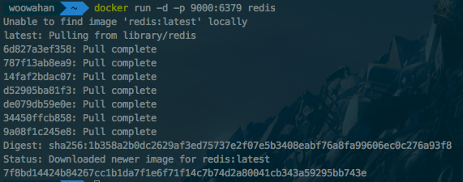
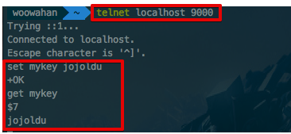
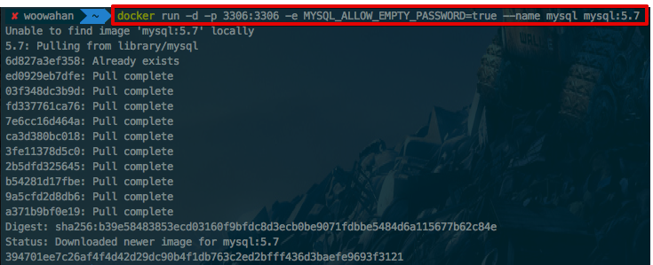
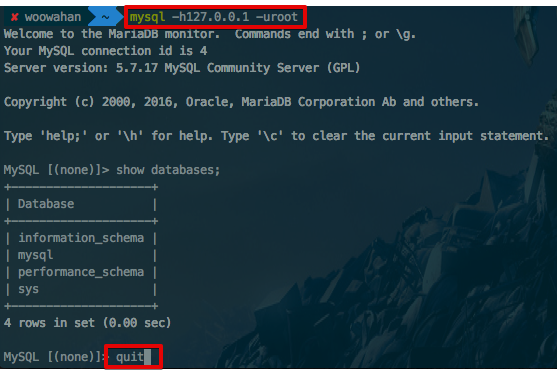
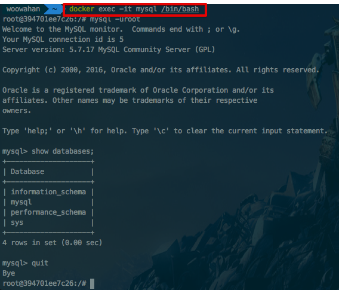

# 맥북에서 도커 시작하기

## 용어
* 컨테이너
  * 격리된 공간에서 프로세스가 동작하는 기술
  * 가상화 기술의 하나지만 **기존 방식과 동일하지 않다**.
  * 프로세스 자체를 격리시키기 떄문에 CPU나 메모리는 딱 프로세스가 필요한 만큼만 추가로 사용
  * 기존 방식의 성능 문제를 해결

* 이미지 
  * 컨테이너 실행에 필요한 파일과 설정값 등을 포함하고 있는 것
  * 상태값이 변하지 않음 
  * 추가되거나 변하는 값은 **컨테이너에 저장**

* Dockerfile
  * 이미지 생성 과정을 작성한 것
  * Dockerfile에 작성된 내용을 토대로 이미지가 생성됨
  * 의존성 패키지, 설정파일 생성등 모든 것을 관리


* CLI



* 도커 커맨드를 입력하면 도커 클라이언트가 도커 서버로 명령을 전송하고 결과를 받아 터미널에 출력

* 명령어 옵션



## 실습

### ubuntu 16.04

* ubuntu 16.04 실행

```
docker run ubuntu:16.04
```


* 실행시킨 컨테이너 내부로 접속

```
docker run --rm -it ubuntu:16.04 /bin/bash
```


* 컨테이너 나오기

```
exit
```

### redis
* redis 접속

```
docker run -d -p 9000:6379 redis
```



* 위 처럼 실행할 경우 백그라운드에서 redis 컨테이너가 구동된다.
* localhost:9000를 redis 컨테이너의 6379 포트로 연결하여 localhost:9000으로 접속시 redis를 사용할 수 있다.



* 나올때는 ```quit```를 입력하면 된다.

### mysql
* ```-e```옵션으로 환경변수 설정하여 실습

```
docker run -d -p 3306:3306 -e MYSQL_ALLOW_EMPTY_PASSWORD=true --name mysql mysql:5.7
```



* password없이 root 계정 생성을 위해 ```MYSQL_ALLOW_EMPTY_PASSWORD ``` 옵션 지정
* 컨테이너 이름은 ```mysql```로 지정



### springBoot
* ```--link```
  * 환경변수와 IP정보를 공유하는데 링크한 컨테이너의 IP정보를 ```/etc/hosts/```에 자동입력
  * 다른 컨테이너와 통신해야될 경우 사용
  * ```--link mysql:mysql```

## 도커 기본 명령어

### 컨테이너 목록
* 컨테이너 목록 확인

```
docker ps [OPTIONS]
```

* 컨테이너 중지

```
docker stop [OPTIONS] CONTAINER [CONTAINER...]
```

* 컨테이너 제거

```
docker rm [OPTIONS] CONTAINER [CONTAINER...]
```

* 컨테이너 로그 확인

```
docker logs [OPTIONS] [CONTAINER ID]
```

### 컨테이너 명령어 실행
* 실행중인 컨테이너에 접속하여 커맨드 실행하기
  * ssh는 권장하지 않는다.
  * ```docker exec [OPTIONS] CONTAINER COMMAND [ARG...]```
  * ```run```은 컨테이너를 새로 생성해서 실행, ```exec```는 실행중인 컨테이너에 명령어 실행



### 컨테이너 마운트
* 컨테이너가 삭제되면 해당 컨테이너에 포함된 데이터 역시 같이 삭제된다.
  * DB 컨테이너 같은 경우 DB 데이터까지 같이 삭제되므로 큰일임
* 호스트 PC (여기선 수행되는 개인 PC) 디렉토리를 마운트해서 컨테이너가 삭제되도 호스트 PC에 남기도록 함

```
docker run -d -p 3306:3306 -e MYSQL_ALLOW_EMPTY_PASSWORD=true --name mysql -v /my/own/datadir:/var/lib/mysql mysql:5.7
```

* ```/my/own/datadir```디렉토리를 컨테이너의 ```/var/lib/mysql``` 디렉토리로 마운트
  * 이제 데이터베이스 파일은 호스트의 ```/my/own/datadir```디렉토리에 저장되고 컨테이너를 삭제해도 데이터는 사라지지 않음
  
  
## 참고자료
* [subicura.com](https://subicura.com/2017/01/19/docker-guide-for-beginners-1.html)