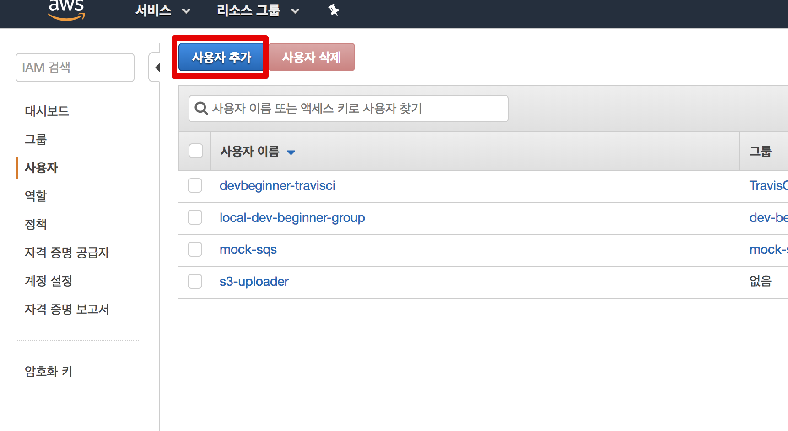
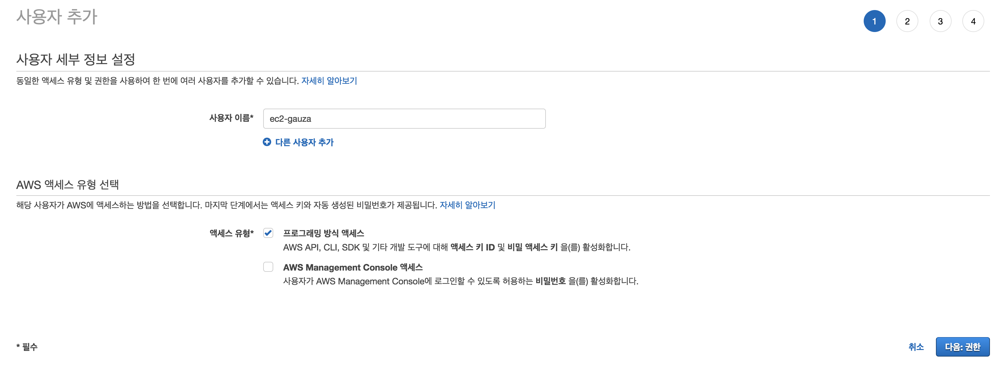
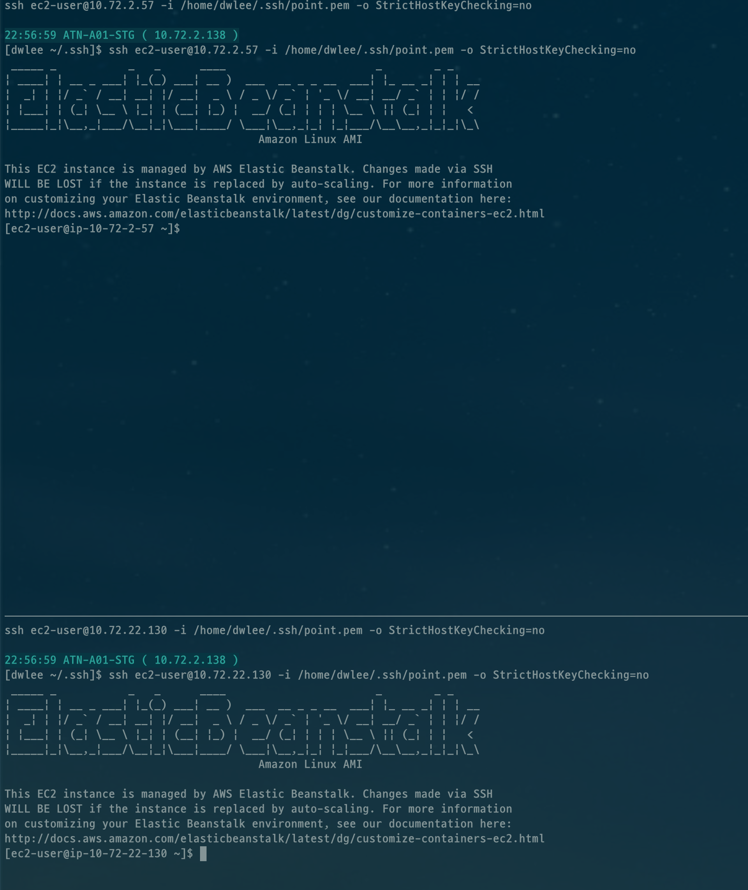

# ec2-gauza 최신 버전 반영

AWS EC2 접속기인 [ec2-gauza](https://github.com/leejaycoke/ec2-gazua)가 업데이트 되었습니다.  
혹시 처음 들어보신다면 아래 영상을 참고하시면 어떤 툴인지 바로 느낌이 올수있습니다.


> 개인적으로 AWS를 사용하시는 분들은 필수로 설치해야할 툴이라고 생각합니다.  

[예전에 기록한 글](https://jojoldu.tistory.com/311)은 최신 버전에서는 설치가 불가능하니, 아래 내용을 따라 재설치 하시면 됩니다.

## 설치

설치하기 전에, 설치 장소에 대해 한가지 이야기 드립니다.  
이 ec2-gauza는 ssh 접속을 지원합니다.  
헌데, 일반적으로 사내에서 EC2로 접속할때는 **로컬에서 바로 접속하진 못하고, 중간 서버를 거쳐야만 가능**한 경우가 많습니다.  
  
예를 들어 로컬에서 A 서버로 가서 A서버에서만 EC2로 갈 수 있다는 등이죠.  
이럴 경우엔 ec2-gauza를 A서버에 설치해야합니다.  
로컬 PC가 아닙니다.  
  
그럼 이제 진행하겠습니다!

### 1. clone

먼저 Github에서 해당 프로젝트를 clone 하고 설치합니다.

```bash
git clone https://github.com/leejaycoke/ec2-gazua.git
cd ./ec2-gazua/
pip install --user -r requirements.txt
```

설치가 끝났다면 **접속 가능한 EC2 목록을 보기 위해** AccessKey와 SecretKey를 등록하겠습니다.

### 2. AccessKey & SecretKey 등록

만약 사내에서 쓴다면 SRE 혹은 AWS 인프라 관리팀에게 IAM User 생성을 요청하시면 됩니다.  
개인 계정이라면 아래와 같이 직접 본인이 IAM User를 생성합니다.  
  
IAM -> 사용자 -> 사용자 추가



사용자명은 본인이 원하시는대로 하시면 됩니다.  
액세스 유형에서 **프로그래밍 방식 엑세스**를 체크하고 다음으로 넘어갑니다.



EC2 목록을 볼 수 있도록 ```EC2ReadOnlyAccess``` 권한을 체크하고 넘어갑니다.  


그럼 생성된 사용자의 키가 등장합니다.


여기서 생성된 액세스키ID와 비밀 액세스키를 복사한 뒤 ```ec2-gz``` 파일을 열어 키를 등록합니다.

```bash
vim ~/.ec2-gz
```

파일 내용은 아래와 같고 여기서 ```aws_access_key_id```와 ```aws_secret_access_key```에 복사한 Key값을 등록하면 됩니다.

```bash
name: minor

ssh-path: ~/.ssh

credential:
    aws_access_key_id: access-key # 요기
    aws_secret_access_key: secret-key # 요기
    region: ap-northeast-2

group-tag: Team
name-tag: Name

filter:
    connectable: true

connect-ip:
    default: private

key-file:
    default: auto

user:
    default: ec2-user
```


키 등록이 끝나셨다면 EC2 접속 권한을 얻기 위해 **pem 키를 등록**합니다

### 3. pem 파일 등록

pem 파일들은 모두 ```.ssh``` 디렉토리에 있어야 합니다.  
대부분은 해당 디렉토리가 없을꺼라 먼저 디렉토리를 만듭니다.

```bash
mkdir ~/.ssh
```

그리고 pem키를 모두 ```.ssh``` 디렉토리로 복사합니다.


참고로 pem키에는 실행 권한이 있어야하니 아래와 같이 명령어를 한번 실행해주세요.

```bash
chmod 600 ~/.ssh/*.pem
```

### 4. 접속!

접속하기 전에 먼저 실행 파일을 전역에 등록하여 어디서든 실행가능하도록 만들겠습니다.
먼저 ```.bashrc``` 파일을 열고

```bash
vim ~/.bashrc
```

아래 코드를 등록합니다.

```bash
alias ec2-gz="python /home/사용자계정/ec2-gazua/ec2-gz.py"
```


source로 반영후

```bash
source ~/.bashrc
```

실행해보면!

```bash
ec2-gz
```


아래와 같이 **pem 파일로 접속 가능한 서버 목록**을 볼 수 있습니다.


좌우상하 키로 접속하고 싶은 서버를 **space**로 선택하시고 **Enter**를 입력하시면!



선택한 모든 서버가 Tmux 화면 분할로 잘 접속된 것을 확인할 수 있습니다.

> 이후에는 Tmux 환경에서 돌아가니 Tmux 사용과 똑같은 방법으로 사용하시면 됩니다.

## 번외 1. 한글이 깨질때

Locale이 제대로 안먹힐때 한글이 깨집니다.  
아래의 코드를 ```.bashrc```에 등록하시면 됩니다.

```bash
vim ~/.bashrc
```

```bash
export LC_ALL="ko_KR.UTF-8"
```


