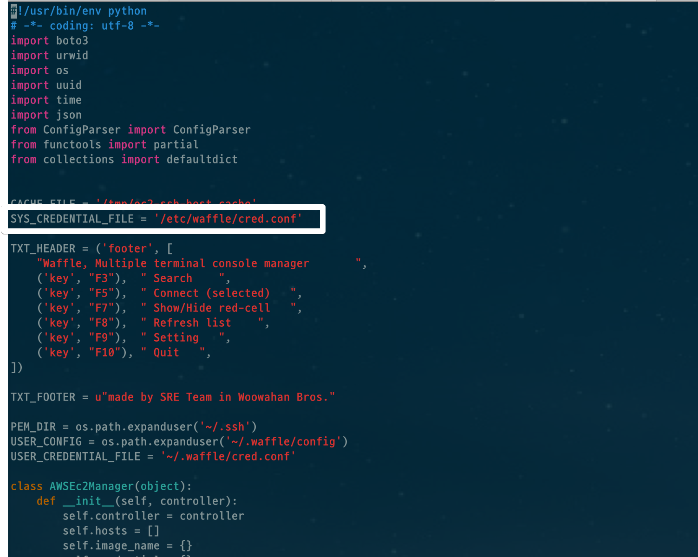
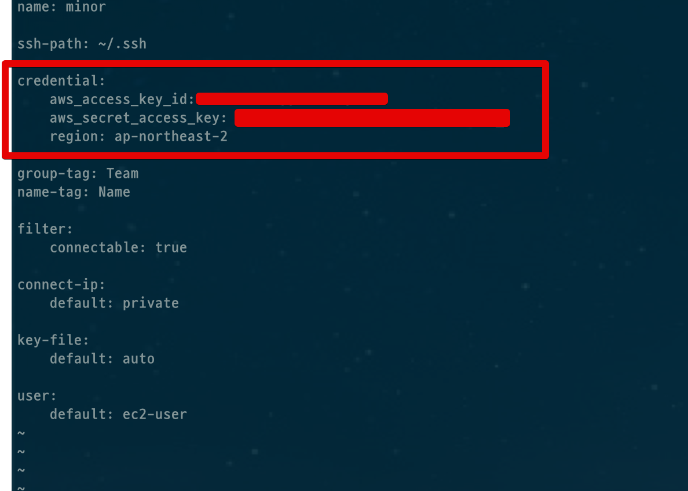
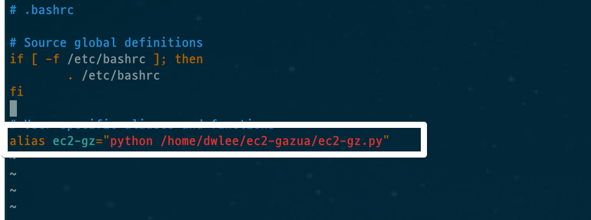
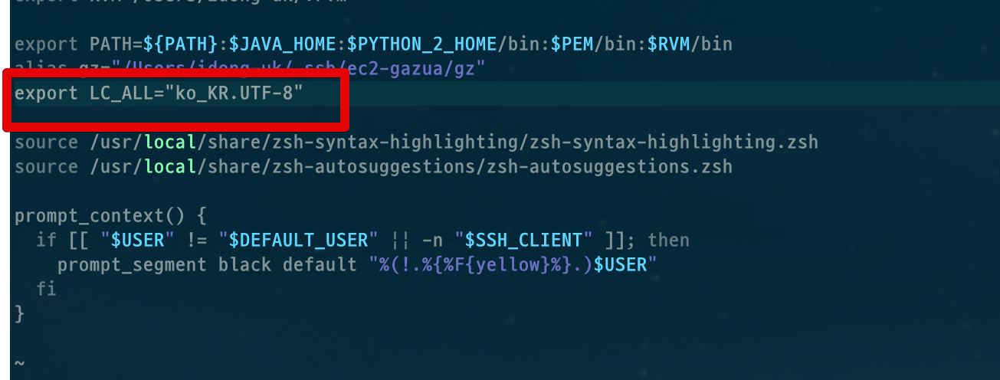

# ec2-gauza 최신 버전 반영

AWS EC2 접속기인 [ec2-gauza](https://github.com/leejaycoke/ec2-gazua)가 업데이트 되었습니다.  
혹시 처음 들어보신다면 아래 영상을 참고하시면 어떤 툴인지 바로 느낌이 올수있습니다.


> 개인적으로 AWS를 사용하시는 분들은 필수로 설치해야할 툴이라고 생각합니다.  

[예전에 기록한 글](https://jojoldu.tistory.com/311)은 최신 버전에서는 설치가 불가능하니, 아래 내용을 따라 재설치 하시면 됩니다.

## 설치

개인계정과 달리 사내 AWS (마이저, 스테이지, 메이저) 에서는 EC2 접근 전, 중간 터미널을 거쳐야만 합니다.  

| 이름     | 주소                     |
|----------|--------------------------|
| 마이너   | atn-a02.woowahan.com     |
| 스테이지 | atn-a01-stg.woowahan.com |
| 메이저   | atn-a01.woowahan.com     |

그래서 ec2-gauza 역시 위 장소에 설치해서 사용합니다.

### 1. clone

먼저 Github에서 해당 프로젝트를 clone 하고 설치합니다.

```bash
git clone https://github.com/leejaycoke/ec2-gazua.git
cd ./ec2-gazua/
pip install --user -r requirements.txt
```

설치가 끝났다면 **접속 가능한 EC2 목록을 보기 위해** AccessKey와 SecretKey를 등록하겠습니다.

### 2. AccessKey & SecretKey 등록

직접 EC2 목록을 볼수 있는 **IAM User**를 생성할 수 있다면 좋겠지만, 실제론 개발팀에 그런 권한이 없으니 각 중간 터미널에 설정된 Key를 통해 진행합니다.

먼저 ec2-ssh (사내 터미널 접속기) 의 설정파일을 찾아봅니다.

```bash
vim $(which ec2-ssh)
```

그럼 아래와 같이 파일이 열리는데요.  
이 중 ```SYS_CREDENTIAL_FILE```에 등록된 값을 복사합니다.



이 conf 파일이 Key를 관리합니다.  
요걸 한번 열어봅니다.

```bash
vim /etc/waffle/cred.conf
```

그럼 아래와 같이 key들이 나옵니다.

> 아시겠지만, Stage 환경은 A01 즉, **Major**입니다.  
Major, Stage 모두 marjo.access-key와 secret-key를 쓰시면 됩니다.


환경에 맞게 키를 복사한 뒤 ```ec2-gz``` 파일을 열어 키를 등록합니다.

```bash
vim ~/.ec2-gz
```

파일 내용은 아래와 같고 여기서 ```aws_access_key_id```와 ```aws_secret_access_key```에 복사한 Key값을 등록하면 됩니다.

```bash
name: minor

ssh-path: ~/.ssh

credential:
    aws_access_key_id: access-key # 요기
    aws_secret_access_key: secret-key # 요기
    region: ap-northeast-2

group-tag: Team
name-tag: Name

filter:
    connectable: true

connect-ip:
    default: private

key-file:
    default: auto

user:
    default: ec2-user
```




키 등록이 끝나셨다면 EC2 접속 권한을 얻기 위해 **pem 키를 등록**합니다

### 3. pem 파일 등록

pem 파일들은 모두 ```.ssh``` 디렉토리에 있어야 합니다.  
대부분은 해당 디렉토리가 없을꺼라 먼저 디렉토리를 만듭니다.

```bash
mkdir ~/.ssh
```

그리고 pem키를 모두 ```.ssh``` 디렉토리로 복사합니다.


참고로 pem키에는 실행 권한이 있어야하니 아래와 같이 명령어를 한번 실행해주세요.

```bash
chmod 600 ~/.ssh/*.pem
```

### 4. 접속!

접속하기 전에 먼저 실행 파일을 전역에 등록하여 어디서든 실행가능하도록 만들겠습니다.
먼저 ```.bashrc``` 파일을 열고

```bash
vim ~/.bashrc
```

아래 코드를 등록합니다.

```bash
alias ec2-gz="python /home/사용자계정/ec2-gazua/ec2-gz.py"
```



source로 반영후

```bash
source ~/.bashrc
```

실행해보면!

```bash
ec2-gz
```


아래와 같이 **pem 파일로 접속 가능한 서버 목록**을 볼 수 있습니다.


좌우상하 키로 접속하고 싶은 서버를 **space**로 선택하시고 **Enter**를 입력하시면!


선택한 모든 서버가 Tmux 화면 분할로 잘 접속된 것을 확인할 수 있습니다.

> 이후에는 Tmux 환경에서 돌아가니 Tmux 사용과 똑같은 방법으로 사용하시면 됩니다.

## 번외 1. 한글이 깨질때

Locale이 제대로 안먹힐때 한글이 깨집니다.  
아래의 코드를 ```.bashrc```에 등록하시면 됩니다.

```bash
vim ~/.bashrc
```

```bash
export LC_ALL="ko_KR.UTF-8"
```


