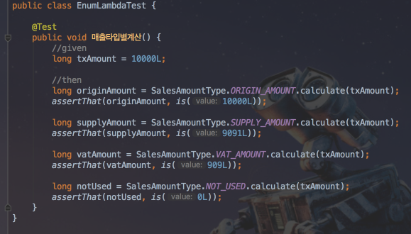

# enum 활용사례 3가지
안녕하세요? 이번 시간엔 enum 활용사례를 3가지정도 소개하려고 합니다.  
모든 코드는 [Github](https://github.com/jojoldu/blog-code/tree/master/enum-uses)에 있기 때문에 함께 보시면 더 이해하기 쉬우실 것 같습니다.  
(공부한 내용을 정리하는 [Github](https://github.com/jojoldu/blog-code)와 세미나+책 후기를 정리하는 [Github](https://github.com/jojoldu/review), 이 모든 내용을 담고 있는 [블로그](http://jojoldu.tistory.com/)가 있습니다. )<br/>
  
최근에 레거시 프로젝트를 개편하면서 enum을 적극 사용하였습니다.  
혹시나 비슷한 고민이 있으신분들에게 참고가 될까 싶어 포스팅하게 되었습니다.  
이런식으로 해결할 수도 있네? 정도로 봐주시면 될것 같습니다.  
그럼 시작하겠습니다!   
  
### 사례1 - code 관리용 테이블 대체하기

```@Enumerated(javax.persistence.EnumType.STRING)```을 entity의 필드에 선언하시면, 해당 enum 타입의 name이 DB에 저장됩니다.  
(여기서는 ```WOOWA_SISTERS```, ```WOOWA_CHILDREN``` 등이 DB에 저장됩니다.)  

단, 대전제는 **enum으로 관리되는 데이터가 빈번하게 추가/제거 되지 않아야**하는 것입니다.  
그렇지 않고, **1년에 1~2번 변경되는 code관리용 정보**는 enum을 고려해보심을 추천드립니다.   

### 사례2 - 타입별 다른 연산식 처리하기
예를 들어 매출금을 계산하는 프로그램이 필요하다고 가정하겠습니다.  
매출금의 경우 원금액, 공급가액, 부가세 이 3가지로 분류할 수 있는데, 한번의 결제가 발생하면 결제된 총 금액을 **원금액**으로, 원금액을 1.1로 나눈 금액을 **공급가액**으로, 공급가액의 10%를 **부가세**로 분류해야 합니다.   


(영수증을 보시면 쉽게 확인할 수 있습니다.)  

보통 이런 경우 가장 쉽게 진행할 수 있는 방법은 매출액 타입을 ```String``` 혹은 ```enum```으로 분리하고 서비스 코드에서 타입에 따라 ```if``` 분기처리 하는 것입니다.  
  
이런 경우가 제가 생각하기엔 전형적인 데이터와 로직이 분리된 사례라고 생각합니다.  
매출타입별 **연산식에 대한 책임**은 누가 갖고있어야 할까요?  
서비스코드일까요?  
각 매출타입이 갖고있어야 하지 않을까요?  
A 타입은 a식으로 계산해야하고,  
B 타입은 b식으로 계산해야한다는 A와 B가 책임져야하는 부분이 아닐까요?  
  
이전에는 이 사례를 코드로 풀려면 지저분해질수 밖에 없었습니다.  
하지만 Java8이 되면서 ```Function 인터페이스```가 등장하게 되어 function을 값으로 사용할 수 있게 되었습니다.  
(물론 내부적으로는 인터페이스의 구현체를 사용하나, 겉으로 드러나는 코드상으론 다른 함수형 언어처럼 function을 갖고 있는것처럼 보이는것입니다.)  


이 코드를 사용하게 되면  



이렇게 각 타입은 거래 금액(```txAmount```)에 대해 본인의 계산식을 실행만 시키면 됩니다.  
어느 코드에서든 특정 금액에 대해 타입별 계산금이 어떻게 되는지는 이제 그 타입에 직접 물어보면 되는 것입니다.  

꼭 이 상황에서 enum을 써야하느냐 보다는, **타입별로 다른 연산식을 적용해야 할 경우**엔 이렇게 사용하면 좋다 정도로 보시면 될것 같습니다.  

### 사례3 - 각 타입을 그룹화 하기
