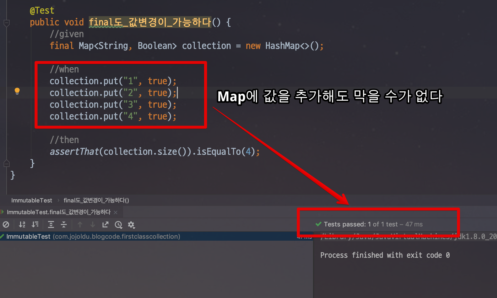

# 일급 컬렉션

안녕하세요?  
이번 시간에는 일급 컬렉션 (First Class Collection) 에 대해 배워보겠습니다.  
  
일급 컬렉션이란 단어는 [소트웍스 앤솔로지](https://coupa.ng/bgRZDf) 의 객체지향 생활체조 파트에서 언급이 되었습니다.  

> 규칙 8: 일급 콜렉션 사용
이 규칙의 적용은 간단하다. 
콜렉션을 포함한 클래스는 반드시 다른 멤버 변수가 없어야 한다. 
각 콜렉션은 그 자체로 포장돼 있으므로 이제 콜렉션과 관련된 동작은 근거지가 마련된셈이다.
필터가 이 새 클래스의 일부가 됨을 알 수 있다. 
필터는 또한 스스로 함수 객체가 될 수 있다. 
또한 새 클래스는 두 그룹을 같이 묶는다든가 그룹의 각 원소에 규칙을 적용하는 등의 동작을 처리할 수 있다. 
이는 인스턴스 변수에 대한 규칙의 확실한 확장이지만 그 자체를 위해서도 중요하다. 
콜렉션은 실로 매우 유용한 원시 타입이다. 
많은 동작이 있지만 후임 프로그래머나 유지보수 담당자에 의미적 의도나 단초는 거의 없다. - 소트웍스 앤솔로지 객체지향 생활체조편

간단하게 설명드리자면, 아래의 코드를

```java
Map<String, String> map = new HashMap<>();
map.put("1", "A");
map.put("2", "B");
map.put("3", "C");
```

아래와 같이 **Wrapping** 하는 것을 얘기합니다.

```java
public class GameRanking {

    private Map<String, String> ranks;

    public GameRanking(Map<String, String> ranks) {
        this.ranks = ranks;
    }
}
```

위와 같이 **Collection을 Wrapping**하면서, **그 외 다른 멤버 변수가 없는 상태**를 일급 컬렉션이라 합니다.  
Wrapping 함으로써 다음과 같은 이점을 가지게 됩니다.

* Collection과 Collection에 필요한 기능을 **함께 관리** 할 수 있음
* Collection의 **불변성**을 보장
* Collection에 **고유한 이름**을 부여할 수 있음

하나 하나 설명드리겠습니다.

## 1. 상태와 행위를 한곳에서 관리

일급 컬렉션의 첫번째 장점은 **값과 로직이 함께 존재**한다는 것입니다.  

> 이 부분은 예전에 소개 드린 [Enum](http://woowabros.github.io/tools/2017/07/10/java-enum-uses.html)의 장점과도 일맥상통합니다.  

예를 들어 여러 Pay들이 모여있고, 이 중 NaverPay 금액의 합이 필요하다고 가정해보겠습니다.  


```java
public class PayGroups {
    private List<Pay> pays;

    public PayGroups(List<Pay> pays) {
        this.pays = pays;
    }
    
    public Long getNaverPaySum() {
        return pays.stream()
                .filter(pay -> PayType.isNaverPay(pay.getPayType()))
                .mapToLong(Pay::getAmount)
                .sum();
    }
}
```

```java
public class PayGroups {
    private List<Pay> pays;

    public PayGroups(List<Pay> pays) {
        this.pays = pays;
    }

    public Long getNaverPaySum() {
        return getFilteredPays(pay -> PayType.isNaverPay(pay.getPayType()));
    }

    public Long getKakaoPaySum() {
        return getFilteredPays(pay -> PayType.isKakaoPay(pay.getPayType()));
    }

    private Long getFilteredPays(Predicate<Pay> predicate) {
        return pays.stream()
                .filter(predicate)
                .mapToLong(Pay::getAmount)
                .sum();
    }
}
```

## 2. 불변

일급 컬렉션은 **컬렉션의 불변을 보장**합니다.  

여기서 ```final```을 사용하면 안되나요?  라고 하시는 분들이 계신데요.  
Java의 ```final```은 정확히는 불변을 만들어주는 것은 아니며, **재할당만 금지** 합니다.  
  
아래 테스트 코드를 참고해봅시다.

```java
    @Test
    public void final도_값변경이_가능하다() {
        //given
        final Map<String, Boolean> collection = new HashMap<>();

        //when
        collection.put("1", true);
        collection.put("2", true);
        collection.put("3", true);
        collection.put("4", true);

        //then
        assertThat(collection.size()).isEqualTo(4);
    }

```

이를 실행해보면!



**값이 추가**되는걸을 확인할 수 있습니다.  
이미 ```collection```은 **비어있는 HashMap**으로 선언되었음에도 값이 변경될수 있다는것이죠.  
  
추가로 테스트해볼까요?

```java
    @Test
    public void final은_재할당이_불가능하다() {
        //given
        final Map<String, Boolean> collection = new HashMap<>();

        //when
        collection = new HashMap<>();

        //then
        assertThat(collection.size()).isEqualTo(4);
    }
```

이 코드는 바로 컴파일에러가 발생합니다.  


**final로 할당된 코드에 재할당할순 없기 때문**이죠.  
  
보신것처럼 Java의 final은 **재할당만 금지**합니다.  
이외에도 ```member.setAge(10)``` 과 같은 코드 역시 작동해버리니 **반쪽짜리 선언문**이라 할 수 있겠습니다.  
  
요즘과 같이 소프트웨어 규모가 커지고 있는 상황에서 **불변 객체**는 아주 중요합니다.  
각각의 객체들이 **절대 값이 바뀔일이 없다**는게 보장되면 그만큼 코드를 이해하고 수정하는데 **사이드 이펙트가 최소화**되기 때문입니다.  
  
Java에서는 final로 그 문제를 해결할 수 없어서 

## 3. 