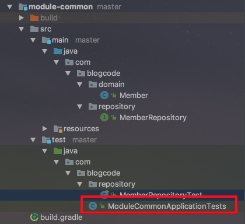
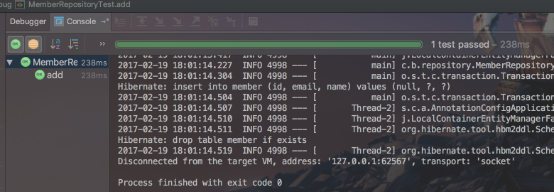
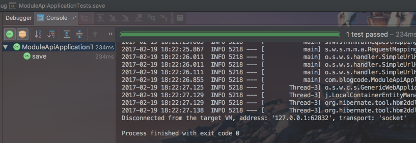
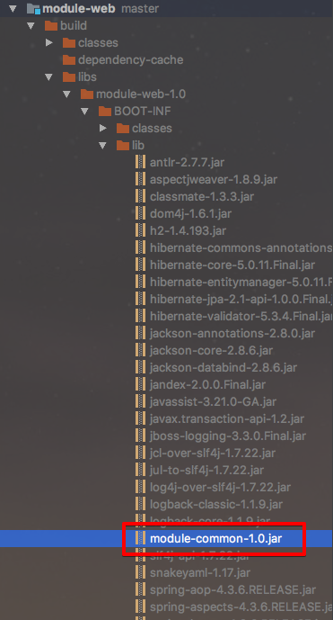
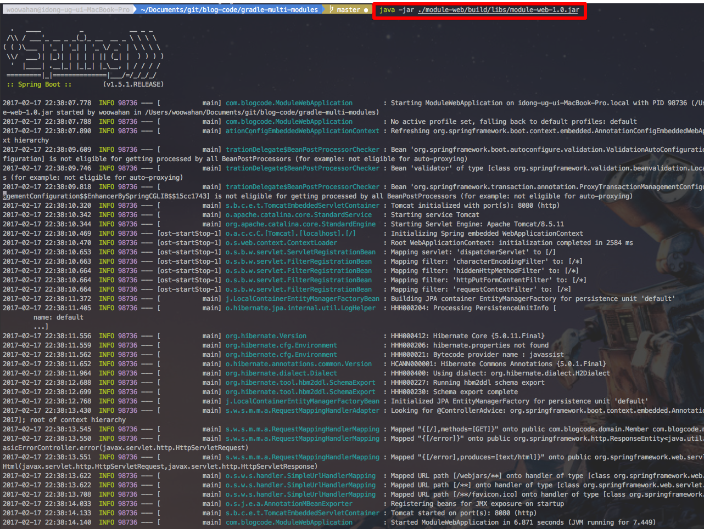
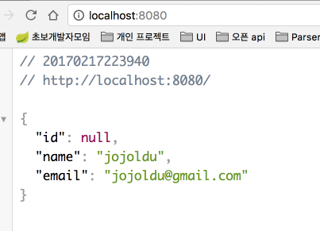

# Gradle 멀티 프로젝트 관리
안녕하세요! 이번 시간에는 아시는 분들은 거의다 아시는(!?) Gradle을 이용한 멀티 프로젝트(모듈) 관리에 대해 소개하려고 합니다.  
모든 코드는 [Github](https://github.com/jojoldu/blog-code/tree/master/gradle-multi-modules)에 있으니 참고하셔서 보시면 더 좋으실 것 같습니다.  
(공부한 내용을 정리하는 [blog-code](https://github.com/jojoldu/blog-code)와 세미나+책 후기를 정리하는 [review](https://github.com/jojoldu/review), 이걸 모두 정리하는 [블로그](http://jojoldu.tistory.com/)가 있습니다.)<br/>  

대부분의 서비스는 단일 프로젝트로 구성되는 일이 거의 없습니다.  
아무리 작게 구성해도 일정 수준 이상의 트래픽을 감당하려면 사용자와의 접점을 담당하는 서버(이하 web프로젝트라고 하겠습니다.), DB와의 접점을 담당하는 서버(api프로젝트라 칭하겠습니다.)로 구분하여 구성하게 됩니다.  
이럴 경우 고민이 되는 것이 그럼 **web과 api 모두에서 사용되는 클래스들은 어떻게 다룰 것인가** 입니다.  

  

(공통으로 사용되는 클래스를 Member클래스라 칭하겠습니다.)  

가장 쉽고 흔한 방법은 **복사 & 붙여넣기**입니다.  
한 프로젝트에서 Member 클래스파일을 생성하고 이를 다른 프로젝트에서 코드를 복사하는 방식입니다.  
하지만 이럴 경우 연동되는 프로젝트가 늘어날 경우, 혹은 Member 클래스의 코드에 수정이 필요할 경우에 정말 **많은 양을 수정해야하고 실수할 여지가 많아집니다**.  

어떻게 하면 이 문제를 해결할 수 있을까요?  
하나의 공통 프로젝트를 두고, 이 프로젝트를 여러 프로젝트에서 가져가서 사용할 수 있으면 좋지 않을까요?  
위 처럼 해결하려면 몇가지 조건이 수반됩니다.
* 개발시에는 바로바로 공통 프로젝트 코드를 사용할 수 있어야 한다.
* 빌드시에는 자동으로 공통 프로젝트가 포함되어야 한다.

Gradle의 Multi Module 방식을 사용하여 문제를 해결해보겠습니다.

### 본문
프로젝트 구조는 root 프로젝트인 gradle-multi-modules란 프로젝트와 그 하위 프로젝트(혹은 모듈)들인 module-api, module-web, module-common 으로 구성합니다.  

  

빌드는 항상 root 프로젝트를 기준으로 진행할 예정이기에 gradle-multi-modules 외에 나머지 프로젝트에는 gradle폴더, gradlew등의 파일이 없으며 build.gradle과 src폴더만 존재합니다.  
module-common이 다른 프로젝트에서 사용할 중요한 혹은 공통 클래스를 모아놓은 프로젝트라고 생각하시면 됩니다.  
공통으로 사용할 ```Member.java```와 ```MemberRepository.java```파일을 만들겠습니다.  

**Member.java**  
```
@Entity
public class Member {
    @Id
    @GeneratedValue
    private Long id;

    @Column
    private String name;

    @Column
    private String email;

    public Member() {
    }

    public Member(String name, String email) {
        this.name = name;
        this.email = email;
    }

    public Long getId() {
        return id;
    }

    public String getName() {
        return name;
    }

    public String getEmail() {
        return email;
    }
}
```

**MemberRepository.java**  
```
public interface MemberRepository extends JpaRepository<Member, Long> {
}
```

module-common의 build.gradle은 아래와 같습니다.  
```
dependencies {
	compile('org.springframework.boot:spring-boot-starter-data-jpa')
	runtime('com.h2database:h2')
	testCompile('org.springframework.boot:spring-boot-starter-test')
}
```
그럼에도 Entity 클래스를 작성하고, 이 Entity 클래스의 repository, 그리고 간단한 repository test까지는 가능해야 하기 때문에 위와 같이 의존성을 추가하였습니다.
이외 설정은 **현재는 추가하지 않습니다**.

그럼 이제 다음 프로젝트(모듈)인 module-api의 코드를 작성해보겠습니다.  
module-api은 실질적으로 module-common의 클래스들을 사용할 것이기 때문에 Service 를 작성하겠습니다  

**MemberServiceCustom.java**  
```
@Service
public class MemberServiceCustom {

    private MemberRepository memberRepository;

    public MemberServiceCustom(MemberRepository memberRepository) {
        this.memberRepository = memberRepository;
    }

    public Long signup (Member member) {
        return memberRepository.save(member).getId();
    }
}
```

MemberRepository의 bean injection을 ```@Autowired```(이하 필드 injection)없이 생성자 injection을 사용하였습니다.  
이전에는 필드 injection을 많이 사용하였는데, 이럴 경우 **SpringMVC에 종속적**이게 된다는 점과 mock 의존성을 좀 더 자유롭게 사용하기가 힘든점이 있어 최근에 생성자 injection을 사용하고 있습니다.  
(IntelliJ의 경우 필드 injection을 사용하면 생성자 injection으로 교체하라는 메세지를 출력시키고 있습니다.)  

그리고 module-api의 build.gradle에도 사용할 의존성들을 추가하겠습니다.  
**build.gradle**  
```
dependencies {
	compile('org.springframework.boot:spring-boot-starter-web')
	testCompile('org.springframework.boot:spring-boot-starter-test')
}
```
자 여기까지 하시면 아마 엄청난 양의 빨간줄을 보실수 있으실 것입니다.  
이는 몇가지 이유가 있는데
* module-api가 사용하는 ```Member```와 ```MemberRepository```를 찾지 못했다.
* spring boot 관련 의존성이 관리되지 못하고 있다.  

등의 이유가 있습니다. 그래서 이를 수정해보도록 하겠습니다.  

gradle-multi-modules의 settings.gradle을 열어서 아래 코드를 추가합니다.  
```
rootProject.name = 'gradle-multi-modules'

include 'module-common', 'module-api', 'module-web'
```

이 코드는 gradle-multi-modules 프로젝트가 'module-common', 'module-api', 'module-web' 프로젝트를 하위 프로젝트로 관리하겠다는 의미입니다.  
settings.gradle의 내용은 여기서 끝입니다. 바로 build.gradle 코드를 작성하겠습니다.
root 프로젝트인 gradle-multi-modules의 build.gradle을 아래와 같이 수정하겠습니다.  

**build.gradle**  

```
buildscript {
    ext {
        springBootVersion = '1.5.1.RELEASE'
    }
    repositories {
        mavenCentral()
    }
    dependencies {
        classpath("org.springframework.boot:spring-boot-gradle-plugin:${springBootVersion}")
        classpath "io.spring.gradle:dependency-management-plugin:0.6.0.RELEASE"
    }
}

subprojects {
    group 'com.blogcode'
    version '1.0'

    apply plugin: 'java'
    apply plugin: 'spring-boot'
    apply plugin: 'io.spring.dependency-management'

    sourceCompatibility = 1.8

    repositories {
        mavenCentral()
    }

    dependencies {
        testCompile group: 'junit', name: 'junit', version: '4.12'
    }
}

project(':module-api') {
    dependencies {
        compile project(':module-common')
    }
}

project(':module-web') {
    dependencies {
        compile project(':module-common')
    }
}
```  

여기서 중요하게 보실 부분은 ```subprojects```와 ```project()```입니다.  
```subprojects```는 ```settings.gradle```에 include된 프로젝트 전부를 관리합니다.    
하위 프로젝트들 모두 SpringBoot와 Java에 의존성을 두고 있기에 관련된 plugin을 등록하였습니다.  
(root 프로젝트까지 적용하고 싶다면 ```allprojects```로 등록하시면 됩니다.)  
```project```의 경우 하위 프로젝트간의 의존성을 관리합니다.  
(참고로 ```:```은 디렉토리 path를 얘기합니다. root 프로젝트에서 하위 프로젝트 사이에 계층이 하나 존재하기 때문에 추가하였습니다.)   
```module-api```와 ```module-web```은 모두 ```module-common```에 의존하고 있기 때문에 이를 등록하였습니다.  
이렇게 설정할 경우 각 프로젝트는 이제 ```module-common``` 의 코드를 사용할 수 있게 됩니다.
이게 끝입니다.  
아주 간단하지 않으신가요?  
그럼 잘 적용되는지 한번 테스트 해보겠습니다.  
처음 테스트 해볼 내용은 ```module-common```입니다.  
```module-common``` 자체가 문제가 없는지 테스트하기 위해 ```ModuleRepositoryTests.java```를 만들겠습니다.  

**ModuleRepositoryTests**  

```
import static org.hamcrest.CoreMatchers.is;
import static org.hamcrest.MatcherAssert.assertThat;

@RunWith(SpringRunner.class)
@DataJpaTest
public class MemberRepositoryTest {

    @Autowired
    private MemberRepository memberRepository;

    @Test
    public void add () {
        memberRepository.save(new Member("jojoldu", "jojoldu@gmail.com"));
        Member saved = memberRepository.findOne(1L);
        assertThat(saved.getName(), is("jojoldu"));
    }
}
```
여기서는 ```Entity```와 ```repository```만 테스트 할 것이기 때문에 ```@SpringBootTest```가 아닌 ```@DataJpaTest```를 사용하였습니다.  
자 그럼 테스트를 한번 실행시켜보겠습니다.  
테스트가 혹시 통과하시나요??  
아래와 같이 실패하지 않으시나요?  


로그를 보시면 아시겠지만 테스트가 실패한 이유는 module-common 프로젝트의 경우 ```@SpringBootApplication```과 같은 **Spring Context를 불러오는 포인트가 없어서** 인데요, 이를 위해 임시 시작 포인트용 클래스인 ```ModuleCommonApplicationTests```를 생성하겠습니다.  



**ModuleCommonApplicationTests.java**  

```
@SpringBootApplication
public class ModuleCommonApplicationTests {
	public void contextLoads() {}
}
```

이제 다시 테스트를 실행해보겠습니다.

  

```module-common``` 프로젝트의 코드가 정상적으로 작동되는 것을 확인할 수 있습니다.  
그럼 바로 멀티 모듈의 기능을 확인하기 위해 ```module-api```의 테스트를 해보겠습니다.  

**ModuleApiApplicationTests.java**  

```
import static org.hamcrest.CoreMatchers.is;
import static org.hamcrest.MatcherAssert.assertThat;

@RunWith(SpringRunner.class)
@SpringBootTest
public class ModuleApiApplicationTests {

	@Autowired
	private MemberServiceCustom memberServiceCustom;

	@Test
	public void save() {
		Member member = new Member("jojoldu", "jojoldu@gmail.com");
		Long id = memberServiceCustom.signup(member);
		assertThat(id, is(1L));
	}
}
```

```module-common```의 ```MemberRepository```를 사용하는 MemberServiceCustom과 ```Member```를 사용하는 테스트 코드를 작성하였습니다. 이를 실행해보면!  

  

테스트가 통과된 것을 확인할 수 있습니다.  
즉, 서로 다른 프로젝트간에 클래스들을 사용할 수 있음을 확인할 수 있습니다.  
개발 단계에서는 이렇게 설정해서 사용한다면 동일한 클래스를 사용해야하는 여러 프로젝트에서 중복된 클래스 없이 개발을 진행할 수 있겠죠?  

자 그럼 한가지 더 이슈가 남아있으니, 바로 **빌드시에 공통모듈을 각 프로젝트 별로 포함시키는 것**입니다.  
현재 상황에서 바로 프로젝트 전체 빌드를 실행해보겠습니다.  

  

module-common 프로젝트의 빌드가 실패합니다.  
그 이유는 gradle 빌드시에는 각 프로젝트를 **실행가능한 jar**형태로 만들게 되는데, module-common 프로젝트의 경우 ```main```메소드가 없기 때문입니다.  
그렇다고 SpringMVC를 module-common에 추가할수는 없습니다.  
이렇게 단순히 참조용 클래스들만 있는 프로젝트를 위해 gradle에서는 ```bootRepackage.enabled``` 설정을 제공합니다.  
module-common의 ```build.gradle```을 아래와 같이 변경하겠습니다.  

  

자 그러면 다시 빌드를 해보겠습니다.  
정상적으로 빌드 된것이 보이시나요?  
jar에 잘 포함되었는지 module-web.jar를 압축해제하여 한번 확인해보겠습니다.  



이 jar가 잘 실행되는지도 확인해보기 위해서 module-web에 간단한 ```Controller```를 추가하겠습니다.  

**MemberController.java**  

```
RestController
public class MemberController {

    @GetMapping("/")
    public Member get() {
        return new Member("jojoldu", "jojoldu@gmail.com");
    }
}
```

그리고 다시 한번 빌드를 한 뒤에 아래와 같이 ```module-web.jar```를 실행해보겠습니다.  



실행 된 것이 확인되시면 브라우저를 열어 [http://localhost:8080](http://localhost:8080)을 입력하겠습니다.  

  

짠! 드디어 빌드까지 성공한 것을 확인할 수 있습니다.  
어떠셨나요?  
아마 gradle에 대해 사용중이셨던 분들에겐 너무나 당연한 이야기였을 것 같지만, 아닌 분들에겐 조금이나마 도움이 되셨으면 좋겠습니다.  
긴글 끝까지 읽어주셔서 감사합니다^^  

### 참고
[권남님의 위키](http://kwonnam.pe.kr/wiki/gradle/multiproject)
[Gradle 레퍼런스](https://docs.gradle.org/current/userguide/multi_project_builds.html)
