Gradle task 적응하기
====================

maven이나 gradle와 같은 build 툴 중 하나는 익숙해져야겠다는 생각에 이것저것 불편했던 사항들을 해결하면서 공부하려고 한다.

<!--toc -->

-	[Gradle task 적응하기](#gradle-task-적응하기)
	-	[Build 후 SCP로 원격서버에 빌드파일 전송하기](#build-후-scp로-원격서버에-빌드파일-전송하기) - [프로젝트 생성](#프로젝트-생성) - [플러그인 추가](#플러그인-추가) - [SCP task 등록](#scp-task-등록) - [war 전송하기](#war-전송하기) - [파라미터로 설정하기](#파라미터로-설정하기) - [마무리](#마무리)

<!-- tocstop -->

Build 후 SCP로 원격서버에 빌드파일 전송하기
-------------------------------------------

CI (젠킨스 or 허드슨) 도입X + 망분리 상황에서는 배포가 여간 귀찮은게 아니다.<br/> 특히 망 분리로 배포서버로 다이렉트로 접근할 수가 없어 인터넷 PC - > 중간 서버 -> 내부망 PC -> 배포 서버 과정을 거쳐 war/jar를 전송해야만 한다.


(으아아아앙ㅠㅠㅠ)

보안 때문에 어쩔수 없긴 한데 QA도중 수정사항을 즉각 반영하는게 잦다보니 이 과정중 하나라도 좀 줄여보자고 생각해서 gradle task를 작성하게 되었다. <br/> 진행할 내용은 **IDE에서 build 진행이 완료되면 지정한 원격 서버로 war/jar를 전송** 하는 것이다. <br/> 코드는 [Github](https://github.com/jojoldu/blog-code/tree/master/gradle-task)에 전부 있으니 같이 보면 좋을것 같다. 그럼 시작하겠다.

#### 프로젝트 생성

먼저 gradle을 설치하자. 이건 별다를게 없는데 그래도 검색이 귀찮다면 [여기](http://enterkey.tistory.com/351)를 참고! 프로젝트는 IntelliJ + SpringBoot 기반으로 진행할 예정이다.<br/> SpringBoot로 프로젝트 생성하는 것은 인터넷에 워낙 많으니 각자 본인의 IDE에 맞게 프로젝트 생성을 하자.<br/> 프로젝트 생성후 build.gradle을 열어보면 휑한 화면을 볼 수 있다.

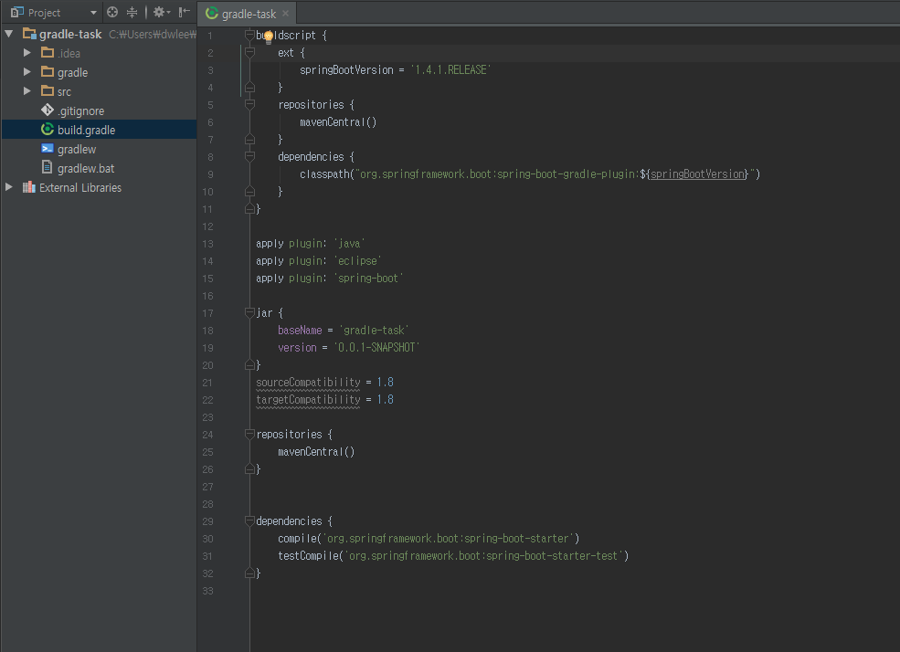

우린 여기서부터 하나씩 진행할 것이다. <br/>

#### 플러그인 추가

Gradle의 경우 ssh 사용을 도와주는 유용한 플러그인으로 [gradle-ssh-plugin](https://gradle-ssh-plugin.github.io/) 이 있다. 특히 scp의 경우 함수만 호출하면 될 정도로 아주 쉬운 형태로 지원해주기 때문에 한번 써보면 여러모로 쓸곳이 많음을 느낄 수 있을것 같다. <br/> 여튼 이 플러그인을 사용할 수 있도록 build.gradle을 수정해보겠다.

```
buildscript {
	ext {
		springBootVersion = '1.4.1.RELEASE'
    gradleSshVersion = '2.2.0' //아래 gradle-ssh-plugin에서 사용할 버전 명시
	}
	repositories {
		jcenter()
	}
	dependencies {
		classpath("org.springframework.boot:spring-boot-gradle-plugin:${springBootVersion}")
    classpath("org.hidetake:gradle-ssh-plugin:${gradleSshVersion}") //gradle 플러그인 의존성 추가
	}
}

//플러그인 적용
apply plugin: 'org.hidetake.ssh'
```

위 코드를 추가하고 gradle 새로고침을 하면 플러그인이 추가된다.

#### SCP task 등록

이 프로젝트에서 scp task등록이 모든것은 아니다. 팀 단위로 사용하는 프로젝트에서 적용할 수 있어야 하므로 scp + 팀 단위에서 어떻게 관리할 것 인가가 메인 주제이기 때문에 벌써 SCP가 나왔다고 놀래지 않으셔도 된다. <br/><br/> 먼저 프로젝트 내부에 gradle.properties를 생성하자

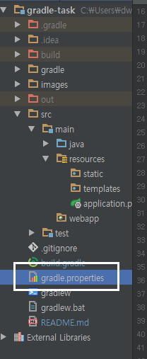

그리고 gradle.properties에 아래와 같이 원격서버 접속 정보를 작성하자.

```
publicHost=원격서버호스트orIP
publicPort=포트
publicUser=계정
publicPassword=비밀번호
publicDir=/
```

위 설정값들은 build.gradle에서 사용할 예정이다. <br/> build.gradle에 아래 코드를 추가해보자.

```
remotes {
	publicServer {
		host = project.properties["publicHost"]
		port = project.properties["publicPort"].toInteger()
		user = project.properties["publicUser"]
		password = project.properties["publicPassword"]
		knownHosts = allowAnyHosts //알 수 없는 호스트라도 접속 가능
	}
}

task scp <<{
	ssh.run {
		//remotes.publicServer으로 호스트 세션 시작
		session(remotes.publicServer) {

			// war 파일명을 로컬변수에 지정
			final warName = "test.txt"
			println "war 이름 : ${warName}"

			println "public 서버 파일 전송 시작"
			/*
				from : 현재 폴더를 기준으로 from path 지정
				into : 도착서버의 디렉토리 path 지정
			 */
			put from: "${warName}", into: project.properties["publicDir"]
			println "public 서버 파일 전송 완료"
		}
	}
}
```

remotes는 gradle.properties를 기준으로 접속할 원격서버를 설정한다. <br/> 원격 서버가 여러 곳이라면, publicServer로 되어있는 부분을 복사+붙여넣기+설정값 변경을 하면 지정한 객체명으로(여기선 publicServer) 여러 task에서 사용할 수 있다. <br/> 하단의 task의 경우 scp 라는 이름으로 지정하여 호스트 세션은 remotes.publicServer로 지정하였다. <br/> 중요하게 봐야할 부분은 put이다.<br/> put은 기존에 우리가 `scp 파일명 계정명@호스트명:디렉토리`로 진행되던 scp 명령어를 간단히 함수로 구현해준 것이다. <br/> 여기서 지정할 것은 **로컬서버의 어떤 파일(from)을 원격서버 어느 디렉토리(into)로 보낼것** 인지만 지정하면 된다. <br/> 간단하게 테스트 하기 위해 프로젝트 폴더에 test.txt를 생성하자.

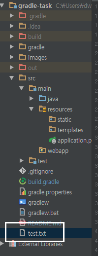

그리고 scp task를 실행해보자 <br/> 아래 그림처럼 IntelliJ에 run config를 등록하자

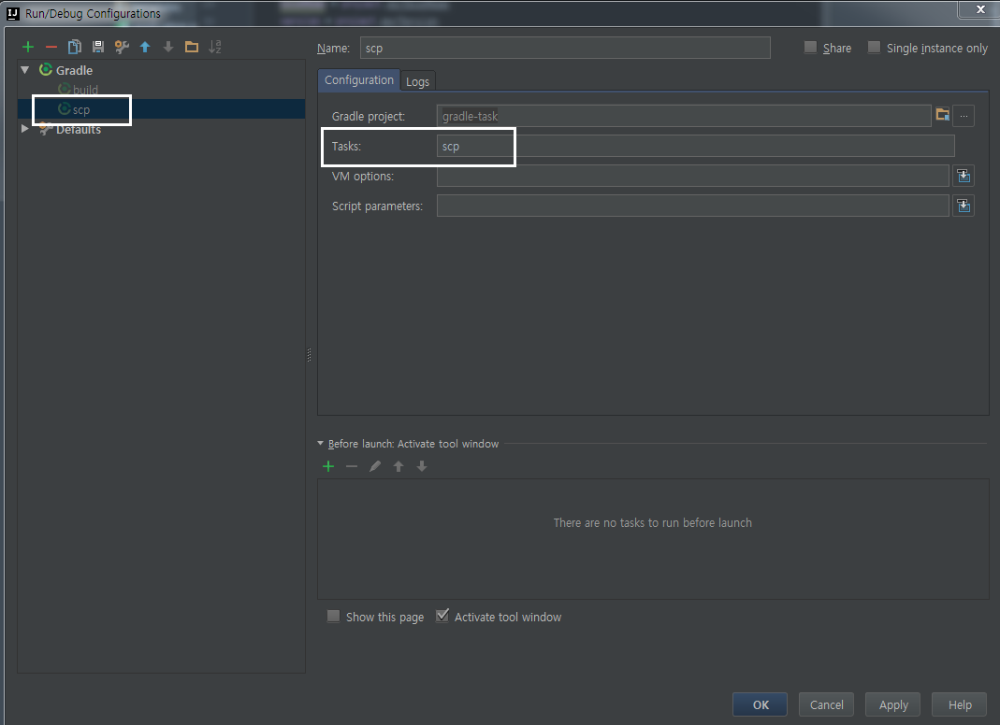

그리고 실행하면!


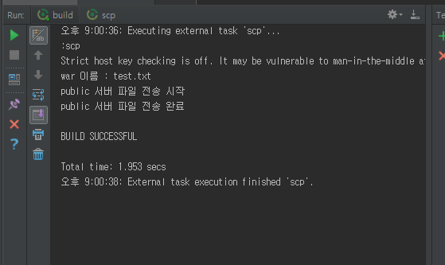

IntelliJ에서 빌드 성공 메세지를 보내주며,

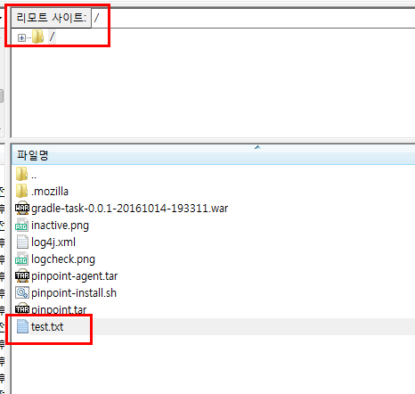

원격서버에는 test.txt가 전달된 것을 확인할 수 있다.<br/><br/> 자 그럼 이제부터 실제 build 파일을 scp 할 수 있도록 수정해보자

#### war 전송하기

보통 배포 파일이라하면 war를 기준으로 하고 있으니 war로 진행하겠다. (SpringBoot가 확산되면서 jar도 점점 늘어나는 추세이긴 하다.) <br/> 일반적인 war 설정은 아래와 같다.

```
war {
	baseName = "gradle-task"
	version = '0.0.1-'+ new Date().format('yyyyMMdd-HHmmss')
	exclude("build/**")
}

// war 플러그인 적용
apply plugin: "war"
```

baseName과 version을 명시하여 build가 성공하면 `baseName-version.war` 란 이름의 war가 생성된다. <br/> 여기서 한번 생각해볼만한 문제가, 보통 이런 war name의 경우 동일 version을 구분하기 위해 version뒤에 **build를 실행한 시간** 을 붙이도록 한다. <br/> 위 코드로 build하게 되면 gradle-task-0.0.1-20161014-091110.war 라는 war가 생성된다. <br/> build할때마다 war명이 변경되는데 scp task에서는 war명을 명시하길 원하고 있으니 대략 난감한 상황이 되버린다.


그래서 war명을 전역변수로 지정하여 war와 scp task에서 이 변수를 사용하도록 지정하겠다.

```
// 여러 task에서 사용할 수 있도록 build file 이름은 전역변수로 지정
project.ext{
	warBaseName = 'gradle-task'
	warVersion = '0.0.1-'+ new Date().format('yyyyMMdd-HHmmss')
}

war {
	baseName = project.warBaseName
	version = project.warVersion
	exclude("build/**")
}

apply plugin: "war"
```

이렇게 지정하게 되면 첫 task 진행시 미리 warVersion 변수에 시시각각 변하는 현재시간이 할당 되고, 다른 task에서는 이를 호출하기만 하면 된다. <br/> 그리고 scp task도 war를 전송하도록 변경하자.

```
task scp <<{
	ssh.run {
		//remotes.publicServer으로 호스트 세션 시작
		session(remotes.publicServer) {
			// war 파일명을 로컬변수에 지정
			final warName = project.warBaseName + "-" + project.warVersion+".war"
			println "war 이름 : ${warName}"

			println "public 서버 파일 전송 시작"
			/*
				from : 현재 폴더를 기준으로 from path 지정
				into : 도착서버의 디렉토리 path 지정
			 */
			put from: "build/libs/${warName}", into: project.properties["publicDir"]
			println "public 서버 파일 전송 완료"
		}
	}
}
```

이렇게 scp까지 수정했을 때의 build.gradle의 전체 코드는 아래와 같다.

```

// 여러 task에서 사용할 수 있도록 build file 이름은 전역변수로 지정
project.ext{
	warBaseName = 'gradle-task'
	warVersion = '0.0.1-'+ new Date().format('yyyyMMdd-HHmmss')
}

buildscript {
	ext {
		springBootVersion = '1.4.1.RELEASE'
		gradleSshVersion = '2.2.0'
	}
	repositories {
		jcenter()
	}
	dependencies {
		classpath("org.springframework.boot:spring-boot-gradle-plugin:${springBootVersion}")
		classpath("org.hidetake:gradle-ssh-plugin:${gradleSshVersion}")
	}
}

apply plugin: "war"
apply plugin: 'java'
apply plugin: 'eclipse'
apply plugin: 'spring-boot'
apply plugin: 'org.hidetake.ssh'

war {
	baseName = project.warBaseName
	version = project.warVersion
	exclude("build/**")
}

sourceCompatibility = 1.8
targetCompatibility = 1.8

repositories {
	jcenter()
}


dependencies {
	compile('org.springframework.boot:spring-boot-starter-web')
	testCompile('org.springframework.boot:spring-boot-starter-test')
}

remotes {
	publicServer {
		host = project.properties["publicHost"]
		port = project.properties["publicPort"].toInteger()
		user = project.properties["publicUser"]
		password = project.properties["publicPassword"]
		knownHosts = allowAnyHosts //알 수 없는 호스트라도 접속 가능
	}
}

task scp <<{
	ssh.run {
		//remotes.publicServer으로 호스트 세션 시작
		session(remotes.publicServer) {
			// war 파일명을 로컬변수에 지정
			final warName = project.warBaseName + "-" + project.warVersion+".war"
			println "war 이름 : ${warName}"

			println "public 서버 파일 전송 시작"
			/*
				from : 현재 폴더를 기준으로 from path 지정
				into : 도착서버의 디렉토리 path 지정
			 */
			put from: "build/libs/${warName}", into: project.properties["publicDir"]
			println "public 서버 파일 전송 완료"
		}
	}
}
```

war 전송을 위해 새로운 run config를 등록하자.

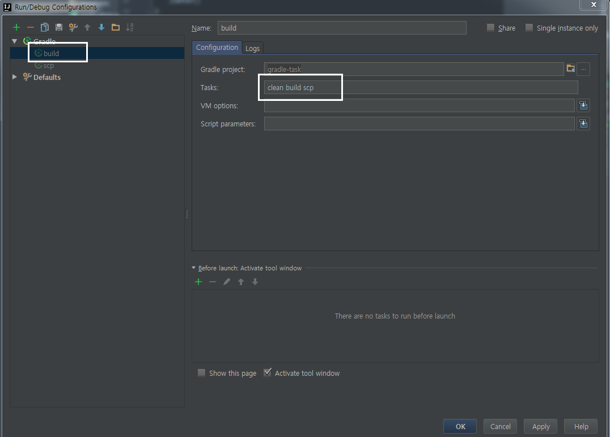

위 사진을 보면 아까와 다르게 scp외에도 여러 코드가 들어가 있다.<br/> 이는 해당 run config 실행시 등록한 task를 순차적으로 실행하라는 것이다. <br/> 현재 내용으로는 clean task -> build task -> scp task가 실행되는 것이다. <br/>

여기까지 다되었으면 이제 실행시켜보자

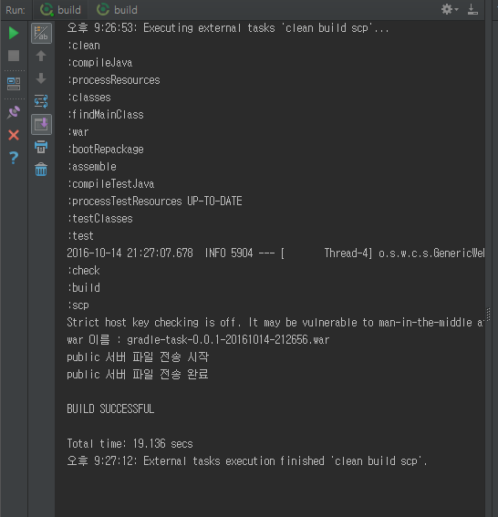

아주 예쁜 성공 메세지를 볼 수 있다. 그리고 원격서버를 보면,

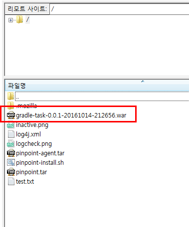

잘 도착했음을 확인할 수 있다.<br/> 여기까지 오느라 너무 수고가 많았지만, 이것만으로 실제 회사에서 사용할 수는 없다.


(??????) <br/>

현재 방식은 개발자가 1명일때 사용할수 있는 방식이다. <br/> 단일 프로젝트에 여러 개발자가 관리 할 경우 서로의 원격서버가 동일하지 않을 수 있다. <br/> 즉, 배포서버로 직접 전달하는 것이 아닌, 중간서버 격인 원격 서버는 각 개발자마다 다를 수 있다는 것이다.<br/> 그렇기 때문에 원격서버 설정은 개발자마다 다르게 관리하되, git에는 올라가지 않도록 수정할 필요가 있다.

#### 파라미터로 설정하기

위와 같은 문제를 해결하는 가장 편리한 방법은 바로 task 실행시에 argument로 원격서버 설정값을 넣어주는 것이다. <br/> 이렇게 할 경우 모든 개발자가 같은 build.gradle를 사용하지만 전송될 원격 서버는 각자의 IDE 마다 다르게 지정해놓으면 되기 때문에 아주 쉽게 문제를 해결할 수 있다. <br/> 문제를 해결하기 전에, 문제상황을 미리 만들어 보자. <br/> gradle.properties를 잘못된 원격 주소로 수정하여 방금전 수행한 run config (build)를 실행해보자. 그러면,

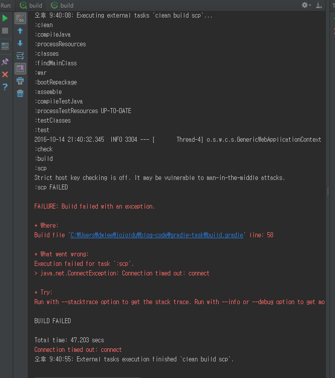

이렇게 scp단계에서 connect가 실패된 것을 확인할 수 있다. <br/> 우리가 해야할 것은 gradle.properties가 아닌 우리만의 원격서버 정보로 접속하는 것이다. <br/> run config 영역을 열어 Script parameters 영역에 다음의 코드를 추가하자.

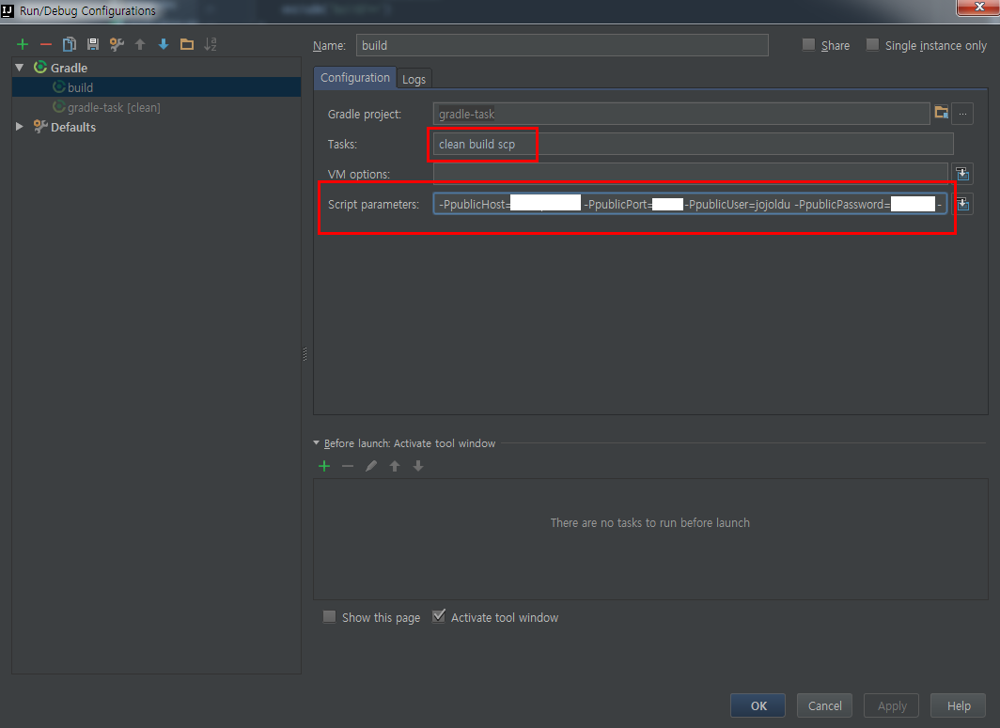

```
-PpublicHost=원격서버호스트orIP -PpublicPort=포트 -PpublicUser=계정 -PpublicPassword=비밀번호 -PpublicDir=디렉토리path
```

보면 바로 눈치챌것같은데, gradle.properties에 등록한 각각의 설정들의 key 앞에 `-P`를 붙인 것이다. (gradle에서 `-P` 옵션은 properties를 뜻한다.) <br/> 이렇게 설정하면 gradle.properties와 충돌나는건 아닐까 걱정되겠지만, parameter가 gradle.properties보다 우선순위가 높아 parameter를 인식하여 task를 진행하니 걱정안해도 된다. <br/> 그럼 실행을 시켜보자.

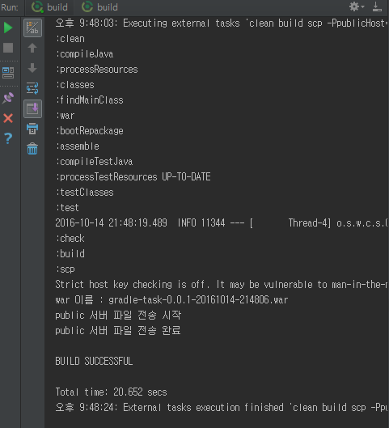

짜잔! 정상적으로 전송된 것을 확인할 수 있다. <br/> 이렇게 관리하게 되면 각 개발자마다 본인의 IDE에 Script parameters를 등록하여 본인만의 원격서버로 war를 전송하면 되고, 다른 개발자의 영향을 받지 않아 실제 회사에서도 사용할 수 있게 된다. <br/>

#### 마무리

여기에서 사용한 예제는 gradle-ssh-plugin의 아주 작은 부분이다. <br/> 실제로는 플러그인을 통해 ssh 명령어를 실행하여 tomcat 배포까지 할 수 있으니 [공식홈페이지의 가이드](https://gradle-ssh-plugin.github.io/docs/)를 꼭꼭 참고하여 나만의 gradle task를 만들어 사용하길 바란다. <br/> 끝! <br/> (2탄은 못쓰겠다. 넘 힘들어 ㅠㅠㅠ)
