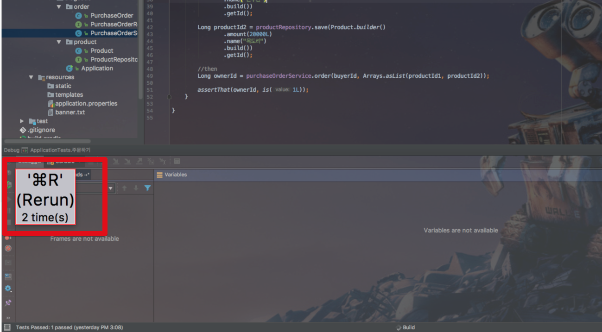
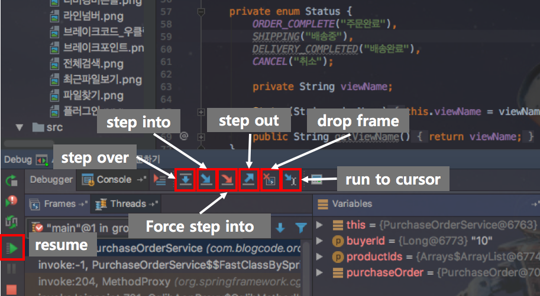
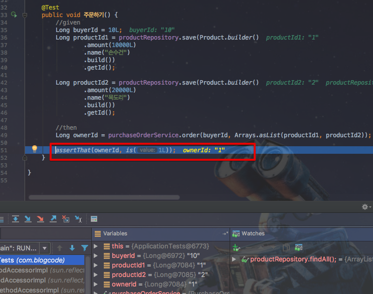

# Intellij-debugging

안녕하세요? 이번 시간엔 intellij-debugging 예제를 진행해보려고 합니다.  
모든 코드는 [Github](https://github.com/jojoldu/blog-code/tree/master/intellij-debugging)에 있기 때문에 함께 보시면 더 이해하기 쉬우실 것 같습니다.  
(공부한 내용을 정리하는 [Github](https://github.com/jojoldu/blog-code)와 세미나+책 후기를 정리하는 [Github](https://github.com/jojoldu/review), 이 모든 내용을 담고 있는 [블로그](http://jojoldu.tistory.com/)가 있습니다. )<br/>
  
굉장히 기초적인 수준이지만, ```System.out.println```으로 디버깅 하셨던 분들에게 도움이 될것 같아 정리하였습니다.  

## 주요 단축키

꼭 디버깅이 아니더라도 아래 단축키 정도는 익혀두면 여러모로 쓸 곳이 많다.

* ```shift + shift``` : 전체 검색 (file, action 모두 검색)


* ```command + shift + a``` : action 검색 (설정, Refactor 등)


* ```command + shift + o``` : 파일 찾기


* ```command + e``` : 최근 열었던 파일 리스트 보기


* ```command+[``` / ```command+]``` : 이전/다음 포커스로 이동

### 단축키 팁

빠른 디버깅을 위해서 단축키를 익혀놓으면 편하다.  
하지만 하나하나 찾아서 하기는 귀찮으니, 아래 처럼 ```key promoter``` 플러그인을 설치하자.


설치하면 내가 클릭한 기능의 단축키를 바로 보여준다.  



단축키를 확인 한 후, 다음부터는 단축키로 명령을 실행하자.

## Break Point

습관적으로 ```run```을 실행하지만, 로컬 개발에서는 웬만하면 ```debug```로 실행하자.  
어플리케이션 구동 중에 Break Point를 사용하려면 ```debug```여야만 한다.  
  
코드 좌측의 여백을 우클릭하면 ```Show Line Numbers```가 나오는데 이를 체크하면 아래처럼 코드 라인에 숫자가 부여된다.  
에러가 발생했을 때, 몇 번째 Line에서 발생했는지 ```log```에 표시되는데, 저 표시가 없으면 개발자가 보기 힘드니 **미리 체크**해놓자.


**라인 넘버와 코드 사이의 여백을 클릭**하면 아래처럼 그 Line에 Break Point가 표시 된다.


어플리케이션이 ```debug``` 모드일때, 해당 Break Point가 실행되는 시점에서 멈추게 된다.  
이때 여러 값을 확인하고, 명령어를 실행하면서 디버깅을 시작하면 된다.   
추가로 여기서 **Break Point를 우클릭** 하면 **조건으로 break**를 걸 수가 있다.  
(굉장히 중요함)


(productId가 2L일때만 위 point에서 break가 되도록 지정)  

특히나 ```for```, ```while```등의 **반복적인 행위속에, 특정값이 들어올때만 break**를 하고 싶은 때가 있다.  
이때 정말 유용하게 사용할 수 있는 기능이다.

## 디버깅 버튼

위 내용을 통해 break를 걸게 되면, 아래처럼 여러 버튼을 사용할 수 있다.  



(break가 된 상태에서만 사용 가능하다)  

가장 좌측에 있는 resume 버튼은 이클립스의 resume(```F8```)과 동일한 기능이다.

### resume

* 단축키 : ```option+command+r```
* 기능 : **다음 break point로 이동**


step 버튼들은 왼쪽에서 오른쪽 순으로 하겠다.

### step over

* 단축키 : ```F8```
* 기능 : 현재 break 된 파일에서 **다음 라인 이동**


break 걸린 라인을 전부 실행 후, 다음라인으로 이동한다.


이 기능을 몰라서 라인 하나하나에 전부 break를 걸었다면, ```F8```을 사용하자.

### step into

* 단축키 : ```F7```
* 기능 : 현재 break 된 라인에서 **다음 실행되는 라인**으로 이동


break 걸린 라인에서 다음 실행될 코드는 ```PurchaseOrder.createOrder```다.  
이때 ```F7```을 누르면


이렇게 ```createOrder```로 이동한다.

### Force step into

* 단축키 : ```option+shift+F7```
* 기능 : 다음 실행되는 라인으로 이동하나, ```step into```와 달리 직접 생성한 클래스 외에 JDK 라이브러리, lombok 라이브러리 등의 내부까지 이동한다.

### Step out

* 단축키 : ```shift+F8```
* 기능 : 

### Run to Cursor

* 단축키 : ```option+F9```
* 기능 : 포커스 되어있는 라인으로 이동


위 처럼 break된 상태에서 다음에 실행될 코드 중, ```ApplicationTests```의 ```assert```에 포커스를 두고,


(51라인에 포커스를 두었다.)  

여기서 ```option+F9```를 누르면 



이렇게 포커스가 지정된 51라인으로 break가 이동한다.  
  
보통 break point로 지정하지 않고, **단발성으로 break를 걸고 싶을때** 사용한다. 

## Watch와 콜스택
 
기본적으로 IntelliJ는 break된 상태에서 **break 라인에서 사용할 수 있는 모든 코드를 사용**할 수 있다.  

### Watch
