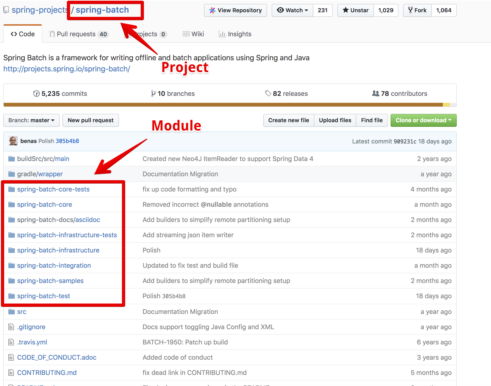

# Eclipse의 Workspace와 IntelliJ

최근 [인프런에 강의 영상](https://www.inflearn.com/course/intellij-guide/)을 올리고 여러 질문을 받았습니다.  
그 중에서 자주 접하는 질문이 바로 **Eclipse의 Workspace가 IntelliJ의 Project가 맞는건지**에 대한 질문이였습니다.  

(질문)  
  
그래서 이 부분에 대해 한번 정리를 하고자 합니다.  
  
먼저 결론부터 말씀드리면 **IntelliJ에는 Workspace 라는 개념이 없습니다**.  
아래는 IntelliJ 공식 문서에 나와 있는 용어 비교 표입니다.

이 표 때문에 오해가 많았을거라 생각합니다.  
근데 이 표 위에 적힌 소개 글을 보시면 이야기가 다르다는 것을 알 수 있습니다.  
아래는 IntelliJ 공식 문서의 글입니다.  

> The first thing you'll notice when launching IntelliJ IDEA is that it has no workspace concept.  
This means that you can work with only one project at a time. While in Eclipse you normally have a set of projects that may depend on each other, in IntelliJ IDEA you have a single project that consists of a set of modules.  
If you have several unrelated projects, you can open them in separate windows.  
If you still want to have several unrelated projects opened in one window, as a workaround you can configure them all in IntelliJ IDEA as modules.

(구글이) 번역 해보면 다음과 같습니다. 

> IntelliJ IDEA를 시작할 때 가장 먼저 주목할 것은 Workspace 개념이 없다는 것입니다.  
즉, **한 번에 하나의 프로젝트만 사용**할 수 있습니다.  
Eclipse 에서는 일반적으로 서로 의존 할 수 있는 일련의 프로젝트를 가지고 있지만 IntelliJ IDEA에서는 일련의 모듈로 구성된 단일 프로젝트가 있습니다.  
서로 관련이 없는 프로젝트가 여러 개 있는 경우 **별도의 창에서 열 수 있습니다**.
서로 관련이 없는 여러 프로젝트를 **하나의 창에서 열어보고 싶다면 IntelliJ IDEA 모듈로 로 구성해야만 합니다**.

최근의 많은 프로젝트들은 아래와 같이 Multi Module 구성으로 진행합니다.

> Multi Module을 처음 들어보신 분들은 예전에 작성한 [Gradle Multi Module 구성하기](http://jojoldu.tistory.com/123?category=721560)를 참고해보세요

이런 각각의 Project들이 모여 있는 것을 

그럼 Eclipse에서는 Sub Module을 어떻게 만드나요?라고 하실 수 있습니다.  
이건 [donzbox님의 포스팅](http://donzbox.tistory.com/594)을 참고하시면 됩니다.

* [migrating-from-eclipse-to-intellij-idea.html#migratingEclipseProject](https://www.jetbrains.com/help/idea/migrating-from-eclipse-to-intellij-idea.html#migratingEclipseProject)