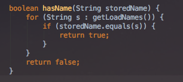
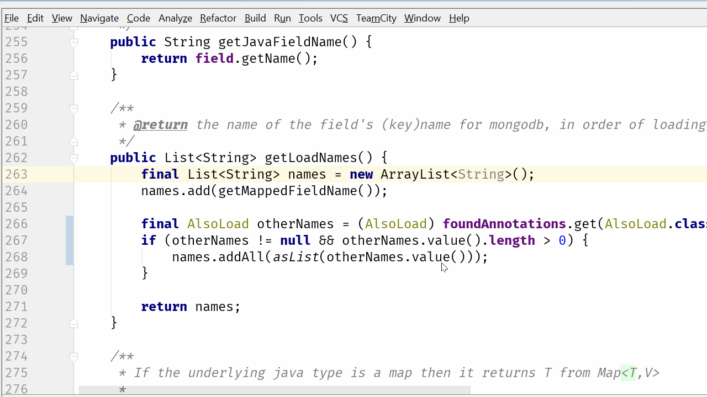
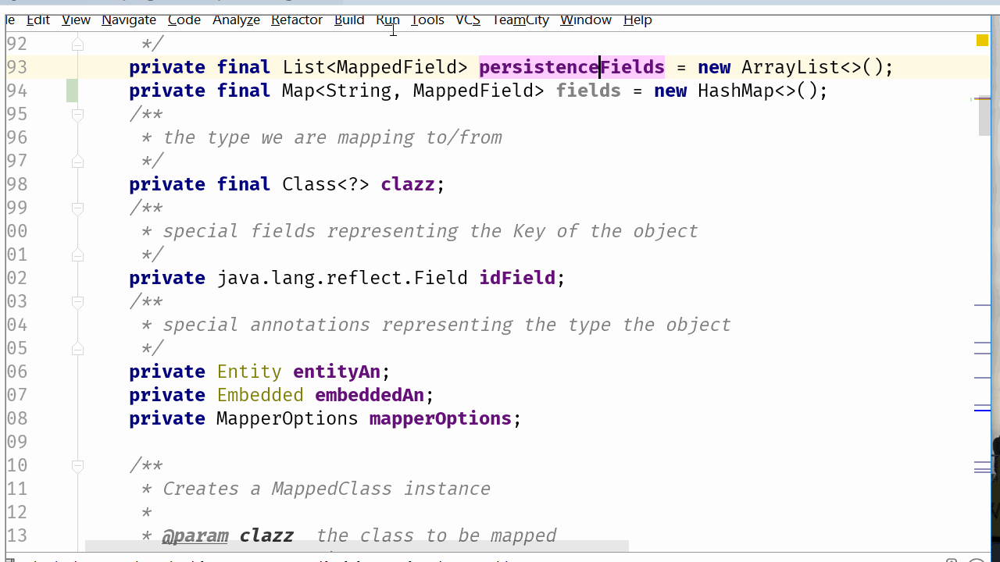
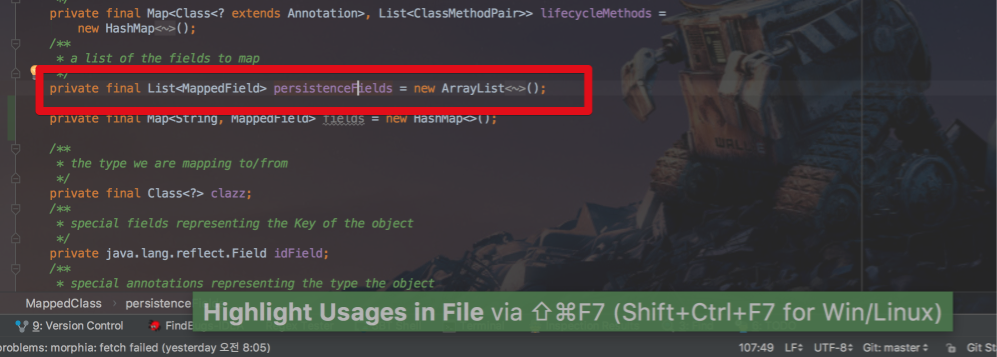
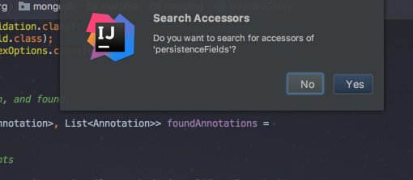
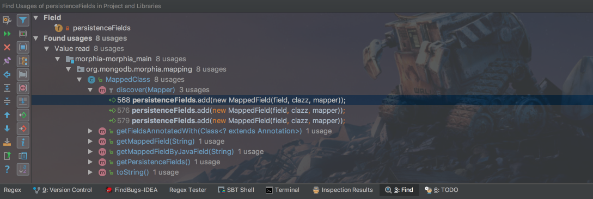
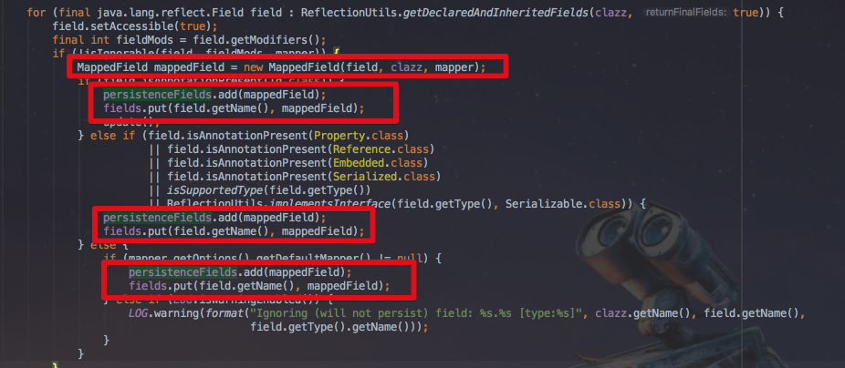
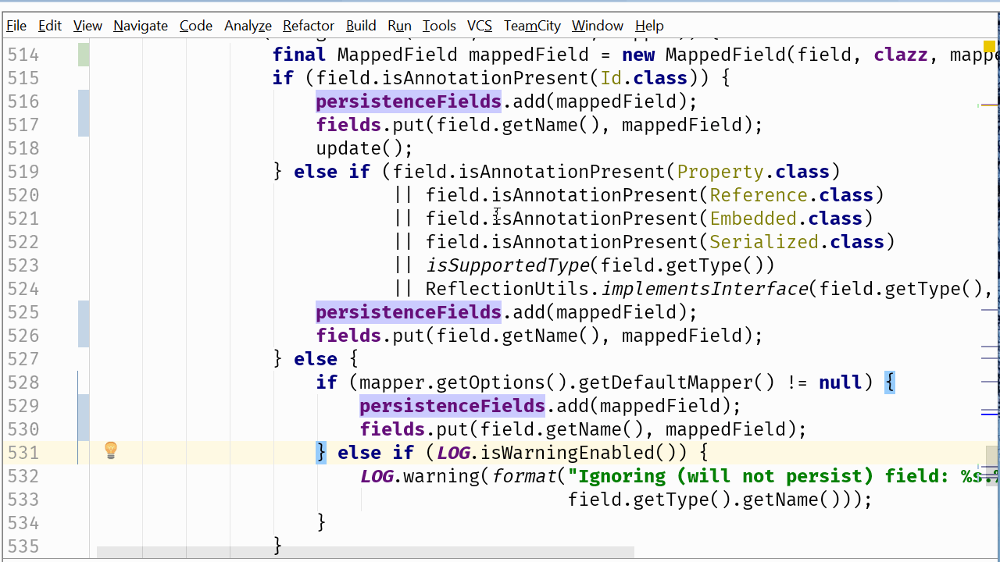
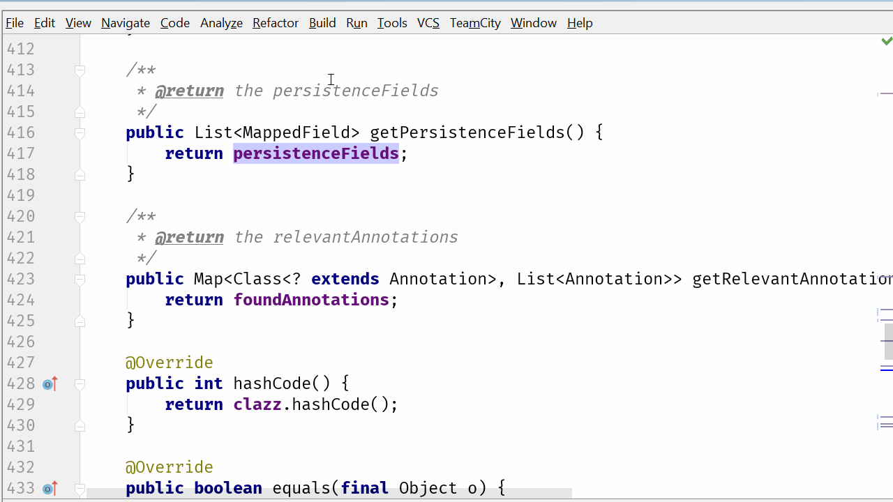
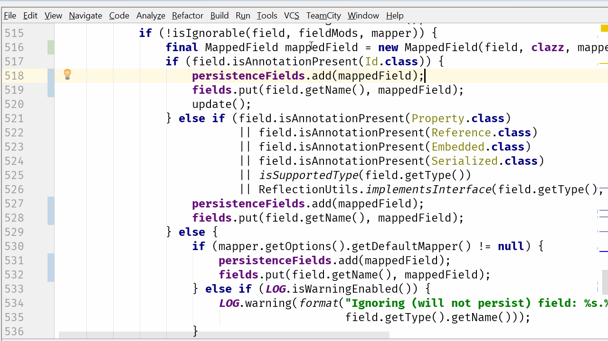

[IntelliJ 블로그](https://blog.jetbrains.com/idea/2017/08/code-smells-iteration/)에 올라온 시리즈물을 번역 & 재정리 하였습니다. 


# 3. Code Smells: 반복

저번시간엔 의심스러운 중첩 코드를 살펴 보았습니다.  
이 문제를 해결하는 가장 좋은 방법은 기존 클래스에서 데이터를 가진 클래스의 내부를 이해하고 다루는것인 아니라, 행위 자체를 이동시키는 것이라고 추천드렸습니다.  
  
그러나 이것이 그 이야기의 끝이 아닙니다.  
이번 글에서는 코드 반복이 야기시킬 수 있는 다른 문제를 탐구하려고 합니다.  
마지막 예제에서 중첩된 루프는 로직이 잘못된 위치에 있었던 것이라고 제안드렸습니다.  
새로 만든 ```hasName```메소드에서 반복이 존재하는 것은 for 루프 또는 stream를 사용하여 구현한것과 관계없이 또다른 문제점을 제시합니다.  
아마도 이것은 name 데이터들을 저장하는 올바른 방식이 아닐 확률이 높습니다.  

### 예제1: List 대신 Set

문제의 코드를 자세히 살펴보겠습니다.  
[악취나는 코드 개선하기 시리즈 - 심하게 중첩된 코드](http://jojoldu.tistory.com/177)에서 저희는 ```MappedField```에 ```hasName()```를 생성했습니다.


이 코드를 다시 for 루프로 확장하면 어떤일을 수행하는지 분명하게 알 수 있습니다.


(```stream()```에 포커스를 두고 ```option+enter``` 실행)  
  
아래와 같은 코드였던 것을 확인할 수 있습니다.



이 메소드는 ```getLoadNames```의 문자열 목록에, 특정 문자열 값이 있는지 반복합니다.  
```getLoadNames```를 사용하는 다른 코드를 봐도 사용하는 방식은 매우 비슷합니다.  
(원하는 것을 찾기 위해 목록을 반복합니다.)


(```getLoadNames()```에 포커스를 두고 find usage(```option+F7```)을 사용합니다.)  
  
이건 꽤 낭비인것 같습니다.  
왜 같은 List를 반복하고 다시 반복해야하나요?  
원하는 데이터가 포함되어 있는지 즉시 물어볼 수 있는 자료구조는 없는걸까요?  
**name 값이 유니크하거나 중복된 값들은 효율적으로 무시될 수 있는** 이런 특별한 상황에서 ```set```은 좋은 대안책이 될 수 있습니다.  
  
이름에서 알 수 있듯이 이 ```getLoadNames```메소드는 단순한 getter 메소드가 아닙니다.  
(물론 위 코드를 보면서 오해의 소지가 있는 메소드 네이밍도 문제라고 생각하실 수 있습니다.  
하지만 이는 이번 게시글의 주제가 아니며, 한번만 수행해야하는 작업 결과를 캐싱하지도 않기 때문에 지금은 **반복**에 대한 이야기에 좀 더 집중하겠습니다.)  
  
name List를 계산하기 위해 일부 데이터를 처리합니다.  
구현 세부 사항은 이글의 목적에 중요하지 않기 때문에, 가장 쉬운 방법으로 ```set```을 리턴하는 메소드로 변경하겠습니다.



```set```은 기존의 리턴 타입인 List와 같은 ```Collection```타입이므로 이 메소드를 호출하는 모든 코드는 똑같이 작동됩니다.  
(```getLoadNames```를 호출하는 3개의 호출자는 모두 for 루프 안에서 사용하고 있습니다.)  
다시 원래의 메소드인 ```hasName```으로 가서, 아래와 같이 간단하게 변경하겠습니다.


이게 끝입니다.  
루프는 필요 없으며, 간단한 체크만으로 해결됩니다.  
  
다른 호출자도 간단하게 호출하는지 확인이 필요하겠지만, ```set```을 반복해야하는 경우 (어떤 이유로든) 호출자를 그대로 둘 수 있습니다.  
프로젝트의 모든 테스트를 실행하면 모든 것이 여전히 예상대로 작동하는 것을 알수 있으므로 이런 변경사항을 적용할 수 있습니다.

### 예제2: List 대신 Map

아주 유사하지만, 조금은 다른 해결책을 가진 예제가 있습니다.


여기서는 모든 ```MappedFiled```를 순회하여 ```name```과 일치하는 ```javaFieldName```이 있는지 확인하고 있습니다.  
현재 구조는 다른 자료구조에서 좀 더 잘 처리할 수 있을것 같습니다.  
```String```을 Key로 가진 ```Map```으로 자료구조를 변경하면 한번에 찾지 않을까요?  
  
```persistenceFields```필드는 이 클래스의 여러 위치에서 사용되므로 변경하지 않고, 다른 방법으로 안전하게 자료 구조를 마이그레이션하겠습니다.  
저는 ```Map<String, MappedField>```형태의 새로운 필드를 추가해서 교체하겠습니다.


```Highlight usages in File(command+shift+F7)``` 기능을 사용하여 ```persistenceFields```를 사용하는 곳에 하이라이트 표시를 하겠습니다.  
이후, List를 초기화하는 장소에서 Map도 같이 초기화하도록 코드를 추가하는 것입니다.



(역자주: 혹시나 내용이 빨라 못보시겠는 분들을 위해 아래 이미지와 설명을 첨부합니다)  
  
```persistenceFields```에 포커스를 두고 ```command+shift+F7```를 실행합니다.  
그럼 현재 클래스 파일에서 해당 필드가 사용되는 부분은 모두 하이라이트 처리가 됩니다.  



```persistenceFields```가 포커스된 채로 ```command+F7```를 실행하면 검색 confirm 창이 등장합니다.



여기서 ```esc```를 눌러 **현재 파일에서만 검색**하도록 실행합니다.  
그럼 아래와 같이 검색결과가 등장합니다.



검색결과를 보시면 아시겠지만 실제로 ```persistenceFields```의 값을 변경하는 일은 ```discover```에서만 발생합니다.(```persistenceFields.add()```) 해당 위치로 이동해서 ```persistenceFields.add()```가 발생할때 ```fileld.put()```하도록 코드를 추가합니다.



(참고로 특정 값을 변수로 뽑아내는 단축키는 ```option+command+v```입니다.)  
  
다시 본문 내용으로 넘어가서,  
  
그런 다음 ```persistenceFields```를 사용하는 모든 위치에서  새로 만든 ```fields```로 마이그레이션합니다.  
가장 쉬운 방법은 ```map.values()```를 사용하는 것입니다.  
```values```는 collection이기 때문에 모든 코드는 기존과 동일한 방식으로 작동합니다.



이러한 변경 사항의 대부분은 현재 클래스에만 영향을 주며 다른 코드에는 영향을 미치지 않습니다.  
예외적으로 수정해야할 것은 getter이며 이 경우엔 List가 아닌 Collection을 반환해야합니다.  
getter의 사용법을 간단히 살펴보면 List를 순회하거나 collection이 작동하는 다른 경우에만 사용된다는 것을 확인할 수 있습니다.  
그래서 collection을 리턴하도록 코드를 수정하겠습니다.



기존 List를 반환하는 메소드들은 모두 새로 만든 Map을 사용하도록 변경합니다.  



(기존 List인 ```persistenceFields```는 삭제하고, Map의 변수명을 ```persistenceFields```로 수정합니다.)  
  
프로젝트를 다시 빌드하고 테스트를 실행하면 모든 것인 여전히 잘 수행되는것을 확인할 수 있습니다.  
  
이제 원래의 메소드로 돌아가서 Map을 사용하겠습니다.  
수정된 코드는 다음과 같습니다.


훨씬 간단해졌습니다!  
  
  
만약 name을 찾기 위해 list를 순회하는 다른 메소드들이 있다면, 위에서 했던 방식 그대로 변경하면 됩니다. (혹은 간단하게 ```getMappedFiledByJavaField```에 위임해도 되겠죠?)  
  
여러 다른 이유로 순회하는 모든 호출자들은 이전과 동일하게 작동하지만, 한가지 다른 점은 Map의 ```values()```을 순회하는 것입니다.  
나중에 다른 메소드들을 살펴보고 이 부분도 좀 더 간단하게 변경할 수 있는지 찾아볼 수 있습니다.  
기억하세요! 데이터에 대한 빠른 접근을 제공하려는 경우 동일한 정보를 저장하는데 하나 이상의 데이터 구조를 사용하는 것이 좋습니다.  
이는 읽기가 수정보다 자주 발생하는 경우 특히 유용합니다.  
  
이런 경우에는 ```MappedField```를 여러 Map에 다른 값들로 저장하고자 할 수 있습니다.

### 요약

**순회하는 코드(for 루트 or Stream API 등)를 발견하면 이게 정말 필요한것**인지 한번 질문해볼 필요가 있습니다.  
값을 찾기 위해 항상 **자료구조 순회가 반복되는 경우 Set 또는 Map을 사용**하는 것이 더 나을수 있습니다.  
이렇게 하면 간단하고 깨끗한 코드를 얻을뿐만 아니라 일반적으로 더 나은 성능을 얻을 수 있습니다.  
  
만약 데이터를 추가/수정하는 것과 읽기까지 해야하는 상황이라면 얼마나 자주 읽는지 vs 쓰는지, 어떤 종류의 수정작업인지를 고려하면 효율적인 자료구조를 선택할 수 있습니다.  
  
<br/>

조짐:

* 어떤 값을 찾기 위해 collection을 반복 순회하는 경우
* Streams API에서 ```findFirst```/```findAny```/```anyMatch```를 호출하는 경우

가능한 해결책:

* 유니크한 값들의 그룹에서 찾고자 하는 값이 있는지 확인하는 코드라면 Set를 고려해보세요

* 항상 특정 property를 가진 Object를 찾는 코드가 있다면, **해당 property를 key로 가진 Map**을 사용하면 훨씬 효율적입니다.

* Collections API는 많은 유용한 메소드를 제공하므로 자료구조를 직접 변경할 수 없어도 **동일한 기능을 하는 Collection 메소드가 있는지 확인**해보세요
  * 첫번째 예제는 값들 사이에 중복된 값들이 있었다면 List로 계속될 수 있었지만, ```List.contains()```를 직접 작성한 반복 코드 대신에 사용할 수 있었습니다.
  * 이 방식이 보다 간결하고 일반적으로 Collection 구현은 자료구조에서 가장 효율적인 버전입니다.

* 어떤 이유로 사용자가 직접 순회하는 코드를 작성해야한다면
  * 데이터의 쓰기/읽기에 대한 **[상세한 코드는 캡슐화](https://refactoring.com/catalog/encapsulateCollection.html)하고 도메인 객체에 유용한 이름을 가진 메소드로 제공**하는 것이 가장 좋습니다.
  * 이렇게 하면 최소한 순회 코드는 비지니스 로직에서 제외됩니다.


