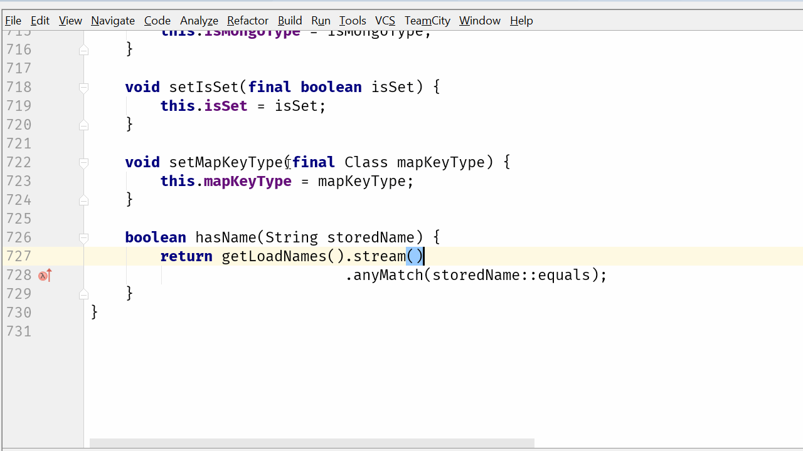

[IntelliJ 블로그](https://blog.jetbrains.com/idea/2017/08/code-smells-iteration/)에 올라온 시리즈물을 번역 & 재정리 하였습니다. 


# 3. Code Smells: 반복

저번시간엔 의심스러운 중첩 코드를 살펴 보았습니다.  
이 문제를 해결하는 가장 좋은 방법은 기존 클래스에서 데이터를 가진 클래스의 내부를 이해하고 다루는것인 아니라, 행위 자체를 이동시키는 것이라고 추천드렸습니다.  
  
그러나 이것이 그 이야기의 끝이 아닙니다.  
이번 글에서는 코드 반복이 야기시킬 수 있는 다른 문제를 탐구하려고 합니다.  
마지막 예제에서 중첩된 루프는 로직이 잘못된 위치에 있었던 것이라고 제안드렸습니다.  
새로 만든 ```hasName```메소드에서 반복이 존재하는 것은 for 루프 또는 stream를 사용하여 구현한것과 관계없이 또다른 문제점을 제시합니다.  
아마도 이것은 name 데이터들을 저장하는 올바른 방식이 아닐 확률이 높습니다.  

### 예제1: List 대신 Set

문제의 코드를 자세히 살펴보겠습니다.  
[악취나는 코드 개선하기 시리즈 - 심하게 중첩된 코드](http://jojoldu.tistory.com/177)에서 저희는 ```MappedField```에 ```hasName()```를 생성했습니다.


이 코드를 다시 for 루프로 확장하면 어떤일을 수행하는지 분명하게 알 수 있습니다.



(```stream()```에 포커스를 두고 ```option+enter``` 실행)  
  
아래와 같은 코드였던 것을 확인할 수 있습니다.


이 메소드는 ```getLoadNames```의 문자열 목록에, 특정 문자열 값이 있는지 반복합니다.  
```getLoadNames```를 사용하는 다른 코드를 봐도 사용하는 방식은 매우 비슷합니다.  
(원하는 것을 찾기 위해 목록을 반복합니다.)


(```getLoadNames()```에 포커스를 두고 find usage(```option+F7```)을 사용합니다.)  
  
이건 꽤 낭비인것 같습니다.  
왜 같은 List를 반복하고 다시 반복해야하나요?  
원하는 데이터가 포함되어 있는지 즉시 물어볼 수 있는 자료구조는 없는걸까요?  
**name 값이 유니크하거나 중복된 값들은 효율적으로 무시될 수 있는** 이런 특별한 상황에서 ```set```은 좋은 대안책이 될 수 있습니다.  
  
이름에서 알 수 있듯이 이 ```getLoadNames```메소드는 단순한 getter 메소드가 아닙니다.  
(물론 위 코드를 보면서 오해의 소지가 있는 메소드 네이밍도 문제라고 생각하실 수 있습니다.  
하지만 이는 이번 게시글의 주제가 아니며, 한번만 수행해야하는 작업 결과를 캐싱하지도 않기 때문에 지금은 **반복**에 대한 이야기에 좀 더 집중하겠습니다.)  
  
name List를 계산하기 위해 일부 데이터를 처리합니다.  
구현 세부 사항은 이 게시글의 목적에 중요하지 않기 때문에, 가장 쉬운 방법으로 ```set```을 리턴하는 메소드로 변경하겠습니다.