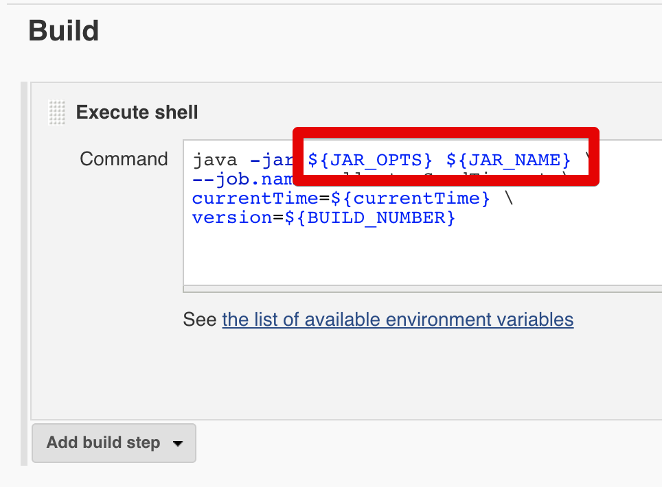
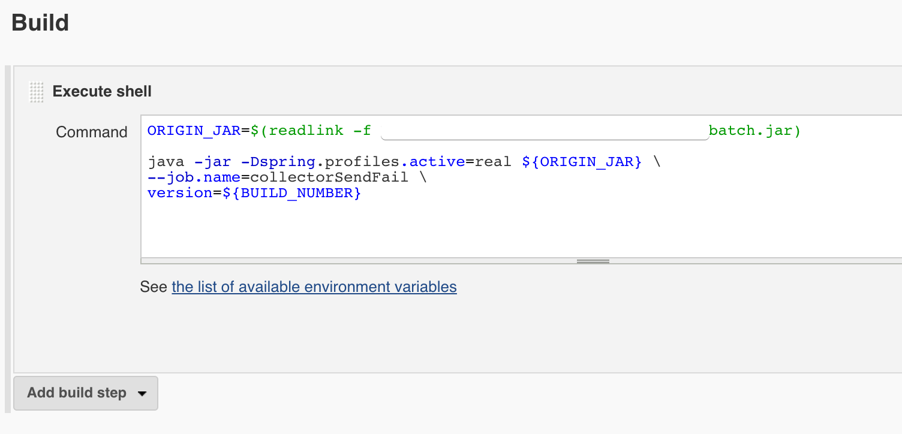

# Spring Batch 공통 설정 관리하기 (feat. 젠킨스 Environment variables)

젠킨스의 경우 스프링 배치의 스케줄러로 많이 사용 됩니다.  
다만, **공통 설정**을 어떻게 해야할지 고민될 때가 많습니다.  
이럴 경우 젠킨스의 Environment variables 가 아주 유용합니다.  
이번 시간에는 젠킨스의 Environment variables를 통해 스프링 배치의 공통 설정들을 관리해보겠습니다.

## 1. 기존 상황

젠킨스에서 스프링 배치를 사용하다보면 다음과 같은 상황을 자주 목격합니다.


```bash
java -jar \
-XX:+UseG1GC \
-Dspring.profiles.active=real \
배치jar \
--job.name=스프링배치Job이름 \
파라미터1=파라미터값1 \
파라미터2=파라미터값2
```

* ```-XX:+UseG1GC```
  * 자바 8 까지는 기본 GC 가 G1GC가 아니기 때문에 설정이 필요합니다.
  * 스프링 배치 역시 자바로 실행되기 때문에 실행 시점에 G1GC 설정을 합니다.
* ```-Dspring.profiles.active=real```
  * 스프링 배치를 실행할 Profile을 결정합니다.
  * 보통 환경에 따라 local, dev, real (or production) 등등으로 해서 로컬/개발/운영 환경 중 어느 환경에서 스프링 배치를 실행하는지를 결정합니다.
  * 여기서는 예시로 real를 선택했습니다.
* ```배치jar```
  * 스프링 배치가 수행될 jar 입니다.
  * 스프링 부트 웹 애플리케이션이 실행되듯 배치 역시 jar 기반으로 실행된다고 보시면 됩니다.

지금 이 젠킨스 Job을 봤을때 크게 이상한게 보이진 않습니다.  
실행시 필요한 설정이 하나라도 추가되거나 수정되어야 한다면 어떨까요?  
더군다나 이런 Job이 50개, 100개 이상 있다면 어떻게 해야할까요?  
한땀한땀 Job 실행 스크립트를 수정해야만 합니다.  
  
불편함이 많겠죠?  
그래서 이런 부분을 개선해보겠습니다.

## 2. 젠킨스 Environment variables 설정하기

여기서 공통화 할 수 있는 부분과 아닌 부분을 분리해보겠습니다.  
공통할 수 없는 부분은 아래와 같습니다.  

```bash
--job.name=스프링배치Job이름 \
파라미터1=파라미터값1 \
파라미터2=파라미터값2
```

실행할 배치 job name이나 그에 따른 파라미터 등은 당연히 모든 Job 마다 다르니 공통설정으로 뺼 순 없습니다.  
대신!  
아래와 같이 배치 jar 환경에 관한 설정은 **모든 Job마다 공통으로 들어가야할 부분**입니다.  

```bash
-XX:+UseG1GC \
-Dspring.profiles.active=real \
배치jar \
```

이 부분들을 옮기겠습니다.  

Jenkins 관리 페이지로 이동 후


시스템 설정 페이지로 이동합니다.


시스템 설정 페이지는 젠킨스 전체 설정을 관리하는 곳입니다.  
메이븐 레파지토리를 비롯해서 앤서블 플러그인을 설치했다면 앤서블 설정까지 다루는 곳이라 보시면 됩니다.  
  
여기서 Global properties -> Environment variables 항목으로 가보시면 아래와 같이 Key/Value 방식으로 **환경 변수**를 선언할 수 있습니다.  
  


* ```JAR_NAME```
  * 실행할 Jar 위치가 저장된 변수입니다.
  * ex) /home/jojoldu/spring-batch/batch.jar 등
* ```JVM_OPTS```
  * G1GC 등의 JVM 옵션 항목이 저장된 변수입니다.
  * xmx, xms 등의 옵션도 필요에 따라 추가하시면 됩니다.
* ```PROFILES_ACTIVE```
  * 스프링 배치의 Profile 항목이 저장된 변수입니다.
  * real이라는 값만 저장하지 않고, **시스템 변수 설정까지** (```-Dspring.profiles.active```) 저장합니다.
* ```JAR_OPTS```
  * 위에서 언급한 설정들을 모두 모아 저장된 변수입니다.
  * 젠킨스 **환경 설정들간에 참조가 가능**합니다.

자 설정이 다 되셨다면 다시 좀 전의 젠킨스 Job으로 이동합니다.  
그리고 이제 기존 설정들을 모두 **환경 변수**로 전환합니다.



```bash
java -jar ${JAR_OPTS} ${JAR_NAME} \
--job.name=스프링배치Job이름 \
파라미터1=파라미터값1 \
파라미터2=파라미터값2
```

* 젠킨스 Environment variables는 ```${키}``` 로 사용할 수 있습니다.
  * 젠킨스 Job 파라미터 호출 방법과 동일합니다.
  * 여기서는 2개의 변수 ```${JAR_OPTS}```, ```${JAR_NAME}``` 를 호출했습니다.
* ```java -jar ${JAR_OPTS} ${JAR_NAME}```
  * ```java -jar``` 외에 나머지 설정들이 모두 환경 변수로 변경 되었습니다.

자 이렇게 설정 후 다시 Job을 실행해보시면!


환경 변수가 정상적으로 작동하는 것을 확인할 수 있습니다.  
  
기본적인 사용 방법은 이걸로 확인이 되셨을것 같습니다.  
한가지 더 나아가보겠습니다.

## 3. readlink 사용하기




```bash
ORIGIN_JAR=$(readlink -f 배치jar)

java -jar \
-XX:+UseG1GC \
-Dspring.profiles.active=real \
${ORIGIN_JAR} \
--job.name=스프링배치Job이름 \
currentTime=${currentTime} \
version=${BUILD_NUMBER}
```

> ```$(readlink -f 배치jar)```는 스프링 배치를 **무중단 배포**하기 위해 자주 사용되는 방법입니다.  
왜 필요한지, 어떻게 사용되는지 궁금하신 분들은 [이전에 작성된 포스팅](https://jojoldu.tistory.com/315)을 참고해보세요.


## 참고

* [Jenkins environment variables](https://medium.com/@mukeshsingal/access-jenkins-global-environment-variables-using-groovy-or-java-b5c1e6b53685)