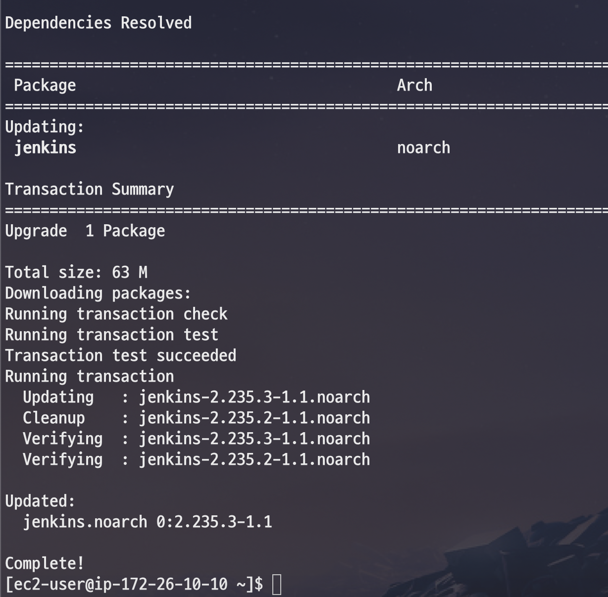
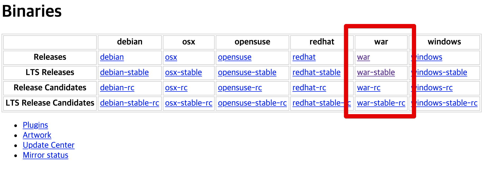
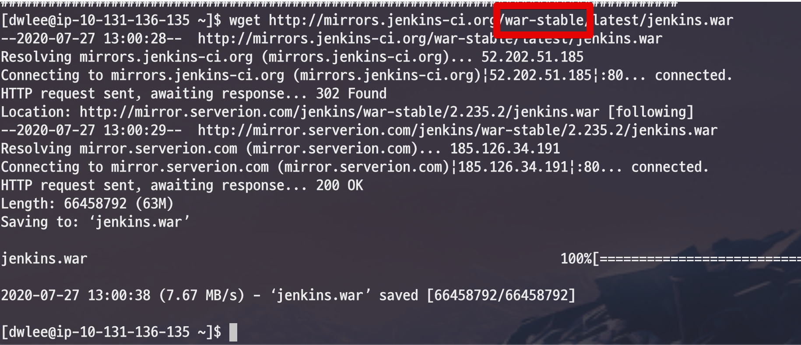

# Jenkins 버전 업데이트하기

Jenkins 버전업을 할 수 있는 2가지 방법을 소개 드립니다.

## 1. yum 으로 install한 경우

만약 기존 Jenkins 설치를 ```yum install```로 진행하셨다면 편하게 ```yum update```로 진행하시면 됩니다.

> ```yum install```로 설치하는 방법은 [이전 포스팅](https://jojoldu.tistory.com/441)에 있습니다.

먼저 기존에 작동 중이던 Jenkins를 종료합니다.

```bash
sudo service jenkins stop
```

그리고 아래 명령어로 바로 업데이트를 진행합니다.

```bash
sudo yum update jenkins -y
```

> ```yum install```, ```yum update```는 모두 **LTS 버전 기준**으로만 작동합니다.  


다만, public key가 없다는 에러 메세지가 나올텐데요.  
이때는 현재 업데이트 버전의 Key가 없기 때문입니다.


아래 명령어로 현재 버전의 인증키를 등록합니다.

```bash
sudo rpm --import https://pkg.jenkins.io/redhat-stable/jenkins.io.key
```

그리고 다시 업데이트 명령어를 사용하시면?

```bash
sudo yum update jenkins -y
```

성공적으로 명령어가 실행되는 것을 볼 수 있습니다.



다시 Jenkins를 실행해보시면 아래와 같이 버전이 잘 업데이트 된 것을 확인할 수 있습니다.


(2.235.2 -> 2.235.3)

## 2. 직접 다운로드해서 설치한 경우

기존 Jenkins 설치를 ```wget```을 통해 직접 설치하셨다면 버전 업데이트도 수동으로 진행이 필요합니다.  
  
Jenkins의 경우 war로 실행되는 데몬입니다.  
그래서 실제로 버전 Update라 하면, 이 **War만 최신 버전으로 교체**하면 되는데요.  
  
War 파일의 위치는 ```ps```으로 확인할 수 있습니다.

```bash
ps -ef | grep jenkins
```


War 위치를 확인했으니 Jenkins

```bash
service jenkins stop
```




가장 최신 버전

```bash
http://mirrors.jenkins-ci.org/war/latest/jenkins.war
```

LTS 버전

```bash
http://mirrors.jenkins-ci.org/war-stable/latest/jenkins.war
```



```bash
wget http://mirrors.jenkins-ci.org/war/latest/jenkins.war
```

```bash
wget http://mirrors.jenkins-ci.org/war-stable/latest/jenkins.war
```


```bash
mv 다운받은war경로 /usr/lib/jenkins/jenkins.war
```

