IE 7,8에서 JS 프레임워크 조합하기
---------------------------------
Angular나 React + @ 조합같은 경우 정말 매력적인 JS 프레임워크임은 분명하나 IE 7, 8에서는 사용할 수 없다는 치명적인 단점이 있다. 
국내에선 아직까지 IE 7,8의 점유율이 높은 편이라 회사 사정에 따라 IE 7,8을 지원해야하는 경우가 있다.


하지만 생각보다 많은 분들이 모던하게 Javascript를 개발하고 싶어한다. React/Angular/ES2015 스터디를 보면 **회사에서는 못쓰지만 이직을 위해** 라는 이유로 스터디에 참석하는 것을 정말 정말 많이 보았다.
그래서 최대한 이런 환경에서 모던하게 개발할 수 있는 방법을 소개하려 한다. 본인의 회사가 IE9부터 지원한다면 뒤로가기 버튼을 살포시 누르면 된다 <br/>
모든 코드는 [Github](https://github.com/jojoldu/blog-code/tree/master/js-framework-ie78) 에 있으니 참고하면 될것 같다.

### 사용할 JS
프로젝트 구성은 SpringBoot+Freemarker+Gradle을 기본으로 하여 아래 JS 라이브러리들을 조합할 예정이다.

* nodejs
  - 4.5.0 LTS 버전 사용 예정 (2016.09.20 기준)
  - grunt를 사용하기 위해 먼저 설치되어 있어야함
  - Javascript 패키지 관리를 bower가 아닌 npm 으로 관리하기 위해 사용
  - bower는 버그가 좀 있다. 웬만하면 npm으로 패키지 관리를 추천
  
* [backbone.js](http://backbonejs.org/)
  - Javascript를 MV* 구조로 개발할 수 있게 지원하는 프레임워크
  - [조규태님의 backbone.js 가이드](http://webframeworks.kr/getstarted/backbonejs/)
  - [backbone.js 사용시 주의사항](http://huns.me/development/1212)

* jquery
  - 설명이 필요없는 Javascript 라이브러리
  - 여기선 Dom select와 이벤트 바인딩용으로 사용
  
* underscore.js
  - Javascript를 함수형으로 사용할 수 있게 지원 (client-side template engine용이 아니다.)
  - map, filter 등과 같은 함수형 기능들이 포함
  - backbone을 사용하려면 필수로 의존하게 되는데, 여기선 backbone 의존성을 위해서도 있지만, 좀 더 함수형으로 코드 작성하기 위해 사용
  - lodash라는 업그레이드 버전이 있지만 공식 사이트에서 IE 11까지만 확인되었다고해서 제외
  - underscore/lodash 모두 **ECMA2015** 때문에 포지션이 애매해졌다. (즉, ECMA2015 쓸수있는 환경이면 이거 다 몰라도 된다.)
  
* require.js
  - Javascript 의존성 관리 및 동적로딩
  - [네이버의 Requirejs 이해](http://d2.naver.com/helloworld/591319) 참고
  
* handlebars.js
  - client-side template engine
  - 서버 통신 없이 화면을 다시 그려야할 경우 사용
  - 기본적인 소개와 문법/기능은 [티몬의 개발 블로그](http://blog.naver.com/PostView.nhn?blogId=tmondev&logNo=220398995882)를 참고
  - 부끄럽지만.. 추가적으로 실제 배포환경에서 사용법은 [내 블로그](http://jojoldu.tistory.com/23) 내용을 참고

* grunt
  - Javascript build 및 task 관리
  - 예를 들면 Javascript들을 압축/난독화 등을 할때 이를 task로 지정하여 명령어 한번에 사용이 가능할 수 있게 지원
  - [널리 블로그에서 소개하는 Grunt](http://nuli.navercorp.com/sharing/blog/post/1132682) 참고하자 개인적으로 grunt 설명중 최고다

개발 진행
-----
### 기본 프로젝트 생성
여기선 SpringBoot + Gradle 기준으로 코드를 작성중이니 그대로하면 좋고, 아니라도 크게 차이는 없으니 본인이 사용할 프로젝트 스펙에 맞춰 프로젝트를 생성하면 된다. <br/>
View 템플릿은 JSP 대신에 Freemarker를 사용할 예정이다. JSP도 크게 상관은 없는데 Boot에서는 Freemarker/thymleaf와 같은 ViewTemplateEngine을 밀어주고 있으니 이참에 한번 사용해보는걸 추천한다. <br/>

* build.gradle에 freemarker 의존성 추가


* Application 및 config, index.ftl

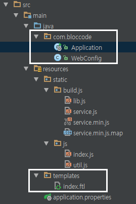

```
//Application.java
@SpringBootApplication
@Controller
public class Application {

	public static void main(String[] args) {
		SpringApplication.run(Application.class, args);
	}

    //@RequestMapping(value = "/", method = RequestMethod.GET)가 GetMapping("/") 가 됨
	@GetMapping("/")
	public String index(){
		return "index";
	}
}

//WebConfig.java
@Configuration
@EnableWebMvc
public class WebConfig extends WebMvcConfigurerAdapter {

    @Override
    public void addResourceHandlers(ResourceHandlerRegistry registry) {
        registry.addResourceHandler("/**").addResourceLocations("classpath:/static/");
    }
}


// index.ftl
<!DOCTYPE html>
<html lang="ko">
<head>
    <meta charset="UTF-8">
    <title>모던 IE78</title>
</head>
<body>
    <h1>모던하게 개발하는 IE 7/8</h1>
</body>
</html>
```

기본적인 환경은 다 구축되었다. 이제 이 프로젝트를 구동시켜 브라우저에 localhost:8080으로 접속해보자 <br/>
그러면!


이렇게 기본적인 정상적으로 프로젝트가 생성되었음을 확인할 수 있다. <br/>
여기서부터 시작이다. 이제 하나씩 Javascript 라이브러리들을 붙여나가겠다.

### package.json 작성
모든 Javascript 프로젝트들의 시작은 package.json 생성부터 시작이다. <br/>
이를 위해선 node.js 설치가 필수이다. <br/>
[공식사이트](https://nodejs.org/ko/)를 방문하여 **LTS 버전**을 다운받아 설치하자. 이 글을 작성할 당시에는 4.5.0이였는데, 아마 보시는 분들은 그보다 높은 버전을 설치할 수도 있다. <br/>
(package.json 작성방법은 [outsider님의 글](https://blog.outsider.ne.kr/674)을 참고하면 아주 좋다.) <br/>
본인 프로젝트 폴더에서 터미널 혹은 CMD를 열어 아래와 같이 명령어를 입력해보자.

```
//package.json 초기화
npm init

//npm init 과정이 끝났다면 필요한 의존성들 설치 (package.json에도 작성하기 위해 -save 옵션을 추가)
npm install -save backbone

npm install -save handlebar

npm install -save jquery.1

npm install -save json2

npm install -save requirejs

```
위 과정이 끝나면 원하는 형태의 package.json과 라이브러리들이 받아져 있을 것이다.

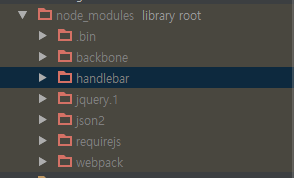

자 그러면 간단하게 jquery를 이용하여 alert을 보여주는 기능을 작성해보겠다. <br/>
src/main/resources/static 폴더 아래에 js 라는 폴더를 생성하고, index.js 파일을 생성하자 <br/>

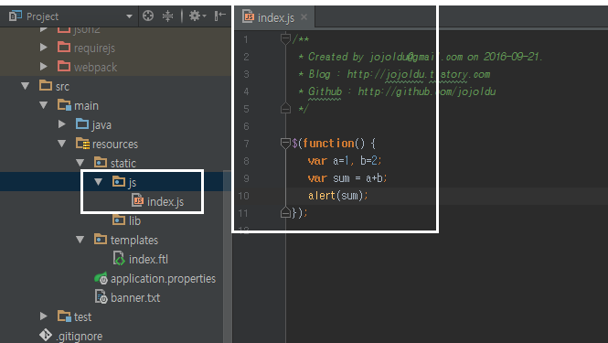

이렇게 생성은 했는데 이걸 쓰려면 jquery가 필요하다. <br/>
앞에 서버코드를 설정한것을 보면 ```registry.addResourceHandler("/**").addResourceLocations("classpath:/static/"); ``` 이렇게 되어있는데, 
이 말은 src/main/resources/static 폴더에 있는 static 파일들을 지원하겠다는 의미이다.  <br/>
  
그래서 귀찮지만 jquery 라이브러리를 src/main/resources/static/js/lib 폴더에 복사하자<br/>
(계속 이렇게 하지 않으니 조금만 참아달라) <br/>
jquery 라이브러리의 위치는 node_modules/jquery.1/node_modules/jquery/dist/에 있는 jquery.min.js 이다

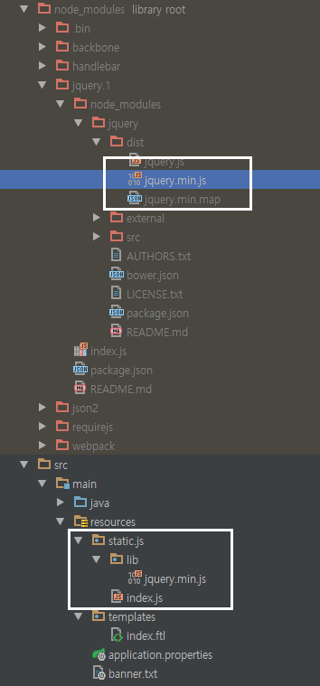

파일을 복사했으면 freemarker에서 호출할 수 있도록 코드를 작성하자.

```
<!DOCTYPE html>
<html lang="ko">
<head>
    <meta charset="UTF-8">
    <title>모던 IE78</title>
</head>
<body>
    <h1>모던하게 개발하는 IE 7/8</h1>
    <script type="text/javascript" src="/js/lib/jquery.min.js"></script>
    <script type="text/javascript" src="/js/index.js"></script>
</body>
</html>
```
작성 후 프로젝트를 다시 실행시켜 localhost:8080에 접속하면 아래와 같이 jquery 기능과 index.js가 정상작동한 것을 확이할 수 있다.

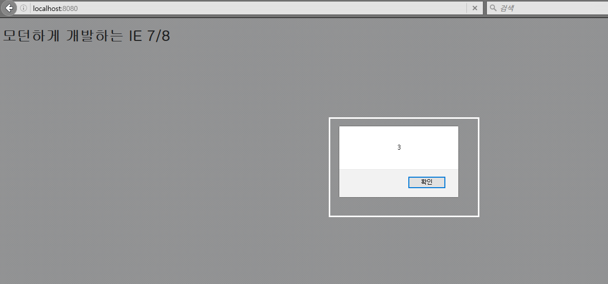

npm과 jquery를 이용하여 간단한 기능을 구현해보았다. 다음은 require.js를 사용해보겠다.

### require.js 소개
index.js를 보면 2가지 기능을 하고 있다. <br/>
sum과 alert 기능인데, index.js가 한가지 기능만 하도록 sum 기능은 분리하고, alert만 남기자. <br/>
index.js가 있는 폴더에 Calculator.js 를 만들자

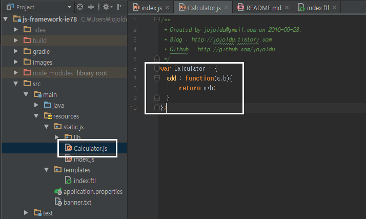

고쳐야할 코드는 아래와 같다.
```
//Calculator.js
var Calculator = {
  add : function(a,b){
      return a+b;
  }
};

//index.js
$(function() {
   var a=1, b=2;
   var sum = Calculator.add(a,b);
   alert(sum);
});

//index.ftl
<!DOCTYPE html>
<html lang="ko">
<head>
    <meta charset="UTF-8">
    <title>모던 IE78</title>
</head>
<body>

    <h1>모던하게 개발하는 IE 7/8</h1>
    <script type="text/javascript" src="/js/lib/jquery.min.js"></script>
    <script type="text/javascript" src="/js/Calculator.js"></script>
    <script type="text/javascript" src="/js/index.js"></script>
</body>
</html>
```

이렇게 구성후 프로젝트를 재시동하여 localhost:8080을 접속하면 정상적으로 코드가 분리된 것을 확인할 수 있다. <br/>
자 이 간단한 구성에서 조차 문제가 있다. <br/>
index.js는 항상 Calculator.js가 필요하다. 이를 index.js가 Calculator.js에 **의존한다** 라고 한다. <br/> 
즉, index.js를 사용하기 위해선 Calculator.js를 항상 먼저 호출해야한다. <br/>
<br/>
헌데 1~2개의 파일이면 문제 없지만 사이트의 규모가 커지면 커질수록 어떤 js를 호출하기 위해선 어떤 js가 먼저 호출되어야 한다는 것을 인지하고 개발하는것이 매우 어렵다. <br/>
Java와 같은 서버사이드 언어에서 이런 문제를 의식하지 못하는 이유는 기본적으로 **import 기능** 이 내장되어 있어 이를 통해 필요한 Class들이 무엇인지 지정할 수 있기 때문이다. <br/>
<br/>
Javascript는 이와 같은 기능이 기본적으로 내장되어 있지 않아 외부 라이브러리의 도움을 받아야 한다. <br/>
우리가 사용할 라이브러리는 require.js 라고 한다. <br/>

require.js를 사용하기 위해 node_modules에서 파일을 옮기자. 근데 또 수동으로 옮기지말고 이번엔 이런 **복사 작업을 자동화** 해보자.

### Grunt - 기본
앞에서 얘기한대로 node_modules에 받은 라이브러리들을 복사하는것이 매우 귀찮은 행위이므로 이를 자동화 하기 위해 grunt를 사용할 것이다 <br/>
grunt의 경우 워낙 [널리 블로그](http://nuli.navercorp.com/sharing/blog/post/1132682)에서 잘 설명하고 있어 참고하면 될 것같다. <br/>
<br/>
자 그럼 grunt 작업을 진행해보자. <br/>
grunt를 사용하기 위해 grunt 라이브러리를 npm으로 받자. 
```
//터미널 혹은 cmd를 프로젝트 폴더에서 open하여 아래 명령어 입력
npm install --save-dev grunt
```
(grunt를 받으면서 package.json에 반영 및 dev용으로 사용하기 위해 --save-dev 옵션 사용하였다.) <br/>
grunt를 전역으로 설치하면 여러 프로젝트간에 grunt 버전이 꼬일 경우 문제가 발생할 수 있으니 이 프로젝트에서만 쓸 수 있도록 grunt를 설치하였다.<br/>
설치가 끝나면 아래와 같이 package.json과 node_modules 폴더가 변경된 것을 확인할 수 있다.

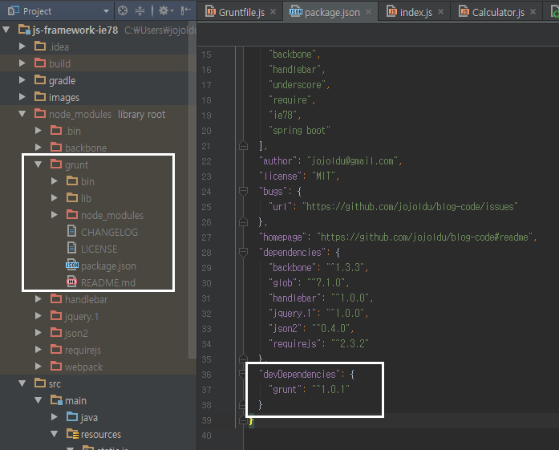

정상적으로 설치된 것을 확인하였으면 grunt를 사용하기 위해 설정파일을 생성해보자 <br/>
package.json과 동일한 위치에 Gruntfile.js 파일을 생성해서 아래 코드를 붙여넣자

```
'use strict';
module.exports = function(grunt) {

    grunt.initConfig({
        pkg : grunt.file.readJSON('package.json'),
        
        //jquery와 requirejs를 copy하도록 지정
        copy : {
            jquery : {
                src : 'node_modules/jquery.1/node_modules/jquery/dist/jquery.min.js',
                dest : 'src/main/resources/static/js/lib/jquery.min.js'
            },
            require : {
                src : 'node_modules/requirejs/require.js',
                dest : 'src/main/resources/static/js/lib/require.js'
            }
        }
    });

    // 플러그인 load
    grunt.loadNpmTasks('grunt-contrib-copy');

    // Default task(s) : 즉, grunt 명령어로 실행할 작업
    grunt.registerTask('default', ['copy']);
};
```
코드 작성이 끝나면 아래와 같이 파일이 위치하면 된다.

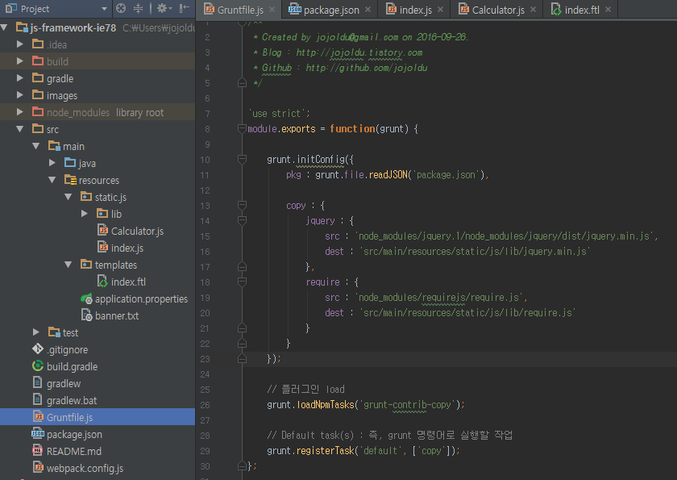

grunt는 grunt를 위한 플러그인들이 존재하는데, 우린 copy 기능을 위해 copy관련 플러그인을 설치해야한다. <br/>
해당 플러그인 이름은 Gruntfile.js에도 명시되어있다. **grunt-contrib-copy**이다.

```
//열려있는 터미널 혹은 cmd에 아래와 같이 설치 명령어를 입력하자
npm install --save-dev grunt-contrib-copy
```

방금전 grunt 설치명령어와 유사하기 때문에 설치가 끝나면 확인 역시 똑같이 하면 된다. <br/>
플러그인 설치가 끝이났다면 한번 실행을 해보자


정상적으로 done 확인후 프로젝트 폴더를 다시 확인해보자 

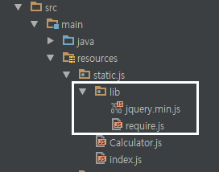

require.js가 정상적으로 복사된것을 확인할 수 있다 <br/>
근데 매번 이렇게 터미널에서 .bin 폴더까지 이동후에 grunt 명령어를 사용해야하나? 귀찮지 않을까? <br/>
이런 귀찮은 명령어를 미리 지정해서 할 수 있다. <br/>

package.json을 열어 scripts에 아래 코드를 추가하자
```
  "scripts": {
    "test": "echo \"Error: no test specified\" && exit 1",
    "start": "node_modules/.bin/grunt"
  }
```

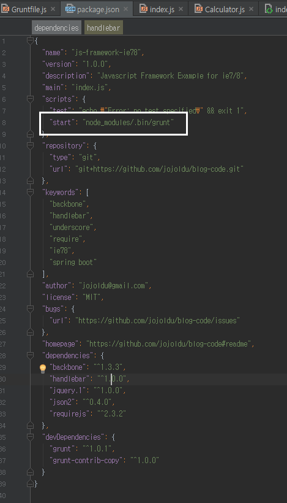

이렇게 등록하게 되면 프로젝트 폴더 내 어디서든 ```npm start``` 라는 명령어를 실행하면 node_modules/.bin/grunt 명령어를 실행시키게 된다. <br/>
정상적으로 작동되는지 확인하기 위해 lib폴더 아래에 있는 jquery.min.js와 require.js를 지우고 터미널 혹은 cmd에서 ```npm start```를 입력해보자

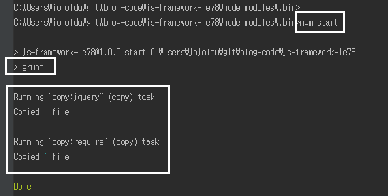

자! 이제야 require.js를 사용할 수 있게 되었다!! 


(삼천포로 느껴진다면 착각이 아닌.....) <br/>

여튼 다음시간엔 grunt를 통해 옮긴 require.js를 사용해보자!

### require.js 사용
전반적인 사용법은 [Nonblock님의 글](http://blog.javarouka.me/2013/04/requirejs-javascript.html)이 큰 도움이 되니 꼭 참고하길 바란다. <br/>
여기서는 간단하게 사용해보려 한다. <br/>
requirejs는 각 js간의 의존성 관리 및 동적로딩을 지원하는 js 라이브러리이다.<br/>
a.js가 b.js가 필요한 경우 requirejs를 이용하여 의존성 관계를 적용할 수 있고, 미리 호출할 필요없이 필요한 경우에만 b.js가 호출되도록 하여 성능상으로도 이점이 생긴다. <br/>
백분이 불여일타! 이전 코드를 requirejs로 리팩토링 해보자. <br/>

requirejs는 js파일을 각자 모듈로 지정하여 사용하는것을 권장한다. <br/>
모듈로 지정하지 않고 사용할 경우 전역스페이스 오염이나 scope 침범등의 문제가 발생할 확률이 높아 웬만하면 모듈로 지정하여 사용하는것을 권장하는 것이다.<br/>
그래서 Calculator.js를 requirejs의 모듈로 되도록 아래와 같이 수정한다.

```
//Calculator.js

define([], function() {
   return {
       add : function(a,b){
           return a+b;
       }
   };
});

```

requirejs는 모듈 선언을 **define** 이란 지시어로 한다. <br/>
define의 인자는 아래와 같은 역할을 한다.
* 1번째 인자는 필요한 의존성들을 선언할 수 있다
* 2번째 인자인 function은 해당 js파일을 호출했을때 실행할 코드와 return될 값 혹은 객체를 생성한다 

즉, Calculator.js를 호출하게 되면 return된 {} 객체를 사용 할 수 있게 된다. <br/>
이제 Calculator.js를 사용하는 index.js를 수정해보겠다.

```
//index.js
require(["/js/Calculator.js"], function(Calculator) {
   var a=1, b=2;
   var sum = Calculator.add(a,b);
   alert(sum);
});
```

index.js는 Calculator.js와 다른 지시어인 **require**를 사용하였다. <br/>
require 지시어는 선언된 모듈들을 사용할 수 있게 해주는 지시어이다. <br/>
define과 비슷하게 첫번째 인자로 의존성, 두번째 인자로 실행 코드 함수가 위치한다.<br/>
1번째 인자를 보면 **/js/Calculator.js라는 의존성을 사용하고, 이를 2번째 인자에서 Calculator 라는 이름으로 사용**하겠다는 의미이다. <br/>
js 관련 수정내용은 여기까지이고 마지막으로 requirejs를 사용할 수 있도록 index.ftl도 수정한다.

```
<!DOCTYPE html>
<html lang="ko">
<head>
    <meta charset="UTF-8">
    <title>모던 IE78</title>
</head>
<body>
    <h1>모던하게 개발하는 IE 7/8</h1>
    <script type="text/javascript" src="/js/lib/require.js"></script>
    <script type="text/javascript" src="/js/lib/jquery.min.js"></script>
    <script type="text/javascript" src="/js/index.js"></script>
</body>
</html>
```

여기서 index.ftl에 보면 2가지 변경 사항이 있다.
* require.js를 호출하는 코드가 추가되었다.
* Calculator.js를 호출하는 코드가 **삭제**되었다.

자 이상태에서 한번 프로젝트를 다시 구동시켜보자. 그리고 개발자 도구로 network를 보자

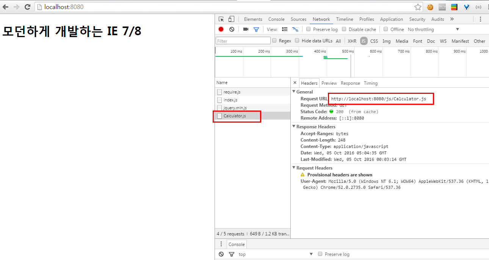

보는것처럼 정상적으로 Calculator.js를 호출하고 있다.<br/>
그렇다면 index.ftl에서 삭제한 이 Calculator.js는 누가 호출해주는 것일까? <br/>
예상한대로 index.js에서 선언한 ```require(["/js/Calculator.js"])``` 에서 호출해주는 것이다. <br/>
여기서 알 수 있는 것은 requirejs는 html/jsp/freemarker등에서 직접 호출을 선언하지 않아도, 필요한 js파일이 있을 경우 의존성에 따라 직접 호출한다는 것이다. <br/>
<br/>

index.js를 보면 html에서 js파일을 호출하듯이 **절대주소**로 js를 호출하고 있다. <br/>
requirejs는 **상대주소**로 호출할 경우 .js를 생략할 수 있다.

```
require(["js/Calculator"], function(Calculator) {
   var a=1, b=2;
   var sum = Calculator.add(a,b);
   alert(sum);
});

```

여기서 보면 중복될만한 코드가 보인다 <br/>
바로 js/Calculator의 **js/**이다. 어차피 모든 js파일이 js폴더 아래에 있을텐데 코드를 작성할때는 js폴더를 지정하지 않아도 자동으로 js폴더내에서 해당 js파일을 찾았으면 한다. <br/>
이런 요구사항을 위해 requirejs에서는 requirejs 설정을 지원한다. <br/>

js 폴더 아래에 main.js 파일을 만들어 아래의 코드를 추가하자

```
//main.js
// 이 코드를 require.js가 로딩된 뒤 기타 모듈을 로딩하기 전에 둔다.
require.config({
    baseUrl: "js", // 모듈을 로딩할 기본 패스를 지정한다.
    waitSeconds: 15 // 모듈의 로딩 시간을 지정한다. 이 시간을 초과하면 Timeout Error 가 throw 된다
});
```

위 main.js를 require.js 호출된 다음에 바로 호출할 수 있도록 index.ftl을 수정하자

```
//index.ftl
<!DOCTYPE html>
<html lang="ko">
<head>
    <meta charset="UTF-8">
    <title>모던 IE78</title>
</head>
<body>
    <h1>모던하게 개발하는 IE 7/8</h1>
    <script type="text/javascript" src="/js/lib/require.js"></script>
    <script type="text/javascript" src="/js/lib/jquery.min.js"></script>
    <script type="text/javascript" src="/js/main.js"></script>
    <script type="text/javascript" src="/js/index.js"></script>
</body>
</html>
```

그리고 해당 설정이 잘 적용되는지 확인하기 위해 index.js를 수정하자

```
require(["Calculator"], function(Calculator) {
   var a=1, b=2;
   var sum = Calculator.add(a,b);
   alert(sum);
});
```

보는 것처럼 Calculator호출시에 **js/**를 생략해서 호출하고 있다. <br/>
이대로 프로젝트를 재시작해서 localhost:8080에 접속하면!


js폴더 지정이 생략되어도 정상적으로 Calculator.js를 호출하는것을 확인할 수 있다.<br/>

자 이제 require.js까지 적용해보았다. 다음은 backbone.js를 적용하자!

### backbone.js 사용 (1)
backbone.js는 Model/Collection/View 라는 3가지 요소로 구성된 Javascript 프레임워크이다<br/>
(Controller가 아니다 오해하시는분들이 꽤 많으신데 Collection이다)<br/>
몇줄의 코드만으로 Model의 변경에 자동으로 view가 반응하도록 할 수 있다. <br/>

backbone을 시작하기전, 현재 시스템을 조금 더 고도화!? 해보자. <br/> 
1+2를 2개의 input box에서 입력 받아 sum을 출력하는 방식으로 변경한다.

```
//index.ftl
<!DOCTYPE html>
<html lang="ko">
<head>
    <meta charset="UTF-8">
    <title>모던 IE78</title>
</head>
<body>
    <h1>모던하게 개발하는 IE 7/8</h1>
    <div id="userInput" class="row">
        입력 1: <input type="text" class="inputs" id="input1" value="0"><br/>
        입력 2: <input type="text" class="inputs" id="input2" value="0">
        <div id="addResult" class="row">
            + : <input type="text" id="result">
        </div>
    </div>
    <br/>
    <script type="text/javascript" src="/js/lib/jquery.min.js"></script>
    <script type="text/javascript" src="/js/lib/require.js"></script>
    <script type="text/javascript" src="/js/main.js"></script>
    <script type="text/javascript" src="/js/index.js"></script>
</body>
</html>

//index.js
require(["Calculator"], function(Calculator) {
   var a = $('#input1').val(),
       b = $('#input2').val();

   var sum = Calculator.add(parseInt(a), parseInt(b));
   $('#result').val(sum);

});
```

index.ftl과 index.js를 수정 후 프로젝트를 재시작해보자. 그러면 바뀐 UI를 확인할 수 있다.

자 여기서 기능을 좀더 확장시켜보자. 현재는 input1,input2의 값이 변경될 경우 결과값이 반영되지 않는다. <br/>
그래서 값이 변경되면 결과에 바로 반영되도록 index.js 코드를 조금 수정해보겠다.

```

//index.js
require(["Calculator"], function(Calculator) {
   var $inputs = $('.inputs'),
       $result = $('#result');

   var getResult = function() {
      var a = $('#input1').val(),
          b = $('#input2').val();
      var sum = Calculator.add(parseInt(a), parseInt(b));
      $result.val(sum);
   };

   $inputs.on('keyup', getResult);

   getResult();
});

``` 

이렇게 코드를 작성후 프로젝트를 다시 실행시켜보자 <br/>
그럼 실시간으로 sum값이 반영되는 프로젝트가 보일 것이다.


기능 확인이 끝났다면 작성한 코드를 다시보자 <br/>
이 코드에서는 문제가 없을까? 이렇게 간단한 코드에서도 문제가 있는걸까? <br/>
<br/>
index.js는 너무 많은 일을 하고 있다. 아래는 index.js가 하고 있는 일이다.
* index.ftl이 호출되었을때 어떤 일을 해야하는지 지시하고 있다
* input1, input2의 값을 가지고 Calculator를 통해 합을 구한다
* inputs class를 가지고 있는 dom에 keyup 이벤트가 발생하면 getResult 함수를 호출한다
* 페이지 처음 로딩시 getResult를 통해 합계를 구한다

index.js가 과연 저 많은 일들을 할 필요가 있을까? <br/>
index.js는 index.ftl이 불렸을 때 어떤 js들을 통해 어떤 일을 지시하는지만 하면 되지 않을까? <br/>
Java는 MVC 모델로 각 Layer를 분리하면서 Javascript는 왜 분리하지 않을까? <br/>
이런 고민을 갖고 있다면 Backbone.js가 좋은 방법이 될 수 있다 <br/>
(물론 angular.js도 가능하다. but! 우린 IE 7,8에서 개발해야 하니 pass.....) 


서론이 너무 길었던것 같다. 이제 이 코드를 backbone 기반으로 변경을 시작해보자.<br/>
기본적인 개념과 사용법은 [조규태님의 backbone.js 가이드](http://webframeworks.kr/getstarted/backbonejs/)를 참고하면 될것같다. <br/>

backbonejs를 정상적으로 사용하기 위해서는 underscore.js와 jquery가 필요하다 <br/>
이를 위해서 이전에 작업한 grunt를 이용하여 node_modules에 있는 js파일들을 복사하자 <br/>
jquery는 이미 있으니 underscore.js와 backbone.js만 진행하면 된다 <br/>
Gruntfile.js를 아래와 같이 수정하자

```
//Gruntfile.js

'use strict';
module.exports = function(grunt) {

    grunt.initConfig({
        pkg : grunt.file.readJSON('package.json'),
        
        //jquery와 requirejs, underscorejs, backbonejs를 copy하도록 지정
        copy : {
            jquery : {
                src : 'node_modules/jquery.1/node_modules/jquery/dist/jquery.min.js',
                dest : 'src/main/resources/static/js/lib/jquery.min.js'
            },
            require : {
                src : 'node_modules/requirejs/require.js',
                dest : 'src/main/resources/static/js/lib/require.js'
            },
            underscore : {
                src : 'node_modules/backbone/node_modules/underscore/underscore-min.js',
                dest : 'src/main/resources/static/js/lib/underscore-min.js'
            },
            backbone : {
                src : 'node_modules/backbone/backbone-min.js',
                dest : 'src/main/resources/static/js/lib/backbone-min.js'
            }
        }
    });

    // 플러그인 load
    grunt.loadNpmTasks('grunt-contrib-copy');

    // Default task(s) : 즉, grunt 명령어로 실행할 작업
    grunt.registerTask('default', ['copy']);
};
```

작성후, 터미널 혹은 CMD에서 **npm start**를 입력하면 grunt가 진행되어 copy가 진행될 것이다

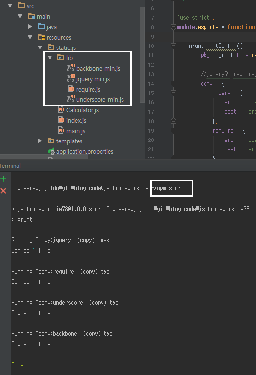

이전과 마찬가지로 index.ftl에 underscore.js와 backbone.js를 추가하자

```
//index.ftl

<!DOCTYPE html>
<html lang="ko">
<head>
    <meta charset="UTF-8">
    <title>모던 IE78</title>
</head>
<body>
    <h1>모던하게 개발하는 IE 7/8</h1>
    <div id="userInput" class="row">
        입력 1: <input type="text" class="inputs" id="input1" value="0"><br/>
        입력 2: <input type="text" class="inputs" id="input2" value="0">
        <div id="addResult" class="row">
            + : <input type="text" id="result">
        </div>
    </div>
    <br/>
    <script type="text/javascript" src="/js/lib/jquery.min.js"></script>
    <script type="text/javascript" src="/js/lib/underscore-min.js"></script>
    <script type="text/javascript" src="/js/lib/backbone-min.js"></script>
    <script type="text/javascript" src="/js/lib/require.js"></script>
    <script type="text/javascript" src="/js/main.js"></script>
    <script type="text/javascript" src="/js/index.js"></script>
</body>
</html>
``` 

backbone의 경우 View와 Model이라는 2가지 타입이 있다. (Collection은 나중에 소개하겠다) <br/>
보통의 경우 데이터 관리는 Model이, 데이터의 변경에 따라 화면변경 혹은 이벤트처리 등은 View에서 담당하고 있기 때문에 View가 Controller역할까지 한다고 보면 될것 같다. <br/>
<br/>
위 코드를 View만으로 수정해보자.<br/>
js 폴더 아래에 add라는 폴더를 생성하여 AddView.js 파일을 추가하자 


추가 및 수정할 코드는 아래와 같다. 

```
//AddView.js
define(["Calculator"], //require->define으로 변경했다. 즉시실행할 필요가 없어져서.
function(Calculator) {
    return Backbone.View.extend({

        // view 객체 생성시 진행할 코드들
        initialize: function () {
            $('.inputs').on('keyup', this.render);
        },

        render : function() {
            var a = $('#input1').val(),
                b = $('#input2').val();
            var sum = Calculator.add(parseInt(a), parseInt(b));

            $('#result').val(sum);
        }
    });
});

//index.js
require(['Calculator', 'add/AddView'], function(Calculator, AddView) {
   var addView = new AddView();
   addView.render();
});
```

backbone.js는 View 객체를 **Backbone.View.extend({})** 로 선언한다. <br/>
requirejs 사용에 대해 다시 한번 기억을 떠올려 보면서 코드를 보자 <br/>
define의 2번째 인자인 function에서 return 되는 객체는 해당 js파일을 호출할때 전달되는 값이라는 것이 기억 날 것이다. <br/>
즉, AddView.js를 누군가 requirejs를 통해 호출할 경우 전달되는 값은 **Backbone.view.extend({...})** 인것이다. <br/>
<br/> 
AddView.js는 index.js의 역할 중, add에 관한 모든 책임을 받았다 <br/>
즉, **inputs 클래스를 가진 dom element들에 keyup이벤트를 할당**하고,<br/> 
**keyup 이벤트가 발생하면 Calculator.js를 이용하여 계산된 결과를 result에 할당**한다.<br/>
<br/>
index.js는 add 기능에 관한 모든 책임을 AddView.js에 이관했기 때문에 남은건 AddView.js를 호출하는것 뿐이다. <br/>
자 그럼 여기까지 한 결과가 정상적으로 작동하는지 확인을 해보자

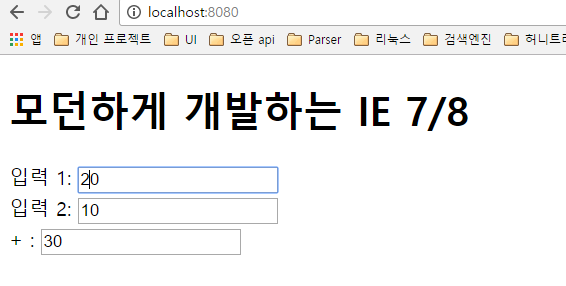

잘 되는 것이 확인 되었다. <br/>

자 근데 여기서 AddView 역시 가지고 있는 역할이 너무 많다. <br/>
**화면 변화에 필요한 일만 AddView**가 담당하고 **데이터는 다른 곳이 책임**을 지는게 좀 더 역할 분리가 된것 아닐까? <br/>
backbone.js의 Model이 바로 이때 사용된다. <br/>
지정한 데이터만 순수하게 관리하는 역할을 하는 객체를 backbone.js에선 Model 객체라고 한다. <br/>
AddView.js 객체와 동일한 위치에 AddModel.js를 생성하자 

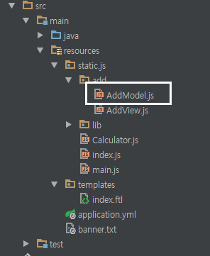

코드는 아래와 같다.

```
// AddModel.js
define(["Calculator"],
function(Calculator) {

    return Backbone.Model.extend({
        // Model 객체 생성시 defaults를 기준으로 관리해야될 데이터(attributes)를 생성
        defaults: {
            input1: 0,
            input2: 0,
            result: 0
        },

        setInputs : function (obj) {
            var input1 = parseInt(obj.input1),
                input2 = parseInt(obj.input2),
                result = Calculator.add(input1, input2);

            // Model 객체의 attributes에 입력 받은 새로운 값을 set
            this.set({input1: input1, input2: input2, result:result});
        }
    });
});
```

defaults는 Model 객체가 관리해야할 데이터로 생각할 수 있지만, 정확히 그렇지는 않다. <br/>
다만 Model이 **관리해야 할 데이터의 초기 데이터 형태가 defaults를 기준으로 생성**된다는 것을 알고 가자<br/>
<br/>
AddModel.js에서는 setInputs 함수가 있다.<br/>
이 함수를 통해서 View영역에서 Model에 데이터 변경을 요청하게 된다. <br/>
전달 받은 값으로 관리되는 데이터를 변경하고, result를 Calculator를 통해 전달 받아 result값도 변경해준다. <br/>
<br/>
input1/2, result등 데이터 관련된 부분을 모두 AddModel에 넘겨주었으니 AddView.js의 코드도 그에 맞춰 변경하자.<br/>
AddView.js 코드 변경사항의 핵심은 **1) Dom이 변경되면, Model에 변경된 내역을 전달, 2) Model의 값에 따라 화면을 변경**하는 것이다.

```
//AddView.js
//require->define으로 변경, View객체를 전달하기 위해
define(["add/AddModel"], //사용할 AddModel.js를 requirejs를 통해 load
function(AddModel) {
    return Backbone.View.extend({
        model : null,

        /*  el로 지정한 dom 하위 element중 inputs 클래스를 가진 element에
         keyup이벤트가 발생하면 set함수 호출되도록 지정  */
        events: {
            'keyup .inputs' : 'set'
        },

        // view 객체 생성시 진행할 코드들
        initialize: function () {
            //아래에서 사용하는 this는 현재 객체 즉, AddView객체를 얘기한다.
            this.model = new AddModel();

            //model의 값이 변경되는(change) 이벤트가 발생하면 view의 render 함수 호출되도록 지정
            this.listenTo(this.model, 'change', this.render);
        },

        set : function() {
            var input1 = $('#input1').val(),
                input2 = $('#input2').val();

            this.model.setInputs({'input1': input1, 'input2': input2});
        },

        render : function() {
            $('#result').val(this.model.get('result'));
        }
    });
});

//index.js
require(['Calculator', 'add/AddView'], function(Calculator, AddView) {

   //생성자 인자로 el을 넣어주면 AddView영역은 el에 할당된 dom 영역을 본인의 영역으로 지정하게 된다.
   var addView = new AddView({
      el : $('#userInput')
   });
   addView.render();
});
```

코드의 역할은 대부분 주석이 있어 이해하는데 크게 어려움은 없을 것 같다. <br/>
전체 Flow는 
* 화면상 input1, input2 값이 변경
* ```events: {'keyup .inputs' : 'set'}``` 로 AddView.js의 set 함수 호출
* set함수가 AddModel의 데이터 변경 (AddModel의 setInputs함수 호출)
* ```this.listenTo(this.model, 'change', this.render)``` 코드로 인해 AddModel데이터 변경시 AddView.js의 render함수 호출
* render함수가 AddModel의 result를 가져와 화면의 result 변경 

index.js에서 new AddView에서 인자로 el을 추가하게 된 이유는 **backbone.js의 event binding** 때문이다.

backbone.js에서 event binding을 할때 주의해야 할 점은, 해당 View 객체의 Dom 영역이 지정되어 있어야만 된다는 것이다. <br/>
AddView.js를 new 로 생성할 때 **{el : $('#userInput')}** 처럼 어떤 dom을 해당 View객체의 영역으로 지정할 것인지 입력되지 않으면 .inputs 클래스가 어디 영역인지 알 수 없어 event bingind이 안된다. <br/>
왜 이렇게 번거롭게 했냐하면, backbone.js는 SPA(Single Page Application)에 초점을 맞춰 나온 프레임워크로, <br/> 
한 페이지 내에 분리된 Dom 영역은 각각에 맞는 Backbone객체들로 이루어지도록 하기 위함이다. <br/>
하나의 js가 여러 Dom을 모두 관리하는게 아니라 A div 영역은 AView.js와 AModel.js가 전담하고, B div 영역은 BView.js와 BModel.js 가 전담하게 되는 것이다.
여기에서도 ```<div id="userInput"></div>``` 영역은 AddView.js와 AddModel.js가 전담하게 된 것이다. <br/>

한가지 더 주의사항이 있다면,<br/>
backbone.js에서 model의 change 이벤트는 model의 defaults 속성에 반응하는 것이 아니라, attributes에 반응한다. 

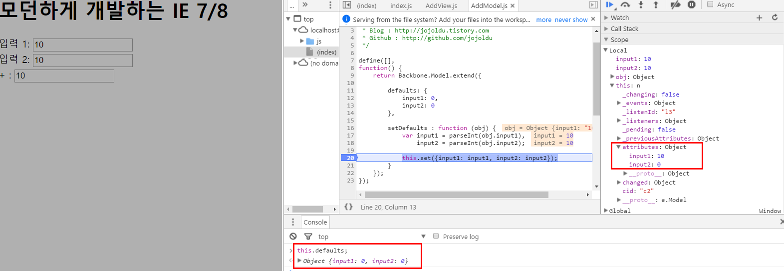

위 그림처럼 set으로 변경하여도 defaults 값은 변경되지 않는다.<br/>
만약 model.defaults로 직접 값을 변경할 경우 change 체크가 안되서 이벤트가 발생하지 않는다. <br/>
model.set() 으로 attributes를 변경해야만 하는 것을 잊지 말자 <br/>
            
겨우 1+2 하는데 왜 이난리를 쳐야하는지 생각할 수도 있을것 같다.

                             

아직 backbone.js 파트의 전부를 다룬것이 아니니... 조금만 더 참고 따라가보자 <br/>
현재 예제는 backbone.js의 진짜 장점을 나타내기에는 조금 부족한 예제이니 backbone.js가 이상하기 보다는 작성자 예제가 구리다고 판단하는게 좀더 옳은 판단임을 얘기하고 싶다.<br/>
다음은 backbone.js의 진짜 강점인 Ajax를 진행하겠다.

### backbone.js 사용 (2)
이번 시간에는 앞서 진행했던 backbone을 좀 더 다듬어 볼 예정이다. <br/>
backbone의 view는 값을 셋팅하는것이 주 목적이 아니라 Model에 따라 Rendering 하는것이 주 목적이다. <br/>
Freemarker에서 result 