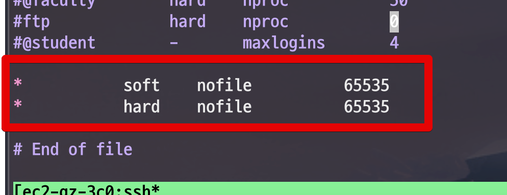
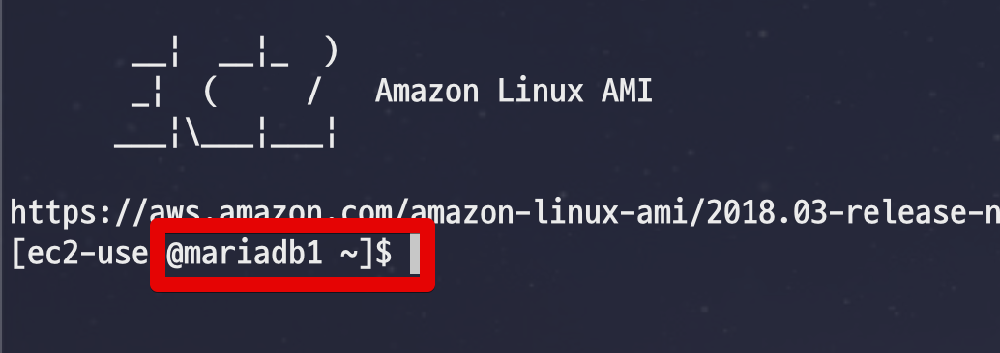

# MariaDB 설치 및 설정

AWS 를 쓸 수 있다면 Aurora가 정답이지만, IDC를 쓰고 있다면 MariaDB 혹은 MySQL을 써야 합니다.  
  
여기선 IDC 환경에서 MariaDB 운영을 위해 필요한

## 1. OS 설정

저 같은 경우 별도로 IDC 장비를 사용하지 못하여 AWS EC2에 직접 설치하며 사용할 예정입니다.  

> Centos 6을 쓰신다면 거의 비슷한 명령어로 수행할 수 있습니다.

### 1-1. ulimit 수정

다음으로 ulimit 설정을 합니다.

> ulimit에 대한 자세한 내용은 예전에 [작성한 글](http://woowabros.github.io/experience/2018/04/17/linux-maxuserprocess-openfiles.html)을 참고해보세요.

아래 파일을 열어 확인해봅니다.

```
vim /etc/security/limits.conf
```

아래와 같이 전체 사용자의 nofile 옵션을 추가합니다.

```
*               soft    nofile          65535
*               hard    nofile          65535
```



### 1-2. Hostname 변경

여러대의 MariaDB를 관리해야하거나, 마스터-슬레이브 구조로 관리 해야될때는 각 서버가 Hostname을 갖고 있는게 편합니다.  
  
빠르게 호스트명을 지정하겠습니다.  

Centos 6 이라면 아래 명령어로 설정 파일을 열어봅니다.

```bash
vim /etc/sysconfig/network
```

그리고 아래와 같이 **HOSTNAME** 항목에 원하는 이름을 등록합니다.


(저는 mariadb1로 등록하였습니다.)  
  
만약 centos7 (Amazon Linux 2) 라면 다음과 같이 변경합니다.

```bash
hostnamectl set-hostname 원하는호스트명
```

설정이 완료되셨다면 적용을 위해 재부팅을 합니다.

```bash
reboot
```

부팅 완료후 재접속을 해보시면!



성공적으로 변경된 것을 확인할 수 있습니다.  
  
### 1-3. KST로 수정

서버의 시간이 UTC 라서 한국시간인 KST로 변경하겠습니다.  
(현재 상태로 시간 함수를 사용하게 되면 한국 시간보다 -9 시간으로 사용됩니다.)

```bash
rm /etc/localtime
ln -s /usr/share/zoneinfo/Asia/Seoul /etc/localtime
```

```bash
$ date
Sat Nov 16 18:20:27 KST 2019
```

```bash
reboot
```

여기까지 하셨다면 기본적인 설정은 끝이납니다.  

## 2. MariaDB 설치

기본적으로 Linxu yum repository에는 MariaDB가 등록되어 있지 않습니다.  
  
그래서 직접 저장소 정보를 등록하겠습니다.  
  
아래 명령어로 yum repository를 열어봅니다.

```bash
vim /etc/yum.repos.d/maria.repo
```

아래 내용을 그대로 붙여넣습니다.

```bash
[mariadb]
name = MariaDB
baseurl = http://yum.mariadb.org/10.1/centos6-amd64
gpgkey=https://yum.mariadb.org/RPM-GPG-KEY-MariaDB
gpgcheck=1
```

* baseurl 은 본인이 원하는 스펙으로 합니다.
  * 10.1 은 MariaDB의 버전을 얘기합니다.
    * 즉, 10.1.x 버전중 최신을 사용합니다
    * 현재 (2019.11.14) 으로는 10.4.10 까지 출시되었습니다.
      * 저는 **기존에 사용중**이던 10.1.x 버전으로 진행합니다.
* centos6-amd64
  * 현재 리눅스 서버 스펙을 선택합니다.
  * Centos 64비트를 사용하는데, 본인이 Centos 7을 사용한다면 ```centos7-amd64``` 을 쓰시면 됩니다.

yum install 을 실행합니다.

```
yum install -y MariaDB-server MariaDB-client
```

설치가 다 되셨다면 확인을 해봅니다.

```bash
rpm -qa | grep MariaDB
```

아래와 같이 나온다면 정상적으로 설치된 것입니다.

```bash
$ rpm -qa | grep MariaDB
MariaDB-compat-10.1.43-1.el6.x86_64
MariaDB-common-10.1.43-1.el6.x86_64
MariaDB-client-10.1.43-1.el6.x86_64
MariaDB-server-10.1.43-1.el6.x86_64
```

> 버전은 설치 당시 최신 버전에 따라 다릅니다.

설치가 다 되셨으면 MariaDB 설정을 진행합니다.

### 2-1. my.cnf 설정

MariaDB의 공식 설정 파일을 ```my.cnf``` 입니다.  
yum 설치시 설정 파일의 기본 위치는 ```/etc/my.cnf``` 입니다.  
  
my.cnf 파일에서 사용할 디렉토리들을 미리 생성해두겠습니다.  
  
지금 생성할 디렉토리들이 my.cnf 설정 옵션에 등록됩니다.  
  
먼저 **백업 대상**이 되는 디렉토리들을 생성합니다.

```bash
mkdir -p /data/mysql/mysql-data
mkdir -p /data/mysql/mysql-ibdata
chown -R mysql:mysql /data/mysql
```

**백업 대상이 아닌** 디렉토리들은 별도의 경로로 설치합니다.

```bash
mkdir -p /home/mysql/log/binary/mysql-bin
mkdir -p /home/mysql/log/error/error.log
mkdir -p /home/mysql/log/relay/relay-log
mkdir -p /home/mysql/log/slow/slow.log
mkdir -p /home/mysql/log/general/mysql_general.log
mkdir -p /home/mysql/tmpdir
chown -R mysql:mysql /home/mysql
```

이제 이 디렉토리들을 포함해서 ```my.cnf```파일을 수정해보겠습니다.

```bash
vim /etc/my.cnf
```

아래는 my.cnf에 복사할 설정들입니다.  
꼭 이대로 설정할 필요는 없습니다.  
사내의 DBA분들에게 여쭤보시거나 기존에 사용중이던 설정값들을 사용하시면 됩니다. 

```bash
[client]
port                            = 3306
socket                          = /data/mysql/mysql.sock

[mysqld]
port                            = 3306
socket                          = /data/mysql/mysql.sock

## config server and data path
datadir                         = /data/mysql/mysql-data
tmpdir                          = /home/mysql/tmpdir
innodb_data_home_dir           = /data/mysql/mysql-data
innodb_log_group_home_dir       = /home/mysql/log


# Log Config
binlog_format                   = mixed
expire_logs_days                = 7
long_query_time                 = 10
max_binlog_size                 = 1G
sync_binlog                     = 1
slow_query_log                  = 1
log-bin                         = /home/mysql/log/binary/mysql-bin
log-error                       = /home/mysql/log/error/mysql.err
relay-log                       = /home/mysql/log/relay/relay-log
slow_query_log_file             = /home/mysql/log/mysql-slow-query.log
general_log_file                = /home/mysql/log/general/mysql_general.log
log-warnings                    = 2

# Character set Config (utf8mb4)
character_set-client-handshake  = FALSE
character-set-server            = utf8mb4
collation_server                = utf8mb4_general_ci
init_connect                    = set collation_connection=utf8mb4_general_ci
init_connect                    = set names utf8mb4

# Common Config
back_log                        = 1024
binlog_cache_size               = 1M
ft_min_word_len                 = 4
interactive_timeout             = 600
join_buffer_size                = 2M
max_allowed_packet              = 1G
max_connections                 = 8196
max_heap_table_size             = 4096M
max_length_for_sort_data        = 1024
open_files_limit                = 8192
performance_schema
read_buffer_size                = 1M
read_rnd_buffer_size            = 8M
skip_external_locking
skip-name-resolve               = 1
sort_buffer_size                = 1M
key_buffer_size                 = 8388608
table_open_cache                = 10240
tmp_table_size                  = 4096M
transaction_isolation           = READ-COMMITTED
slave_skip_errors               = all

# Query Cache Disable
query_cache_type                = 0
query_cache_size                = 0

# Innodb config
innodb_additional_mem_pool_size = 32M
innodb_autoinc_lock_mode        = 1
innodb_buffer_pool_size         = 3G # 현재 서버 사양의 70~80%를 설정한다.
innodb_fast_shutdown            = 1
innodb_file_per_table           = 1
innodb_flush_log_at_trx_commit  = 2
innodb_flush_method=ALL_O_DIRECT
innodb_lock_wait_timeout        = 72000
innodb_log_buffer_size          = 64M
innodb_log_file_size            = 512M
innodb_log_files_in_group       = 8
innodb_mirrored_log_groups      = 1
innodb_open_files               = 8192
innodb_read_io_threads          = 8
innodb_thread_concurrency       = 0
innodb_thread_sleep_delay       = 0
innodb_write_io_threads         = 8

#Thread Pool
thread_handling=pool-of-threads
thread_pool_idle_timeout        = 120
thread_pool_stall_limit         = 60

# Replication related settings
log_bin_trust_function_creators = 1

server-id                       = 1 

[mysqldump]
quick
max_allowed_packet              = 512M

```

* 각 디렉토리들의 위치는 회사/팀마다 다를수 있으니 꼭 my.cnf 파일로 확인해보셔야 합니다.
* innodb_buffer_pool_size 의 경우 **현재 서버 사양의 70~80%** 정도로 설정합니다.
  * 현재 사용중인 EC2 서버는 메모리가 4GB 라서 my.cnf에서 3GB로만 설정했습니다.

다 되셨으면 한번 실행해보겠습니다.

```bash
service mysql start
```

그럼 아래와 같이 로그가 보이면서 실행이 되는 것을 알 수 있습니다.


### 2-2. 실행 실패시

바로 시작할때 아래와 같이 에러가 발생할 수 있습니다.

```bash
$ service mysql start
Starting MariaDB.191116 09:01:10 mysqld_safe Logging to '/home/mysql/log/error/mysql.err'.
191116 09:01:10 mysqld_safe Starting mysqld daemon with databases from /data/mysql/mysql-data
./etc/init.d/mysql: line 264: kill: (19565) - No such process
 ERROR!
```

좀 더 자세히 원인을 파악해봅니다.

```bash
vim /home/mysql/log/error/mysql.err
```

필수 파일들이 존재하지 않다는 것인데요.  

```bash
2019-11-16  9:01:12 140219978098816 [Note] Plugin 'FEEDBACK' is disabled.
2019-11-16  9:01:12 140219978098816 [ERROR] Could not open mysql.plugin table. Some plugins may be not loaded
2019-11-16  9:01:12 140219978098816 [Note] Recovering after a crash using /home/mysql/log/binary/mysql-bin
2019-11-16  9:01:12 140219978098816 [Note] Starting crash recovery...
2019-11-16  9:01:12 140219978098816 [Note] Crash recovery finished.
2019-11-16  9:01:12 140219977733888 [Warning] Failed to load slave replication state from table mysql.gtid_slave_pos: 1146: Table 'mysql.gtid_slave_pos' doesn't exist
2019-11-16  9:01:12 140219978098816 [ERROR] Can't open and lock privilege tables: Table 'mysql.servers' doesn't exist
2019-11-16  9:01:12 140219978098816 [Note] Server socket created on IP: '::'.
2019-11-16  9:01:12 140219978098816 [ERROR] Fatal error: Can't open and lock privilege tables: Table 'mysql.user' doesn't exist
```

이는 처음 설치시 자동으로 생성되는 ```data``` 들이 기본 위치인 ```/var/lib/mysql``` 에 있기 때문인데요.  
이들이 ```/etc/my.cnf```에 지정된 위치로 가있어야만 정상적으로 실행할 수 있습니다.  
그래서 이 파일들을 모두 복사하겠습니다.

```bash
cp -R /var/lib/mysql/* /data/mysql/mysql-data/
```

```bash
chown -R mysql:mysql /data/mysql
```

### 2-3. root 계정으로 접속하기

실행한 MariaDB로 접속을 해볼텐데요.  
생성된 계정이 없는데 어떤걸로 해야하지? 라는 생각이 듭니다.  
  
이제 막 설치되었을때는 ```root``` 계정의 비밀번호가 없는 상태라 그냥 접속이 가능합니다.  


```bash
mysql -u root
```

```bash
use mysql;
update user set password=password('비밀번호') where user='root';
flush pribvileges;
```