# Java 라이브러리 maven 저장소에 등록하기 

안녕하세요? 이번 시간엔 **Java 라이브러리 maven 저장소에 등록**하는 방법을 소개드리려 합니다.  
모든 코드는 [Github](https://github.com/jojoldu/enum-mapper)에 있기 때문에 함께 보시면 더 이해하기 쉬우실 것 같습니다.  
(공부한 내용을 정리하는 [Github](https://github.com/jojoldu/blog-code)와 세미나+책 후기를 정리하는 [Github](https://github.com/jojoldu/review), 이 모든 내용을 담고 있는 [블로그](http://jojoldu.tistory.com/)가 있습니다. )<br/>

본인이 만든 Java 라이브러리를 Maven Repository에 등록하고, 이를 여러 프로젝트에서 활용하고 싶으신 분들이 계실것 같습니다.  
저 역시 이번에 그런 경우가 생겨, 직접 진행하고 정리해보았습니다.  

## 본문

Gradle로 진행하는 방법이 Maven보다 과정이 더 복잡하단 생각에 Maven으로 진행하겠습니다.  
(전 Maven보다는 Gradle을 선호합니다..)  
등록할 라이브러리가 Maven 프로젝트라는 가정하에 시작합니다.

### 1. bintray 등록

OSSRH를 이용할 수도 있지만, 그 과정이 매끄럽지 못해 bintray라는 대행서비스를 사용합니다.  
먼저 bintray.com에 가입을 합니다.  
이때 주의하실 점은 사이트 메인에서 가입하시면 **엔터프라이즈 트라이얼 가입자**가 됩니다.  
이렇게 될 경우 jcenter와 mavencentral에 jar를 무료로 업로드 할수 없습니다.  
그래서 오픈소스 개발자로 가입을 합니다.  

* [가입링크](https://bintray.com/signup/oss)

화면이 아래와 같은 형태여야 합니다.

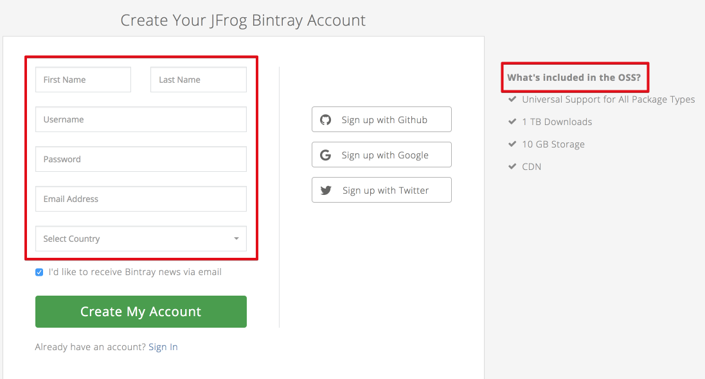

가입을 완료하시면 아래와 같이 프로필 페이지가 등장할텐데, 여기서 **Add New Repository**를 클릭합니다.

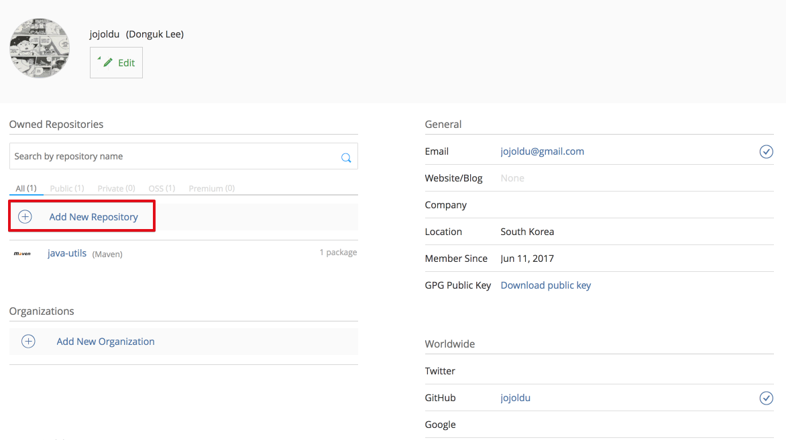

아래와 같이 원하는 형태로 저장소를 설정합니다.

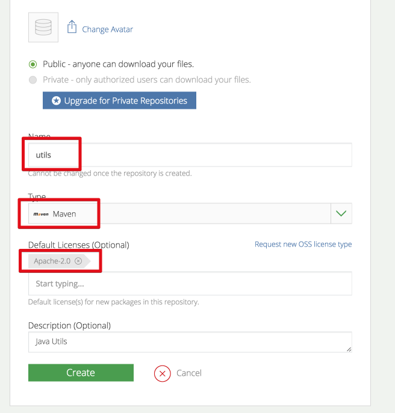

저는 Type은 Maven으로 (여기선 저장소 형태를 얘기합니다. Ant/Maven/Gradle 같은 빌드 시스템 선택이 아닙니다.), 라이센스는 Apache-2.0으로 하였습니다.  
create하시면 해당 저장소의 페이지로 이동합니다.  
여기서 **Add New Package**를 클릭합니다.

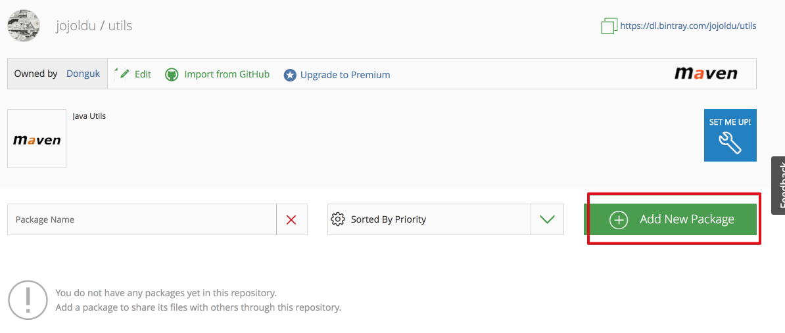

저는 기존에 생성해둔 저장소(**java-utils**를 사용하겠습니다.)  

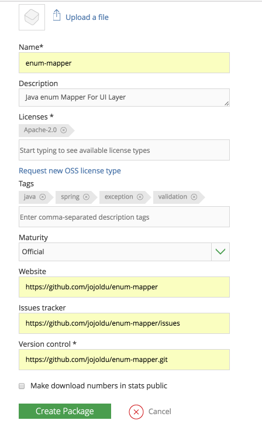

위 처럼 본인의 라이브러리 정보를 등록합니다.  
(보통은 github 정보를 등록하시면 됩니다.)  
Name은 일반적으로 **artifactId**를 권장합니다.  
(artifactId란 Maven 혹은 Gradle에서 의존성 추가하실때를 예로 들면 ```org.apache.commons:commons-lang3```에서 ```commons-lang3```를 얘기합니다.  
좀전에 생성한 저장소 이름을 groupId로, 지금 생성하는 패키지의 이름을 artifactId로 생성한다고 보시면 됩니다.)  
생성을 완료하시면 패키지 관리 페이지로 이동합니다.  
**Edit** 버튼을 클릭하고,

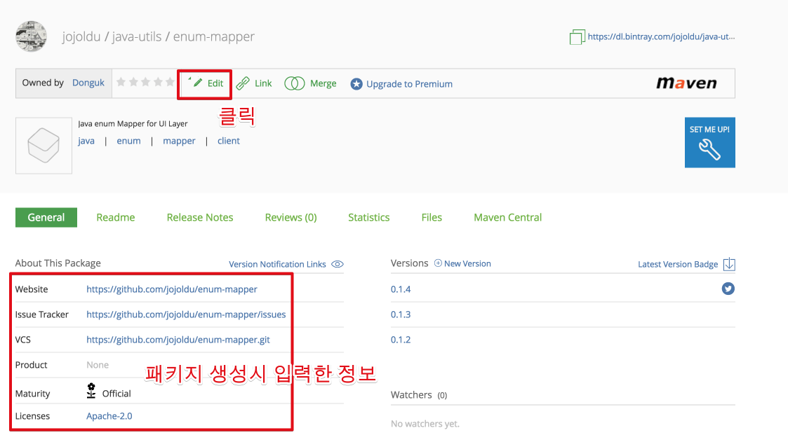

설정 페이지 가장 하단에 있는 **GitHub repo (user/repo)**에 Github 정보를 입력합니다.  
(usename/저장소명 으로 입력합니다.)

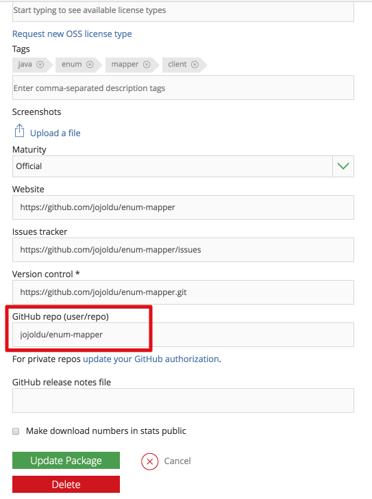

자 이제 잠깐 웹 페이지는 그대로 둔채, GPG 키 생성을 진행하겠습니다.

### 2. GPG Key 생성

라이브러리 위변조를 방지하기 위해 GPG키로 전자서명이 필요합니다.  
이번엔 그 과정을 진행하겠습니다.  
이번 과정은 맥과 윈도우가 다르게 진행됩니다.  
본인의 OS가 윈도우라면 다음 [링크](https://www.lesstif.com/pages/viewpage.action?pageId=30277671#id-메이븐중앙저장소에아티팩트업로딩-maven-uploadingartifacttocentralrepository-GPG키생성)를 따라 진행하시면 됩니다.  
여기서는 맥으로 진행합니다.  
  
[https://gpgtools.org](https://gpgtools.org/)에 접속하여 GPG Suite를 다운받아 설치합니다.

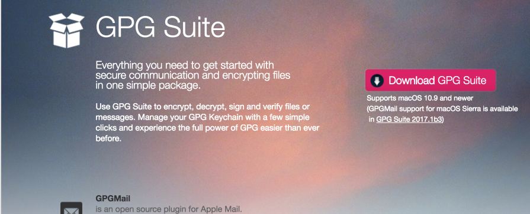

설치후, 실행을 해보시면 아래와 같은 화면이 출력됩니다.

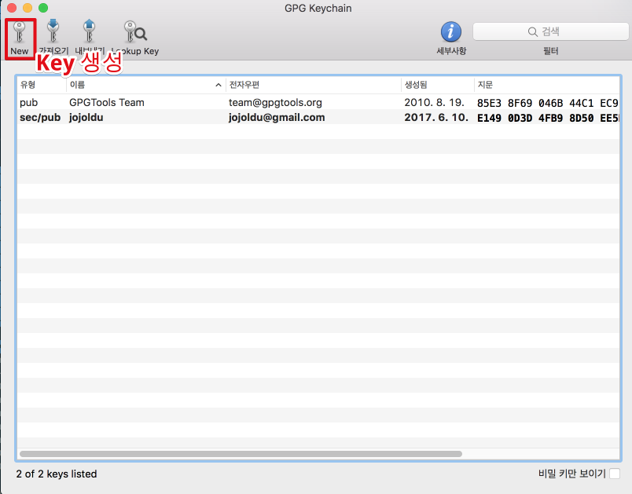

**New** 버튼으로 키를 생성합니다.

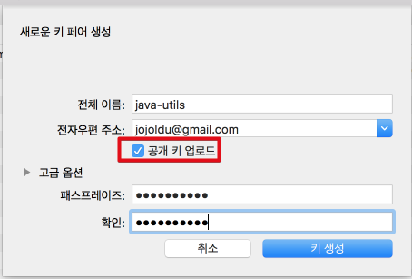

(이때, 공개키 업로드를 해야만 하니 꼭! 공개키 업로드를 체크해주세요)  
방금 생성한 키를 우클릭하여 **복사**를 클릭합니다.  

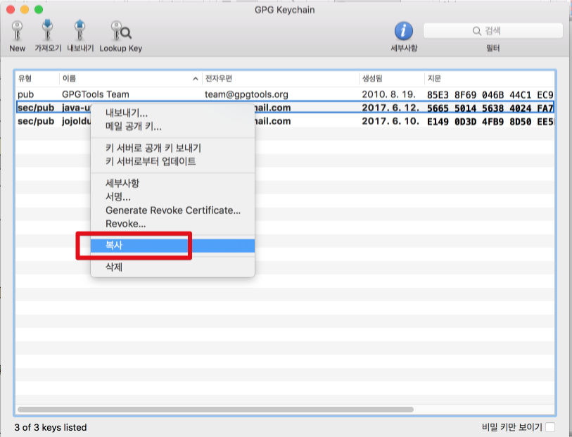

이 내용을 bintray 본인 계정에 등록해야합니다.  
bintray 페이지의 우측 상단 프로필 영역에서 **Edit Profile**을 클릭합니다.  
그리고 좌측 사이드 영역에 있는 **GPG Signing**을 클릭합니다.

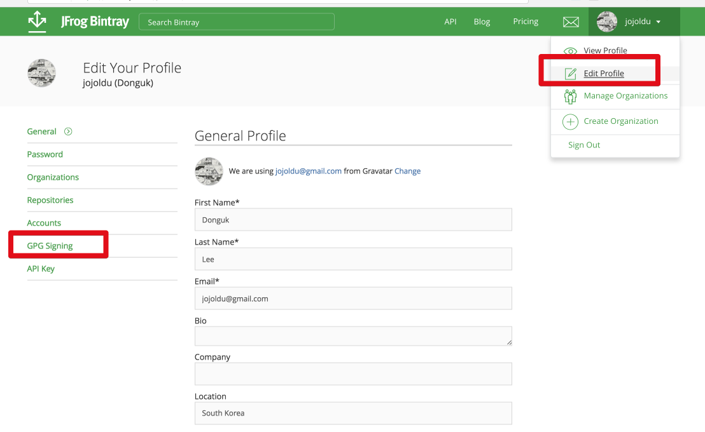

방금 복사한 키를 붙여넣기 합니다.

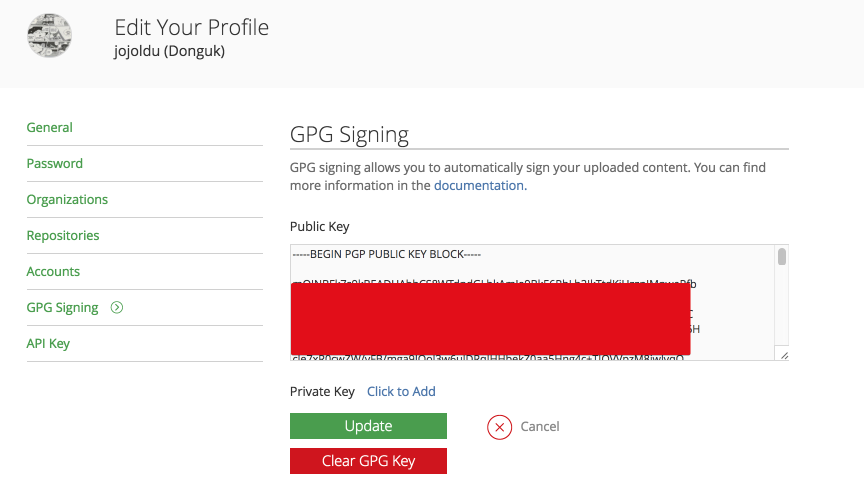

GPG 키 등록이 끝났습니다.  
이제 본인이 생성한 프로젝트의 pom.xml로 이동하겠습니다.

### 3. pom.xml

bintray에 라이브러리 업로드를 할 수 있도록 maven pom.xml 설정을 진행합니다.  
bintray 업로드 외 설정은 생략하였으니, 본인의 취향에 맞게 설정을 추가하시면 됩니다.  
(자세한 설정은 [Github](https://github.com/jojoldu/enum-mapper/blob/master/pom.xml)을 참고하세요!)

```
<?xml version="1.0" encoding="UTF-8"?>
<project xmlns="http://maven.apache.org/POM/4.0.0"
         xmlns:xsi="http://www.w3.org/2001/XMLSchema-instance"
         xsi:schemaLocation="http://maven.apache.org/POM/4.0.0 http://maven.apache.org/xsd/maven-4.0.0.xsd">
    <modelVersion>4.0.0</modelVersion>

    <groupId>com.github.jojoldu</groupId>
    <artifactId>enum-mapper</artifactId>
    <version>0.0.1</version>

    <name>Enum Mapper</name>
    <description>A Java enum mapper library for UI Layer(Select box, Radio Box, etc..) </description>
    <url>https://github.com/jojoldu/enum-mapper</url>

    <licenses>
        <license>
            <name>apache-2.0</name>
            <url>https://opensource.org/licenses/Apache-2.0</url>
            <distribution>repo</distribution>
        </license>
    </licenses>

    <scm>
        <url>https://github.com/jojoldu/enum-mapper</url>
    </scm>

    <distributionManagement>
        <repository>
            <id>enum-mapper</id>
            <url>https://api.bintray.com/maven/{bintray계정}/{bintray 저장소명}/{bintray 패키지명}/;publish=1</url>
        </repository>
    </distributionManagement>

    <properties>
        <java.version>1.8</java.version>
        <project.build.sourceEncoding>UTF-8</project.build.sourceEncoding>
        <bintray.repo>jojoldu/java-utils</bintray.repo>
        <bintray.package>enum-mapper</bintray.package>
    </properties>

    <build>
        <pluginManagement>
            <plugins>
                <plugin>
                    <groupId>org.apache.maven.plugins</groupId>
                    <artifactId>maven-compiler-plugin</artifactId>
                    <configuration>
                        <source>1.8</source>
                        <target>1.8</target>
                    </configuration>
                </plugin>
                <plugin>
                    <groupId>org.apache.maven.plugins</groupId>
                    <artifactId>maven-jar-plugin</artifactId>
                    <version>2.3.2</version>
                </plugin>
                <plugin>
                    <groupId>org.apache.maven.plugins</groupId>
                    <artifactId>maven-source-plugin</artifactId>
                    <version>2.1.2</version>
                </plugin>
                <plugin>
                    <artifactId>maven-javadoc-plugin</artifactId>
                    <version>2.9.1</version>
                    <executions>
                        <execution>
                            <id>attach-javadocs</id>
                            <phase>verify</phase>
                            <goals>
                                <goal>jar</goal>
                            </goals>
                        </execution>
                    </executions>
                </plugin>
            </plugins>
        </pluginManagement>
    </build>

    <dependencies>
        ...
    </dependencies>
</project>
```

제가 설정한 코드이기 때문에 본인의 라이브러리에 맞게 바꿔주시면 됩니다.  

* jojoldu : bintray 계정명
* java-utils : bintray 저장소명
* enum-mapper : bintray 패키지명

로 생각하시고 코드를 변경하시면 됩니다.  
이것만 가지고 maven 설정이 끝난것은 아닙니다.  
결국 업로드를 위해서 **API Key와 같은 부분을 설정**해야하는데, 이를 pom.xml에 등록하면 Github에 Key가 노출되므로 로컬의 **settings.xml**을 사용하겠습니다.

### 4. settings.xml 설정

로컬 PC에 Maven이 설치되어있다는 가정하에 시작합니다.  
터미널을 열어 아래와 같은 명령어를 입력합니다.  

```
vim ~/.m2/settings.xml
```

settings.xml이 기존에 생성되있으신 분들도 계실테고, 아니신 분들도 계실텐데 없다면 생성까지 진행되니 걱정안하셔도 될것 같습니다.  
settings.xml에 아래 내용을 추가하시면 됩니다.  
(아래는 전체 settings.xml 내용입니다. 이미 있으신 분들은 ```<servers>```, ```<profiles>```, ```<activeProfiles>``` 만 붙여넣으시면 됩니다.)

```
 1 <?xml version='1.0' encoding='UTF-8'?>
  2 <settings xsi:schemaLocation='http://maven.apache.org/SETTINGS/1.0.0 http://maven.apache.org/xsd/settings-1.0.0.xsd'
  3           xmlns='http://maven.apache.org/SETTINGS/1.0.0' xmlns:xsi='http://www.w3.org/2001/XMLSchema-instance'>
  4     <servers>
  5         <server>
  6             <id>enum-mapper</id>
  7             <username>{bintray 계정명}</username>
  8             <password>{bintray API Key}</password>
  9         </server>
 10     </servers>
 11     <profiles>
 12         <profile>
 13             <repositories>
 14                 <repository>
 15                     <snapshots>
 16                         <enabled>false</enabled>
 17                     </snapshots>
 18                     <id>central</id>
 19                     <name>bintray</name>
 20                     <url>http://jcenter.bintray.com</url>
 21                 </repository>
 22             </repositories>
 23             <pluginRepositories>
 24                 <pluginRepository>
 25                     <snapshots>
 26                         <enabled>false</enabled>
 27                     </snapshots>
 28                     <id>central</id>
 29                     <name>bintray-plugins</name>
 30                     <url>http://jcenter.bintray.com</url>
 31                 </pluginRepository>
 32             </pluginRepositories>
 33             <id>bintray</id>
 34         </profile>
 35     </profiles>
 36     <activeProfiles>
 37         <activeProfile>bintray</activeProfile>
 38     </activeProfiles>
 39 </settings>
```

이 코드에서 변경하실 내용은 ```<servers>``` 입니다.  
id는 pom.xml에서 등록한 id를 사용하셔야 합니다.


API Key의 경우 bintray -> Edit Profile -> API Key에서 확인하실수 있습니다.

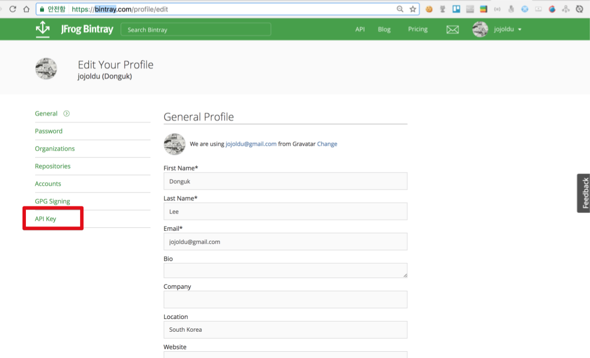

해당 key를 복사해서 ```<password>```에 입력해주시면 됩니다.  
  
설정이 완료 되셨으면 이제 bintray에 라이브러리를 업로드 해보겠습니다.

### 5. deploy

pom.xml이 있는 프로젝트에서 터미널을 열어 아래의 명령어를 입력합니다.

```
mvn clean deploy
```

정상적으로 진행되시면 아래와 같은 결과가 출력됩니다.

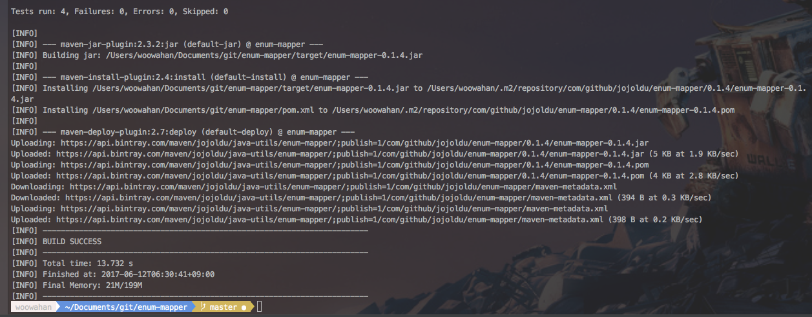

bintray의 패키지 페이지로 가보시면!

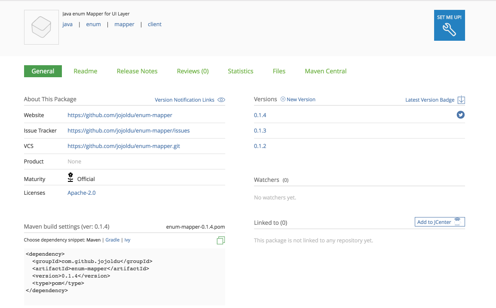

성공적으로 등록된 것을 확인할 수 있습니다.  
여기까지는 maven 라이브러리 관리 대행인 **bintray에 업로드** 하는 과정이였습니다.  
이걸 직접 [maven repository](https://mvnrepository.com)에서 검색하거나 패키지 다운로드를 진행하려면 jcenter 혹은 maven central에 등록이 되어야 합니다.  
직접 업로드 할 필요 없이 bintray의 링크를 이용하여 아주 쉽게 진행하겠습니다.

### 6. jcenter link

방금전 확인한 bintray 패키지 관리 페이지의 우측 하단을 보시면 **Add to JCenter** 버튼이 보이실것입니다.

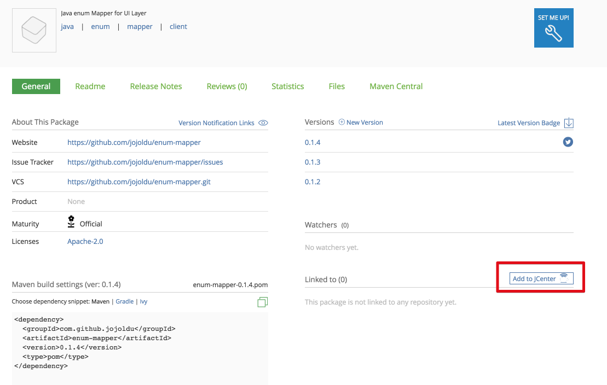

이걸 클릭하시면 제출 페이지가 등장하는데 **send** 버튼을 클릭하시면 JCenter와 현재 패키지 동기화 요청이 진행됩니다.

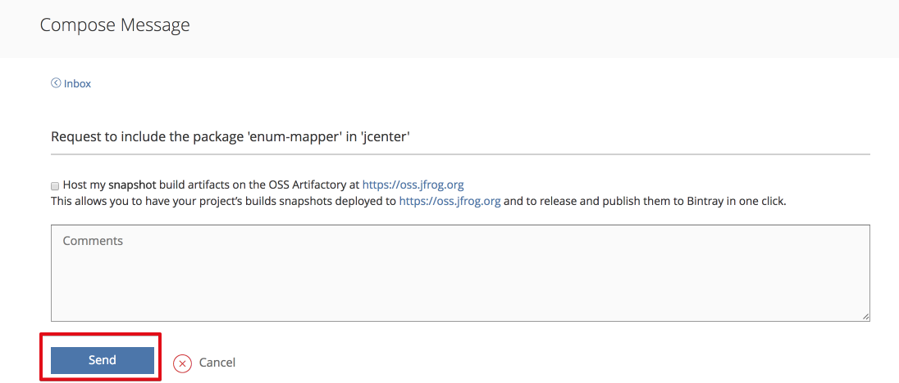

관리자 승인이 필요한데, 보통 시차때문에 밤 12시쯤 승인이 되니 느긋한 마음으로 기다립니다.  
(JetBrains도 그렇고 밤 12시에 승인되는 곳이 많아 밤잠 설칠일이 많네요ㅠ)  


### 7. maven central link

maven central과 link 하는 것은 패키지가 link 되는 것이 아니라, **jcenter와 maven central이 링크**되는 것입니다.  
그래서 패키지가 jcenter와 링크되기 전까지는 maven central과 링크가 되지 않으니 유의해주세요.  


## 참고

* [lesstif님의 위키](https://www.lesstif.com/pages/viewpage.action?pageId=30277671#id-메이븐중앙저장소에아티팩트업로딩-maven-uploadingartifacttocentralrepository-deploy.1)

* [stunstun님의 블로그](http://stunstun.tistory.com/230)

* [bintray blog](https://blog.bintray.com/2015/09/17/publishing-your-maven-project-to-bintray/)

* [bintray docs](https://bintray.com/docs/usermanual/uploads/uploads_syncingwiththirdpartyplatforms.html#_syncing_artifacts_with_maven_central)