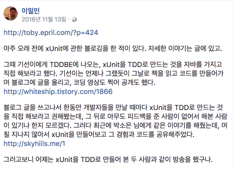
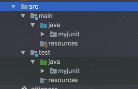

# my-junit

안녕하세요? 이번 시간엔 JUnit을 직접 만들어보는 시간을 가지려고 합니다.  
모든 코드는 [Github](https://github.com/jojoldu/blog-code/tree/master/my-junit)에 있기 때문에 함께 보시면 더 이해하기 쉬우실 것 같습니다.  
(공부한 내용을 정리하는 [Github](https://github.com/jojoldu/blog-code)와 세미나+책 후기를 정리하는 [Github](https://github.com/jojoldu/review), 이 모든 내용을 담고 있는 [블로그](http://jojoldu.tistory.com/)가 있습니다. )<br/>
 

## 계기

긴 추석연휴 기간동안 미뤄둔 포스팅 예정 글들을 다 정리했습니다.  
3개를 연달아 처리하고 뭐가 더 남았나 에버노트를 보다가 아주 예전에 메모해놓은 일감이 있었습니다.  
  
예전에 토비님께서 페이스북에 올리신 글입니다.



(원분 : [페이스북링크](https://www.facebook.com/tobyilee/posts/10208774948625630))  
  
일단 회사에서 사용하는 기술들을 익히기에 급급해 계속 미루다가 이제야 다시 봤습니다.  


## 본문

빌드툴은 Gradle을 사용할 예정입니다.  
IDE는 IntelliJ 를 사용하는데, 스프링이나 웹 개발이 필요한 부분이 아니기 때문에 꼭 유료버전인 Ultimate이 아니더라도 무료 버전인 Community 버전을 사용하셔도 됩니다.  
(이클립스 쓰셔도 됩니다)  
  
build.gradle은 로그 관리를 위해 2개의 의존성을 먼저 추가하고 시작하겠습니다.  

build.gradle

```gradle
dependencies {
    compile group: 'org.slf4j', name: 'slf4j-api', version: '1.7.25' // log를 위해 slf4j 추가
    compile group: 'ch.qos.logback', name: 'logback-classic', version: '1.2.3' // log를 위해 logback 추가
}
```

혹시나 logback을 처음 접하신다면 [소내기님의 logback 튜토리얼](https://sonegy.wordpress.com/category/logback/)을 참고하시면 좋습니다.  
  
기본적인 디렉토리 구조는 다음과 같습니다.



src/main/java,resources & src/test/java,resources이며 기본 패키지는 myjunit입니다.  
  
자 그럼 첫번째 테스트 코드를 작성해보겠습니다.

### 1. 첫 테스트 코드


### 2. TestCase 

```java

public abstract class TestCase {

    protected String methodName;

    public TestCase(String methodName) {
        this.methodName = methodName;
    }

    public abstract void run();
}

```


## 참고

* [테스팅 프레임워크는 직접 만들어 써보자 - 토비님 블로그](http://toby.epril.com/?p=424)
* [[번역]JUnit A Cook’s Tour](https://bluepoet.me/2016/12/03/%EB%B2%88%EC%97%ADjunit-a-cooks-tour/)
* [Collecting Parameter 패턴](http://www.javajigi.net/display/SWD/Move+Accumulation+to+Collecting+Parameter)
* [Composite 패턴](https://ko.wikipedia.org/wiki/%EC%BB%B4%ED%8F%AC%EC%A7%80%ED%8A%B8_%ED%8C%A8%ED%84%B4)
* [Template Method 패턴](http://jdm.kr/blog/116)