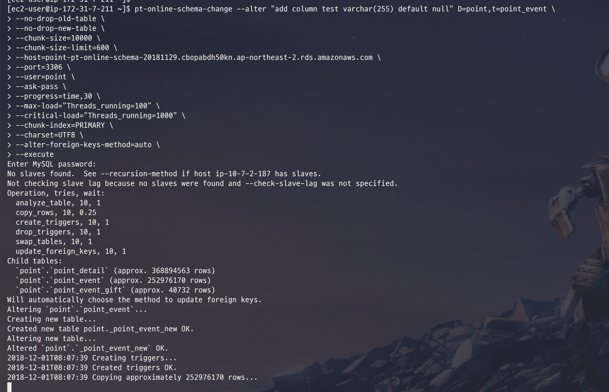

# Mysql Percona pt-online-schema-change

Mysql 대량 테이블 업데이트를 위한 pt-online-schema-change 정리

## 1. 설치

pt-online-schema-change의 스크립트는 perl 기반입니다.  
그래서 perl에 관련된 패키지들을 설치하겠습니다.  
아래 스크립트들을 차례로 실행시켜주세요.

### Perl 패키지 설치

```bash
sudo yum install perl-DBI
```

```bash
sudo yum install perl-DBD-MySQL
```

```bash
sudo yum install perl-TermReadKey
```

```bash
sudo yum install perl perl-IO-Socket-SSL perl-Time-HiRes
```

```bash
sudo yum install perl-devel
```

### percona-toolkit 설치

perl 관련 패키지들이 모두 설치되셨다면, percona-toolkit을 설치합니다.  
실제로 pt-online-schema-change 을 실행할 스크립트를 설치한다고 보시면 됩니다.  
  
보통 ```.rpm```, ```.deb``` 파일을 받아서 즉시 설치하면 되지만, 이 글을 쓰는 시점에서 ```.rpm``` 설치가 안되어 ```tar.gz``` 파일로 대체해서 진행하겠습니다.

```bash
wget percona.com/get/percona-toolkit.tar.gz
```

```bash
tar xzvf percona-toolkit.tar.gz
```

```bash
perl ./Makefile.PL
```

```bash
make
```

```bash
sudo make install
```

대략 이런식의 설치 로그가 출력됩니다.

```bash
Installing /usr/local/share/man/man1/pt-config-diff.1p
Installing /usr/local/share/man/man1/pt-deadlock-logger.1p
Installing /usr/local/share/man/man1/pt-table-checksum.1p
Installing /usr/local/share/man/man1/pt-kill.1p
Installing /usr/local/share/man/man1/pt-duplicate-key-checker.1p
Installing /usr/local/share/man/man1/pt-summary.1p
Installing /usr/local/share/man/man1/pt-index-usage.1p
Installing /usr/local/share/man/man1/pt-visual-explain.1p
Installing /usr/local/share/man/man1/pt-sift.1p
Installing /usr/local/share/man/man1/pt-online-schema-change.1p
Installing /usr/local/share/man/man1/pt-slave-restart.1p
Installing /usr/local/share/man/man1/pt-show-grants.1p
Installing /usr/local/share/man/man1/pt-upgrade.1p
Installing /usr/local/bin/pt-mysql-summary
Installing /usr/local/bin/pt-variable-advisor
Installing /usr/local/bin/pt-table-checksum
Installing /usr/local/bin/pt-mongodb-summary
Installing /usr/local/bin/pt-slave-find
Installing /usr/local/bin/pt-pmp
Installing /usr/local/bin/pt-duplicate-key-checker
Installing /usr/local/bin/pt-index-usage
Installing /usr/local/bin/pt-diskstats
Installing /usr/local/bin/pt-mongodb-query-digest
Installing /usr/local/bin/pt-find
Installing /usr/local/bin/pt-upgrade
Installing /usr/local/bin/pt-config-diff
Installing /usr/local/bin/pt-slave-delay
Installing /usr/local/bin/pt-summary
Installing /usr/local/bin/pt-slave-restart
Installing /usr/local/bin/pt-stalk
Installing /usr/local/bin/pt-secure-collect
Installing /usr/local/bin/pt-fk-error-logger
Installing /usr/local/bin/pt-sift
Installing /usr/local/bin/pt-align
Installing /usr/local/bin/pt-table-sync
Installing /usr/local/bin/pt-query-digest
Installing /usr/local/bin/pt-online-schema-change
Installing /usr/local/bin/pt-mext
Installing /usr/local/bin/pt-visual-explain
Installing /usr/local/bin/pt-kill
Installing /usr/local/bin/pt-archiver
Installing /usr/local/bin/pt-fingerprint
Installing /usr/local/bin/pt-heartbeat
Installing /usr/local/bin/pt-fifo-split
Installing /usr/local/bin/pt-deadlock-logger
Installing /usr/local/bin/pt-table-usage
Installing /usr/local/bin/pt-ioprofile
Installing /usr/local/bin/pt-show-grants
Appending installation info to /usr/lib64/perl5/perllocal.pod
```

```bash
# bashrc을 열어서
vim ~/.bashrc

# 아래 코드를 등록합니다.
alias pt-online-schema-change="/home/ec2-user/percona-toolkit-3.0.12/bin/pt-online-schema-change"
```


## 2. 사용

```bash
pt-online-schema-change --alter "변경할 Alter 정보" D=데이터베이스,t=테이블명 \
--no-drop-old-table \
--no-drop-new-table \
--chunk-size=500 \
--chunk-size-limit=600 \
--defaults-file=/etc/my.cnf \
--host=127.0.0.1 \
--port=3306 \
--user=root \
--ask-pass \
--progress=time,30 \
--max-load="Threads_running=100" \
--critical-load="Threads_running=1000" \
--chunk-index=PRIMARY \
--charset=UTF8 \
--alter-foreign-keys-method=auto \
--execute
```

예를 들어 실제 데모로 진행해본다면 다음과 같이 실행해볼 수 있습니다.

```bash
pt-online-schema-change --alter "add column test varchar(255) default null" D=point,t=point_event \
--no-drop-old-table \
--no-drop-new-table \
--chunk-size=10000 \
--chunk-size-limit=600 \
--host=point-pt-online-schema-20181129.cbopabdh50kn.ap-northeast-2.rds.amazonaws.com \
--port=3306 \
--user=point \
--ask-pass \
--progress=time,30 \
--max-load="Threads_running=100" \
--critical-load="Threads_running=1000" \
--chunk-index=PRIMARY \
--charset=UTF8 \
--alter-foreign-keys-method=auto \
--execute 
```



요렇게 %가 올라가는 로그를 보실 수 있습니다.


## 참고


