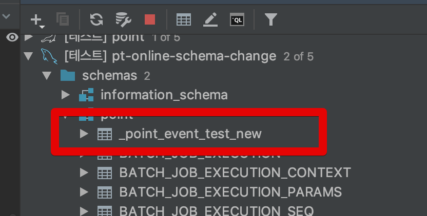
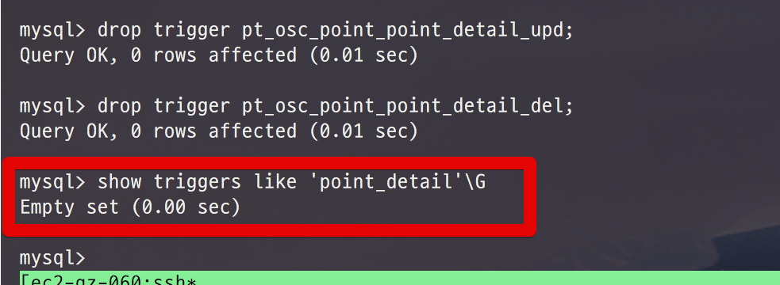

# Mysql Percona pt-online-schema-change

Mysql에서 몇억건 이상의 대량의 데이터를 갖고 있는 테이블을 ```update``` 하는것은 쉬운일이 아닙니다.  
단순히 ```alter table```을 해버리면 4시간, 5시간 이상 수행되기 떄문인데요.  
이를 해결 하기 위해 ```create select``` 방법을 사용하곤 합니다.  

> 참고: [MySQL 대용량 테이블 스키마 변경하기](https://jojoldu.tistory.com/244)

하지만 이 방법에는 큰 문제가 있는데요.  
FK (Foreign Key) 변경이 어렵습니다.  
**FK는 기존에 맺어져있던 테이블에 계속 유지**되기 떄문입니다.  
  
이외에도 여러 문제들이 있는데, 이를 해결하기 위해 percona의 pt-online-schema-change을 사용할때가 많습니다.  
이번 시간에는 이 pt-online-schema-change 사용법을 정리하겠습니다.

> percona는 XtraBackup 등 Mysql 을 운영하기 위한 여러 툴을 제공하는 회사입니다.  
[사이트](https://www.percona.com)


## 1. 설치

pt-online-schema-change 스크립트는 공식 사이트에서 rpm 파일을 제공합니다.  
rpm 파일이 간혹 설치가 안될때가 있습니다.  
그럴때를 대비해 여기서는 ```tar.gz```로 설치하는 방법을 소개드리겠습니다.  
  
pt-online-schema-change의 스크립트는 **perl 기반**입니다.  
그래서 perl에 관련된 패키지들을 설치하겠습니다.  
아래 스크립트들을 차례로 실행시켜주세요.

### Perl 패키지 설치

```bash
sudo yum install perl-DBI
```

```bash
sudo yum install perl-DBD-MySQL
```

```bash
sudo yum install perl-TermReadKey
```

```bash
sudo yum install perl perl-IO-Socket-SSL perl-Time-HiRes
```

```bash
sudo yum install perl-devel
```

### percona-toolkit 설치

perl 관련 패키지들이 모두 설치되셨다면, percona-toolkit을 설치합니다.  
pt-online-schema-change 을 실행할 스크립트를 설치한다고 보시면 됩니다.  
  
보통 ```.rpm```, ```.deb``` 파일을 받아서 즉시 설치하면 되지만, 이 글을 쓰는 시점에서 ```.rpm``` 설치가 안되어 ```tar.gz``` 파일로 대체해서 진행하겠습니다.  
  
먼저 tar 파일을 다운 받습니다.

```bash
wget percona.com/get/percona-toolkit.tar.gz
```

다은 받은 파일의 압축을 해제합니다.

```bash
tar xzvf percona-toolkit.tar.gz
```

압축이 해제된 폴더로 이동합니다.


```bash
cd percona-toolkit-3.0.12
```

그리고 아래 3개 스크립트로 install을 시작합니다.

```bash
perl ./Makefile.PL
make
sudo make install
```

대략 이런식의 설치 로그가 출력됩니다.

```bash
Installing /usr/local/share/man/man1/pt-config-diff.1p
Installing /usr/local/share/man/man1/pt-deadlock-logger.1p
Installing /usr/local/share/man/man1/pt-table-checksum.1p
Installing /usr/local/share/man/man1/pt-kill.1p
Installing /usr/local/share/man/man1/pt-duplicate-key-checker.1p
Installing /usr/local/share/man/man1/pt-summary.1p
Installing /usr/local/share/man/man1/pt-index-usage.1p
Installing /usr/local/share/man/man1/pt-visual-explain.1p
Installing /usr/local/share/man/man1/pt-sift.1p
Installing /usr/local/share/man/man1/pt-online-schema-change.1p
Installing /usr/local/share/man/man1/pt-slave-restart.1p
Installing /usr/local/share/man/man1/pt-show-grants.1p
Installing /usr/local/share/man/man1/pt-upgrade.1p
Installing /usr/local/bin/pt-mysql-summary
Installing /usr/local/bin/pt-variable-advisor
Installing /usr/local/bin/pt-table-checksum
Installing /usr/local/bin/pt-mongodb-summary
Installing /usr/local/bin/pt-slave-find
Installing /usr/local/bin/pt-pmp
Installing /usr/local/bin/pt-duplicate-key-checker
Installing /usr/local/bin/pt-index-usage
Installing /usr/local/bin/pt-diskstats
Installing /usr/local/bin/pt-mongodb-query-digest
Installing /usr/local/bin/pt-find
Installing /usr/local/bin/pt-upgrade
Installing /usr/local/bin/pt-config-diff
Installing /usr/local/bin/pt-slave-delay
Installing /usr/local/bin/pt-summary
Installing /usr/local/bin/pt-slave-restart
Installing /usr/local/bin/pt-stalk
Installing /usr/local/bin/pt-secure-collect
Installing /usr/local/bin/pt-fk-error-logger
Installing /usr/local/bin/pt-sift
Installing /usr/local/bin/pt-align
Installing /usr/local/bin/pt-table-sync
Installing /usr/local/bin/pt-query-digest
Installing /usr/local/bin/pt-online-schema-change
Installing /usr/local/bin/pt-mext
Installing /usr/local/bin/pt-visual-explain
Installing /usr/local/bin/pt-kill
Installing /usr/local/bin/pt-archiver
Installing /usr/local/bin/pt-fingerprint
Installing /usr/local/bin/pt-heartbeat
Installing /usr/local/bin/pt-fifo-split
Installing /usr/local/bin/pt-deadlock-logger
Installing /usr/local/bin/pt-table-usage
Installing /usr/local/bin/pt-ioprofile
Installing /usr/local/bin/pt-show-grants
Appending installation info to /usr/lib64/perl5/perllocal.pod
```

설치가 다 되셨다면, 전역에서 실행할 수 있게 ```.bashrc```에 등록하겠습니다.

```bash
# bashrc을 열어서
vim ~/.bashrc

# 아래 코드를 등록합니다.
alias pt-online-schema-change="/home/ec2-user/percona-toolkit-3.0.12/bin/pt-online-schema-change"
```


여기까지 하셨다면 모든 작업이 끝났습니다!

## 2. 사용

아래의 명령어로 사용할 수 있습니다.

```bash
pt-online-schema-change --alter "변경할 Alter 정보" D=데이터베이스,t=테이블명 \
--no-drop-old-table \
--no-drop-new-table \
--chunk-size=500 \
--chunk-size-limit=600 \
--defaults-file=/etc/my.cnf \
--host=127.0.0.1 \
--port=3306 \
--user=root \
--ask-pass \
--progress=time,30 \
--max-load="Threads_running=100" \
--critical-load="Threads_running=1000" \
--chunk-index=PRIMARY \
--charset=UTF8 \
--alter-foreign-keys-method=auto \
--preserve-triggers
--execute
```

* ```--no-drop-old-table```
    * 마이그레이션 후, 기존 테이블을 삭제 하지 않겠다는 옵션 입니다.
* 
* ```--charset=UTF8```
    * 필수로 넣으셔야 합니다.
    * 안넣을 경우 한글명 데이터들이 이관하면서 깨지는 경우가 생깁니다.

옵션의 대부분은 이름만 보셔도 알 수 있는데요.  
좀 더 자세한 설명을 원하시면 [percona toolkit - pt-online-schema-change 옵션 정리](http://notemusic.tistory.com/44)을 참고해보시면 됩니다.  
  
예를 들어 실제 데모로 진행해본다면 다음과 같이 실행해볼 수 있습니다.

```bash
pt-online-schema-change --alter "add column test varchar(255) default null" D=point,t=point_detail \
--no-drop-old-table \
--chunk-size=500 \
--chunk-size-limit=600 \
--host=point-pt-online-schema-20181129.cbopabdh50kn.ap-northeast-2.rds.amazonaws.com \
--port=3306 \
--user=point \
--ask-pass \
--progress=time,30 \
--charset=UTF8 \
--alter-foreign-keys-method=auto \
--preserve-triggers
--execute 
```


요렇게 %가 올라가는 로그를 보실 수 있습니다.


## 3. 삭제 및 재시작

위에서 사용한 ```--no-drop-new-table``` 으로 인해 작업 도중 중지시킨다면 다음과 같이 새 테이블이 그대로 남게 됩니다.

아래처럼 새롭게 생성된 테이블들을 삭제합니다.



추가로 트리거도 생성 되었기 때문에 아래와 같이 오류가 발생하면서 재실행이 안될것입니다.


이럴 경우 pt-online-schema-change로 생성된 트리거를 확인하고 **강제로 삭제**하면 됩니다.  
아래와 같이 트리거 목록을 확인하신 뒤,


```sql
show triggers like 'table이름'\G
```

prefix로 ```pt_```가 붙은 트리거들을 모두 삭제합니다.



```sql
drop trigger trigger이름;
```

해당 테이블에 더이상 트리거가 보이지 않는다면 다 삭제가 되었으니 다시 실행해보시면 됩니다.

## 속도

* EC2에서 RDS로 remote로 명령어 실행
    * 네트워크 통신을 통해 진행
    * MySQL **서버에서 직접 실행하는 것보다는 전반적으로 속도가 느림**
* chunk-size=1000 기준
* Replication 되어 있는 상태

### 1600만건 / FK X

* 약 12분 소요
* RDS CPU 약 17% 유지
  


### 1600만건 / FK O

* 
## 참고

설정에 관한 자세한 내용은 이미 다른분께서 모든 옵션을 번역해주셨기 때문에 이를 참고하시는걸 추천드립니다.

* [소소한 데이터 이야기 – pt-online-schema-change 편](http://gywn.net/2017/08/small-talk-pt-osc/)