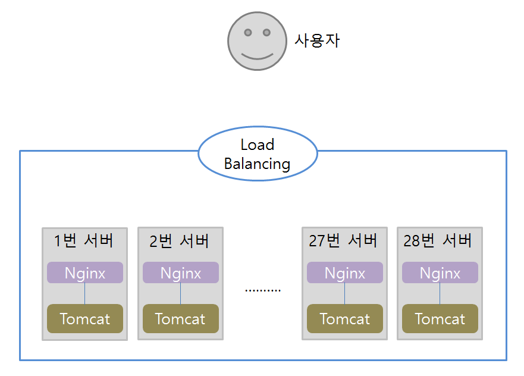
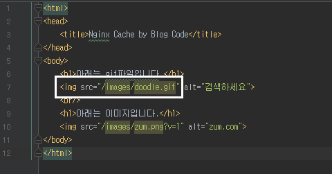
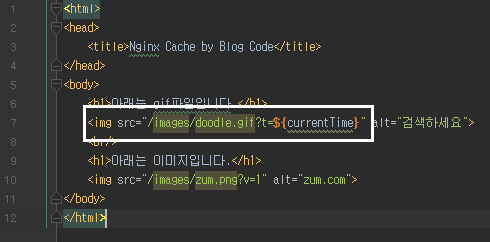
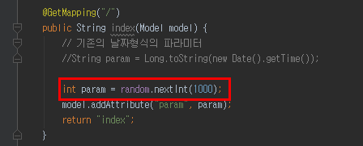
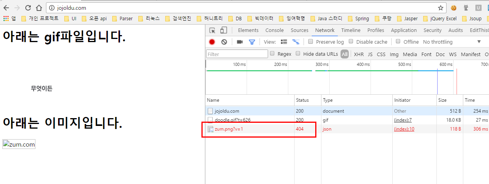
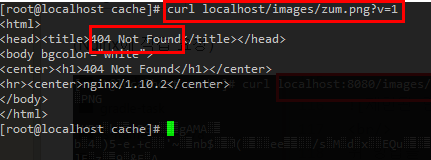
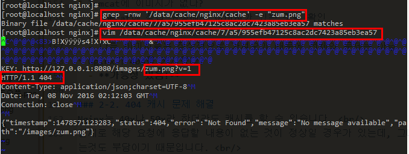
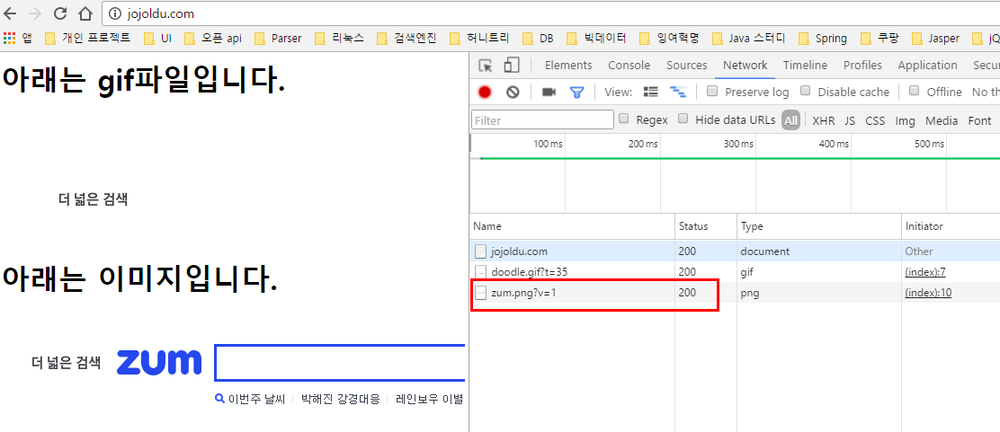

# Nginx 리버스 프록시
안녕하세요? <br/>
저는 [zum.com](http://zum.com/)의 메인페이지 운영 및 개발을 담당하는 포털개발팀의 이동욱입니다. <br/>
이번 시간에는 제가 최근에 zum.com을 운영하면서 실수했었던 내용들 중, Nginx에 관련된 내용들을 정리하였습니다. <br/>
(Nginx외에도 정말 많은 실수를 했지만 이번엔 Nginx만 하였습니다^^;) <br/>

본문 시작전에 간단히 zum.com의 서버구조를 소개드리면, <br/>



<p align="center">(아주 간단하게 그린 줌닷컴 구조)</p><br/><br/>

L4를 Load Balancer로 사용하여 28대의 서버에 균등하게 요청을 분배하고 있습니다. <br/>
이때 각 서버는 Nginx와 Tomcat을 함께 가지고 있으며, Nginx를 **리버스 프록시 서버**로 사용하고 있습니다. <br/><br/>
**리버스 프록시 서버란?** <br/>
일정 수준 이상의 규모를 가진 웹 서비스에서는 웹 서버(Nginx)와 웹 어플리케이션 서버 (Tomcat)를 분리하여 웹 서버를 프록시 서버로 두어 **사용자의 요청을 캐시하여** 동일한 요청이 오면 웹 어플리케이션 서버에 전달하지 않고 웹 서버에 캐시된 내용을 바로 전달하도록 하여 성능상의 이점을 얻기 위해 사용합니다.<br/>
예를 들어 zum.com이란 도메인의 요청이 오게되면 리버스 프록시 서버(Nginx)에서 해당 요청을 받아 캐시된 데이터가 있다면 캐시된 데이터를 바로 전달하고, 없다면 Tomcat에 처리를 의뢰 하는 것을 얘기합니다. <br/>
여기서 얘기하는 리버스는 **역전** 이 아닌 **뒷쪽** 이란 뜻입니다.<br/>
자세한 내용은 [joinc님의 포스팅](http://www.joinc.co.kr/w/man/12/proxy)을 참조하시면 더욱 이해하기 쉬우실 것 같습니다. <br/>

### 시작 전에..
아래에서 사용한 예제 코드의 경우 모두 [Github](https://github.com/jojoldu/blog-code/tree/master/server/nginx-cache)에서 확인할 수 있으며, 내용들은 모두 제 [개인 블로그](http://jojoldu.tistory.com/)에도 동시 포스팅 되었음을 미리 말씀드립니다. <br/>
예제를 실행하기 위해선 Java8, Nginx, CentOS가 설치되어 있어야만 합니다. <br/>
혹시나 Nginx가 설치되어있는지 확인이 필요하다면 아래와 같은 명령어로 확인이 가능합니다. <br/>

**Nginx 실행여부 확인**
```
ps auxww |grep nginx
```

<br/>
위와 같이 master process와 worker process가 표시된다면 현재 nginx가 서버에서 구동중입니다. 구동중인 nginx 프로세스가 없다면 설치를 하시면 됩니다.<br/><br/>
모든 예제는 실제 서비스와 유사한 형태의 코드로 작성하였습니다. <br/>
문제 자체를 이해하는데는 오히려 실제 서비스 코드보다 간략화된 예제코드가 더 쉽게 이해될 것 같습니다. <br/>
하나하나 문제가 되었던 사건들을 소개하겠습니다. <br/>

### 1-1. 캐시 파라미터 문제
최근 zum.com에서는 두들 캠페인을 진행하였습니다. <br/>


(화면 좌측의 더 넓은 검색 부분입니다.)<br/><br/>
사용자가 zum.com을 방문시 gif 파일을 통해 애니메이션이 시작하도록 하는 캠페인이였습니다. <br/>
기능에 대한 상세 기능은 아래와 같습니다.

* 사용자가 방문할때마다 애니메이션이 **새로** 시작되어야 한다.
* 애니메이션이 끝나면 **새로고침 해야만** 다시 애니메이션이 시작되어야 한다.

보기엔 크게 문제가 없어보이는 기능이라, 코드는 아래와 같이 작성하였습니다. <br/>


<br/>
어려울것 하나 없는 기능이기에 바로 코드를 수정하고 개발서버에서 테스트를 진행하는데, 이상하게도 **새로고침하면 gif 애니메이션이 시작하지 않았습니다.**


(엉엉 ㅠㅠㅠ)<br/><br/>
이유를 찾아보니 gif의 경우 웹 브라우저에 **캐시 된 이후에는 애니메이션의 마지막 이미지만** 볼 수 있던 것입니다. <br/>
1회성 애니메이션은 기획상 안됐기에, 결국 **새로고침 할때마다 gif를 새로 부르는 수밖에** 없다는 결론을 내렸습니다. <br/>
그래서 아주 간단하게 다음과 같이 호출 시간을 파라미터로 하도록 코드를 수정하였습니다.


<br/>
현재시간을 파라미터 t에 할당하여 호출하도록 하였습니다. <br/>
이렇게 될 경우 매번 호출때마다 **현재 시간을 사용하므로 파라미터가 달라져 브라우저 캐시를 회피** 할 수 있으며, 계속해서 새롭게 gif 파일을 호출할 수 있습니다. <br/>
기능 작동과 QA서버 테스트를 마치고 실서버 배포후 가벼운 마음으로 퇴근한 저는 3시간만에 다시 회사로 복귀하게 되었습니다.<br/>
어떤 문제 때문에 저녁에 다시 출근하게 된 것일까요?<br/><br/>
웹 서버를 조금이라도 운영해보신 분들은 현재 저 코드가 어마어마한 문제를 안고 있다는 것을 알고 계실 것입니다. <br/>

일반적으로 웹 사이트는 성능상 이점을 얻기 위해 gif/image/css/js 등과 같은 **정적 자원(static resource)은 Nginx와 같은 웹 서버에서 캐시** 하여 Tomcat의 부담을 줄이고 있습니다. <br/>


(예제 Nginx 캐시 설정) <br/><br/>
이렇게 설정되었을 경우 Nginx에서는 css,js,gif,png,jpg,jpeg파일은 **전부 캐시를 하게 됩니다.** <br/>
저 전부라는 표현이 중요합니다. <br/>
즉, 바뀐 **파라미터에 따라 다 캐시하게 됩니다.** <br/>
한번 확인을 해보겠습니다. <br/>
서버의 ```/etc/nginx/nginx.conf``` 혹은 ```/etc/nginx/conf.d/proxy.conf``` 와 같이 설정파일을 열어 캐시 디렉토리 위치를 확인 후,


<p align="center">(여기 예제에서는 nginx.conf에 설정해두었습니다.)</p> <br/><br/>
캐시 파일 저장소로 지정된 ```/data/cache/nginx/cache```를 확인해보겠습니다. <br/>

```
grep -rnw '찾고자하는 디렉토리 위치' -e "찾는 텍스트명"
```


<br/>
doodle.gif파일만 조회하였는데 여러개가 매치된 것을 확인할 수 있습니다. <br/>
좀 더 극적으로 확인하기 위해 해당 프로젝트를 새로고침을 좀 더 해보겠습니다. <br/>
몇 번의 새로고침 후에 다시 조회 명령어를 입력하면! <br/>


<br/>
훨씬 더 많은 캐시파일이 만들어진 것을 확인할 수 있습니다. <br/>
해당 파일들을 하나하나 열어보시면 각 파일들의 key가 파라미터에 따라 다르다는 것을 확인할 수 있습니다. <br/>


즉, 일일 천만PV의 zum.com 서비스이기에 **쉴틈 없이 캐시파일이 생성되어 3시간만에 디스크의 용량이 가득차버린 것** 입니다. <br/>


(안돼!!)<br/><br/>

### 1-2. 캐시 파라미터 해결
위와 같은 문제를 해결하기 위해선 **gif파일을 Nginx에서 캐시하지 않도록 설정에서 제외** 하는 방법이 있습니다. <br/>
하지만 이 방법은 Tomcat의 부담이 너무나 커지기에 사용할 수 없습니다. <br/>
(혹시나 자사의 서비스가 gif파일이 많지 않고, 사용자가 많지 않다면 gif를 캐시 설정에서 제외하는 방법도 좋은 방법입니다.) <br/>
차안으로 생각한 방법이 1~1000의 랜덤한 숫자의 파라미터를 할당하는 것입니다. <br/>


<br/>
위 방법을 사용한 이유는 다음과 같습니다. <br/>
* 하루에 100회 이상 새로고침 하는 사용자가 많이 없기에 대부분의 사용자는 애니메이션이 재시작 되는 것을 확인 가능.
* Nginx에서 캐시되는 gif는 최대 1000개이므로, 실제 디스크에서 차지하는 양은 30MB (gif 크기가 약 30kb 이하) 이므로 크게 부담이 없음.
* 해당 gif는 정기적으로 교체될 것이니 사용자 브라우저의 캐시를 대부분 무시가능

적용한 이후로는 예상한대로 크게 디스크와 트래픽에 부담없이 두들(gif) 이벤트가 계속 진행중입니다. <br/>
완전한 해결책이라고 할수는 없지만 비슷한 고민이 있으시다면 대체제로 고려해볼만한 해결책이라고 생각합니다!


### 2-1. 404 캐시 문제
이번 문제는 404 캐시문제입니다. <br/>
zum.com의 신규 로고와 관련해서 전체적인 이미지 교체 작업을 진행후, 실서버에 배포를 하였는데 몇몇 이미지가 노출되지 않았습니다. <br/>
(여기서는 예제로 해당 이미지명을 **zum.png** 로 하겠습니다.) <br/>
개발자 도구를 통해 확인해 보니 해당 이미지 파일만 404이며, 다른 정적파일들은 모두 200을 전달하고 있었습니다. <br/>



<p align="center">(zum.png만 404)</p> <br/><br/>



(서버에서 Nginx에 직접 요청도 404)<br/>

QA서버에서 테스트시에는 문제가 없었기에, 실서버 Tomcat쪽에 문제가 있는건가 싶어 Tomcat에 직접 요청을 해보았습니다.


(Tomcat에 직접 요청)<br/>

Tomcat이 8080포트를 사용하고 있기에 (Nginx는 80포트) 직접 이미지를 호출하니 정상적으로 넘어오는 것이 확인되었습니다. <br/>

그렇다면 **Tomcat에서는 이미지를 정상적으로 넘겨주지만, Nginx에서 문제가 있는 것으로 추측** 됩니다. <br/>
하나하나 따져보겠습니다. <br/>
* Tomcat에 이미지가 없다?
  - Tomcat에 직접 요청해서 이미지가 있는 것을 확인
* Nginx 기능에 문제가 있다?
  - 다른 이미지들은 정상적으로 가져오기 때문에 전체의 문제는 아님
* Nginx가 404를 캐시했다?
  - **가능성 있음!**

<br/>
마지막 추측에 대해 생각해보았습니다. <br/>
Nginx는 40x나 50x라 하더라도 캐시를 할 수 있습니다. <br/>
실제로 해당 요청에 응답할 내용이 없는 것이 정상일 경우가 있는데, 그때마다 Tomcat에 요청 주는것도 부담이기 때문입니다. <br/>
위 가정을 검증하기 위해 zum.png 파일을 어떻게 캐시하고 있는지 확인해보겠습니다. <br/>
캐시 파일 저장소로 지정된 ```/data/cache/nginx/cache```를 아래 명령어로 검색해보면, <br/>

```
grep -rnw '찾고자하는 디렉토리 위치' -e "찾는 텍스트명"
```
<br/>


(zum.png를 캐시한 내용을 확인)<br/>
보시는 것처럼 **404 코드를 캐시** 한 것을 확인할 수 있습니다. <br/>
(위 명령어로 zum.png를 캐시한 파일을 검색하여, vim으로 오픈한 것입니다.)  <br/>

즉, Tomcat에 신규 버전이 배포되기 전에 서버에서 이미지를 호출하게 될 경우 Nginx에서는 이미지가 없는 상태인 404를 캐시하게 되고, **배포된 이후에도 캐시는 존재하기 때문에 Tomcat에 재요청 없이 곧바로 404를 전달** 시켜준 것입니다. <br/>

문제를 찾았으니 해결은 아주 쉽게 됩니다! <br/>

### 2-2. 404 캐시 문제 해결
잘못된 캐시를 수정하는 것은 아주 쉽습니다. <br/>
해당 캐시 내용을 지우기만 하면, 해당 요청에 대한 **캐시 내용이 없기에 Tomcat에 요청하게 되고 정상적인 내용을 다시 캐시** 하게 됩니다. <br/>
캐시 파일을 지워보겠습니다. <br/>


(해당 캐시파일을 삭제!)<br/>



(성공적으로 캐시되어 이미지가 호출)<br/><br/>

정상적인 내용을 캐시한 것을 확인후 배포를 마칠 수 있었습니다! <br/>

### 마무리
최근에 제가 발생시키고 해결했던 Nginx에 관한 2가지 문제를 소개드렸습니다. <br/>
다른 분들이 보시기엔 어떻게 이런 일을 실수할 수 있느냐며 생각하실 것 같아 기록할까 말까 참 많은 고민을 했었습니다. <br/>
하지만 이런 이슈 내용들을 부끄럽더라도 계속 공유해야 같은 실수를 저나, 신입사원 분들이 안하실 것이라는 생각에 작성할 수 있었습니다. <br/>
앞으로도 이런 실수들을 계속해서 기록해나가겠습니다.<br/>
긴글 끝까지 읽어주셔서 감사합니다.


(타사의 이모티콘으로 마무리하는 더 넓은 마음, 더 넓은 검색 zum!)
