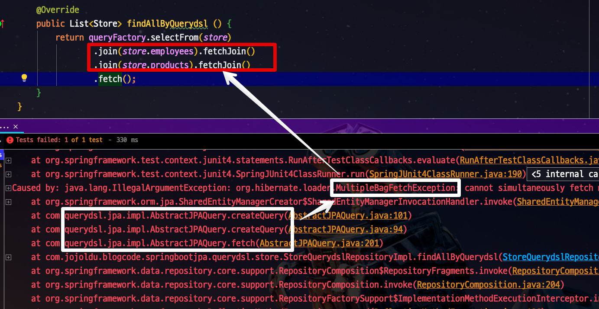

# MultipleBagFetchException 발생시 해결방법

JPA의 N+1 문제에 대한 해결책으로 

## 문제 상황

## 해결책 1. Fetch Join

[이전 글](https://jojoldu.tistory.com/165)에서도 작성했지만, N+1 을 해결하는 가장 쉬운 방법으로 보통 **Fetch Join**을 언급합니다.  

* **ToOne은 몇개든** 사용 가능합니다
* **ToMany는 1개만** 가능합니다.

## 해결책 2. Hibernate default_batch_fetch_size
 
> Tip)
> 같은 방법으로 **페이징 문제도 동일하게 해결합니다**.
> 1:N 관계에서 1에 대한 페이징이 정상작동 하지 않기 때문입니다.


## 추가) Querdsl은 Multi Fetch Join이 가능했던것 같은데요?

이 질문을 자주 받았는데요.  
**Querydsl이라고해서 용빼는 재주가 있는게 아닙니다**.  
결국 Querydsl 역시 JPQL 로 변환 작업에서 동일하게 문제가 발생합니다.  
JPA에서 안되는게 Querydsl에 될수는 없습니다.  
  
다시 한번 Querydsl의 코드를 확인해보세요.  

```java
return queryFactory
        .selectFrom(txItem)
        .join(txItem.customer, customer).fetchJoin()
        .join(txItem.txDetails, txDetail).fetchJoin()
        .where(
                txItem.settleCode.in(request.getSettleCodes()),
                txItem.txDate.eq(txDate),
                customer.bizNo.in(request.getBizNos()))
        .fetch();
```

Fetch Join은 **ToOne**은 여러개 적용이 가능하지만, **ToMany**와 같이 1:N 의 N에 대해서는 여러개 사용할 수 없습니다.  
Querydsl 역시 **N 자식들에 대해서는 멀티 페치 조인이 안됩니다**.  



본인의 Querydsl 코드에 여러개 Fetch Join 이 있다면 그건 ```ToOne```에 걸려있는게 여러개일겁니다.
