# Spring Boot Data Jpa 프로젝트에 Querydsl 적용하기

안녕하세요?  
이번 시간에는 Spring Boot Data Jpa 프로젝트에 [Querydsl](http://www.querydsl.com/)을 적용하는 방법을 소개 드리겠습니다.  
  
> 모든 코드는 [Github](https://github.com/jojoldu/blog-code/tree/master/spring-boot-querydsl)에 있습니다.
 
Spring Data Jpa를 써보신 분들은 아시겠지만, 기본으로 제공해주는 ```@Query```로는 **다양한 조회 기능을 사용하기에 한계**가 있습니다.  
  
그래서 이 문제를 해결하기 위해 **정적 타입을 지원하는 조회 프레임워크**를 사용하는데요.  
Querydsl은 Jooq와 함게 **가장 유명한 조회 프레임워크**입니다.  
  
이번 포스팅에서는 Spring Boot Data Jpa에서 Querydsl을 어떻게 설정하는지를 이야기합니다.  
Querydsl의 장점 혹은 왜 써야하는지 등의 내용은 담지 않습니다.  

> 이건 나중에 한번 각잡고 작성해서 공유드리겠습니다 :)

개발환경은 다음과 같습니다.

* IntelliJ
* Spring Boot 2.1.1
* Gradle
* Lombok

IntelliJ가 아닌 이클립스라도 크게 문제는 없습니다만, IntelliJ라면 더욱 편하게 진행하실 수 있습니다.  
  
그럼 이제 시작해보겠습니다.

## 1. Gradle 설정

[Gradle Multi Module](https://jojoldu.tistory.com/123)이 아닌 단일 모듈로 작업을 시작합니다.  

> 만약 Gradle Multi Module에서 어떻게 사용하는지 궁금하신 분들은 [제 개인프로젝트](https://github.com/jojoldu/bns/blob/master/build.gradle)를 참고해보세요

먼저 스프링부트와 Gradle로 프로젝트를 생성합니다.  

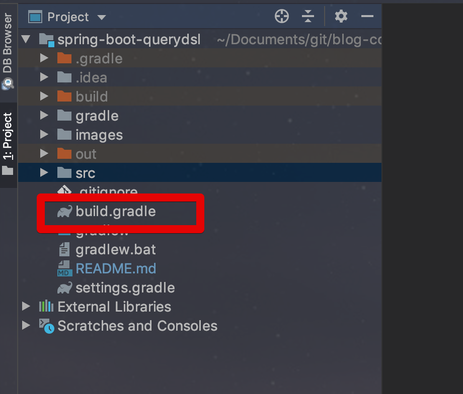

그리고 build.gradle을 열어 아래와 같이 Querydsl 관련 설정을 추가합니다.  
  
먼저 **Querydsl 플러그인 설정**을 먼저합니다.  


```groovy
buildscript {
    ext {
        ...
        querydslPluginVersion = '1.0.10' // 플러그인 버전
    }
    repositories {
        ...
        maven { url "https://plugins.gradle.org/m2/" } // 플러그인 저장소
    }
    dependencies {
        ...
        classpath("gradle.plugin.com.ewerk.gradle.plugins:querydsl-plugin:${querydslPluginVersion}") // querydsl 플러그인 의존성 등록
    }
}
```

위 플러그인이 있어야만 Querydsl의 도메인 모델인 ```QClass```들이 생성됩니다.  
이 ```QClass``` 들이 Querydsl의 중심이기 때문에 꼭 있어야합니다.  

> 자세한건 이후 실습때 경험해보실 수 있습니다.

그리고 Querydsl을 사용할 수 있는 라이브러리를 추가합니다.  

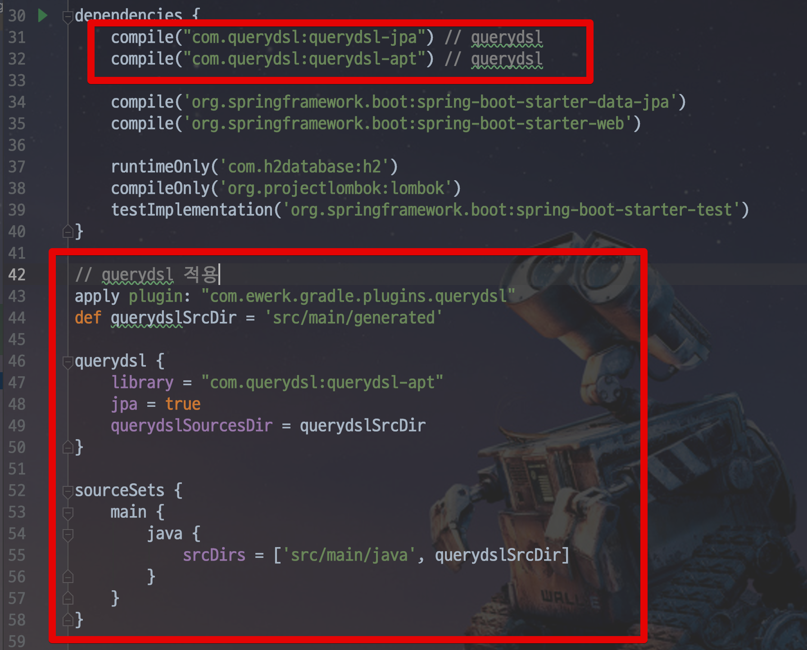


```groovy
dependencies {
    compile("com.querydsl:querydsl-jpa") // querydsl
    compile("com.querydsl:querydsl-apt") // querydsl
    ...
}
```

의존성까지 다 추가되셨다면 Gradle에 Querydsl의 도메인인 QClass 생성을 위한 Task를 추가합니다.

> 즉, 위에서 설정한 Plugin을 사용하는 Task 추가입니다.


```groovy
// querydsl 적용
apply plugin: "com.ewerk.gradle.plugins.querydsl" // Plugin 적용
def querydslSrcDir = 'src/main/generated' // QClass 생성 위치

querydsl {
    library = "com.querydsl:querydsl-apt"
    jpa = true
    querydslSourcesDir = querydslSrcDir
}

sourceSets {
    main {
        java {
            srcDirs = ['src/main/java', querydslSrcDir]
        }
    }
}
```

위 설정값을 모두 합친 코드는 아래와 같습니다.

```groovy
buildscript {
    ext {
        springBootVersion = '2.1.1.RELEASE'
        querydslPluginVersion = '1.0.10'
    }
    repositories {
        mavenCentral()
        maven { url "https://plugins.gradle.org/m2/" } // plugin 저장소
    }
    dependencies {
        classpath("org.springframework.boot:spring-boot-gradle-plugin:${springBootVersion}")
        classpath("gradle.plugin.com.ewerk.gradle.plugins:querydsl-plugin:${querydslPluginVersion}")
    }
}

apply plugin: 'java'
apply plugin: 'eclipse'
apply plugin: 'org.springframework.boot'
apply plugin: 'io.spring.dependency-management'

group = 'com.jojoldu.blogcode'
version = '0.0.1-SNAPSHOT'
sourceCompatibility = 1.8

repositories {
    mavenCentral()
}


dependencies {
    compile("com.querydsl:querydsl-jpa") // querydsl
    compile("com.querydsl:querydsl-apt") // querydsl

    compile('org.springframework.boot:spring-boot-starter-data-jpa')
    compile('org.springframework.boot:spring-boot-starter-web')

    runtimeOnly('com.h2database:h2')
    compile('org.projectlombok:lombok')
    testCompile('org.springframework.boot:spring-boot-starter-test')
}

// querydsl 적용
apply plugin: "com.ewerk.gradle.plugins.querydsl"
def querydslSrcDir = 'src/main/generated'

querydsl {
    library = "com.querydsl:querydsl-apt"
    jpa = true
    querydslSourcesDir = querydslSrcDir
}

sourceSets {
    main {
        java {
            srcDirs = ['src/main/java', querydslSrcDir]
        }
    }
}
```

Gradle 설정이 다 되셨다면 이제 프로젝트에 설정을 진행하겠습니다.

> 현재 구글 검색에서 나오는 Querydsl이나 몇몇 책들을 보면 이 설정이 조금 과한데, 전혀 그럴 필요 없습니다.

## 2. Java Config & 기본 사용법

먼저 Java 설정을 진행합니다.

### 2-1. Java Config

설정값을 모아둔 패키지에 ```QuerydslConfiguration```을 생성합니다.  

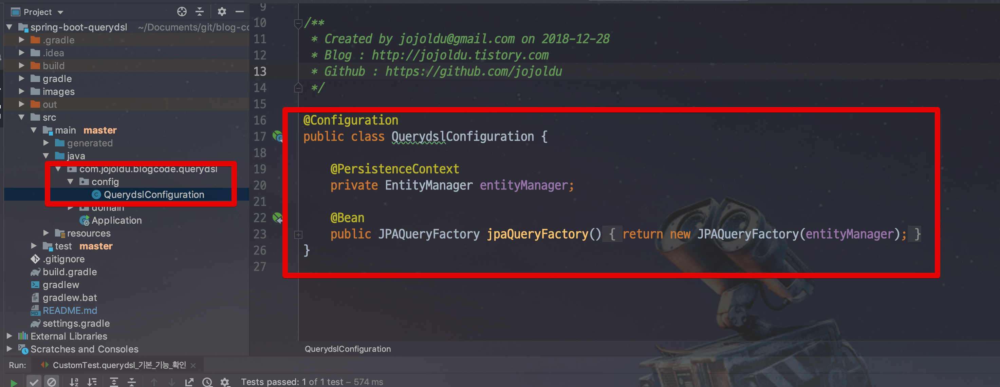

```java
@Configuration
public class QuerydslConfiguration {

    @PersistenceContext
    private EntityManager entityManager;

    @Bean
    public JPAQueryFactory jpaQueryFactory() {
        return new JPAQueryFactory(entityManager);
    }
}
```

위 설정으로 이 프로젝트에서는 어느 곳에서나 ```JPAQueryFactory```를 주입 받아 Querydsl을 사용할 수 있게 됩니다.  
  
그럼 한번 간단하게 사용해볼까요?

### 2-2. 기본적인 사용법

먼저 테스트로 사용할 Entity를 하나 생성해보겠습니다.

```java
@Getter
@NoArgsConstructor(access = AccessLevel.PROTECTED)
@Entity
public class Academy {

    @Id
    @GeneratedValue(strategy = GenerationType.IDENTITY)
    private Long id;

    private String name;
    private String address;

    @Builder
    public Academy(String name, String address) {
        this.name = name;
        this.address = address;
    }
}
```

그리고 테스트로 데이터를 넣고, 검증할 ```Repository```도 하나 생성합니다.  

```java
public interface AcademyRepository extends JpaRepository<Academy, Long> {
}
```

자 그럼 여기서 Querydsl Repository를 하나 생성하겠습니다.  
클래스명은 ```AcademyRepositorySupport```입니다.


```java
@Repository
public class AcademyRepositorySupport extends QuerydslRepositorySupport {
    private final JPAQueryFactory queryFactory;

    public AcademyRepositorySupport(JPAQueryFactory queryFactory) {
        super(Academy.class);
        this.queryFactory = queryFactory;
    }

    public List<Academy> findByName(String name) {
        return queryFactory
                .selectFrom(academy)
                .where(academy.name.eq(name))
                .fetch();
    }

}
```

* 설정으로 **Bean 등록된 queryFactory를 생성자 인잭션**으로 주입 받아 사용합니다.

이 코드를 생성하다보면 다음과 같은 오류 메세지가 나옵니다.

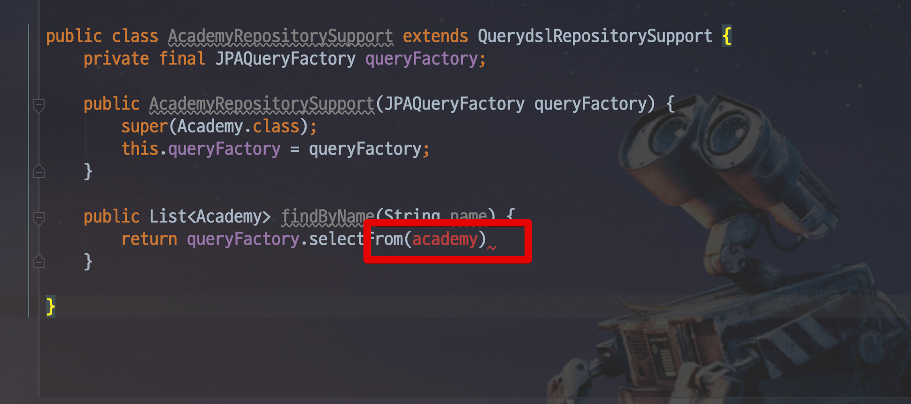

이건 Querydsl의 QClass인 ```academy```를 사용하고 싶은데 아직 찾을수 없다는 뜻인데요.  
QClass를 생성해보겠습니다.  

IntelliJ의 Gradle View를 열어서 **Tasks -> other -> compileQuerydsl**를 더블클릭으로 실행합니다.  
(이 Task가 위 Gradle 설정에서 등록한 Task입니다.)

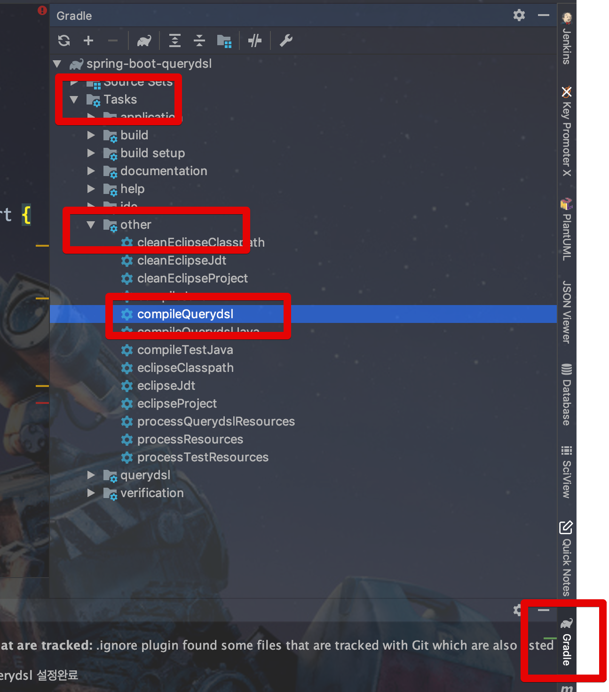

그럼 아래와 같이 Build가 진행되는데요.  
성공으로 끝나면 **현재 프로젝트에 있는 모든 Entity의 QClass가 생성**됩니다.

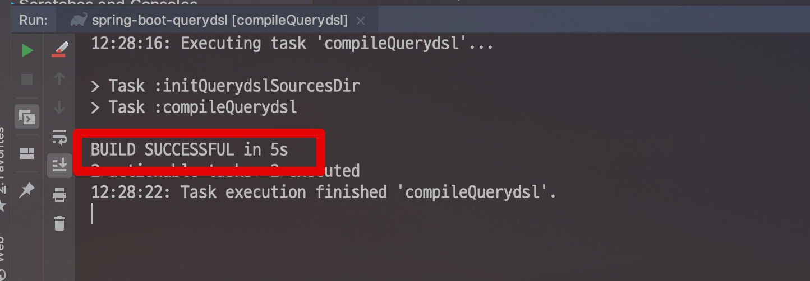

build.gradle에서 설정한 위치 (```src/main/generated/```) 을 보시면 아래와 같이 QClass가 생성된 것을 확인할 수 있습니다.

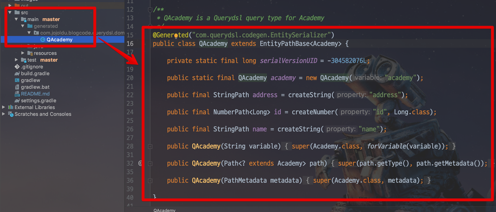

자 그럼 이제 클래스가 생성되었으니 아까 전 코드의 ```academy```를 import 합니다.  
해당 코드에서 ```option+enter```를 사용해 Import를 진행하시면 됩니다.

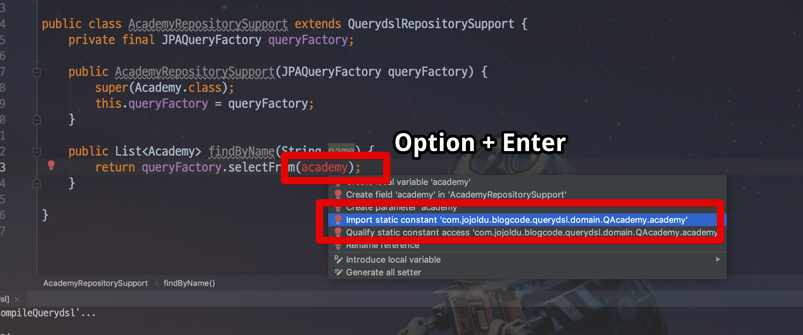

그럼 아래와 같이 Import가 된 것을 확인할 수 있습니다.

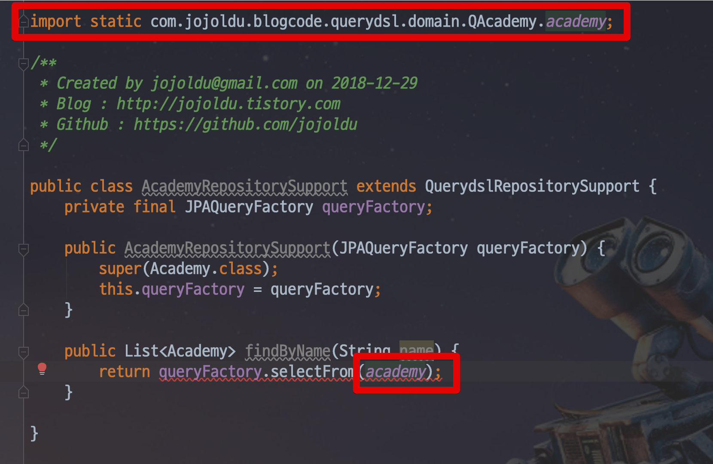

나머지 코드를 완성합니다.

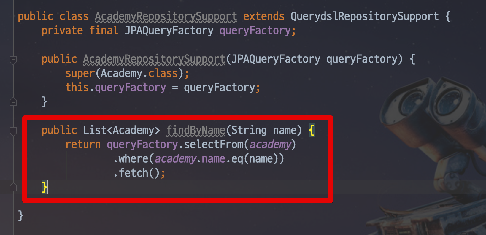

컴파일 에러가 나지 않는 상태가 되셨다면, 테스트 코드로 이 메소드가 정상작동하는지 테스트해보겠습니다.  

### 2-3. 기본 사용법 테스트

Querydsl이 정상작동했다면 ```findByName```이라는 메소드가 정상작동하겠죠?  
  
아래와 같이 테스트 코드를 작성해서 검증해보겠습니다.

```java
@RunWith(SpringRunner.class)
@SpringBootTest
public class BasicTest {
    
    @Autowired
    private AcademyRepository academyRepository;
    
    @Autowired
    private AcademyRepositorySupport academyRepositorySupport;

    @After
    public void tearDown() throws Exception {
        academyRepository.deleteAllInBatch();
    }

    @Test
    public void querydsl_기본_기능_확인() {
        //given
        String name = "jojoldu";
        String address = "jojoldu@gmail.com";
        academyRepository.save(new Academy(name, address));

        //when
        List<Academy> result = academyRepositorySupport.findByName(name);

        //then
        assertThat(result.size(), is(1));
        assertThat(result.get(0).getAddress(), is(address));
    }
}
```

코드는 간단합니다.  
1개의 Academy 데이터를 넣고, Querydsl로 만든 ```findByName```메소드로 조회시 정상적으로 결과가 나오는지 확인합니다.  
  
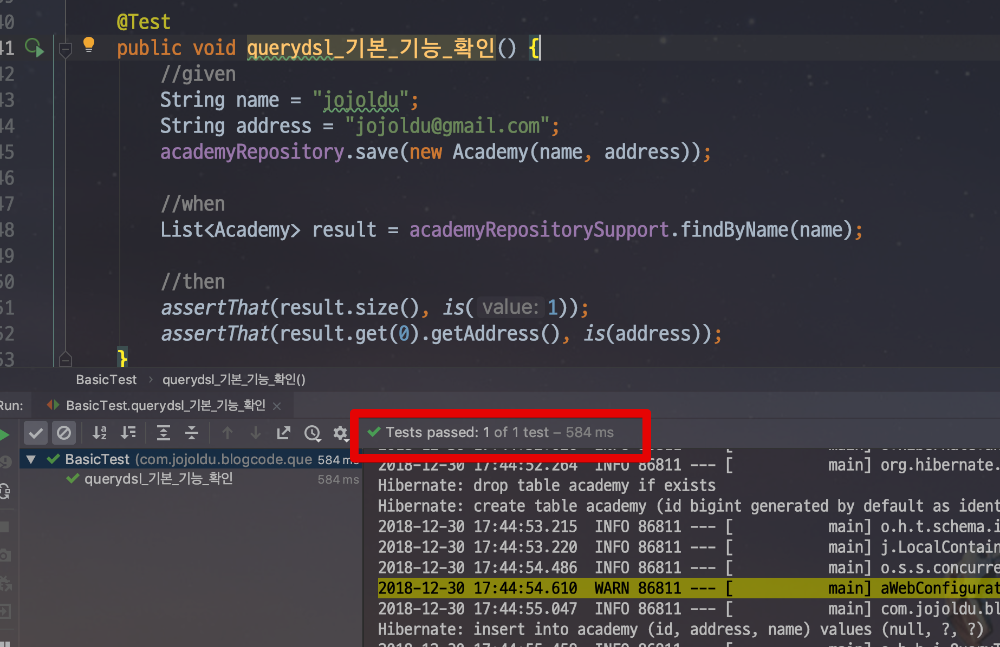

정상적으로 Queyrdsl이 설정된 것을 확인할 수 있습니다!  
하지만!  
여기서 끝이 아니라, 한 단계 더 나아가보겠습니다.

## 3. Spring Data Jpa Custom Repository 적용

위와 같은 방식으로도 Querydsl을 사용할 수 있지만, 한가지 단점이 있는데요.  
  
**항상 2개의 Repository를 의존성으로 받아야한다**는 것입니다.  
  
Querydsl의 Custom Repository와 JpaRepository를 상속한 Repository가 기능을 나눠가졌기 때문인데요.  
  
이를 해결하기 위해 Spring Data Jpa에서는 **Custom Repository를 JpaRepository 상속 클래스에서 사용**할 수 있도록 기능을 지원합니다.  
  
전체적인 그림은 아래와 같습니다.


> [Spring Data 공식 문서](https://docs.spring.io/spring-data/jpa/docs/2.1.3.RELEASE/reference/html/#repositories.custom-implementations)을 참고하시면 Custom Repository 내용이 나오니 자세히 읽어보시면 됩니다.

위와 같이 구성하면 ```AcademyRepository```에서 ```AcademyRepositoryImpl``` 의 코드도 사용할 수 있습니다.  
  
일종의 공식이라고 보시면 되는데요, ```Custom```이 붙은 인터페이스를 상속한 ```Impl``` 클래스의 코드는 ```Custom``` 인터페이스를 상속한 ```JpaRepository```에서도 사용할 수 있습니다.  

> ```Custom```과 ```Impl```만 외우셔두 됩니다.

자 그럼 진행해보겠습니다.  
먼저 ```AcademyRepository``` 와 같은 위치에 ```AcademyRepositoryCustom``` 인터페이스와 ```AcademyRepositoryImpl``` 클래스를 생성합니다.

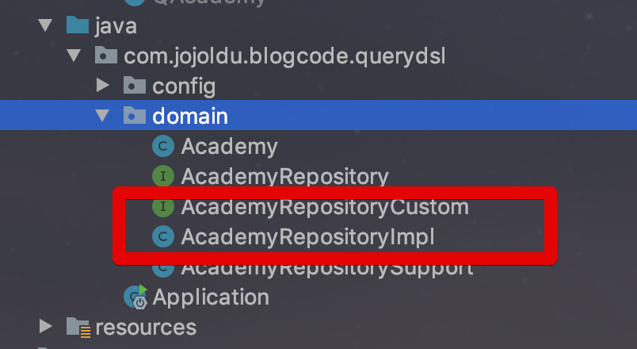

그리고 ```AcademyRepositoryCustom``` 인터페이스와 ```AcademyRepositoryImpl``` 클래스에 다음과 같은 코드를 추가합니다.

```java
public interface AcademyRepositoryCustom {
    List<Academy> findByName(String name);
}
```

클래스는 기존에 있던 ```Support``` 클래스 코드를 참고해서 구현합니다.

```java
@RequiredArgsConstructor
public class AcademyRepositoryImpl implements AcademyRepositoryCustom {

    private final JPAQueryFactory queryFactory;

    @Override
    public List<Academy> findByName(String name) {
        return queryFactory.selectFrom(academy)
                .where(academy.name.eq(name))
                .fetch();
    }
}
```

> 다른 블로그를 보시면 QuerydslSupport 상속 코드도 추가하는데, **페이징이 필요한게 아니라면 안하셔도 됩니다**  
결국 ```JPAQueryFactory```를 통해서 작동하는거라서요

그리고 이 코드를 ```AcademyRepository```에서 쓸수 있게 상속 구조로 변경하겠습니다.

```java
public interface AcademyRepository extends JpaRepository<Academy, Long>, AcademyRepositoryCustom {
}
```

그럼 이 코드가 정상작동하는지 테스트 해볼까요?

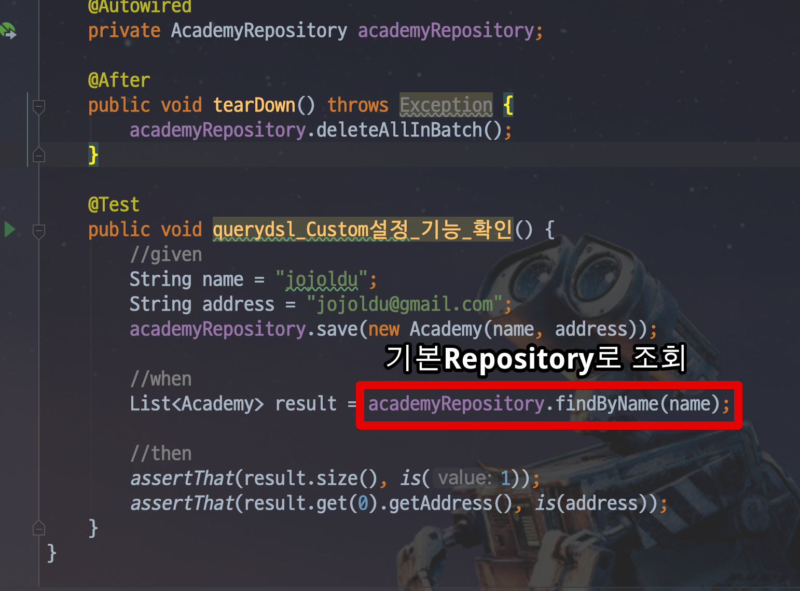

```java
@RunWith(SpringRunner.class)
@SpringBootTest
public class CustomTest {

    @Autowired
    private AcademyRepository academyRepository;

    @After
    public void tearDown() throws Exception {
        academyRepository.deleteAllInBatch();
    }

    @Test
    public void querydsl_Custom설정_기능_확인() {
        //given
        String name = "jojoldu";
        String address = "jojoldu@gmail.com";
        academyRepository.save(new Academy(name, address));

        //when
        List<Academy> result = academyRepository.findByName(name);

        //then
        assertThat(result.size(), is(1));
        assertThat(result.get(0).getAddress(), is(address));
    }
}
```

테스트 코드를 실행해보면!

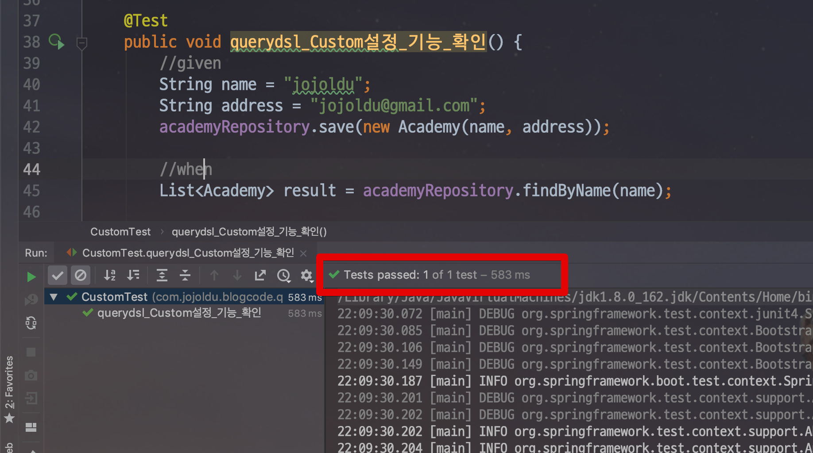

이렇게 성공적으로 기능이 작동하는 것을 확인할 수 있습니다.  
위 코드가 잘 적용된거죠?

## 4. 주의 사항

Querydsl의 QClass를 담는 ```src/main/generated```는 자동생성되는 파일들의 디렉토리이니 무조건 ```.gitignore```에 추가하셔야 합니다.

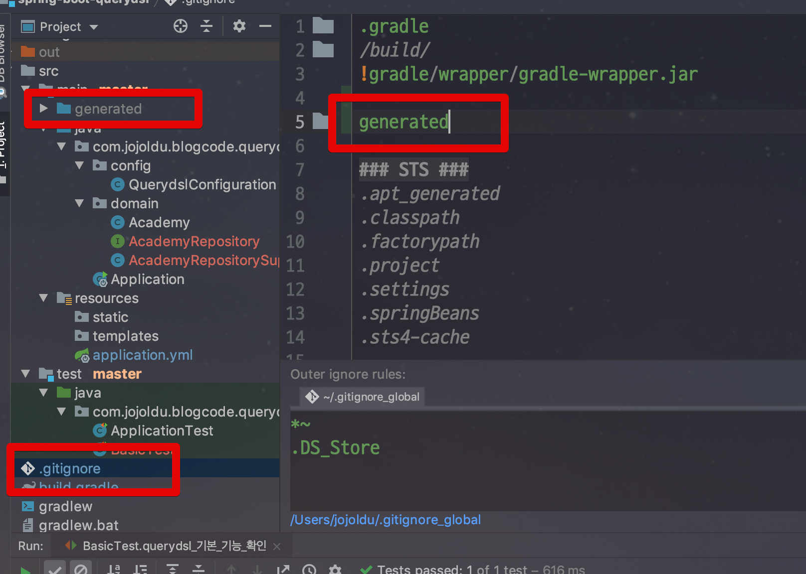

