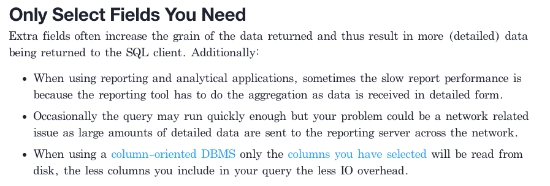
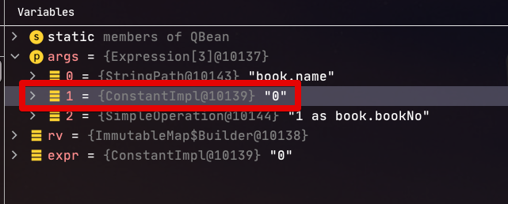

# Querydsl에서 상수 사용하기

쿼리 성능을 개선할 수 있는 여러 방법 중에 가장 쉬운 방법은 **조회하는 컬럼의 수를 최소화**하는 것입니다.  



* [dzone-6-simple-performance-tips-sql](https://dzone.com/articles/6-simple-performance-tips-sql)
  
무분별하게 Entity를 가져오기 보다는 Dto로 필요한 필드만 가져오길 권장하는 이유이기도 한대요.  
조회에 필요한 필드들만 조회하였지만, 그럼에도 더 줄일 수 있는 방법은 무엇이 있을까요?  
가장 쉽게 해볼 수 있는 것이 **이미 선언되어있는 값은 그대로 사용**하는 것입니다.  
  
메소드의 인자값으로 넘어왔거나, 다른 메소드를 통해서 이미 알고 있는 값을 굳이 DB에서 다시 조회해올 필욘 없겠죠?  
    
그래서 이번 시간에는 Querydsl에서 상수를 사용하는 방법에 대해서 소개드리겠습니다.

## 1. constantAs

가장 먼저 알아볼 것은 ```constantAs``` 입니다.  
이를테면 다음과 같은 경우인데요.  

* 조회 조건에 사용된 값을 select 절에서도 사용해야할때

이때 ```constantAs```를 사용하기가 좋습니다.  
  
바로 샘플 코드로 알아보겠습니다.  
  
**조회용 Dto**

```java
@Getter
@NoArgsConstructor
public class BookPageDto {
    private String name;
    private int pageNo;
    private int bookNo;
}
```

**Repository**

```java
public List<BookPageDto> getBookPage (int bookNo, int pageNo) {
    return queryFactory
            .select(Projections.fields(BookPageDto.class,
                    book.name,
                    Expressions.constantAs(bookNo, book.bookNo) // (1)
                )
            )
            .from(book)
            .where(book.bookNo.eq(bookNo))
            .offset(pageNo)
            .limit(10)
            .fetch();
}
```

흔하게 볼 수 있는 Querydsl 조회용 코드입니다.  
여기서 보실 것은 (1) 인데요.  
  
(1) ```Expressions.constantAs(bookNo, book.bookNo)```

* 첫번째 인자는 조회 결과에 사용될 변수값, 두번째 인자는 alias할 이름을 지정합니다.
  * 여기서 ```bookNo```는 파라미터로 받은 값이라 그대로 조회 결과에 사용됩니다.
* ```book.bookNo```는 **Dto의 필드명**처럼 사용됩니다.
  * Entity의 필드인 ```book.bookNo```와 Dto의 필드인 ```bookNo```가 똑같은 이름, 똑같은 타입이라 alias 로 사용할 수 있습니다.
* 즉, Entity에서 선언된 필드와 동일한 이름/타입이면 컴파일 체크가 가능한 QClass 의 필드를 사용할 수 있습니다.

실제로 잘 되는지 테스트 코드로 확인해보겠습니다.

```java
@Test
void 상수값을_사용한다() throws Exception {
    //given
    int bookNo = 1;
    for (int i = 1; i <= 10; i++) {
        bookRepository.save(Book.builder()
                .name("a"+i)
                .bookNo(bookNo)
                .build());
    }

    //when
    List<BookPageDto> bookPages = bookQueryRepository.getBookPage(bookNo, 0);

    //then
    assertThat(bookPages).hasSize(10);
    assertThat(bookPages.get(0).getBookNo()).isEqualTo(bookNo);
}
```

10개의 값을 넣어 첫번째 페이지의 10개 결과를 반환하는 코드를 검증하였는데요.  
  
테스트가 통과되는 것을 알 수 있습니다.


그리고 실제 실행된 쿼리를 확인해보시면!?


**불필요한 컬럼인 bookNo가 빠진채로 조회**되는 것을 알 수 있습니다.  
의도한대로 컬럼 조회를 최소화하면서 원하는 결과를 얻어냈습니다.

## 2. constant

자 그럼 위에서 사용한 ```constanAs```를 보면 한가지 의문이 남는데요.

* **Entity에서 선언되지 않은 필드**일때 상수 결과로 반환하고 싶을땐 어찌하나?

이럴때는 ```constant```를 사용하면 됩니다.

```java
public List<BookPageDto> getBookPage (int bookNo, int pageNo) {
    return queryFactory
            .select(Projections.fields(BookPageDto.class,
                    book.name,
                    Expressions.constantAs(bookNo, book.bookNo),
                    Expressions.as(Expressions.constant(pageNo), "pageNo") (1)
                )
            )
            .from(book)
            .where(book.bookNo.eq(bookNo))
            .offset(pageNo)
            .limit(10)
            .fetch();
}
```

(1) ```Expressions.as(Expressions.constant(pageNo), "pageNo")```

* ```Expressions.constant(pageNo)```: 조회 결과에 사용될 상수값 지정
* ```Expressions.as(상수값, "pageNo")``` : 상수값 alias (Path 지정)

여기서 ```Expressions.constant```의 반환 타입이 ```Expression```인 것을 보시고 **변수명이 똑같으면** ```as``` 없이 ```Expressions.constant```만 선언하면 되지 않을까 생각하실텐데요.  
그럴 경우 ```select```절의 ```as```가 없어 단순히 해당 ```변수값만``` select절에서 사용하게 됩니다.



(```1 as book.bookNo```와 달리 0만 있는 것을 볼 수 있습니다.)  
  
그래서 실제로 실행해보면 아래와 같이 ```IllegalArgumentException: Unsupported expression 0``` 가 발생하면서 실패하니 꼭 ```Expressions.as```를 붙여주어 Path를 강제화 하셔야만 합니다.


자 그럼 이제 잘되는 지 확인해보겠습니다.  
1번에서 사용했던 테스트 코드를 조금 변경하여 다시 수행해봅니다.

```java
@Test
void 상수값을_사용한다() throws Exception {
    //given
    int bookNo = 1;
    for (int i = 1; i <= 10; i++) {
        bookRepository.save(Book.builder()
                .name("a"+i)
                .bookNo(bookNo)
                .build());
    }

    //when
    List<BookPageDto> bookPages = bookQueryRepository.getBookPage(bookNo, 0);

    //then
    assertThat(bookPages).hasSize(10);
    assertThat(bookPages.get(0).getPageNo()).isEqualTo(0);
    assertThat(bookPages.get(0).getBookNo()).isEqualTo(bookNo);
}
```

테스트가 통과되고


쿼리 역시 정상적으로 **상수들은 제외한 쿼리**가 수행되는 것을 확인할 수 있습니다.


