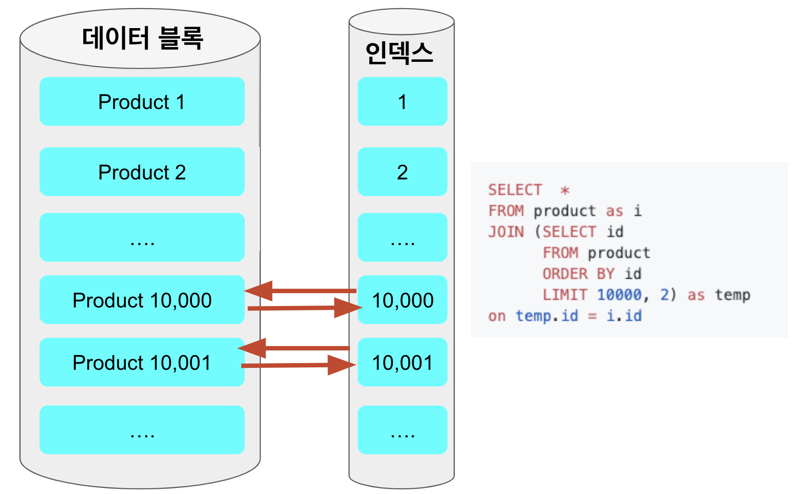

# 2. 페이징 성능 개선하기 - 커버링 인덱스 사용하기


## 2. 커버링 인덱스 사용하기

앞서 1번처럼 No Offset 방식으로 개선할 수 있다면 정말 좋겠지만, 사용할 수 없는 상황이라면 **커버링 인덱스**로 성능을 개선할 수 있습니다.  
  
커버링 인덱스란 **쿼리를 충족시키는 데 필요한 모든 데이터를 갖고 있는 인덱스**를 이야기합니다.  
  
즉, ```select, where, order by, limit, group by``` 등에서 사용되는 모든 컬럼이 **한개의 Index**안에 다 포함된 경우인데요.  
  
예를 들어 아래와 같은 페이징 쿼리를

```sql
SELECT *
FROM items
WHERE 조건문
ORDER BY id DESC
OFFSET 페이지번호
LIMIT 페이지사이즈
```

아래처럼 처리한 코드를 의미합니다.

```sql
SELECT  *
FROM  items as i
JOIN (SELECT id
        FROM items
        WHERE 조건문
        ORDER BY id DESC
        OFFSET 페이지번호
        LIMIT 페이지사이즈) as temp on temp.id = i.id
```

위 쿼리에서 커버링 인덱스가 사용된 부분이 ```JOIN```에 있는 쿼리입니다.  
(아래 쿼리입니다.)

```sql
SELECT id
FROM items
WHERE 조건문
ORDER BY id DESC
OFFSET 페이지번호
LIMIT 페이지사이즈
```

select절을 비롯해 order by, where 등 쿼리 내 모든 항목이 **인덱스 컬럼으로만** 이루어지게 하여 **인덱스 내부에서 쿼리가 완성**될 수 있도록 하는 방식인데요.  
이렇게 커버링 인덱스로 빠르게 걸러낸 row의 id를 통해 **실제 select 절의 항목들을 빠르게 조회**해오는 방법입니다.  
  
### 2-1. 커버링 인덱스는 왜 빠른가?

일반적으로 인덱스를 이용해 조회되는 쿼리에서 가장 큰 성능 저하를 일으키는 부분은 인덱스를 검색하고 **대상이 되는 row의 나머지 컬럼값을 데이터 블록에서 읽을 때** 입니다.  
  
> 페이징 쿼리와 무관하게 **인덱스를 탔음에도 느린 쿼리**의 경우 이 select절 항목 때문입니다.  

이를테면 커버링 인덱스를 태우지 않은 일반적인 조회 쿼리는 ```order by, offset ~ limit``` 을 수행할때도 데이터 블록으로 접근을 하게 됩니다.


반대로 커버링 인덱스 방식을 이용하면, ```where, order by, offset ~ limit``` 을 **인덱스 검색**으로 빠르게 처리하고, 이미 **다 걸러진 10개의 row에 대해서만** 데이터 블록에 접근하기 때문에 성능의 이점을 얻게 됩니다.



> ```select, where, order by, group by, having``` 등에 사용되는 컬럼에 대한 커버링 인덱스의 적용 방식은 이전에 작성된 커버링 인덱스 시리즈를 참고하시면 좋습니다.
> [1. 커버링 인덱스 (기본 지식 / WHERE / GROUP BY)](https://jojoldu.tistory.com/476)  
> [2. 커버링 인덱스 (WHERE + ORDER BY / GROUP BY + ORDER BY )](https://jojoldu.tistory.com/481)

예를 들어 앞서 1번에서 사용된 기존의 페이징 쿼리는

```sql
select id, book_no, book_type, name
from book
where name like '200%'
order by id desc
limit 10 offset 10000;
```

select에서 사용된 **book_no, book_type**이 인덱스 (```idx_book_1(name)```)에 포함되지 않기 때문에 커버링 인덱스가 될 수가 없습니다.

> id도 인덱스에 없지 않나요? 라고 질문하신다면 앞 글에서도 언급하고 있지만 클러스터 인덱스(PK)인 id는 [모든 인덱스에 자동 포함](https://jojoldu.tistory.com/476)됩니다.


### 2-2. 구현 코드

자 그럼 이제 한번 실제로 코드를 구현해볼텐데요.  

### 2-2. 구현 코드

**Querydsl**

```java
public List<BookPaginationDto> paginationCoveringIndex(String name, int pageNo, int pageSize) {
        // 1) 커버링 인덱스로 대상 조회
        List<Long> ids = queryFactory
                .select(book.id)
                .from(book)
                .where(book.name.like(name + "%"))
                .orderBy(book.id.desc())
                .limit(pageSize)
                .offset(pageNo * pageSize)
                .fetch();

        // 1-1) 대상이 없을 경우 추가 쿼리 수행 할 필요 없이 바로 반환
        if (CollectionUtils.isEmpty(ids)) {
            return new ArrayList<>();
        }

        // 2)
        return queryFactory
                .select(Projections.fields(BookPaginationDto.class,
                        book.id.as("bookId"),
                        book.name,
                        book.bookNo,
                        book.bookType))
                .from(book)
                .where(book.id.in(ids))
                .fetch().stream()
                .sorted() // where in id만 있어 결과 정렬이 보장되지 않는다. (쿼리 시간 최적화를 위해 애플리케이션에서 정렬한다)
                .collect(Collectors.toList());
public List<BookPaginationDto> paginationCoveringIndex(String name, int pageNo, int pageSize) {
        List<Long> ids = queryFactory
                .select(book.id)
                .from(book)
                .where(book.name.like(name + "%"))
                .orderBy(book.id.desc())
                .limit(pageSize)
                .offset(pageNo * pageSize)
                .fetch();

        if(CollectionUtils.isEmpty(ids)) {
                return new ArrayList<>();
        }

        return queryFactory
                .select(Projections.fields(BookPaginationDto.class,
                        book.id.as("bookId"),
                        book.name,
                        book.bookNo,
                        book.bookType))
                .from(book)
                .where(book.id.in(ids))
                .orderBy(book.id.desc())
                .fetch();
}
```

**JdbcTemplate**

```java
public List<BookPaginationDto> paginationCoveringIndexSql(String name, int pageNo, int pageSize) {
String query =
        "SELECT i.id, book_no, book_type, name " +
        "FROM book as i " +
        "JOIN (SELECT id " +
        "       FROM book " +
        "       WHERE name LIKE '?%' " +
        "       ORDER BY id DESC " +
        "       LIMIT ? " +
        "       OFFSET ?) as temp on temp.id = i.id";

return jdbcTemplate
        .query(query, new BeanPropertyRowMapper<>(BookPaginationDto.class),
                name,
                pageSize,
                pageNo * pageSize);
}
```

### 2-3. 성능 비교

### 2-4. 단점