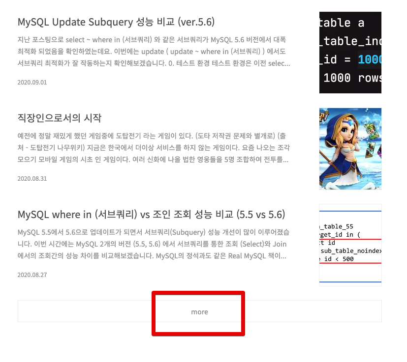
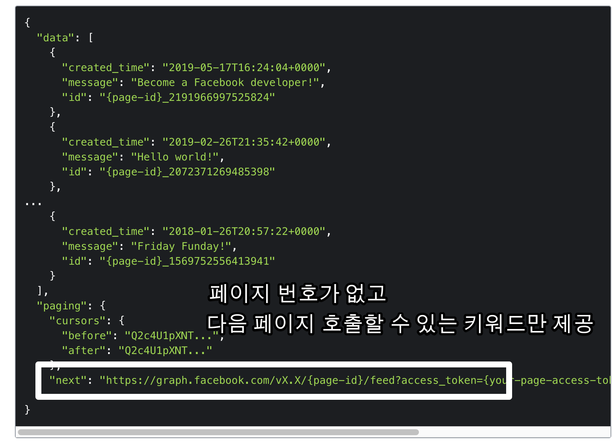
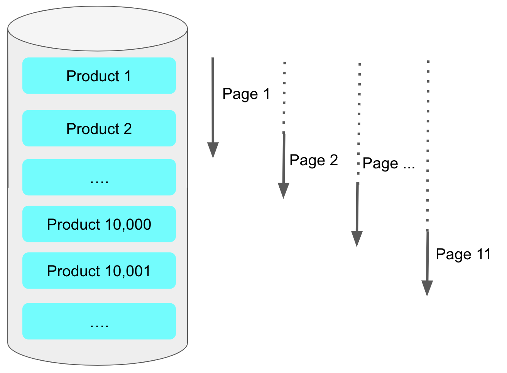
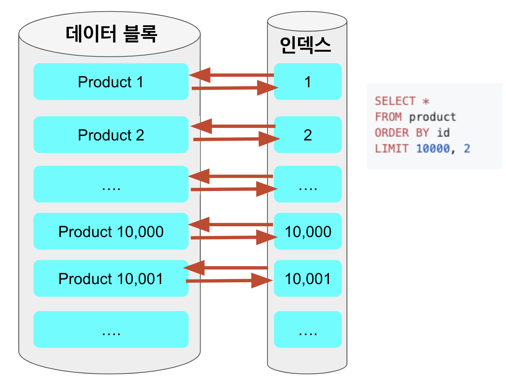

# 페이징 성능 개선하기 (feat. Querydsl)

일반적인 웹 서비스에서 페이징은 아주 흔하게 사용되는 기능입니다.  
처음엔 수만, 수십만건정도로 데이터가 적어서 큰 문제가 없지만, 점차 적재된 데이터가 많아짐에 따라 페이징 기능이 느려지는걸 겪게 되는데요.  
  
특히 1억건이 넘는 테이블에서의 페이징은 단순히 인덱스만 태운다고해서 해결되진 않습니다.  
  
그래서 이번 시간에는 일반적인 페이징 기능에서 성능을 올릴 수 있을지를 알아보겠습니다.  
당연히 인덱스를 이용한 쿼리 튜닝이 되어있다는 가정하에 진행됩니다.  
조회 쿼리의 인덱스 사용조차 안되고 있으면 그게 먼저 되어야합니다.

> ps 1. 페이징을 어떻게 구현하느냐에 대해서는 이미 알고 계시다는 가정하에 진행하겠습니다.  
> ps 2. 사내 기술 블로그에 기고한 [Spring Batch와 Querydsl](https://woowabros.github.io/experience/2020/02/05/springbatch-querydsl.html)와 연결됩니다.


## 1. No Offset 으로 구조 변경하기

가장 먼저 진행해볼 방법은 기존 페이징 방식에서 No Offset으로 구조를 변경하는 것입니다.  
No Offset 이란 용어가 조금 생소하실텐데요.  
  
기존의 페이징 방식이 아래와 같이 **페이지 번호** (```offset```) 와 **페이지 사이즈** (```limit```) 를 기반으로 한다면


No Offset은 아래와 같이 **페이지 번호 (offset)가 없는** 더보기 (More) 방식을 이야기 합니다.



페이스북과 같은 대량의 데이터를 다루는 SNS의 오픈 API를 사용해보신 분들은 그와 **비슷**하다고 보시면 됩니다.  
(내부 구조를 모르기 때문에 **동일하진 않습니다**.)



어떤 형태인지 이해가 되신다면, **그럼 왜 이 방식이 더 빠른것인지** 궁금하실텐데요.  
한번 자세히 알아보겠습니다.

## 1-1. No Offset은 왜 빠른가?

기존에 사용 하는 페이징 쿼리는 일반적으로 다음과 같은 형태입니다.

```sql
SELECT *
FROM items
WHERE 조건문
ORDER BY id DESC
OFFSET 페이지번호
LIMIT 페이지사이즈
```

> **최신 -> 과거순**으로 조회된다는 가정하에 ```desc```가 붙었습니다.  
> 모든 예제는 최신 -> 과거순으로 가정하고 진행합니다.

이와 같은 형태의 페이징 쿼리가 뒤로갈수록 느린 이유는 결국 **앞에서 읽었던 행을 다시 읽어야 하기 때문**인데요.



예를 들어 ```offset 10000, limit 20``` 이라 하면 최종적으로 **10,020개의 행을 읽어야 합니다**.  (10,000부터 20개를 읽어야하니)  
  
그리고 이 중 앞의 10,000 개 행을 버리게 됩니다.  
(실제 필요한건 마지막 20개뿐이니)  
  
뒤로 갈수록 **버리지만 읽어야할** 행의 개수가 많기 때문에 뒤로 갈수록 느려지는 것입니다.  
  
No Offset 방식은 바로 이 부분에서 **조회 시작 부분을 지정**해 매번 첫 페이지만 읽도록 하는 방식입니다.  
(클러스터 인덱스인 PK를 조회시작부분 조건문으로 사용했기 때문에 빠르게 조회됩니다.)

```sql
SELECT *
FROM items
WHERE 조건문 
AND id < 마지막조회ID # 직전 조회 결과의 마지막 id
ORDER BY id DESC
LIMIT 페이지사이즈
```

> 클러스터 인덱스에 대해 잘 모르신다면 꼭 [이전에 작성된 포스팅](https://jojoldu.tistory.com/476)을 읽어보시길 추천드립니다.

이전에 조회된 결과를 한번에 건너뛸수 있게 마지막 조회 결과의 ID를 조건문에 사용하는 것으로 이는 **매번 이전 페이지 전체를 건너 뛸 수 있음**을 의미합니다.  
  
즉, 아무리 페이지가 뒤로 가더라도 **처음 페이지를 읽은 것과 동일한 성능**을 가지게 됩니다.

> 좀 더 상세한 내용은 [fetch-next-page](https://use-the-index-luke.com/sql/partial-results/fetch-next-page) 를 참고해주세요.

## 1-2. 구현 코드

이제 실제로 해당 페이징 기능을 구현해 볼 차례인데요.  
실제 API로 구현된다면 다음과 같은 형태가 된다고 보시면 됩니다.


```java

```

## 1-3. 성능 비교

## 1-4. 단점

* where 기준 Key가 중복이 있을 경우
  * 이를 테면 ```group by``` 등으로 시작점으로 잡을 Key가 중복이 될 경우 정확한 결과를 반환할 수 없어서 사용할 수가 없습니다. 
* 회사 혹은 서비스 정책상 (or UX 관점에서) More 버튼형태로는 안된다고 하면 답이 없습니다.
  

## 2. 커버링 인덱스 사용하기

1번처럼 No Offset 방식으로 개선할 수 있다면 정말 좋겠지만, 회사 정책상 or 서비스 기획상 무조건 페이징 번호가 있어야 하는 방식이라면 사용할 순 없겠죠?  
  
이럴 경우엔 커버링 인덱스로 성능을 개선할 수 있습니다.  
  
커버링 인덱스란 **쿼리를 충족시키는 데 필요한 모든 데이터를 갖고 있는 인덱스**를 이야기합니다.  
즉, ```select, where, order by, limit, group by``` 등에서 사용되는 모든 컬럼이 **한개의 Index**안에 다 포함된 경우인데요.  
  
예를 들어 아래와 같은 페이징 쿼리를

```sql
SELECT *
FROM items
WHERE 조건문
ORDER BY id DESC
OFFSET 페이지번호
LIMIT 페이지사이즈
```

아래처럼 처리한 코드를 의미합니다.

```sql
SELECT  *
FROM  items as i
JOIN (SELECT id
        FROM items
        WHERE 조건문
        ORDER BY id DESC
        OFFSET 페이지번호
        LIMIT 페이지사이즈) as temp on temp.id = i.id
```

여기서 커버링 인덱스가 사용된 부분이 ```JOIN```에 사용된 아래 쿼리입니다.

```sql
SELECT id
FROM items
WHERE 조건문
ORDER BY id DESC
OFFSET 페이지번호
LIMIT 페이지사이즈
```

이렇게 커버링인덱스로 빠르게 걸러낸 row의 pk를 통해 실제 필요한 10개의 row를 빠르게 조회해오는 방법입니다.  
  

## 2-1. 커버링 인덱스는 왜 빠른가?

일반적으로 인덱스를 이용해 조회되는 쿼리에서 가장 큰 성능 저하를 일으키는 부분은 인덱스를 검색하고 **대상이 되는 row의 나머지 컬럼값을 데이터 블록에서 읽을 때** 입니다.  
  
기존의 쿼리는 ```order by, offset ~ limit``` 을 수행할때도 데이터 블록으로 접근을 하게 됩니다.



반대로 커버링 인덱스 방식을 이용하면, ```where, order by, offset ~ limit``` 을 인덱스 검색으로 빠르게 처리하고, 실제 **해당하는 row에 대해서만 데이터 블록에 접근**하기 때문에 성능의 이점을 얻게 됩니다.


> 이에 대한 상세한 내용은 이전에 작성된 포스팅 [커버링 인덱스 시리즈](https://jojoldu.tistory.com/476)를 참고해보시면 좋습니다.

## 2-2. 구현 코드

## 2-3. 성능 비교

## 2-4. 단점

* 커버링 인덱스도 데이터가 많아질수록 1번 방식인 No Offset보다 성능이 떨어집니다.
* JPA 기반의 질의어인 **JPQL 에서는 from절의 서브쿼리를 지원하지 않습니다**.
  * 그래서 보통은 커버링 인덱스 결과를 통해 가져온 id 값으로 한번더 쿼리를 수행하는 식으로 우회합니다.
  * 결과적으로 쿼리가 1번 수행되는게 2번 수행될뿐 전체 성능의 차이는 크지 않기 때문입니다.

## 3. Count 쿼리 결과 Cache하기 


```sql
select
    book0_.id as id1_3_,
    book0_.book_no as book_no2_3_,
    book0_.book_type as book_typ3_3_,
    book0_.name as name4_3_ 
from
    book book0_ 
where
    book0_.book_type=? 
order by
    book0_.id desc limit ?, ?
```

불필요한 ```order by``` 와 ```select``` 을 제외해서 count쿼리를 실행해줍니다.

```sql
select
    count(book0_.id) as col_0_0_ 
from
    book book0_ 
where
    book0_.book_type=?
```

where로 걸러진 데이터가 1000만건, 1억건이여도 다 row를 읽어서 count를 구하기 때문입니다.  

### 3-1. 구현 코드 - 직접 Paging 

### 3-2. 구현 코드 - QuerydslSupport

### 3-3. 단점

* 실시간으로 데이터 수정이 필요해 페이지 버튼 반영이 필요한 경우 사용할 수 없습니다.
  * 결국 새로고침 (or 버튼 클릭을 통한 페이지 이동) 하기 전까지는 페이지 버튼들이 계속 그대로 유지 되기 때문에 실시간성이 떨어집니다.
  * 마감된 데이터 혹은 실시간을 유지할 필요 없을 경우에만 사용할 수 있습니다.


