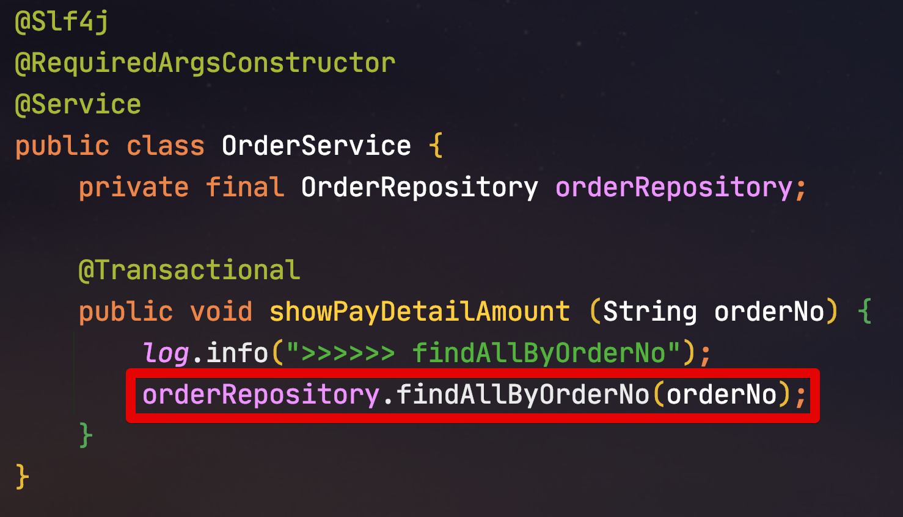
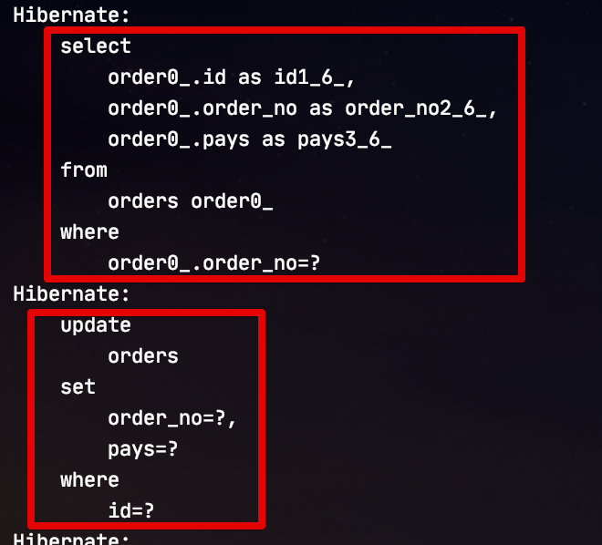
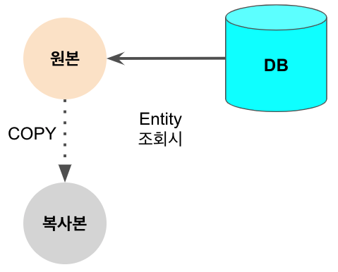
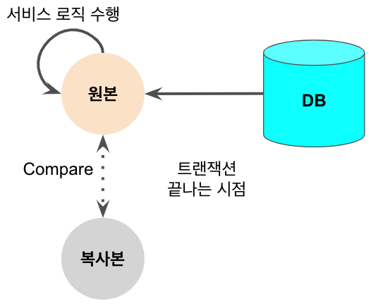
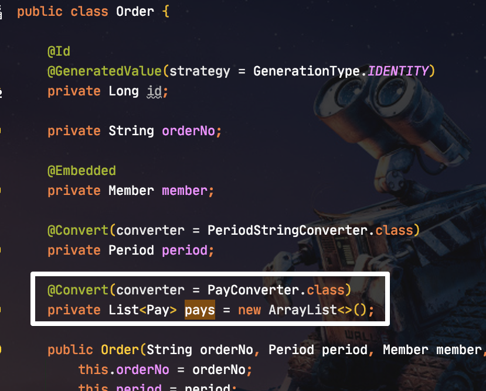
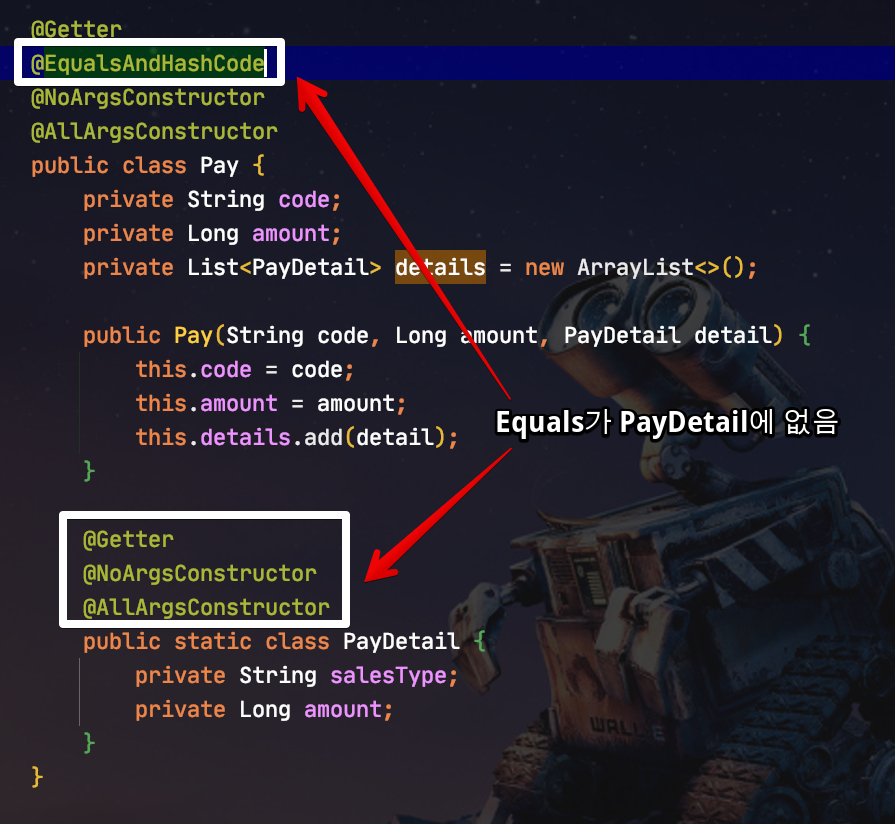
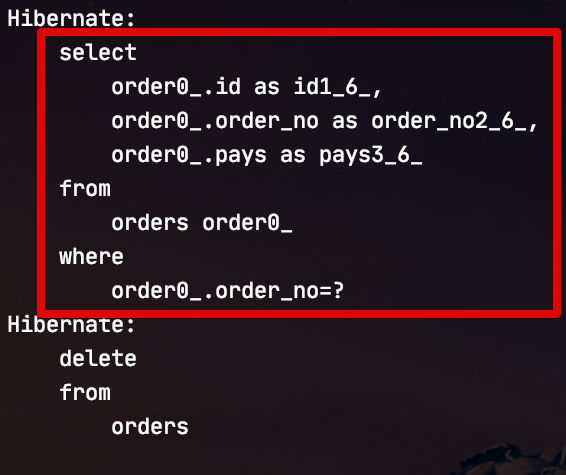
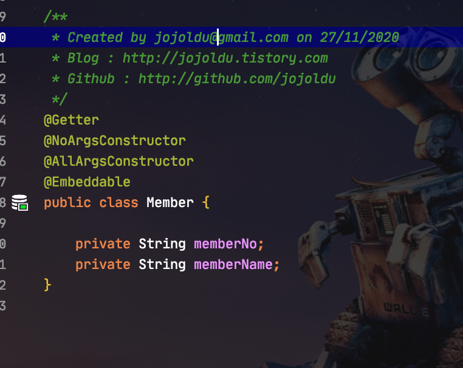

# JPA Entity Select에서 Update 쿼리 발생할 경우

JPA Entity를 단순히 조회만 하였는데도, 예상치 못하게 Update 쿼리가 발생하는 경우가 있습니다.  
이를테면 다음과 같은 경우인데요.  
  
**find로 조회**만 하는데,



발생한 쿼리는 다음과 같이 select와 update가 실행 되었습니다.  



신기한 것은 전체 컬럼에 대한 Update 쿼리가 발생한것입니다.  
보통 이렇게 **트랜잭션 내에서 Update 쿼리**가 발생하면 보통은 [Dirty Checking](https://jojoldu.tistory.com/415)이 발생했음을 **의심**해볼만 한데요.  

> 의심이라고 말씀드리는 이유는 실제로 다른 원인이 있을수도 있기 때문입니다.

자 그럼 왜 이렇게 발생했는지 실제 예제 코드와 함께 보겠습니다.

## 1. 예제 코드

먼저 위에서 발생한 Entity를 비롯한 서비스 코드는 다음과 같습니다.  
  
**Order**

```java
@Getter
@NoArgsConstructor
@Entity
@Table(name = "orders")
public class Order {

    @Id
    @GeneratedValue(strategy = GenerationType.IDENTITY)
    private Long id;

    private String orderNo;

    @Embedded
    private Member member;

    @Convert(converter = PeriodStringConverter.class)
    private Period period;

    @Convert(converter = PayConverter.class)
    private List<Pay> pays = new ArrayList<>();

    public Order(String orderNo, Period period, Member member, Pay pay) {
        this.orderNo = orderNo;
        this.period = period;
        this.member = member;
        this.pays.add(pay);
    }
}
```

**Pay**, **PayDetail**

```java
@Getter
@EqualsAndHashCode
@NoArgsConstructor
@AllArgsConstructor
public class Pay {
    private String code;
    private Long amount;
    private List<PayDetail> details = new ArrayList<>();

    public Pay(String code, Long amount, PayDetail detail) {
        this.code = code;
        this.amount = amount;
        this.details.add(detail);
    }

    @Getter
    @NoArgsConstructor
    @AllArgsConstructor
    public static class PayDetail {
        private String salesType;
        private Long amount;
    }
}
```

**Member**

```java
@Getter
@NoArgsConstructor
@AllArgsConstructor
@Embeddable
public class Member {

    private String memberNo;
    private String memberName;
}
```

**PayConverter**

```java
public class PayConverter implements AttributeConverter<List<Pay>, String> {
    private final ObjectMapper objectMapper = new ObjectMapper();

    @Override
    public String convertToDatabaseColumn(List<Pay> attribute) {
        try {
            return objectMapper.writeValueAsString(attribute);
        } catch (JsonProcessingException e) {
            return null;
        }
    }

    @Override
    public List<Pay> convertToEntityAttribute(String dbData) {
        try {
            return objectMapper.readValue(dbData, new TypeReference<List<Pay>>(){});
        } catch (JsonProcessingException e) {
            return new ArrayList<>();
        }
    }
}
```

**PeriodStringConverter**

```java
public class PeriodStringConverter implements AttributeConverter<Period, String> {

    @Override
    public String convertToDatabaseColumn(Period attribute) {
        return attribute.toString();
    }

    @Override
    public Period convertToEntityAttribute(String dbData) {
        return Period.parse( dbData );
    }
}
```

자 그리고 실제로 이를 호출하는 서비스 메소드는 다음과 같습니다.

```java
@Slf4j
@RequiredArgsConstructor
@Service
public class OrderService {
    private final OrderRepository orderRepository;

    @Transactional
    public void showPayDetailAmount (String orderNo) {
        log.info(">>>>>> findAllByOrderNo");
        orderRepository.findAllByOrderNo(orderNo);
    }
}
```

너무나 단순한 코드이고, Update가 발생할 코드가 없기 때문에 Dirty Checking을 의심해볼만한데요.  
그럼 왜 Dirty Checking이 발생하는지 확인해보겠습니다.

## 2. 문제 해결

먼저 Dirty Checking이 발생하는 경우를 확인해볼텐데요.  
  
JPA의 구현체인 Hibernate를 이용할 경우 **트랜잭션 범위**에서 Entity를 조회할 경우 아래와 같이 조회시점의 Entity 복사본을 만들어 둡니다.

> 일반적으로 JPA를 쓰신다고 하면 별도의 설정을 하지 않았다면 Hibernate를 쓴다고 보시면 됩니다.



그리고 **트랜잭션이 끝나는 시점**에 여러가지 서비스 로직으로 원본 Entity의 변경이 있다면 **조회시점에 복사해둔 복사본**과 비교를 해여 다른 점이 있으면 Update쿼리를 발생시키는데요.

> 기본적으로 비교해서 다른게 있을때 전체 컬럼 Update가 발생합니다.  
> 변경이 있는 컬럼에 한해서만 발생시키고 싶으시면 [이전에 작성된 포스팅](https://jojoldu.tistory.com/415)을 참고해주세요. 



여기서 **비교**가 중요한데요.  

* Entity 원본과 복사본의 비교는 객체의 ```equals```로 판단하지 않고 **각 컬럼들이 같은지** 비교를 한다.
  * [how-does-hibernate-detect-dirty-state-of-an-entity-object](https://stackoverflow.com/a/5268617/3713488)
* 각 컬럼들의 비교는 ```Objects.equals```로 진행한다.
  * Hibernate 5.2 까지는 Hibernate의 ```EqualsHelper.equals```로 비교하였습니다. ([Hibernate Issue](https://hibernate.atlassian.net/browse/HHH-12604#icft=HHH-12604))

여기서 컬럼 하나 하나 비교에 사용되는 ```Objects.equals``` 는 실제로 **해당 객체의 equals** 메소드를 호출하는데요.


아시다시피 Java에서는 객체의 equals를 override하지 않으면 **레퍼런스 비교**를 하기 때문에 **같은 값을 갖고 있더라도 신규 생성된 객체**의 경우 기존 객체 비교시 ```false```가 발생합니다.  
  
자 그럼 설명했다시피 ```equals```를 override 해야하는 **객체형 필드**는 어디일까요?  
바로 Pay와 PayDetail인데요.  



Pay 클래스를 가보시면 Pay에는 정상적으로 ```equals```가 override 되어 있지만, PayDetail에는 ```equals```가 **override 되어 있지 않는 것**을 확인할 수 있습니다.



자 그래서 PayDetail에도 ```equals```가 override (```@EqualsAndHashCode```) 를 한 뒤에, 다시 테스트를 돌려보면?



**Dirty Checking이 발생하지 않는 것**을 확인할 수 있습니다.  
  
Order 클래스를 주의 깊게 보신분들은 여기서 의아한 점이 하나 있을것입니다.

### 2-1. 왜 Pay에서만 발생하나?

Order 클래스를 보시면 Pay외에도 객체형 필드들이 여럿 있는데요.

* ```@Embedded```가 선언된 Member
* Pay와 마찬가지로 ```@Convert```가 선언된 Period

이들의 코드를 보시면 별도로 ```@EqualsAndHashCode```가 선언되지 않았음을 알 수 있는데요.



이들에 대해서는 다음과 같은 이유 때문입니다.

* ```@Embedded``` 로 선언된 객체는 필드가 아닌 Entity의 영역을 확대시킨 것이라, 실제 비교를 ```@Embedded```로 선언된 객체가 아닌 ```@Embedded``` 클래스 내부의 필드들이 대상입니다.
  * 즉, Member 클래스의 ```equals```를 사용하지않고, Member 클래스 내부에 있는 ```memberNo```, ```memberName```에 대해 각각 ```equals```를 사용합니다.
* Period 의 경우 Pay와 마찬가지로 **객체형 필드**이지만, **불변 객체** (Immutable types)이며, 그에 따라 ```equals```가 이미 구현되어 있습니다.
  * 즉, 복사본이 생겨도 동일한 객체가 생성되기 때문에 이들은 Dirty Checking 대상이 아닙니다.
  * 같은 이유로 ```LocalDate, LocalTime``` 등등 역시 Dirty Checking이 발생하지 않습니다.
  * 이에 대해서는 [Hibernate 공식 문서](https://docs.jboss.org/hibernate/orm/5.4/userguide/html_single/Hibernate_User_Guide.html#basic-jpa-convert)를 참고해보시면 더 많은 도움을 얻을 수 있습니다.

> ```@OneToMany```, ```@OneToOne```, ```@ManyToOne```등으로 선언된 객체의 경우는 Order와 마찬가지로 Entity이기 때문에 필드 비교 대상이 아닙니다.

## 3. 마무리

결론은 간단합니다.

* 가변 객체 (mutable type)을 Entity 필드로 사용해야할 경우 (```@Convert```) 무분별한 Dirty Checking을 막기 위해 ```equals```를 **꼭 Override``` 해야한다.
* 그렇지 않을 경우 단순히 **조회 로직에서도 Dirty Checking이 발생**한다.
