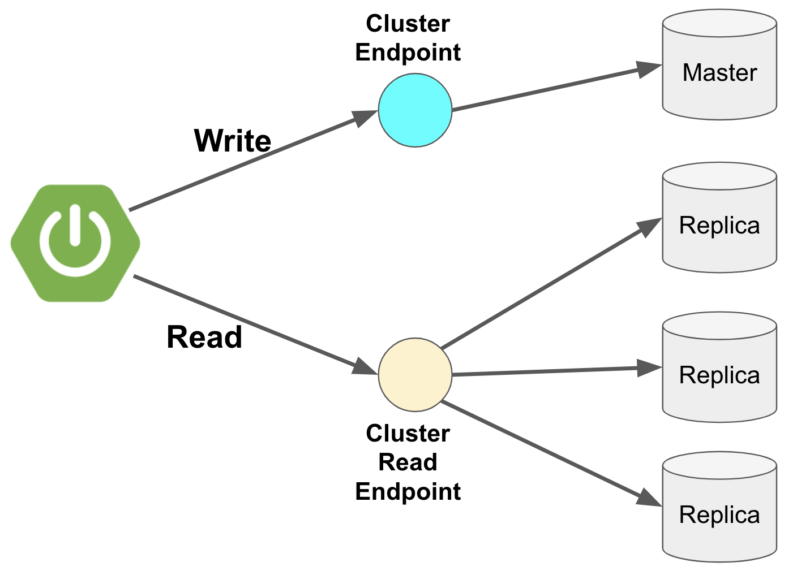
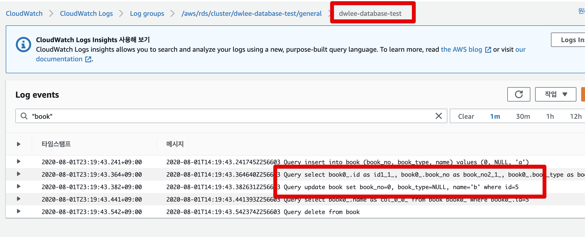
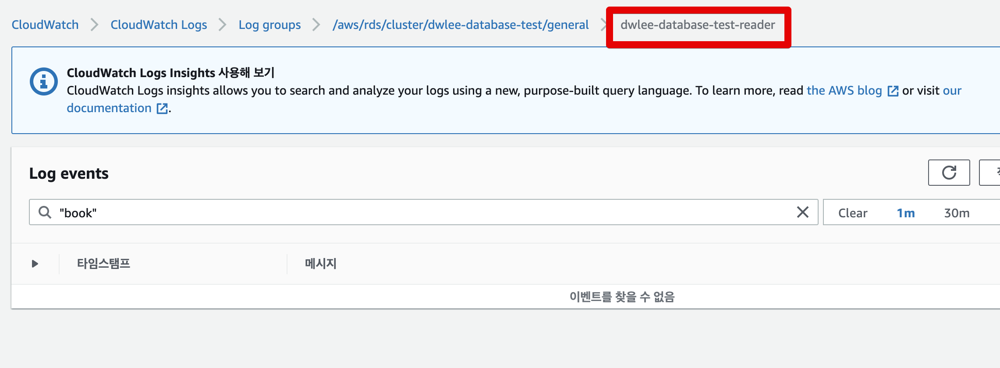

# JPA에서 Reader DB 사용하기 (feat. AWS Aurora)

[이전 시간](https://jojoldu.tistory.com/506) 에 AWS Aurora 환경에서 Spring Batch ItemReader가  Reader DB를 사용 하는 것에 대해서 소개 드렸는데요.  
  
이번엔 일반적인 JPA 기반의 웹 애플리케이션에서 Reader DB는 어떻게 사용할지에 대해서 소개드리겠습니다.  
  
AWS Aurora 기반의 환경이라고 하면 아래와 같은 환경을 이야기 합니다.



일반적으로 DB의 확장이라고 하면 Write 요청은 Master로만 발생시키고, 나머지 Replica 되고 있는 DB들은 조회용 (ReaderDB) 으로 사용하는 구조인데요.  
  
그렇다면 조회 요청에 한해서 어떻게 ReaderDB로 보낼지, JPA에서 문제는 없는지 알아보겠습니다.  
  
## 1. 일반적인 사용법

이미 아시겠지만, ```@Transactional(readOnly=true)``` 가 선언되어있다면 **자동으로 ReaderDB로 요청**이 전달됩니다.  
  
> 만약 정상적으로 ReaderDB 호출이 안된다면 jdbc-url에 클러스터 엔드 포인트와 리더 엔트포이트를 둘다 등록하면 된다.  
> ex: ```jdbc-url: jdbc:mysql:aurora://클러스터엔드포인트:포트,리더엔드포인트:포트```   

즉, 아래와 같이 사용하시면 ReaderDBs


아래와 같이 선언하여도 ```@Transactional``` 의 기본 propagation 이 ```REQUIRES``` 라서 
상위 호출자의 트랜잭션을 같이 사용한다.

```java
@RequiredArgsConstructor
@Repository
public class BookQueryRepository {
    private final JPAQueryFactory queryFactory;

    @Transactional(readOnly = true)
    public Book getBookById (Long bookId) {
        return queryFactory
                .select(book)
                .from(book)
                .where(book.id.eq(bookId))
                .fetchOne();
    }
}
```

그래서 아래와 같이 

```java
@RequiredArgsConstructor
@Repository
public class BookQueryRepository {
    private final JPAQueryFactory queryFactory;

    @Transactional(readOnly = true, propagation = Propagation.REQUIRES_NEW)
    public Book getBookById (Long bookId) {
        return queryFactory
                .select(book)
                .from(book)
                .where(book.id.eq(bookId))
                .fetchOne();
    }
}
```







## 정리

정리하면 다음과 같다.

* 일반적으로는 Service 혹은 Repository에 ```@Transactional(readOnly = true)``` 를 걸어주면 쿼리는 Reader DB로 호출된다.
* 다만 Repository에 ```@Transactional(readOnly = true)```가 있어도 상위 호출자인 Service에서 ```@Transactional``` 로 되어있다면 MasterDB를 호출한다.
    * 이는 ```@Transactional``` 의 기본 propagation 이 ```REQUIRES``` 이기 때문이다.
    * Repository의 propagation 을 ```REQUIRES_NEW``` 으로 지정하면 ReadOnly 트랜잭션이 신규 생성되어 ReaderDB로 호출이 전달된다.
    * 단, 이럴 경우 DirtyChecking이 안되기 때문에 DirtyChecking이 필요할 경우 적용하지 않는다.  