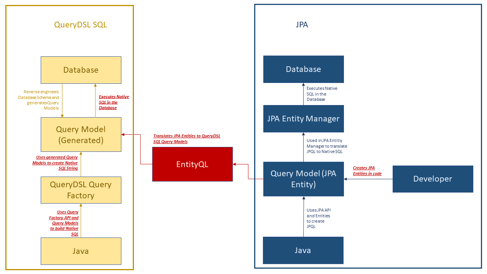

# 화성에서 온 Querydsl, 금성에서 온 Mysql


querydsl-jpa 를 소개하는 자리
querydsl-sql은 해당하지 않는다.

즉, JPQL에서 지원하지 않으면 querydsl이라고 뾰족한 수가 있진 않다.


## 1. 성능 이슈

### 테스트 환경

* Java 8
* Querydsl 4.2.1
* MySQL 5.6 (MariaDB 10.1)

MySQL 5.6 에서는 [인덱스 컨디션 푸시다운](https://jojoldu.tistory.com/474)과 [서브쿼리](https://jojoldu.tistory.com/520) 등의 최적화가 있었습니다.  
그만큼 MySQL 버전별로 인덱스나 옵티마이저 개선이 많이 되어있어서 버전별 차이가 심합니다.  
  
Querydsl의 경우에도 2,3,4 로 오면서 문법적인 것에서 변화가 있었기 때문에 아래 내용을 적용시에는 꼭 현재 환경에서 테스트를 진행해시길 추천드립니다.

### exist 사용하지 않기

### Entity 보다는 Dto를 사용한다

core한 로직을 다루는 Entity에 **서비스 모듈별 로직이 모두 담기게 된다**

### constantAs 적극 사용하기

이미 특정값을 알고 있는 경우엔 constantAs로 불필요한 컬럼 조회를 제거한다.

### select 필드에 entity 사용하지 않기

oneToOne에서 N+1 문제가 난리난다.
여기서 oneToOne 매핑을 Embeddable 로 풀 수 없는 경우도 있다.
(주문-업주 관계에서 업주 정보를 Embeddable로 볼 수 있을까?)

### select 필드에 entity가 있을 경우 distinct는 절대 쓰지 않는다.

### 정렬이 필요 없는 group by는 정렬 제거하기

#### 페이징이 필요 없는 정렬 조회는 애플리케이션에서 정렬하기

### 서브쿼리 대신 Join으로

MySQL 5.6 부터는 서브쿼리가 대폭 개선되어서 조회시 조건문에 사용되는 서브쿼리에는 성능 저하가 없습니다.

> MySQL 5.5까지는 where에 서브쿼리가 있을 경우 드라이빙 테이블의 row 1건마다 서브쿼리가 실행되는 DEPENDENT SUBQUERY 였습니다.

다만, 아래 조건에서는 서브쿼리 최적화가 적용되지 않습니다.

* IN ()
이렇게 **서브쿼리 최적화가 적용되지 않는 조건을 매번 기억하기는 어려우니**, 

in 절에 select 쿼리를 넣을시 성능상 이슈가 발생할 수 있다.
서브쿼리로 조회된 결과 데이터를 임시 테이블에 적재해서 처리하는데,
이 데이터의 양이 **메모리에서 처리할 수 없는 규모일 경우** 디스크에 임시 테이블을 생성해서 처리하게 된다.

### 커버링 인덱스는 두번의 쿼리로

```sql
select *
from usertest
where chgdate like '2010%'
limit 100000, 100
```

```sql
select a.*
from (
      select userno
      from usertest
      where chgdate like '2012%'
      limit 100000, 100
) b join usertest a on b.userno = a.userno
```


* 카카오뱅크 MySQL DBA이신 [성동찬님의 커버링 인덱스 소개글](https://gywn.net/2012/04/mysql-covering-index/)
* Non Clustered Key, Clustered Key를 포함한 [커버링 인덱스 기본 지식](https://jojoldu.tistory.com/476)

Querydsl의 경우 **from절의 subquery를 지원하지 않습니다**.  
그래서 이럴 경우엔 다음처럼 2번의 쿼리로 나눠서 호출합니다.

### Bulk Insert는 entityql도 고려해본다



#### 단점

* 모든 컬럼에 ```@Column```과 ```name```을 선언해야함
* primitive type을 사용할 수 없다 (int, long 등등)


## 2. 팀 컨벤션


### 상속 (extends) / 구현 (implements) 없이 사용하기

아래와 같은 형태의 Querydsl Repository는 사용하지 않는다.

```java
ARepository extends QuerydslRepositorySupport
```

```java
BRepositoryImpl implements BRepositoryCustom
```

core repsotory에 둘 것인가, 서비스 Repository에 둘 것인지 구분한다.  
서비스 repository들은 모두 아래와 같이 querydslFactory만 받아서 사용한다.

```java
@RequiredArgsConstructor
@Repository
public class AcademyQueryRepository {
    private final JPAQueryFactory queryFactory;

    public List<Academy> findByName(String name) {
        return queryFactory.selectFrom(academy)
                .where(academy.name.eq(name))
                .fetch();
    }
}
```

결국 Querydsl은 ```JPAQueryFactory``` 만 있으면 사용할 수 있다는 점을 명심하자.

### Projection은 fields를 사용한다

Projection을 위해 setter나 생성자를 추가할 경우 서비스 로직에서 무분별하게 사용될 여지가 있다.

```java
/* BAD example 1. */
queryFactory
.select(Projections.beans(DmGiveDetailDto.class,
      give.id.as("giveId"),
      adBond.amount.as("adBondAmount")
))
.from(give)
.innerJoin(give.giveAdBonds, giveAdBond)
.innerJoin(giveAdBond.adBond, adBond)


/* BAD example 2. */
queryFactory
.select(Projections.constructor(DmGiveDetailDto.class,
      give.id.as("giveId"),
      adBond.amount.as("adBondAmount")
))
.from(give)
.innerJoin(give.giveAdBonds, giveAdBond)
.innerJoin(giveAdBond.adBond, adBond)
```

명시적으로 setter와 생성자는 배제한다.
setter와 생성자는 그 의도가 명확한 서비스 로직이 필요한 경우에만 등록한다.


```java
/* GOOD example */
queryFactory
.select(Projections.fields(DmGiveDetailDto.class,
      give.id.as("giveId"),
      adBond.amount.as("adBondAmount")
))
.from(give)
.innerJoin(give.giveAdBonds, giveAdBond)
.innerJoin(giveAdBond.adBond, adBond)
```

### if문 대신 BooleanExpression

### 같은 타입은 별도 캐스팅하지 않는다.


### selectDistinct 보다는 distinct 를 사용한다.


코드리뷰 과정에서 selectDistinct는 select로 착각하고 넘어가는 경우가 빈번하다.


```java
/* BAD example */
queryFactory
.selectDistinct(give)
.from(give)
.innerJoin(give.giveAdBonds, giveAdBond)
.innerJoin(giveAdBond.adBond, adBond)
```

명확하게 distinct()를 별도로 빼서 코드리뷰때 놓치지 않도록 한다.

```java
/* GOOD example */
queryFactory
.select(give).distinct()
.from(give)
.innerJoin(give.giveAdBonds, giveAdBond)
.innerJoin(giveAdBond.adBond, adBond)
```


### JPAQueryFactory 가 필요할땐 JPAQueryFactory 의존성을 주입받는다


**직접 EntityManager를 주입 받아 사용하지 않는다**.


```java
/* BAD example */
private final EntityManager em;
...


new JPAQueryFactory(em).delete(테이블)
      .where(...).execute();
```


JPA를 다루는 Sub Module에서 JPAQueryFactory Bean을 등록한 상태이다. 


```java
@Configuration
@EnableJpaAuditing // JPA Auditing 활성화
public class JpaConfig {
    @PersistenceContext
    private EntityManager entityManager;

    @Bean
    public JPAQueryFactory jpaQueryFactory() {
        return new JPAQueryFactory(entityManager);
    }
}
```

즉, 불필요하게 계속 JPAQueryFactory 인스턴스를 만들 필요가 없다.  
위 예제는 아래 코드처럼 사용하면 된다.

```java
/* GOOD example */
private final JPAQueryFactory queryFactory;
...


queryFactory.delete(테이블)
      .where(...).execute();
```

## 3. 의도치 않은 쿼리 주의

### dto를 조회할때 distinct는 권장하지 않는다.

distinct는 조회 컬럼 전체가 동일할 경우 하나로 합쳐버린다.  
즉, **서로 다른 데이터 임에도 하나로** 나을 수가 있다.  
아래 같은 경우 customerId와 giveAmount가 동일하면 1개로 조회된다 (실제로 다른 row라 하더라도)


```java
/* BAD example */
queryFactory
.select(Projections.fields(DmGiveDetailDto.class,
      give.customer.id.as("customerId"), // 같은 customer의
      give.amount.as("giveAmount") // 서로 다른 give 지만 amount가 같은 경우
))
.distinct()
.from(give)
```

그래서 Dto를 쓸때 ```distinct``` 는 **진짜 필요한지** 한번 더 고민해보고, 유의해서 사용한다.


### oneToOne 관계에선 alias를 꼭 선언한다.

oneToOne 에서 Cross Join 발생한다.

```java
from(parent).innerJoin(parent.child).fetch()
    .where(parent.something.gt(parent.child.somthing))
```

```java
from(parent).innerJoin(parent.child, child).fetch() // as 처리가 필요함.
    .where(parent.something.gt(child.somthing))
```


