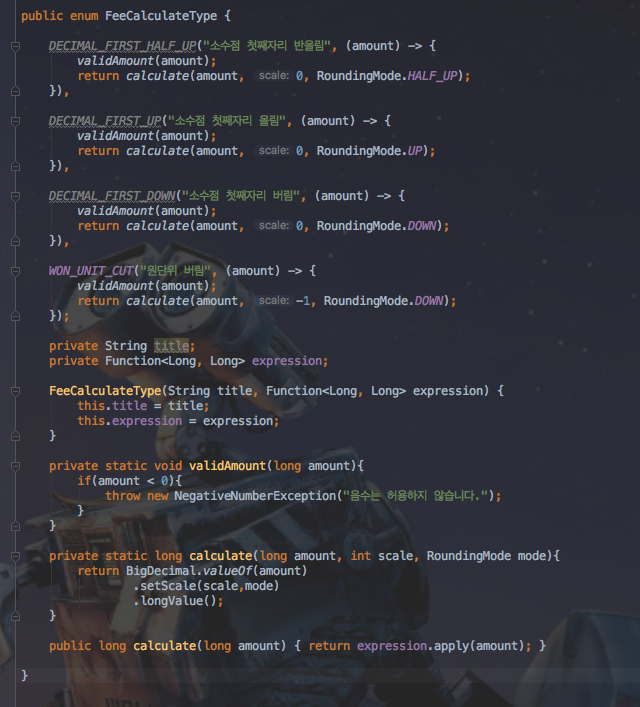
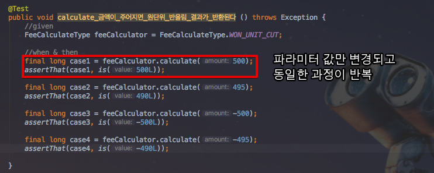
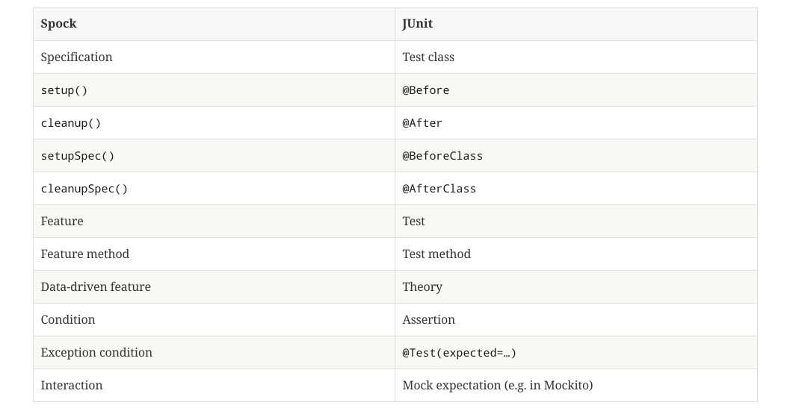

# spring-boot-spock

안녕하세요? 이번 시간엔 spring-boot-spock 예제를 진행해보려고 합니다.  
모든 코드는 [Github](https://github.com/jojoldu/blog-code/tree/master/spring-boot-spock)에 있기 때문에 함께 보시면 더 이해하기 쉬우실 것 같습니다.  
(공부한 내용을 정리하는 [Github](https://github.com/jojoldu/blog-code)와 세미나+책 후기를 정리하는 [Github](https://github.com/jojoldu/review), 이 모든 내용을 담고 있는 [블로그](http://jojoldu.tistory.com/)가 있습니다. )<br/>
 

## 소개

> BDD는 한 TDD 실천자가 테스트의 의도를 더 명확하게 표현하기 위한 용어를 찾는 과정에서 탄생하였다.  
사실 테스트라는 단어는 **원하는 동작을 정의한다는 정신을 잘 반영하지 못하며 의미가 너무 함축적**이다.  
개발자 커뮤니티에서는 테스트와 테스트메소드보다는 **명세와 행위**라는 용어를 거론하기 시작했다.  
더 적합한 용어를 찾는 노력의 부산물로, BDD 커뮤니티는 JUnit 등 기존 테스트 프레임워크의 대안도 다수 만들어낼 수 있었다.
(Effective Unit Testing p.240)

Spock을 소개하기전에 꼭 읽어보셨으면해서 책의 한 구절을 소개드렸습니다.  
Spock은 **BDD 프레임워크**입니다.  
TDD프레임워크인 JUnit과 비슷한 점이 많으나, **기대하는 동작과 테스트의 의도를 더 명확하게 드러내주고 산만한 코드는 뒤로 숨겨주는 등**의 큰 장점이 있습니다.  
아직까지 JUnit을 많이 사용하시겠지만, Spock을 소개드리고 싶습니다.  
(저도 최근까지 JUnit만 쓰다가 팀내 선임님의 적극적인 사용으로 조금씩 시작하게 되었습니다^^;)

## 1. Java

소수점 자리에 맞춰 반올림/올림/버림 하는 ```Enum```을 생성하여 테스트를 진행해보겠습니다.  



위 ```Enum``` 타입이 계산을 올바르게 하는지 검증하기 위한 테스트 코드를 작성합니다. 

### 1-1. 기존 JUnit 테스트 코드

JUnit으로 테스트 코드를 작성하다보면 몇가지 문제점을 만나게 됩니다.


1. 이 중 어느 ```assertThat```을 써야할까요?


2. ```is```는 어떤걸 써야할까요?
 


3. 파라미터만 변경되고 동일한 과정이 반복되는데 과정 자체를 재사용할순 없을까요?
4. case1, case2, case3, case4를 별도의 테스트처럼 보일순 없을까요?

이번엔 음수가 입력되었을때 정상적으로 Exception이 발생하는지 테스트 케이스를 만들어 보겠습니다.


음수가 발생했을때 정상적으로 ```NegativeNumberException```이 발생하는지 테스트하는 코드입니다.  

5. JUnit을 처음 보시는 분들은 이 코드의 검증 코드가 어디있는지 어떻게 알수 있을까요?  
6. 테스트 코드의 길이가 길어진다면, 마지막까지 코드를 읽은 후 **예상 결과를 확인 하기 위해 다시 메소드의 첫줄로 이동**해야만 합니다.  
  
JUnit을 사용하면 위와 같은 불편함을 빈번하게 직면합니다.  
이런 불편함을 Spock을 통해 해소해보겠습니다.

### 1-2. Spock 설치

Spock을 사용하기 위해선 의존성 도구(Maven, Gradle)에 2개의 의존성 추가가 필요합니다.

```groovy
testCompile('org.spockframework:spock-core:1.1-groovy-2.4') // Spock 의존성 추가
testCompile('org.spockframework:spock-spring:1.1-groovy-2.4') // Spock 의존성 추가
``` 

추가로 groovy가 필요하기 때문에 build.gradle에 groovy 플러그인 추가가 필요합니다.


```groovy

apply plugin: 'groovy' // groovy 지원

```

위와 같이 설정하면 Spock을 사용할 수 있는 환경설정은 끝입니다.  
  
이제 기본적인 사용법을 소개드리겠습니다.

### 1-3. Spock 기본 사용법


groovy 언어로 작성하기 때문에 **테스트 메소드 이름을 문자열로** 작성할 수 있게 되었습니다.  
Java에서도 한글 메소드명이 가능하긴 했지만 띄어쓰기, 가장 앞에 특수문자 사용하기 등의 제약조건이 있는 반면 groovy는 이 모든 제약 조건에서 빠져나올수 있습니다.  
이제는 정말 명확하게 이 테스트 케이스의 의도를 표현할 수 있게 되었습니다.  
  
처음보는 코드라도 이해하시는데 크게 어려움은 없으시겠지만, 예약어들에 대한 소개는 아래와 같습니다.

* ```Specification```: ```extends``` 하면 ```Spock Test``` 클래스가 됩니다.  
* ```def``` : groovy의 동적 타입 선언(메소드, 변수에 모두 사용할 수 있음. JS의 ```var``` 같은 존재)
  * ```def``` 대신에 Java처럼 실제 클래스 타입을 명시할 수도 있습니다.
* ```given```, ```when```, ```then``` : Spock의 feature 메소드

 ```given:```, ```when:```, ```then:```등과 같은 메소드를 Spock에선 **feature** 메소드라고 합니다.  
이 3개외에 추가로 3개가 더 있어 총 6단계의 라이프사이클을 가지고 있습니다.  


(출처: [spock 공식 문서](http://spockframework.org/spock/docs/1.0/spock_primer.html))

1. ```given``` (혹은 ```setup```) : 테스트 하기 위한 기본 설정작업 (테스트 환경 구축)
2. ```when``` : 테스트할 대상 코드를 실행 (Stimulus)
3. ```then``` : 테스트할 대상 코드의 결과를 검증 (이 메소드 범위에선 한줄한줄이 자동 assert가 됩니다.) 
4. ```expect``` : 테스트할 대상 코드를 실행 및 검증 (when + then)
5. ```where``` : feature 메소드를 파라미터로 삼아 실행시킵니다.

다른 메소드들은 많이들 들어보셨을텐데, ```where```에 대해서는 생소하실것 같습니다.  
 ```where``` 블록에 대해선 [공식 문서 - Where Blocks](http://spockframework.org/spock/docs/1.0/spock_primer.html) 에 있는 예시가 정말 좋아 해당 예시를 통해 소개하겠습니다.


위 코드는 ```Math.max(a, b) == c``` 테스트 코드의 a,b,c에 각각 ```5```, ```1```, ```5```와 ```3```, ```9```, ```9```를 입력하여 실행하게 됩니다.  
즉, ```where```는 **feature 메소드를 파라미터화하여 실행**합니다.  
  
자 그럼 이제 Spock을 통해 JUnit 테스트 코드를 개편해보겠습니다.

### 1-4. Spock으로 전환한 테스트 코드

첫번째 테스트 케이스를 Spock으로 전환해보겠습니다.


여기서 ```@Unroll```이 정말 재밌는 예약어입니다.  
메소드 이름에 ```#변수명```으로 되어있으면 ```where```에 지정된 


2번째 테스트 케이스(Exception 검증)을 Spock으로 전화해보겠습니다.


### 1-5. Spock과 JUnit 비교

Spock이 조금 생소한 용어를 사용하고 있지만, JUnit과 크게 다르지 않은 사용법을 제공하고 있습니다.  
아래는 Spock과 JUnit의 대치되는 예약어를 비교한 것입니다.



(출처: [공식문서](http://spockframework.org/spock/docs/1.0/spock_primer.html))


## 2. SpringBoot + Spock

이제는 실제 SpringBoot 환경에서 Spock을 어떻게 사용할지에 대해 소개드리겠습니다.  
참고로 Spock은 모든 Spring 코드를 Java와 동일하게 사용할 수 있습니다.  

참고로 ```@RunWith(SpringRunner.class)```는 Spock 테스트에서 사용하지 않습니다.  


보시는 것처럼 ```SpringRunner``` 클래스는 이전에 사용하던 ```SpringJUnit4ClassRunner```를 확장한 클래스이다보니 JUnit을 사용할때 필요한것이기 때문입니다.  


### 2-1. 기본 사용법

간단하게 Repository 기능을 테스트해보겠습니다.  


### 2-2. SpringBatch

### 2-3. @MockBean, @SpyBean

## 출처

* [Naver D2 - Spock으로 테스트하기](http://d2.naver.com/helloworld/568425)
* [spockframework.org](http://spockframework.org/spock/docs/1.0/spock_primer.html)