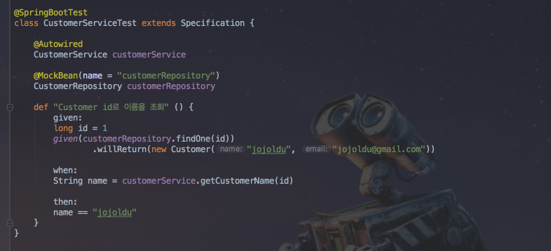
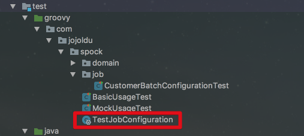
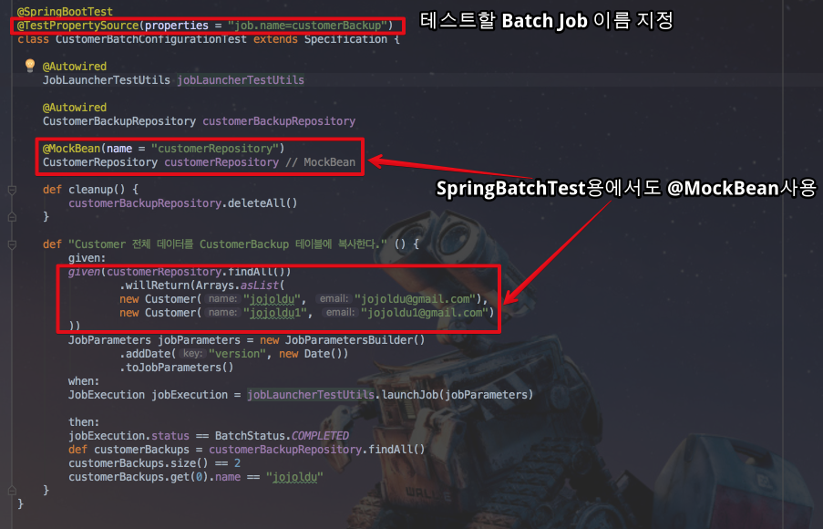

# Spock

안녕하세요? [저번시간](http://jojoldu.tistory.com/228)에 이어 Spring Boot & Spock 예제를 진행해보려고 합니다.  
모든 코드는 [Github](https://github.com/jojoldu/blog-code/tree/master/spring-boot-spock)에 있기 때문에 함께 보시면 더 이해하기 쉬우실 것 같습니다.  
(공부한 내용을 정리하는 [Github](https://github.com/jojoldu/blog-code)와 세미나+책 후기를 정리하는 [Github](https://github.com/jojoldu/review), 이 모든 내용을 담고 있는 [블로그](http://jojoldu.tistory.com/)가 있습니다. )<br/>

## 2. SpringBoot + Spock

실제 SpringBoot 환경에서 Spock을 어떻게 사용할지에 대해 소개드리겠습니다.  
Spock은 모든 Spring Boot 테스트 코드를 **JUnit과 거의 흡사하게 사용할 수 있어 아주 쉽게 적용**할 수 있습니다.  
기본적인 사용법부터 하나씩 진행하겠습니다.

### 2-1. 기본 사용법

스프링 컨텍스트를 호출하여 검증하는 간단한 테스트 코드를 작성해보겠습니다.


 ```Bean```으로 등록된 ```CustomerRepository```을 호출하여 ```findAll()``` 메소드를 검증하는 코드입니다.  
기존 JUnit과 동일하게 ```@SpringBootTest```를 사용하여 스프링 테스트 컨텍스트를 생성후, ```@Autowired```를 사용하여 필요한 의존성들을 주입받아 테스트하고 있습니다.  
  
기존 JUnit과 크게 사용법이 다르지 않아 Spock을 처음 접하셔도 전혀 위화감이 없는 코드라고 생각합니다.  
  
앞서 1부에서 소개한 기능 외에 ```setup```, ```cleanup```이란 새로운 코드가 보입니다.

* setup
  * JUnit의 ```@Before```와 같은 기능
  * 모든 테스트 메소드가 **각각 실행되기 전에 수행**됩니다. 
* cleanup
  * JUnit의 ```@After```와 같은 기능
  * 모든 테스트 메소드가 **각각 실행된 후에 수행**됩니다.

이외에도 ```setupSpec```, ```cleanupSpec```등이 더 있는데, 이런 메소드를 보고 Spock에선 [fixture 메소드](http://spockframework.org/spock/docs/1.1-SNAPSHOT/all_in_one.html#_fixture_methods) 라고 합니다.  
관련해선 위 링크를 통해 공식 문서를 보시면 바로 이해하실수 있습니다.  
  
JUnit 코드와 다른 점이 한가지 더 있다면 ```SpringRunner.class```가 빠진것입니다.  
 ```@RunWith(SpringRunner.class)```는 Spock 테스트에서 사용하지 않습니다.  


보시는 것처럼 ```SpringRunner``` 클래스는 이전에 사용하던 ```SpringJUnit4ClassRunner```를 확장한 클래스이다보니 JUnit을 사용할때 필요하며 Spock에선 사용되지 않습니다.  
그 외에는 JUnit과 똑같이 사용하시면 됩니다.  
  
기본적인 사용법이 끝났으니, Mock 테스트 코드를 사용해보겠습니다.

### 2-2. @MockBean, @SpyBean

SpringBoot의 ```@MockBean```, ```@SpyBean```에 대한 기본적인 사용법은 이전 [포스팅](http://jojoldu.tistory.com/226)을 참고하시면 될것 같습니다.  
  
간단하게 ```@MockBean```을 이용한 테스트 코드를 작성해보겠습니다.



첫번째 예제와 마찬가지로 ```@SpringBootTest```만 선언한 후 (```extends Specification```은 하셔야 합니다) ```CustomerRepository```를 Mock Bean으로 등록하였습니다.  
  
mocking 한 기능은 ```findOne(id)```를 호출할 경우 ```"jojoldu", "jojoldu@gmail.com``` 리턴하도록 ```given:```에 추가한 코드입니다.  
 (```given(customerRepository.findOne(id)).willReturn(new Customer("jojoldu", "jojoldu@gmail.com"))```)  

아마 ```given()```를 작성하면 자동으로 import가 안되실 수 있는데 그럴 경우엔 ```import static org.mockito.BDDMockito.given```를 바로 입력하시면 됩니다.  

어떠신가요? ```@MockBean```도 JUnit과 크게 다르지 않음을 확인할 수 있습니다.  
 ```@SpyBean```은 ```@MockBean```과 사용법이 동일하기 때문에 별도로 설명을 추가하지 않겠습니다^^;

### 2-3. Spring Boot Batch

마지막으로 SpringBoot Batch에서 Spock을 사용한 테스트 코드를 작성해보겠습니다.  
먼저 프로젝트에 SpringBoot Batch와 관련된 의존성들을 추가하겠습니다.  
Gradle 기준으로는 아래와 같습니다.  

```groovy
compile('org.springframework.boot:spring-boot-starter-batch') // spring boot batch
compile('org.springframework.batch:spring-batch-test') // spring batch test
```

그리고 테스트 환경 구축을 위해 ```TestJobConfiguration``` groovy 클래스를 아래 위치에 생성하겠습니다.  



이 Configuraion 클래스에선 ```JobLauncherTestUtils```, Batch Test와 관련된 어노테이션들을 추가합니다.

```groovy
@EnableBatchProcessing
@Configuration
@EnableAutoConfiguration
@ComponentScan
class TestJobConfiguration {

    @Bean
    JobLauncherTestUtils jobLauncherTestUtils() {
        return new JobLauncherTestUtils();
    }
}
```

테스트 환경 구축은 끝났습니다!  
자 그럼 Batch Job을 위한 관련 클래스들을 생성하겠습니다.  
  
  
**CustomerBackup**

```java
@Entity
@Getter
@NoArgsConstructor
public class CustomerBackup {

    @Id
    @GeneratedValue(strategy = GenerationType.IDENTITY)
    private Long id;

    private String name;
    private String email;
    private Long customerId;

    public CustomerBackup(Customer customer) {
        this.name = customer.getName();
        this.email = customer.getEmail();
        this.customerId = customer.getId();
    }
}
```

**CustomerBackupRepository**

```java
public interface CustomerBackupRepository extends JpaRepository<CustomerBackup, Long>{
}
```

테스트해볼 Job은 다음과 같습니다.

```java
@Configuration
@ConditionalOnProperty(name = "job.name", havingValue = JOB_NAME)
public class CustomerBackupBatchConfiguration {
    public static final String JOB_NAME = "customerBackup";
    private static final String STEP_NAME = JOB_NAME+"Step";

    private JobBuilderFactory jobBuilderFactory;
    private StepBuilderFactory stepBuilderFactory;
    private CustomerRepository customerRepository;
    private CustomerBackupRepository customerBackupRepository;

    public CustomerBackupBatchConfiguration(JobBuilderFactory jobBuilderFactory, StepBuilderFactory stepBuilderFactory, CustomerRepository customerRepository, CustomerBackupRepository customerBackupRepository) {
        this.jobBuilderFactory = jobBuilderFactory;
        this.stepBuilderFactory = stepBuilderFactory;
        this.customerRepository = customerRepository;
        this.customerBackupRepository = customerBackupRepository;
    }

    @Bean
    public Job job() {
        return jobBuilderFactory.get(JOB_NAME)
                .flow(step())
                .end()
                .build();
    }

    @Bean
    public Step step() {
        return stepBuilderFactory.get(STEP_NAME)
                .tasklet(backup())
                .build();
    }

    @Bean
    @StepScope
    public Tasklet backup(){
        return (contribution, chunkContext) -> {
            List<Customer> customers = customerRepository.findAll();
            List<CustomerBackup> customerBackups = customers.stream()
                    .map(CustomerBackup::new)
                    .collect(Collectors.toList());

            customerBackupRepository.save(customerBackups);

            return RepeatStatus.FINISHED;
        };
    }
}
```

(Spring Batch를 이미 경험하셨다고 가정하고 진행합니다.)  
  
위 코드는 ```Customer```의 전체 데이터를 읽어와 ```CustomerBackup``` 테이블로 복사하는 Batch Job이며 Job의 이름은 ```customerBackup```입니다.  

> 기본적으로 item -> processor -> writer 구조를 사용해야하지만, 여기선 Spock의 테스트 방법을 소개하는것이 메인 내용이기 때문에 간단하게 ```Tasklet```으로 배치 코드를 작성하겠습니다.  
  
코드가 간단하기 때문에 바로 Spock 테스트 코드를 작성하겠습니다.



 ```@TestPropertySource```로 테스트할 Job을 지정하였습니다.  
그 아래에는 백업할 데이터를 가져오는 ```CustomerRepository```는 ```@MockBean```으로 등록하여 read 과정을 간략하게 하였습니다.  
  
 ```given:```에서는 ```JobParameter```를 비롯한 Batch Test에 필요한 데이터들을 생성하고, ```when:```에서 Batch Job을 실행합니다.  
(```jobLauncherTestUtils.launchJob()```)  
  
마지막 검증단계 (```then:```)에선 Job이 잘 수행되었는지 (```jobExecution.status == BatchStatus.COMPLETED```)를 검증하고, 실제 백업 테이블에 데이터가 복사되었는지 검증합니다.  
  
전체 코드를 다시 한번 보겠습니다.  
JUnit으로 SpringBootTest 사용하는 것과 많이 다르신가요?  
Spock을 사용하기 위해 뭔가 또 새로 배워야하는게 아닐까 라고 부담스러워하시는 분들에게 전혀 그런 걱정 하실 필요가 없다고 말씀드리고 싶습니다.  
  
**Spock의 장점은 사라지지 않으면서 JUnit과 유사한 방식으로 SpringBootTest를 사용**할 수 있습니다.  
  
## 마무리

Spock을 이제 업무에서 활용하고 있는 단계라 아직 미숙한점이 많습니다.  
급한 업무에선 아직 JUnit으로 테스트 코드를 작성할만큼 익숙하지 않은 상태입니다.  
그만큼 모르는게 많기 때문에 포스팅할거리가 많다고 혼자서 긍정적으로 생각하고 있습니다^^;  
업무에서 계속 사용하면서 여러 상황에서의 사용법, 문제해결 방법들을 지속적으로 기록하겠습니다.  
  
끝까지 읽어주셔서 감사합니다!