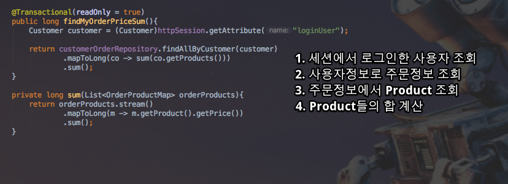

# @MockBean, @SpyBean

안녕하세요? 이번 시간엔 SpringBoot의 @MockBean, @SpyBean 예제를 진행해보려고 합니다.  
모든 코드는 [Github](https://github.com/jojoldu/blog-code/tree/master/spring-mock-spy-bean)에 있기 때문에 함께 보시면 더 이해하기 쉬우실 것 같습니다.  
(공부한 내용을 정리하는 [Github](https://github.com/jojoldu/blog-code)와 세미나+책 후기를 정리하는 [Github](https://github.com/jojoldu/review), 이 모든 내용을 담고 있는 [블로그](http://jojoldu.tistory.com/)가 있습니다. )<br/>


## 소개

[SpringBoot 1.4](https://docs.spring.io/spring-boot/docs/current/reference/html/boot-features-testing.html#boot-features-testing-spring-boot-applications-mocking-beans)에 도입된 2개의 테스트 어노테이션 ```@MockBean```, ```@SpyBean```을 소개드리려고 합니다.  

기존에 테스트 코드를 작성하면 하나의 Service 메소드 단위로 테스트를 수행하는 경우가 많습니다.  
서비스 메소드가 단순하다면 문제가 없지만 보통은 여러 레파지토리와 비지니스 로직이 함께 있습니다.  
이 테스트 메소드가 검증하는데 수행되는 시간이 10분이라면 어떨까요?  
**피드백이 늦어질수록 생산성은 극도로 낮아집니다.**


### 테스트더블

목적에 따라 비슷한듯하면서도 다른 객체를 사용하는 모든 행위를 **테스트 더블**이라 합니다.  

종종 


* 테스트 대상 코드 격리
* 테스트 속도 개선
* 예측 불가능한 실행 요소 제거
* 특수한 상황 테스트 가능
* 


Customer.java

```java

@Entity
@Getter
@NoArgsConstructor
public class Customer {

    @Id
    @GeneratedValue
    private Long id;

    @Column(nullable = false)
    private String name;

    @Column(nullable = false)
    private String email;

    @Column(nullable = false)
    private String mobileNumber;

    @Builder
    public Customer(String name, String email, String mobileNumber) {
        this.name = name;
        this.email = email;
        this.mobileNumber = mobileNumber;
    }
}

```

CustomerOrder.java

```java
@Entity
@Getter
@NoArgsConstructor
public class CustomerOrder {

    @Id
    @GeneratedValue
    private Long id;

    @Column(nullable = false)
    private LocalDateTime orderDateTime;

    @Column(nullable = false)
    private String address;

    @Column(nullable = false)
    private boolean isGiftPackaging;

    private String memo;

    @OneToOne
    @JoinColumn(name = "customer_id", foreignKey = @ForeignKey(name = "FK_ORDER_CUSTOMER"))
    private Customer customer;

    @OneToMany(mappedBy = "customerOrder", cascade = CascadeType.ALL, orphanRemoval = true)
    private List<OrderProductMap> products = new ArrayList<>();

    @Builder
    public CustomerOrder(LocalDateTime orderDateTime, String address, boolean isGiftPackaging, String memo, Customer customer, List<OrderProductMap> products) {
        this.orderDateTime = orderDateTime;
        this.address = address;
        this.isGiftPackaging = isGiftPackaging;
        this.memo = memo;
        this.customer = customer;
        this.products = products;
    }

    public void addProduct(Product product){
        if(this.products == null){
            this.products = new ArrayList<>();
        }

        this.products.add(new OrderProductMap( this, product));
    }
}

```

Product.java

```java
@Entity
@Getter
@NoArgsConstructor
public class Product {

    @Id
    @GeneratedValue
    private Long id;

    @Column(nullable = false)
    private String name;

    @Column(nullable = false)
    private long price;

    @Column(nullable = false)
    private LocalDate manufactureDate;

    @Builder
    public Product(String name, long price, LocalDate manufactureDate) {
        this.name = name;
        this.price = price;
        this.manufactureDate = manufactureDate;
    }
}
```


OrderProductMap.java

```java
@Entity
@Getter
public class OrderProductMap {

    @Id
    @GeneratedValue
    private Long id;

    @ManyToOne
    @JoinColumn(name = "customer_order_id", foreignKey = @ForeignKey(name = "FK_CUSTOMER_ORDER_MAP"))
    private CustomerOrder customerOrder;

    @ManyToOne
    @JoinColumn(name = "product_id", foreignKey = @ForeignKey(name = "FK_PRODUCT_MAP"))
    private Product product;

    public OrderProductMap(CustomerOrder customerOrder, Product product) {
        this.customerOrder = customerOrder;
        this.product = product;
    }
}

```

위와 같이 도메인 상황에서 




### @MockBean


### @SpyBean

현재 ```@SpyBean```은 DataJpaRepository 인터페이스에서는 작동되지 않습니다.  


[@SpyBean on Data Jpa Repository bean isn't working](https://github.com/spring-projects/spring-boot/issues/7033) 

