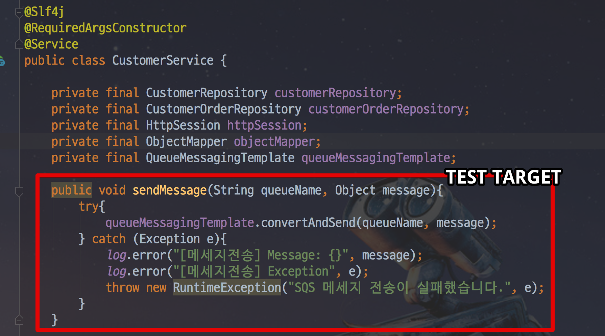
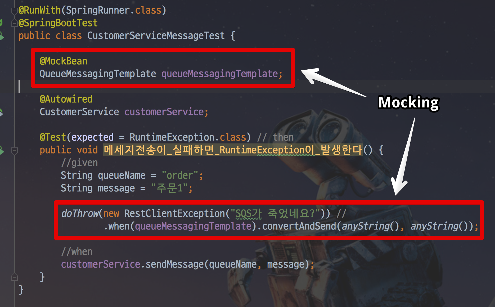
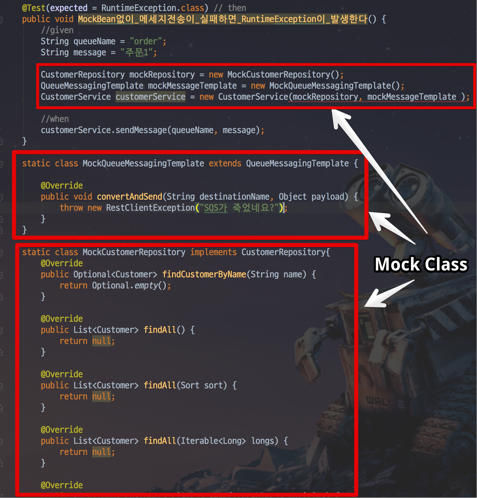
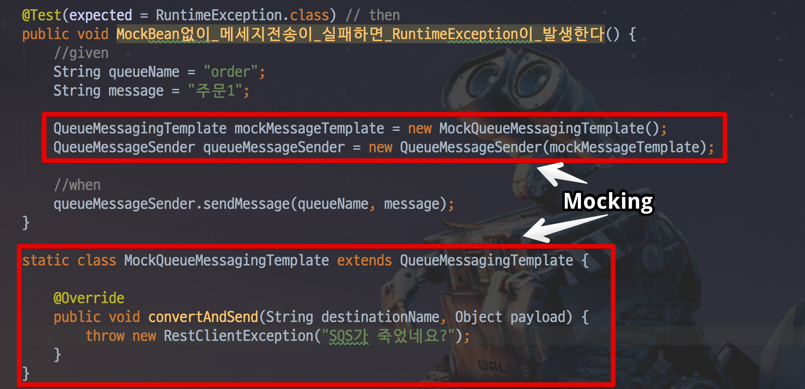

# @SpyBean @MockBean 의도적으로 사용하지 않기

보통 스프링 부트 관련 테스트 코드를 작성할때 ```@MockBean```과 ```@SpyBean``` 를 사용했습니다.  
(참고: [SpringBoot @MockBean, @SpyBean 소개](http://jojoldu.tistory.com/226))  
  
복잡한 스프링 프로젝트에서도 **원하는 코드만 아주 간단하게 Mock 처리를 할 수가 있어** 정말 많이 사용했습니다.  
  
그러다 최근에 Spring Boot Cloud 프로젝트의 테스트 코드를 보면서 제가 완전히 잘못하고 있음을 깨달았는데요.  
  
**대부분의 테스트 코드가 ```@MockBean```, ```@SpyBean```없이 작성**되있었습니다.   
마침 [정진욱님의 발표](https://www.inflearn.com/course/intellij-guide/)도 봤던지라, 저도 ```@MockBean```과 ```@SpyBean```없이 테스트 코드 작성을 시도해봤는데요.  
  
완전 큰 깨달음을 얻었습니다.  
샘플 예제로 한번 소개드리겠습니다.

## 예제

예를 들어서, AWS SQS로 메세지를 보내는 서비스 메소드를 테스트 한다고 가정해봅시다.



메세지를 보내고 실패가 나면 ```RuntimeException```으로 감싸서 던지는게 잘 수행되는지를 테스트 하고 싶습니다.  
기존처럼 ```@MockBean```을 통해 테스트 코드를 짜면 아래와 같이 됩니다.



보시는 것처럼 엄청 간단하게 작성됩니다.  
엄청 간단하게 작성된 것이 중요합니다.    
**대상 객체인 CustomerService가 테스트 하기 어려울 정도로 의존성이 물려있음에도** 아주 간단하게 테스트 코드가 작성된 것입니다.  
  
그럼 이 상황에서 ```@MockBean``` 없이 테스트 코드를 짜면 어떻게 될까요?



**Mocking 해야할 대상이 너무 많습니다**  
CustomerService가 의존하고 있는 모든 Bean 들의 MockClass 생성이 필요해서 테스트 코드 작성하기가 정말 힘듭니다.  
  
그럼 테스트 하기 좋은 코드로 될려면 어떻게 바꿔야할까요?  
결국 테스트 대상인 sendMessage 메소드가 의존하고 있는 의존성은 ```QueueMessagingTemplate``` 뿐입니다.  
그래서 **SQS에 메세지를 보내는 sendMessage를 별도의 컴포넌트로 분리**하면 됩니다.  


이렇게 되면 테스트 코드 작성하기가 아주 쉬워집니다.



sendMessage라는 **테스트 대상에 필요한 기능들만 완전히 격리되어 아주 쉽게 테스트 할 수 있는 코드가 되었습니다**.  

## 그래서?

여기서 ```@Mockbean```이 좋은게 아닌가?라는 의문이 드실 수 있는데요.  
오히려 반대입니다.  
CustomerService가 너무 많은 의존성을 갖고 있는, Code Smell이 나는 코드 임에도 불구하고 ```@MockBean```은 이를 눈치채지 못하게 합니다.

이때 알게된 것이, ```@MockBean```, ```@SpyBean``` 이 두 어노테이션의 가장 큰 문제점은 **좋은 디자인이 아님에도 테스트 코드 작성하기가 편해진다는 것**입니다.  

> 물론 ```@MockBean```, ```@SpyBean```으로 인해 Spring Context를 실행해야하는 것도 당연한 큰 단점입니다.


2개 어노테이션을 쓰지 않고, 테스트 코드를 작성하기 시작하면서 선순환이 시작되었습니다.

1. ```@MockBean```, ```@SpyBean``` 쓰지 않고 테스트 코드를 작성한다  
2. 테스트 코드 작성하기가 힘들다
3. 프로덕션 코드가 너무 많은 의존성에 물려있는게 아닌가 의심한다
4. 프로덕션 코드의 디자인을 개선한다
5. 다시 테스트 코드 작성을 시작한다.
6. ```@MockBean```, ```@SpyBean``` 없이 테스트 코드 작성하기가 수월하다.
7. 모두가 행복하다(!?)

이걸 깨닫고 최대한 테스트 코드를 두 어노테이션 없이 작성하도록 노력 중입니다.  
아직 많이 부족하지만, 그래도 계속 연습하고 적용하면 습득이 되지 않을까 생각중입니다.  
  
만약 저처럼 두 어노테이션에 의지한 테스트 코드를 많이 작성 중이시라면 한번쯤 이와 같은 의심을 해보시는걸 추천드립니다.  
감사합니다 :)
