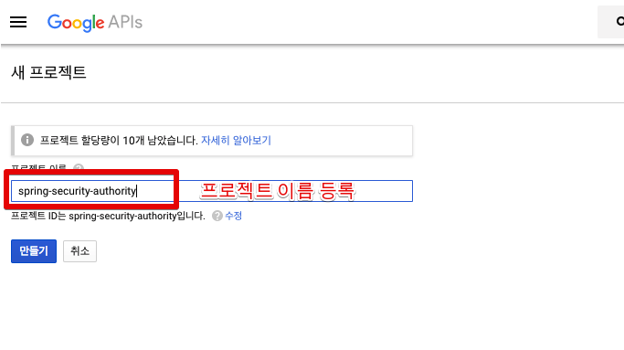
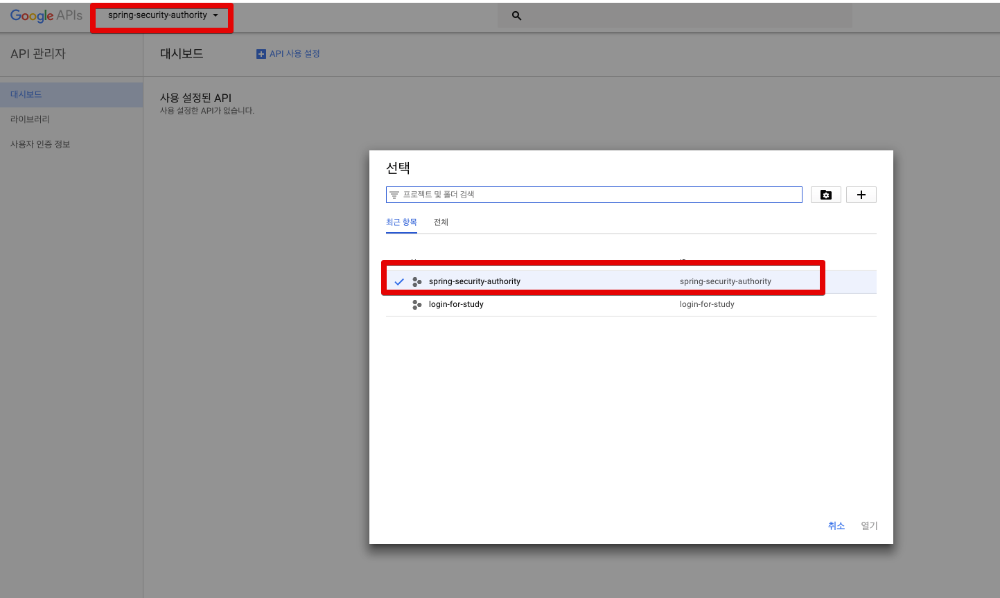
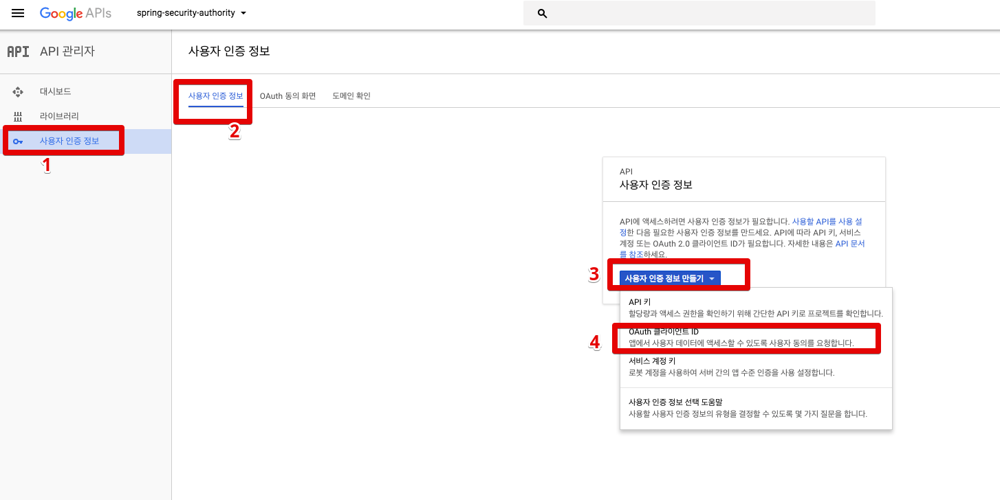
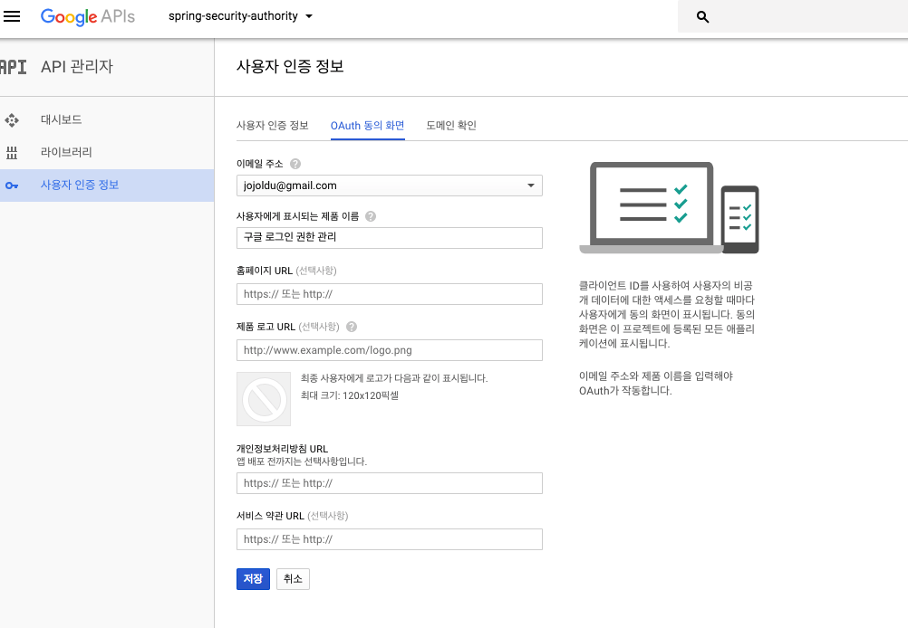

# spring-security-authority

안녕하세요? 이번 시간엔 spring-security-authority 예제를 진행해보려고 합니다.  
모든 코드는 [Github](https://github.com/jojoldu/blog-code/tree/master/spring-security-authority)에 있기 때문에 함께 보시면 더 이해하기 쉬우실 것 같습니다.  
(공부한 내용을 정리하는 [Github](https://github.com/jojoldu/blog-code)와 세미나+책 후기를 정리하는 [Github](https://github.com/jojoldu/review), 이 모든 내용을 담고 있는 [블로그](http://jojoldu.tistory.com/)가 있습니다. )<br/>
 
### 구글 등록

먼저 [console.developers.google.com](https://console.developers.google.com/)에 접속하여 프로젝트를 생성합니다.  


프로젝트 등록 정보는 별다를게 없고 이름만 등록합니다.



OAuth2 인증정보를 받기 위해 좌측 상단에 프로젝트 select box를 클릭하셔서 방금 생성한 프로젝트를 선택합니다.



빈 화면이 보이실텐데요, 여기서 좌측 사이드바를 따라 **사용자 인증정보 -> 사용자인증 정보 -> OAuth 클라이언트 ID**를 선택합니다.



클릭하시면 OAuth 동의화면 구성이 필요하다는 **파란색 버튼이 등장**하는데, 이를 클릭하시면 OAuth 동의 화면 설정창으로 이동하게 됩니다.  
해당 페이지에서 제품 이름만 등록합니다. 



저장하신뒤, 아래 클라이언트 정보를 입력합니다.  


최종 생성이 되시면 인증정보가 화면에 노출됩니다.  
거기서 클라이언트 ID와 보안비밀(security)를 앞으로 OAuth2에서 사용할 예정입니다. 


### Spring Security 설정

위에서 설정한 구글 인증 정보를 프로젝트 yml에 등록해보겠습니다.  
보통 application.yml에 등록하실텐데요, 이렇게 되면 git에 인증정보가 노출되는 문제가 있어 별도의 yml을 생성하여 인증정보만 관리하도록 하여 이를 gitignore 처리하겠습니다.


실제 코드는 아래와 같습니다.

```yaml
google :
  client :
    clientId : 
    clientSecret: 
    accessTokenUri: https://accounts.google.com/o/oauth2/token
    userAuthorizationUri: https://accounts.google.com/o/oauth2/auth
    scope: email, profile
  resource:
    userInfoUri: https://www.googleapis.com/oauth2/v2/userinfo
```