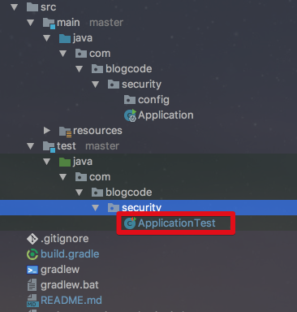
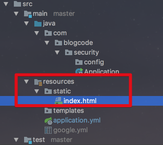
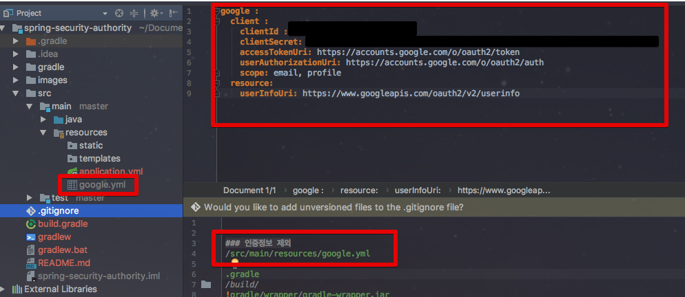

# Spring Security & 구글 OAuth로 진행하는 계정 권한 관리 

안녕하세요? 이번 시간엔 Spring Security & 구글 OAuth로 진행하는 계정 권한 관리 예제를 진행해보려고 합니다.  
모든 코드는 [Github](https://github.com/jojoldu/blog-code/tree/master/spring-security-authority)에 있기 때문에 함께 보시면 더 이해하기 쉬우실 것 같습니다.  
(공부한 내용을 정리하는 [Github](https://github.com/jojoldu/blog-code)와 세미나+책 후기를 정리하는 [Github](https://github.com/jojoldu/review), 이 모든 내용을 담고 있는 [블로그](http://jojoldu.tistory.com/)가 있습니다. )<br/>
 

## 1. 구글 로그인 

### 1-1. 프로젝트 기본 설정 및 테스트

SpringBoot 프로젝트를 생성하고 아래와 같이 의존성을 추가하겠습니다.  
(기본적으로 gradle을 빌드도구로 사용할 예정입니다.)  

```java

buildscript {
	ext {
		springBootVersion = '1.5.6.RELEASE'
	}
	repositories {
		mavenCentral()
	}
	dependencies {
		classpath("org.springframework.boot:spring-boot-gradle-plugin:${springBootVersion}")
	}
}

apply plugin: 'java'
apply plugin: 'eclipse'
apply plugin: 'org.springframework.boot'

version = '0.0.1-SNAPSHOT'
sourceCompatibility = 1.8

repositories {
	mavenCentral()
}

ext['hibernate.version'] = '5.2.10.Final' //Spring Boot Overriding

dependencies {
	compile('org.springframework.boot:spring-boot-starter-data-jpa')
	compile('org.springframework.boot:spring-boot-starter-security')
	compile('org.springframework.security.oauth:spring-security-oauth2')
	compile('org.springframework.boot:spring-boot-starter-web')
	compile('org.springframework.boot:spring-boot-starter-thymeleaf')

	runtime('org.springframework.boot:spring-boot-devtools') // hot reload
	runtime('com.h2database:h2')
	compileOnly('org.projectlombok:lombok')

	testCompile('org.springframework.boot:spring-boot-starter-test')
	testCompile('org.springframework.security:spring-security-test')
	testCompile('io.rest-assured:rest-assured:3.0.3') // Rest API Test
}
```

기존에서 못보던 라이브러리들이 있으실텐데요 차례로 적용하면서 설명 드리겠습니다.  
SpringSecurity가 의존성에 있으면 기본인증이 자동추가 되어 페이지 호출시 무조건적으로 로그인 하는 alert창이 등장하게 됩니다.  
당장 필요한 기능이 아니기에 application.yml에 해당 옵션을 끄고, 기본적인 다른 설정들도 추가하겠습니다.  

```yml

spring:
  jpa:
    show-sql: true # JPA로 생성되는 쿼리 확인
  h2:
    console:
      enabled: true
      path: /h2-console # h2 db 웹 클라이언트 접속 url
  devtools:
    livereload:
      enabled: true # 정적파일들의 실시간 갱신
security:
  basic:
    enabled: false # security 기본 인증 옵션 제거
logging:
  level:
    org.hibernate.type: trace  # JPA로 생성되는 쿼리의 파라미터 값 확인

```

각 옵션들에 대한 설명은 주석에 추가하였습니다.  
자 그럼 테스트코드를 기반으로 하여 실제 프로덕트 코드까지 생성해보겠습니다.  
(사실 첫 시작은 별게 없습니다^^;)  
  
build.gradle에 추가한 ```rest-assured``` 라이브러리를 이용하여 ```localhost:8080```으로 호출할 경우 지정한 html 페이지가 잘 호출되는지 테스트 해보겠습니다.  
  
아래와 같은 구조로 ```ApplicationTest.java```를 생성하겠습니다.




```java
import static io.restassured.RestAssured.given;
import static org.hamcrest.CoreMatchers.containsString;

@RunWith(SpringRunner.class)
@SpringBootTest
public class ApplicationTest {

    @Before
    public void setup() {
        RestAssured.port = 8080;
    }

    @Test
    public void 기본path로_접근하면_index_html_호출된다 () throws Exception {
        given()
                .when()
                    .get("/")
                .then()
                    .statusCode(200)
                    .contentType("text/html")
                    .body(containsString("권한 관리"));
    }
}
```

이걸 그대로 실행시키면 404 에러가 발생합니다.  
그 어떤 Controller도 생성되지 않았기 때문인데요.  
이 문제를 해결해보겠습니다.  

src/main/resources/static 디렉토리 아래에 ```index.html```을 생성하겠습니다.



그리고 아래 코드를 ```index.html```에 작성합니다.

```html

<!DOCTYPE html>
<html lang="en">
<head>
    <meta charset="UTF-8">
    <meta http-equiv="X-UA-Compatible" content="IE=edge"/>
    <title>Spring Security와 권한 관리</title>
    <meta name="description" content="Spring Security로 관리하는 프로젝트 권한"/>
    <meta name="viewport" content="width=device-width"/>
    <link rel="stylesheet" type="text/css" href="https://maxcdn.bootstrapcdn.com/bootstrap/3.3.7/css/bootstrap.min.css">
</head>
<body>
    <h1>Spring Security 권한 관리</h1>
    <script src="http://code.jquery.com/jquery-2.2.4.min.js" ></script>
    <script src="https://maxcdn.bootstrapcdn.com/bootstrap/3.3.7/js/bootstrap.min.js"></script>
</body>
</html>
```

메인페이지는 이게 끝입니다.  
실제로 잘되는지 테스트 해볼까요?  
  
좀 전에 작성한 테스트 코드를 다시 실행해보겠습니다.  


짠! 테스트 코드가 통과한 것을 알 수 있습니다.  
혹시나 안 믿기시는 분들이 계신다면 Application.java를 실행시켜 ```localhost:8080```으로 접속하셔서 확인해보셔도 됩니다.  
Controller가 없어도 ```index.html```을 ```/```로 호출할 수 있는 이유는 **스프링부트에서 기본적으로 static 디렉토리 아래에 있는 index.html을 ```/``` path로 지정**해주기 때문입니다.  
  
앞으로는 설정이 변경될때마다 다시 스프링부트를 실행시킬 필요 없이 테스트 코드를 바로 실행시켜 테스트 하면 되겠죠?  
자 이제 본격적으로 Spring Security와 구글 OAuth를 추가해보겠습니다.

### 1-2. 구글 OAuth 등록

먼저 [console.developers.google.com](https://console.developers.google.com/)에 접속하여 프로젝트를 생성합니다.  
아래 이미지와 같이 좌측 상단의 프로젝트 select box를 클릭하여 Modal창이 등장하면 + 버튼을 클릭합니다.


프로젝트 등록 정보는 별다를게 없고 이름만 등록합니다.


OAuth2 인증정보를 받기 위해 좌측 상단에 프로젝트 select box를 클릭하셔서 방금 생성한 프로젝트를 선택합니다.


빈 화면이 보이실텐데요, 여기서 좌측 사이드바를 따라 **사용자 인증정보 -> 사용자인증 정보 -> OAuth 클라이언트 ID**를 선택합니다.


클릭하시면 OAuth 동의화면 구성이 필요하다는 **파란색 버튼이 등장**하는데, 이를 클릭하시면 OAuth 동의 화면 설정창으로 이동하게 됩니다.  
해당 페이지에서 제품 이름만 등록합니다. 


저장하신뒤, 아래 클라이언트 정보를 입력합니다.  


최종 생성이 되시면 인증정보가 화면에 노출됩니다.  
거기서 클라이언트 ID와 보안비밀(security)를 앞으로 OAuth2에서 사용할 예정입니다. 


이렇게 하면 구글의 OAuth 등록은 끝이났습니다.  
다음은 Spring Security 설정입니다. 

### 1-2. Spring Security 설정

위에서 설정한 구글 인증 정보를 프로젝트 yml에 등록해보겠습니다.  
보통 application.yml에 등록하실텐데요, 이렇게 되면 **git에 인증정보가 노출되는 문제**가 있어 별도의 yml을 생성하여 인증정보만 관리하도록 하여 이를 gitignore 처리하겠습니다.



실제 코드는 아래와 같습니다.

```yaml
google :
  client :
    clientId : 구글 인증정보
    clientSecret: 구글 인증정보
    accessTokenUri: https://accounts.google.com/o/oauth2/token
    userAuthorizationUri: https://accounts.google.com/o/oauth2/auth
    scope: email, profile
  resource:
    userInfoUri: https://www.googleapis.com/oauth2/v2/userinfo
```

그리고 ```.gitignore```에 ```google.yml```을 추가하겠습니다.

```yml
### 인증정보 제외
/src/main/resources/google.yml
```

application.yml은 그대로 사용하고, google.yml은 별도로 관리하도록 설정하였습니다.  
