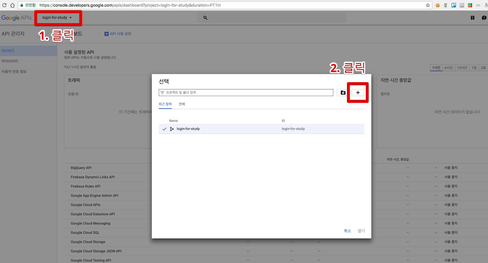
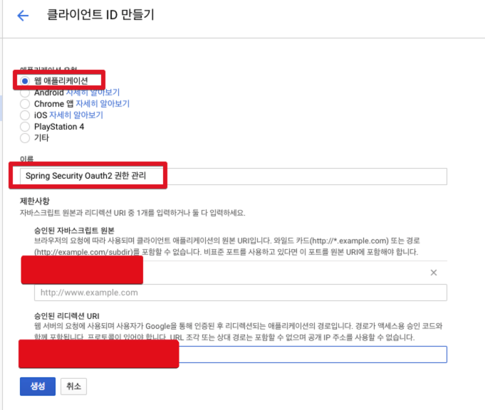
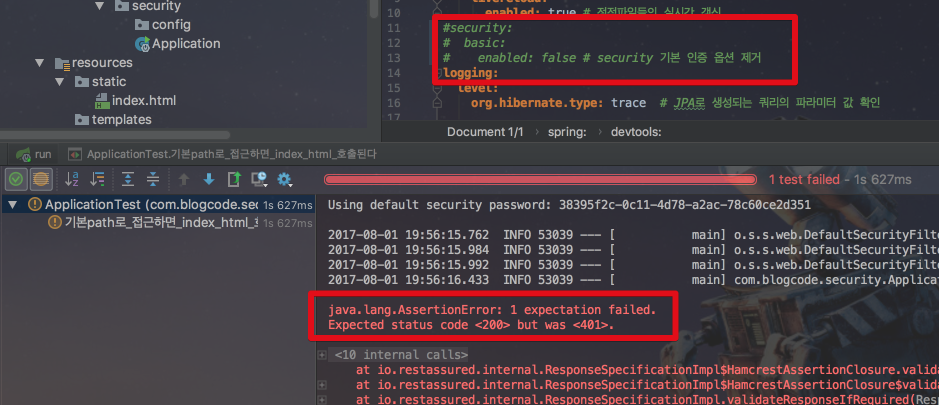
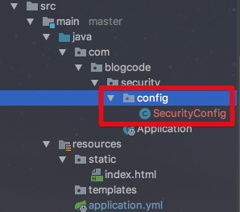
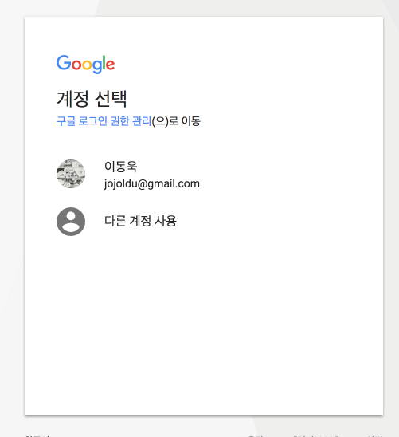
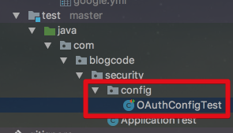
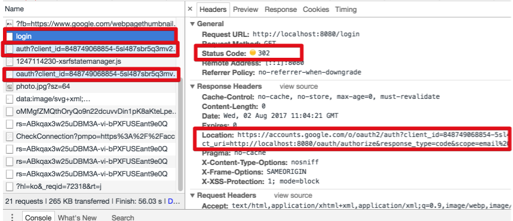
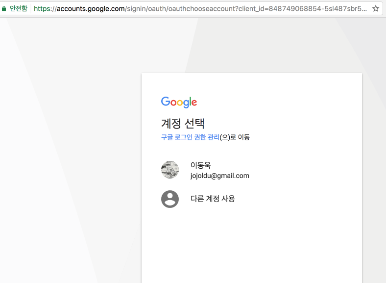

# Spring Security & 구글 OAuth & 테스트코드로 진행하는 계정 권한 관리 

안녕하세요? 이번 시간엔 Spring Security & 구글 OAuth로 진행하는 계정 권한 관리 예제를 진행해보려고 합니다.  
모든 코드는 [Github](https://github.com/jojoldu/blog-code/tree/master/spring-security-authority)에 있기 때문에 함께 보시면 더 이해하기 쉬우실 것 같습니다.  
(공부한 내용을 정리하는 [Github](https://github.com/jojoldu/blog-code)와 세미나+책 후기를 정리하는 [Github](https://github.com/jojoldu/review), 이 모든 내용을 담고 있는 [블로그](http://jojoldu.tistory.com/)가 있습니다. )<br/>
 

## 1. 구글 로그인 

최근 많은 회사에서 사내 백오피스 시스템의 로그인을 구글 OAuth로 진행하고 있습니다.  
구글 메일을 사내 메일로 사용하면 많은 백 오피스의 로그인 시스템을 구글 계정 하나로 관리할 수 있기 때문입니다.  
하지만, 백 오피스가 각각 용도에 따라 구별되어있으면 괜찮지만, 보통은 하나의 백오피스를 여러 팀에서 사용할때가 많습니다.  
그럴 경우 각각의 팀마다 혹은 계정마다 백 오피스의 메뉴 혹은 카테고리 노출 여부를 관리해야할 때가 발생합니다.  
이번 시간에는 이렇게 구글 OAuth를 통해 계정들의 메뉴 관리 기능을 테스트 코드와 함께 설명드리겠습니다.  
내용과 설명이 많아 한번에 올리지 못하고 나눠서 올리도록 하겠습니다.  
  
그럼 이제 시작하겠습니다!

### 1-1. 프로젝트 기본 설정 및 테스트

SpringBoot 프로젝트를 생성하고 아래와 같이 의존성을 추가하겠습니다.  
(기본적으로 gradle을 빌드도구로 사용할 예정입니다.)  

```java

buildscript {
	ext {
		springBootVersion = '1.5.6.RELEASE'
	}
	repositories {
		mavenCentral()
	}
	dependencies {
		classpath("org.springframework.boot:spring-boot-gradle-plugin:${springBootVersion}")
	}
}

apply plugin: 'java'
apply plugin: 'eclipse'
apply plugin: 'org.springframework.boot'

version = '0.0.1-SNAPSHOT'
sourceCompatibility = 1.8

repositories {
	mavenCentral()
}

ext['hibernate.version'] = '5.2.10.Final' //Spring Boot Overriding

dependencies {
	compile('org.springframework.boot:spring-boot-starter-data-jpa')
	compile('org.springframework.boot:spring-boot-starter-security')
	compile('org.springframework.security.oauth:spring-security-oauth2')
	compile('org.springframework.boot:spring-boot-starter-web')
	compile('org.springframework.boot:spring-boot-starter-thymeleaf')

	runtime('org.springframework.boot:spring-boot-devtools') // hot reload
	runtime('com.h2database:h2')
	compileOnly('org.projectlombok:lombok')

	testCompile('org.springframework.boot:spring-boot-starter-test')
	testCompile('org.springframework.security:spring-security-test')
	testCompile('io.rest-assured:rest-assured:3.0.3') // Rest API Test
}
```

기존에서 못보던 라이브러리들이 있으실텐데요 차례로 적용하면서 설명 드리겠습니다.  
SpringSecurity가 의존성에 있으면 기본인증이 자동추가 되어 페이지 호출시 무조건적으로 로그인 하는 alert창이 등장하게 됩니다.  
당장 필요한 기능이 아니기에 application.yml에 해당 옵션을 끄고, 기본적인 다른 설정들도 추가하겠습니다.  

```yml

spring:
  jpa:
    show-sql: true # JPA로 생성되는 쿼리 확인
  h2:
    console:
      enabled: true
      path: /h2-console # h2 db 웹 클라이언트 접속 url
  devtools:
    livereload:
      enabled: true # 정적파일들의 실시간 갱신
security:
  basic:
    enabled: false # security 기본 인증 옵션 제거
logging:
  level:
    org.hibernate.type: trace  # JPA로 생성되는 쿼리의 파라미터 값 확인

```

각 옵션들에 대한 설명은 주석에 추가하였습니다.  
자 그럼 테스트코드를 기반으로 하여 실제 프로덕트 코드까지 생성해보겠습니다.  
(사실 첫 시작은 별게 없습니다^^;)  
  
build.gradle에 추가한 ```rest-assured``` 라이브러리를 이용하여 ```localhost:8080```으로 호출할 경우 지정한 html 페이지가 잘 호출되는지 테스트 해보겠습니다.  
(RestAssured의 사용법을 자세하게 알고 싶으시다면 [API 문서](https://github.com/rest-assured/rest-assured/wiki/Usage)를 참고해주세요.  
상세하게 예제가 소개되어있습니다.)
  
아래와 같은 구조로 ```ApplicationTest.java```를 생성하겠습니다.


```java
import static io.restassured.RestAssured.given;
import static org.hamcrest.CoreMatchers.containsString;

@RunWith(SpringRunner.class)
@SpringBootTest
public class ApplicationTest {

    @Before
    public void setup() {
        RestAssured.port = 8080;
    }

    @Test
    public void 기본path로_접근하면_index_html_호출된다 () throws Exception {
        given()
                .when()
                    .get("/")
                .then()
                    .statusCode(200)
                    .contentType("text/html")
                    .body(containsString("권한 관리"));
    }
}
```

이걸 그대로 실행시키면 404 에러가 발생합니다.  
그 어떤 Controller도 생성되지 않았기 때문인데요.  
이 문제를 해결해보겠습니다.  

src/main/resources/static 디렉토리 아래에 ```index.html```을 생성하겠습니다.


그리고 아래 코드를 ```index.html```에 작성합니다.

```html

<!DOCTYPE html>
<html lang="en">
<head>
    <meta charset="UTF-8">
    <meta http-equiv="X-UA-Compatible" content="IE=edge"/>
    <title>Spring Security와 권한 관리</title>
    <meta name="description" content="Spring Security로 관리하는 프로젝트 권한"/>
    <meta name="viewport" content="width=device-width"/>
    <link rel="stylesheet" type="text/css" href="https://maxcdn.bootstrapcdn.com/bootstrap/3.3.7/css/bootstrap.min.css">
</head>
<body>
    <h1>Spring Security 권한 관리</h1>
    <script src="http://code.jquery.com/jquery-2.2.4.min.js" ></script>
    <script src="https://maxcdn.bootstrapcdn.com/bootstrap/3.3.7/js/bootstrap.min.js"></script>
</body>
</html>
```

메인페이지는 이게 끝입니다.  
실제로 잘되는지 테스트 해볼까요?  
  
좀 전에 작성한 테스트 코드를 다시 실행해보겠습니다.  


짠! 테스트 코드가 통과한 것을 알 수 있습니다.  
혹시나 안 믿기시는 분들이 계신다면 Application.java를 실행시켜 ```localhost:8080```으로 접속하셔서 확인해보셔도 됩니다.  
Controller가 없어도 ```index.html```을 ```/```로 호출할 수 있는 이유는 **스프링부트에서 기본적으로 static 디렉토리 아래에 있는 index.html을 ```/``` path로 지정**해주기 때문입니다.  
  
앞으로는 설정이 변경될때마다 다시 스프링부트를 실행시킬 필요 없이 테스트 코드를 바로 실행시켜 테스트 하면 되겠죠?  
자 이제 본격적으로 Spring Security와 구글 OAuth를 추가해보겠습니다.

### 1-2. 구글 OAuth 등록

먼저 [console.developers.google.com](https://console.developers.google.com/)에 접속하여 프로젝트를 생성합니다.  
아래 이미지와 같이 좌측 상단의 프로젝트 select box를 클릭하여 Modal창이 등장하면 + 버튼을 클릭합니다.



프로젝트 등록 정보는 별다를게 없고 이름만 등록합니다.


OAuth2 인증정보를 받기 위해 좌측 상단에 프로젝트 select box를 클릭하셔서 방금 생성한 프로젝트를 선택합니다.


빈 화면이 보이실텐데요, 여기서 좌측 사이드바를 따라 **사용자 인증정보 -> 사용자인증 정보 -> OAuth 클라이언트 ID**를 선택합니다.


클릭하시면 OAuth 동의화면 구성이 필요하다는 **파란색 버튼이 등장**하는데, 이를 클릭하시면 OAuth 동의 화면 설정창으로 이동하게 됩니다.  
해당 페이지에서 제품 이름만 등록합니다. 


저장하신뒤, 아래 클라이언트 정보를 입력합니다.  



(저같은 경우 원본 URL은 ```http://localhost:8080```, 리디렉션 URI는 ```http://localhost:8080/login```로 등록하였습니다.)  
  
최종 생성이 되시면 인증정보가 화면에 노출됩니다.  
거기서 클라이언트 ID와 보안비밀(security)를 앞으로 OAuth2에서 사용할 예정입니다. 


위에서 설정한 구글 인증 정보를 프로젝트 yml에 등록해보겠습니다.  
보통 application.yml에 등록하실텐데요, 이렇게 되면 **git에 인증정보가 노출되는 문제**가 있어 별도의 yml을 생성하여 인증정보만 관리하도록 하여 이를 gitignore 처리하겠습니다.


실제 코드는 아래와 같습니다.

```yaml
google :
  client :
    clientId : 인증정보
    clientSecret: 인증정보
    accessTokenUri: https://accounts.google.com/o/oauth2/token
    userAuthorizationUri: https://accounts.google.com/o/oauth2/auth
    clientAuthenticationScheme: form
    scope: email, profile
  resource:
    userInfoUri: https://www.googleapis.com/oauth2/v2/userinfo
```

혹시나 헷갈리실수 있으신데, ClientId는 뒷자리가 ```.apps.googleusercontent.com``` 형태로 되어있습니다.  
  
그리고 ```.gitignore```에 ```google.yml```을 추가하겠습니다.

```yml
### 인증정보 제외
/src/main/resources/google.yml
```

application.yml은 그대로 사용하고, google.yml은 별도로 관리하도록 설정하였습니다.  
  
이렇게 하면 구글의 OAuth 등록은 끝이났습니다.  
다음은 Spring Security 설정입니다. 

### 1-2. Spring Security 기본 설정

Spring Security 설정을 추가하기 위해 현재 꺼놓은 Security 옵션을 다시 활성화 시키겠습니다.  
그리고 다시 테스트를 실행시켜보겠습니다.



401 즉, Unauthorized Error 가 발생하였습니다.  

```/``` 접근을 위해 인증이 필요하다는 메세지인데, ```/``` 는 권한없이 인증 제외 설정을 추가하겠습니다.  

config 패키지를 생성하여 ```SecurityConfig.java```파일을 생성하겠습니다.



그리고 아래의 코드를 추가합니다.

```java

@Configuration
@EnableWebSecurity
public class SecurityConfig extends WebSecurityConfigurerAdapter {

    @Override
    protected void configure(HttpSecurity http) throws Exception {
        http.antMatcher("/**")
                .authorizeRequests()
                .antMatchers("/", "/h2-console/**", "/favicon.ico").permitAll()
                .anyRequest().authenticated()
                .and().logout().logoutSuccessUrl("/").permitAll()
                .and().headers().frameOptions().sameOrigin()
                .and().csrf().disable();
    }
}

```

기본적인 Spring Security 옵션입니다.  

```/, /h2-consle, /favicon.ico```는 권한 체크를 하지 않겠다는 설정(```.antMatchers("/", "/h2-console/**", "/favicon.ico").permitAll()```)을 추가하였고,  

```csrf```를 off (```.csrf().disable()```) 하였습니다.  

이렇게 하면 ```/```는 권한이 없이 접근 가능하기 때문에 정상적으로 테스트가 통과하게 됩니다.


Security 기본 설정이 된것이 확인 되었으니, OAuth2 설정과 테스트 코드를 작성해보겠습니다.

### 1-3. Google OAuth2 설정 

페이스북 로그인, 네이버 로그인 등 OAuth2 클라이언트가 적용된 서비스를 많이 접해보셨을텐데요, 해당 서비스를 이용해보시면 아래와 같이 OAuth2 로그인 화면이 등장하실것 입니다.  

 

마찬가지로 구글 로그인 역시 해당 서비스의 로그인이 필요하게 되어, 웹 페이지에서 리다이렉션이 발생합니다.  
그래서 로그인 진행시 (```/login```) OAuth 리다이렉션이 진행되는지 테스트 코드를 작성해보겠습니다.  
src/test/java 아래에 config 패키지를 추가하여 ```OAuthConfigTest.java``` 파일을 생성하겠습니다.



테스트 코드는 아래와 같습니다.

```java

import static io.restassured.RestAssured.given;
import static org.hamcrest.CoreMatchers.containsString;

@RunWith(SpringRunner.class)
@SpringBootTest
public class OAuthConfigTest {

    @Before
    public void setup() {
        RestAssured.port = 8080;
    }

    @Test
    public void google로그인_시도하면_OAuth인증창_등장한다 () throws Exception {
        given()
                .when()
                    .redirects().follow(false) // 리다이렉트 방지
                    .get("/login")
                .then()
                    .statusCode(302)
                    .header("Location", containsString("https://accounts.google.com/o/oauth2/auth"));
    }
}

```

로그인 URL은 ```/login```으로 할 예정입니다.  

```then()```이후 옵션들은 OAuth 로그인 검증 코드입니다.  

OAuth2 로그인의 경우 인증코드(```code```)를 발급 받고, 발급 받은 인증코드로 AccessToken을 다시 발급 받는 과정이 있어 **중간 리다이렉션이 발생**합니다.  



이런 리다이렉션 과정들로 인해 **login URL의 테스트 결과 확인이 어렵기 때문에** 리다이렉션 방지 옵션(```.redirects().follow(false)```)을 추가하였습니다.  
추가로 리다이렉션이 어디로 되는지도 정확히 확인 하기 위해 Location 헤더정보도 확인하도록 추가하였습니다.  
그럼 이 테스트를 돌려보겠습니다.


401 에러가 발생했습니다!  
왜냐하면 seurity 옵션에서 **```/login``` URL 권한이 없기** 때문입니다.  
비 로그인시에 로그인이 진행되니 로그인 URL도 권한 체크를 제외하도록 security 옵션을 변경하겠습니다.  

```java

@Configuration
@EnableWebSecurity
public class SecurityConfig extends WebSecurityConfigurerAdapter {

    @Override
    protected void configure(HttpSecurity http) throws Exception {
        http.antMatcher("/**")
                .authorizeRequests()
                .antMatchers("/", "/h2-console/**", "/favicon.ico", "/login**").permitAll() // "/login**" 옵션 추가
                .anyRequest().authenticated()
                .and().logout().logoutSuccessUrl("/").permitAll()
                .and().headers().frameOptions().sameOrigin()
                .and().csrf().disable();
    }
}

```

변경 된 것은 ```.antMatchers("/", "/h2-console/**", "/favicon.ico").permitAll()```에  ```"/login**"```이 추가된 것 뿐입니다.  
자 그럼 수정 후에 다시 테스트를 수행해보겠습니다.  


또 실패하였습니다.  
이번엔 404 에러가 발생했습니다.  
왜냐하면 저희는 ```/login``` URL을 처리하는 코드가 없기 때문입니다.  
보통은 Controller를 생성해서 처리하는데요, Spring Boot OAuth2를 사용하는 경우 Configuration으로 처리가 가능합니다.  
자 그럼 이제 진짜 OAuth2 설정을 진행해보겠습니다.  
src/main/java 아래 config 패키지에 (SecurityConfig와 동일한 위치) OAuthConfig를 생성해보겠습니다.  
그리고 아래와 같이 코드를 추가해보겠습니다.  

```java

@Configuration
@EnableOAuth2Client
public class OAuthConfig {

    private final OAuth2ClientContext oauth2ClientContext;

    public OAuthConfig(OAuth2ClientContext oauth2ClientContext) {
        this.oauth2ClientContext = oauth2ClientContext;
    }

    @Bean
    public Filter ssoFilter() {
        OAuth2ClientAuthenticationProcessingFilter oauth2Filter = new OAuth2ClientAuthenticationProcessingFilter("/login");
        OAuth2RestTemplate oAuth2RestTemplate = new OAuth2RestTemplate(googleClient(), oauth2ClientContext);
        oauth2Filter.setRestTemplate(oAuth2RestTemplate);
        oauth2Filter.setTokenServices(new UserInfoTokenServices(googleResource().getUserInfoUri(), googleClient().getClientId()));

        return oauth2Filter;
    }

    @Bean
    @ConfigurationProperties("google.client")
    public OAuth2ProtectedResourceDetails googleClient() {
        return new AuthorizationCodeResourceDetails();
    }

    @Bean
    @ConfigurationProperties("google.resource")
    public ResourceServerProperties googleResource() {
        return new ResourceServerProperties();
    }

    @Bean
    public FilterRegistrationBean oauth2ClientFilterRegistration(OAuth2ClientContextFilter filter) {
        FilterRegistrationBean registration = new FilterRegistrationBean();
        registration.setFilter(filter);
        registration.setOrder(-100);
        return registration;
    }

    @Bean
    public static PropertySourcesPlaceholderConfigurer properties() {
        YamlPropertiesFactoryBean yaml = new YamlPropertiesFactoryBean();
        yaml.setResources(new ClassPathResource("google.yml"));

        PropertySourcesPlaceholderConfigurer propertySourcesPlaceholderConfigurer = new PropertySourcesPlaceholderConfigurer();
        propertySourcesPlaceholderConfigurer.setProperties(yaml.getObject());
        return propertySourcesPlaceholderConfigurer;
    }
}

```

```ssoFilter()```에 있는 ```OAuth2ClientAuthenticationProcessingFilter```인자값이 OAuth 로그인 시작 포인트가 됩니다.  

```/login```으로 등록했기 때문에 해당 URL에 get 요청을 할 경우 자동으로 OAuth 로그인이 진행됩니다.  
  
가장 하단에 보시면 ```PropertySourcesPlaceholderConfigurer``` 메소드에선 처음에 등록한 google.yml을 불러오도록 지정하였습니다.  
불러온 yml의 값들은 ```@ConfigurationProperties("google.client")``` 을 통해 인증에 필요한 여러 설정값들을 자동으로 할당하도록 하였습니다.  
  
자 그럼 여기서 생성한 ssoFilter가 Security를 거치도록 설정을 추가하겠습니다.

```java

@Configuration
@EnableWebSecurity
public class SecurityConfig extends WebSecurityConfigurerAdapter {

    private final Filter ssoFilter;

    public SecurityConfig(Filter ssoFilter) {
        this.ssoFilter = ssoFilter;
    }

    @Override
    protected void configure(HttpSecurity http) throws Exception {
        http.antMatcher("/**")
                .authorizeRequests()
                .antMatchers("/", "/h2-console/**", "/favicon.ico", "/login**").permitAll() // "/login**" 옵션 추가
                .anyRequest().authenticated()
                .and().logout().logoutSuccessUrl("/").permitAll()
                .and().headers().frameOptions().sameOrigin()
                .and().csrf().disable()
                .addFilterBefore(ssoFilter, BasicAuthenticationFilter.class); // OAuthConfig에서 생성한 ssoFilter 추가
    }
}

```

생성자 주입으로 (```@Autowired```가 없어도 Bean 주입은 이렇게 가능합니다.) ssoFilter를 가져와 ```addFilterBefore```에 등록하였습니다.  
이제 OAuth의 기본 설정이 끝났습니다.  
자 다시 테스트를 실행해보겠습니다.  


짠! 드디어 테스트가 통과되었습니다.  
그럼 실제로 OAuth 로그인이 되는지 확인해볼까요?  
  
브라우저를 열어 ```localhost:8080/login```을 입력해보겠습니다.  
아래와 같은 화면이 등장하시나요?



로그인 화면이 등장하면 로그인을 진행하시면 되며, 저처럼 계정 선택 화면이 등장하면 계정을 선택하시면 됩니다.  
그럼 리다이렉트가 계속 진행되어 최종적으로 원래의 localhost:8080/ 으로 이동하게 됩니다.


음 이게 끝인가? 라고 생각드실것 같습니다.  
[구글계정으로 가입된 서비스를 확인할 수 있는 페이지](https://myaccount.google.com/permissions) 으로 접속하시면 방금까지 만든 OAuth 서비스에 구글 계정이 가입된 것을 확인할 수 있습니다.


구글 OAuth를 사용한 것은 확인되었으니, 이제 이렇게 인증 정보를 통해 로그인 세션을 비롯한 여러 기능들을 하나씩 추가해보겠습니다.  

### 1-4. 로그인 세션 관리

OAuth2를 사용한다고해서 기존과 다른 마법같은 일이 펼쳐지는것은 아닙니다.  
OAuth2는 사용자 인증 및 허가된 정보를 가져오는 것외에는 사용하지 않습니다.  
인증된 정보를 통해 로그인 세션을 관리하고, 사용자는 저희가 만든 서비스의 세션을 통해 서비스를 이용해야만 합니다.  
  
세션을 사용하는 방법은 크게 3가지가 있습니다.  

1. 톰캣 세션을 사용한다.
  * 일반적으로 별다른 설정을 하지 않으시고 HttpSession을 사용할 경우입니다.
  * 이렇게 될 경우 톰캣(WAS)에 세션이 저장되기 때문에 2대이상의 WAS가 구동되는 환경에서는 톰캣들간의 세션 공유를 위한 추가설정이 필요합니다.
2. Database를 세션저장소로 사용한다.
  * 여러 WAS들간의 공용 세션을 사용할 수 있는 가장 쉬운 방법입니다.
  * 많은 설정이 필요없지만, 결국 로그인 요청마다 DB IO가 발생하여 성능상 이슈가 발생할 수 있습니다.
  * 보통 로그인이 요청이 많이 없는 백오피스, 사내시스템 용도에서 사용합니다.
3. Redis, Memcached와 같은 메모리 DB를 세션 저장소로 사용한다.
  * 사용자 서비스에서 가장 많이 사용되는 방식입니다.
  * 실제 서비스로 사용하기 위해서는 Embedded Redis와 같은 방식이 아닌 외부 메모리 서버가 필요합니다.

여기선 2번째 방식인 Database를 세션 저장소로 사용되는 방식을 선택하여 진행할 예정입니다.  


[spring session jdbc 가이드](https://docs.spring.io/spring-session/docs/current-SNAPSHOT/reference/html5/guides/boot-jdbc.html)