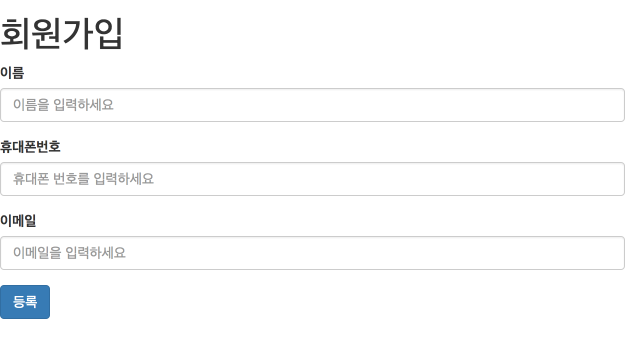
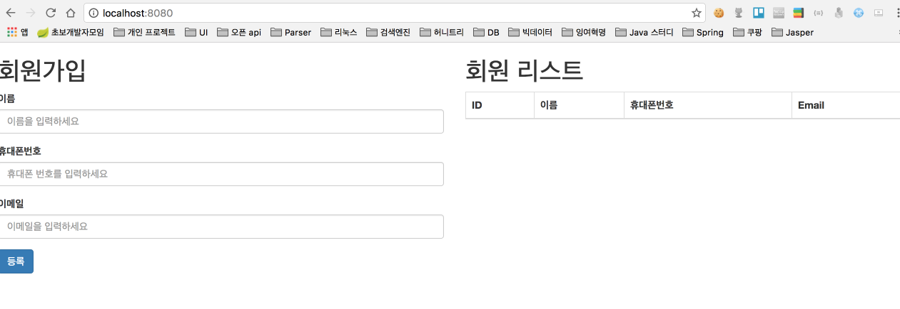
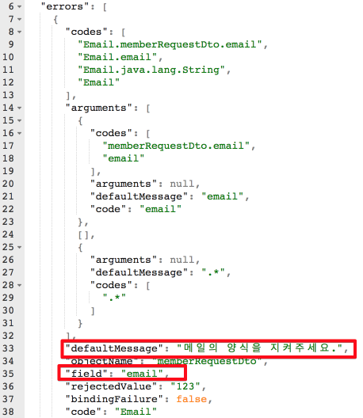

# Validation 공통모듈 만들기
안녕하세요? 이번 시간엔 유효성 체크(이하 validation) 공통 모듈 생성하는 예제를 진행해보려고 합니다. 모든 코드는 [Github](https://github.com/jojoldu/blog-code/tree/master/spring-validation)에 있기 때문에 함께 보시면 더 이해하기 쉬우실 것 같습니다.  
(공부한 내용을 정리하는 [Github](https://github.com/jojoldu/blog-code)와 세미나+책 후기를 정리하는 [Github](https://github.com/jojoldu/review), 이 모든 내용을 담고 있는 [블로그](http://jojoldu.tistory.com/)가 있습니다. )<br/>

예를 들어 아래와 같은 회원 가입 양식이 있다고 가정해보겠습니다.  


대부분의 입력 양식처럼 위 양식도 등록시 몇가지 조건들이 있습니다.  
* 이름/휴대폰번호/이메일은 **필수값**입니다.
* 휴대폰번호는 **10자리 혹은 11자리의 숫자**로 이루어져야 합니다.
* 이메일은 이메일 양식을 지켜야한다 (xxx@xxx)

이 조건들을 체크하기 위해서 많은 분들이 하는 방법중 하나가 **클라이언트 사이드에서 체크**를 하는 것입니다.  
하지만 클라이언트 사이드에서 validation을 하게 될 경우 얼마든지 브라우저에서 조작이 가능하기 때문에 validation을 무효화해서 잘못된 데이터를 전송할 수 있습니다.  
그래서 이런 체크는 백엔드에서 필수적으로 하게 되는데, 이때 유용하게 사용되는 것이 **Validation 어노테이션**들입니다.  
위 조건을 만족하도록 간단하게 프로젝트를 구성해보겠습니다.  

### 코드
예제코드에 앞서서 좀 더 실제 프로젝트와 유사하게 맞추기 위해 조건을 추가하겠습니다.  
* 휴대폰 번호는 입력 받을때는 숫자만 입력 받는다.
* 휴대폰 번호를 DB 저장시에는 조건 검색이 가능하도록 3개 컬럼에 나눠서 저장한다. (ex: 컬럼1: 010, 컬럼2: 1234, 컬럼3: 5678)
* 휴대폰 번호 출력시에는 - 문자가 포함되야 한다 (ex: 010-1234-5678)   

그럼 이제 추가 조건까지 포함해서 코드를 작성해보겠습니다.  
먼저 프로젝트 의존성 관리를 위해 build.gradle을 아래와 같이 추가하였습니다.  
<br/>
**build.gradle**  

```
buildscript {
	ext {
		springBootVersion = '1.5.1.RELEASE'
	}
	repositories {
		mavenCentral()
	}
	dependencies {
		classpath("org.springframework.boot:spring-boot-gradle-plugin:${springBootVersion}")
	}
}

apply plugin: 'java'
apply plugin: 'eclipse'
apply plugin: 'org.springframework.boot'

jar {
	baseName = 'spring-validation'
	version = '0.0.1-SNAPSHOT'
}

sourceCompatibility = 1.8

repositories {
	mavenCentral()
}


dependencies {
	compile('org.springframework.boot:spring-boot-starter-data-jpa')
	compile('org.springframework.boot:spring-boot-starter-web')
	compile('org.springframework.boot:spring-boot-devtools')
	runtime('com.h2database:h2')
	testCompile('org.springframework.boot:spring-boot-starter-test')
}

```
이외 추가 설정은 없기 때문에 바로 자바 코드로 넘어가겠습니다.  
<br/>
**Member**  

```
@Entity
public class Member {

    @Id
    @GeneratedValue
    private Long id;

    @Column(nullable = false)
    private String name;

    @Column(nullable = false)
    private String phone1;

    @Column(nullable = false)
    private String phone2;

    @Column(nullable = false)
    private String phone3;

    @Column(nullable = false)
    private String email;

    public Member() {}

    public Member(String name, String phone1, String phone2, String phone3, String email) {
        this.name = name;
        this.phone1 = phone1;
        this.phone2 = phone2;
        this.phone3 = phone3;
        this.email = email;
    }

    public Long getId() {
        return id;
    }

    public String getName() {
        return name;
    }

    public String getPhone1() {
        return phone1;
    }

    public String getPhone2() {
        return phone2;
    }

    public String getPhone3() {
        return phone3;
    }

    public String getEmail() {
        return email;
    }
}
```

**MemberRequestDto**  

```
public class MemberRequestDto {

    private Long id;

    @NotBlank(message = "이름을 작성해주세요.")
    private String name;

    @NotBlank(message = "전화번호를 작성해주세요.")
    @Pattern(regexp = "[0-9]{10,11}", message = "10~11자리의 숫자만 입력가능합니다")
    private String phoneNumber;

    @NotBlank(message = "메일을 작성해주세요.")
    @Email(message = "메일의 양식을 지켜주세요.")
    private String email;

    public MemberRequestDto() {}

    public Member toEntity(){
        String[] phones = parsePhone();
        return new Member(name, phones[0], phones[1], phones[2], email);
    }

    private String[] parsePhone(){
        String[] phones = new String[3];
        int mid = phoneNumber.length() == 10? 7:8;
        phones[0] = phoneNumber.substring(0,3);
        phones[1] = phoneNumber.substring(4,mid);
        phones[2] = phoneNumber.substring(mid,phoneNumber.length()-1);
        return phones;
    }

    public Long getId() {
        return id;
    }

    public String getName() {
        return name;
    }

    public String getPhoneNumber() {
        return phoneNumber;
    }

    public String getEmail() {
        return email;
    }
}
```  

**MemberResponseDto**  

```
public class MemberResponseDto {
    private Long id;
    private String name;
    private String phoneNumber;
    private String email;

    public MemberResponseDto() {}

    public MemberResponseDto(Member member) {
        id = member.getId();
        name = member.getName();
        phoneNumber = toStringPhone(member.getPhone1(), member.getPhone2(), member.getPhone3());
        email = member.getEmail();
    }

    private String toStringPhone(String phone1, String phone2, String phone3){
        return phone1+"-"+phone2+"-"+phone3;
    }

    public Long getId() {
        return id;
    }

    public String getName() {
        return name;
    }

    public String getPhoneNumber() {
        return phoneNumber;
    }

    public String getEmail() {
        return email;
    }
}
```

Member, MemberRequestDto, MemberResponseDto 3개의 클래스를 생성하였습니다.  
회원 정보를 나타내기 위해 Member클래스만 사용하지 않은 이유는, Entity 클래스를 파라미터 혹은 View 데이터로 사용하게 되면 **변화에 대응하기가 힘들기 때문**입니다.  
휴대폰 번호 같은 경우 테이블에 저장되는 형태는 3개의 컬럼으로 저장되는데, 화면에 입력 받는 형태는 하나의 문자열입니다. 이걸 Entity에서 구현하려면 Entity 클래스는 테이블의 역할을 벗어난 **많은 책임을 담당**하게 되고, **파라미터가 변경될 때마다 메인이 되는 Entity 클래스의 구조가 계속해서 변경**되게 됩니다.  
반면에 MemberRequestDto가 화면에서 입력 받는 파라미터 타입의 역할을 하게 될 경우 파라미터 형태가 변경되어도 MemberRequestDto만 변경하면 되고 Entity 클래스는 변경되지 않아도 되기에 테이블 구조가 변경될일은 없습니다.  
동일한 이유로 View에 출력되는 타입 역시 Entity가 아닌 Response 클래스를 별도로 두어 어떤 출력 형태라도 큰 변경 없이 대응할 수 있도록 하였습니다.  
<br/>
그럼 이를 사용하는 Controller/Service/Repository를 생성하겠습니다.  
<br/>
**MemberRepository**  
<br/>

```
public interface MemberRepository extends JpaRepository<Member, Long>{
    Optional<Member> findByEmail(String email);
}
```
repository는 간단하게 JpaRepository를 상속 받겠습니다.  
<br/>
**MemberService**  

```
@Service
public class MemberService {

    private MemberRepository memberRepository;

    public MemberService(MemberRepository memberRepository) {
        this.memberRepository = memberRepository;
    }

    @Transactional
    public Long save(MemberRequestDto memberRequestDto){
        return memberRepository.save(memberRequestDto.toEntity()).getId();
    }


    @Transactional(readOnly = true)
    public List<MemberResponseDto> findAll() {
        return memberRepository
                .findAll()
                .stream()
                .map(MemberResponseDto::new)
                .collect(Collectors.toList());
    }
}
```

스프링에 대한 의존성을 낮추고 Mock 객체 주입을 좀 더 쉽게하기 위해 생성자 Injection을 하였습니다.  
보시면 save할때는 requestDto를 entity로, find를 할 때는 entity를 responseDto로 전환하는 과정을 거치게 됩니다.  
만약 리턴되는 데이터가 많을 경우에 모든 데이터를 ```map```으로 전환하기가 부담되신다면, **querydsl을 사용하여 조회 결과를 responseDto로** 받을 수 도 있습니다.  

<br/>
**MemberController**  

```
@RestController
public class MemberController {

    private MemberService memberService;

    public MemberController(MemberService memberService) {
        this.memberService = memberService;
    }

    @PostMapping("/member")
    public Long saveMember(@RequestBody @Valid MemberRequestDto memberRequestDto) {
        return memberService.save(memberRequestDto);
    }

    @GetMapping("/members")
    public List<MemberResponseDto> findAll(){
        return memberService.findAll();
    }
}
```

Controller는 별다를 것이 없지만, JSON 데이터를 인스턴스에 매핑하기 위해 ```@RequestBody```를, validation 실행을 위해 ```@Valid```를 사용하였습니다.  
<br/>
백엔드구성은 마쳤습니다. 다음은 화면단 코드를 작성하겠습니다.  
Ajax로 데이터를 주고 받을 예정이기에 별도의 템플릿 엔진(freemarker, thymleaf 등)을 사용하지 않겠습니다.  
단, SpringBoot의 경우 ```/``` url에 매핑된 메소드가 없고,   ```src/main/resources/static/index.html```을 생성하면 ```/``` 접속시 **자동으로 index.html을 호출**하게 됩니다. 이를 이용하여 index.html을 작성하겠습니다.  
<br/>
**index.html**  

```
<!DOCTYPE html>
<html lang="en">
<head>
    <meta charset="UTF-8">
    <title>Validation 서버에 집중하기</title>
    <link rel="stylesheet" href="https://maxcdn.bootstrapcdn.com/bootstrap/3.3.2/css/bootstrap.min.css">

</head>
<body>
    <div class="row">
        <div class="col-md-6">
            <h1> 회원가입 </h1>
            <form>
                <div class="form-group">
                    <label for="name">이름</label>
                    <input type="text" class="form-control" id="name" placeholder="이름을 입력하세요">
                </div>
                <div class="form-group">
                    <label for="phoneNumber"> 휴대폰번호 </label>
                    <input type="text" class="form-control" id="phoneNumber" placeholder="휴대폰 번호를 입력하세요">
                </div>
                <div class="form-group">
                    <label for="email">이메일</label>
                    <input type="text" class="form-control" id="email" placeholder="이메일을 입력하세요">
                </div>
                <button type="button" class="btn btn-primary" id="btnSave">등록</button>
            </form>
        </div>
        <div class="col-md-6">
            <h1> 회원 리스트 </h1>
            <table class="table table-horizontal table-bordered">
                <thead class="thead-strong">
                <tr>
                    <th>ID</th>
                    <th>이름</th>
                    <th>휴대폰번호</th>
                    <th>Email</th>
                </tr>
                </thead>
                <tbody id="tbody">

                </tbody>
            </table>
        </div>
    </div>

    <script src="https://ajax.googleapis.com/ajax/libs/jquery/3.1.1/jquery.min.js"></script>
    <script src="https://cdnjs.cloudflare.com/ajax/libs/handlebars.js/4.0.6/handlebars.min.js"></script>

    <script id="table-template" type="text/x-handlebars-template">
        {{#each members}}
            <tr>
                <td>{{id}}</td>
                <td>{{name}}</td>
                <td>{{phoneNumber}}</td>
                <td>{{email}}</td>
            </tr>
        {{/each}}
    </script>

    <script type="application/javascript">
        var $tbody = $('#tbody');

        var findAll = function () {
            $.ajax({
                url:'/members',
                method: 'GET',
                success: function (response) {
                    var source   = $("#table-template").html();
                    var template = Handlebars.compile(source);
                    var html = template({members:response});
                    $tbody.html('');
                    $tbody.html(html);
                }
            });
        };

        $('#btnSave').click(function () {
            var member = {
                name: $('#name').val(),
                phoneNumber: $('#phoneNumber').val(),
                email: $('#email').val()
            };
            $.ajax({
                url:'/member',
                method: 'POST',
                data: JSON.stringify(member),
                contentType: "application/json; charset=utf-8",
                success: function (response) {
                    findAll();
                }
            });
        });

        findAll();
    </script>
</body>
</html>
```

bootstrap, jquery, handlebars를 사용한 간단한 회원가입, 회원리스트 기능의 게시판입니다.  
(혹시나 handlebars에 대해 잘 모르시는 분들은 이전에 제가 작성한 [handlebars 글](http://jojoldu.tistory.com/23)을 읽어보시길 추천드립니다.)  
프로젝트를 구동시켜 http://localhost:8080/ 에 접속하여 아래와 같은 화면이 출력되는지 확인하겠습니다.  



자 그럼 여기서 개발자 도구를 열고, 일부러 조건에 맞지 않는 값들을 입력하여 등록 버튼을 클릭해보겠습니다.  


그럼 위 처럼 400 에러와 함께 여러 에러 결과를 확인이 가능한데, 이를 [jsoneditoronline](http://www.jsoneditoronline.org/) 에서 정리해서 확인해보겠습니다.  



이 많은 결과값에서 저희가 집중해야할 것은 **defaultMessage**와 **field**입니다.  
전체 결과를 보시면 아시겠지만, 모든 validation 에러들은 errors 배열에 담겨오며 defaultMessage와 field값을 가지고 있습니다.  
defaultMessage는 validation 어노테이션에 지정한 메세지를 얘기하며, field는 해당 클래스 인스턴스의 필드명을 얘기합니다.  
그렇다면 field 값과 defaultMessage를 활용하면 **validation 에러가 발생하면 자동으로 해당 필드에 메세지를 출력**할 수 있지 않을까요?  
validation을 어노테이션을 통해 간단하고 일관되게 처리후 그 결과는 자동으로 해당 필드에 표현 될 수 있도록 jquery 코드를 추가하겠습니다.  
이 기능을 하는 함수명은 ```markingErrorField```라 하겠습니다.  
<br/>
**index.html**  

```
var markingErrorField = function (response) {
    const errorFields = response.responseJSON.errors;

    if(!errorFields){
        alert(response.response.message);
        return;
    }

    var $field, error;
    for(var i=0, length = errorFields.length; i<length;i++){
        error = errorFields[i];
        $field = $('#'+error['field']);

        if($field && $field.length > 0){
            $field.siblings('.error-message').remove();
            $field.after('<span class="error-message text-muted taxt-small text-danger">'+error.defaultMessage+'</span>');
        }
    }
};
```
코드 자체는 특별한 것이 없습니다.  
error 배열에 있는 값들을 하나씩 호출하여 해당 필드명을 ID로 가진 Dom Element를 찾아 defaultMessage를 붙이는 것(```$field.after('<span class="error-message text-muted taxt-small text-danger">'+error.defaultMessage+'</span>'```)입니다.  
그 과정에서 이전에 출력시킨 에러메세지들은 전부 삭제(```$field.siblings('.error-message').remove()```)하여 중복으로 남기지 않도록 하였습니다.  
그리고 기존의 ```save``` 코드에 error 발생시 ```markingErrorField```를 실행시키도록 수정하겠습니다.  

```
$('#btnSave').click(function () {
    var member = {
        name: $('#name').val(),
        phoneNumber: $('#phoneNumber').val(),
        email: $('#email').val()
    };
    $.ajax({
        url:'/member',
        method: 'POST',
        data: JSON.stringify(member),
        contentType: "application/json; charset=utf-8",
        success: function (response) {
            findAll();
        },
        error: function (response) {
            markingErrorField(response);
        }
    });
});
```

자 그럼
