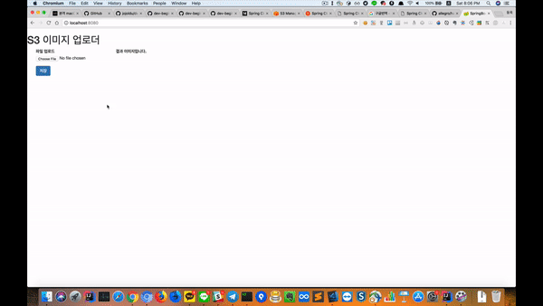
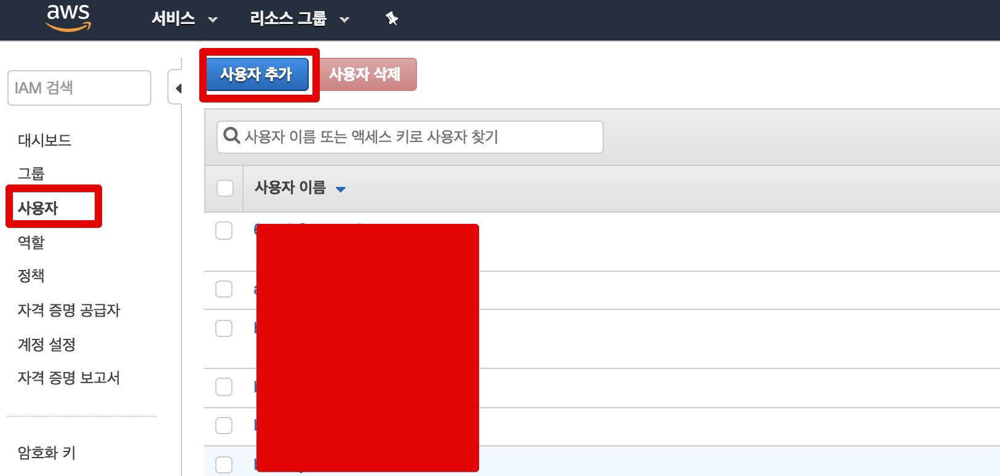
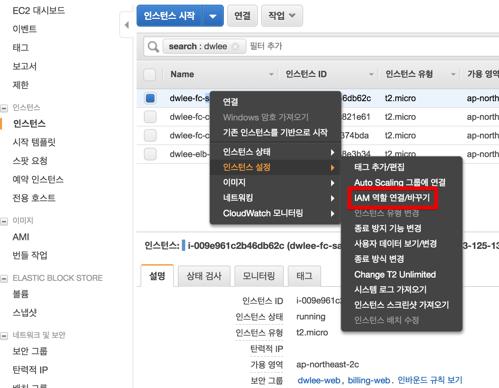

# SpringBoot & AWS S3 연동하기

안녕하세요? 이번 시간엔 SpringBoot & AWS S3 연동하기 예제를 진행해보려고 합니다.  
모든 코드는 [Github](https://github.com/jojoldu/blog-code/tree/master/springboot-aws-tui)에 있기 때문에 함께 보시면 더 이해하기 쉬우실 것 같습니다.  
(공부한 내용을 정리하는 [Github](https://github.com/jojoldu/blog-code)와 세미나+책 후기를 정리하는 [Github](https://github.com/jojoldu/review), 이 모든 내용을 담고 있는 [블로그](http://jojoldu.tistory.com/)가 있습니다. )<br/>
  
SpringBoot로 서비스를 구축하다보면 꼭 만들어야할 것이 **정적 파일 업로더**입니다.  
이미지나 HTML과 같은 정적 파일을 S3에 제공해서 이를 원하는 곳에서 URL만으로 호출할 수 있게 하는걸 말합니다.  
보통 [TUI 에디터](https://github.com/nhnent/tui.editor)와 같은 웹 에디터에서는 꼭 같이 구현해야할 기능입니다.  
  
클라우드가 없던 시절에는 서버 1대에 웹 서버(Apache, Nginx 등)을 설치하여 특정 디렉토리를 지정해서 구현했었는데요.  
클라우드가 생기고 나서는 클라우드에서 제공하는 스토리지 서비스를 사용하면 되서 아주 편해졌습니다.  
여기서는 AWS의 S3를 이용하여 구현해보겠습니다.  
  
Spring Cloud AWS와 AWS S3를 이용하여 아주 쉽게 진행하니 가벼운 마음으로 따라오시면 될것 같습니다.


## 1. Spring Boot 프로젝트 생성

먼저 프로젝트 구성을 위해 의존성을 추가합니다.  
여기서는 Gradle을 사용합니다.  
  
### build.gradle

```groovy
repositories {
    mavenCentral()
    maven { url 'https://repo.spring.io/libs-milestone'}
}


dependencies {
    compile('org.springframework.boot:spring-boot-starter-web')
    compile('org.springframework.cloud:spring-cloud-starter-aws')

    // handlebars
    compile 'pl.allegro.tech.boot:handlebars-spring-boot-starter:0.3.0'

    compileOnly('org.projectlombok:lombok')
    testCompile('org.springframework.boot:spring-boot-starter-test')
}


dependencyManagement {
    imports {
        mavenBom 'org.springframework.cloud:spring-cloud-aws:2.0.0.RC2'
    }
}
```

> Spring Cloud AWS가 현재 (2018.06.03) 2.0.0.RC2가 최신이라 ```maven { url 'https://repo.spring.io/libs-milestone'}``` 추가가 필요합니다.  
  
뷰 템플릿은 본인이 원하시는걸 사용하시면 됩니다. (Freemarker, Thymeleaf 등)  
저는 개인적으로 Handlebars를 선호하기 때문에 ```compile 'pl.allegro.tech.boot:handlebars-spring-boot-starter:0.3.0'```를 추가했습니다.  
  
### S3Uploader.java

다음으로 S3에 정적 파일을 올리는 기능을 하는 ```S3Uploader.java``` 파일을 생성합니다.  

> 여기선 Lombok을 사용한 코드가 있으니 참고하세요.

```java
@Slf4j
@RequiredArgsConstructor
@Component
public class S3Uploader {

    private final AmazonS3Client amazonS3Client;

    @Value("${cloud.aws.s3.bucket}")
    private String bucket;

    public String upload(MultipartFile multipartFile, String dirName) throws IOException {
        File uploadFile = convert(multipartFile)
                .orElseThrow(() -> new IllegalArgumentException("MultipartFile -> File로 전환이 실패했습니다."));

        return upload(uploadFile, dirName);
    }

    private String upload(File uploadFile, String dirName) {
        String fileName = dirName + "/" + uploadFile.getName();
        String uploadImageUrl = putS3(uploadFile, fileName);
        removeNewFile(uploadFile);
        return uploadImageUrl;
    }

    private String putS3(File uploadFile, String fileName) {
        amazonS3Client.putObject(new PutObjectRequest(bucket, fileName, uploadFile).withCannedAcl(CannedAccessControlList.PublicRead));
        return amazonS3Client.getUrl(bucket, fileName).toString();
    }

    private void removeNewFile(File targetFile) {
        if (targetFile.delete()) {
            log.info("파일이 삭제되었습니다.");
        } else {
            log.info("파일이 삭제되지 못했습니다.");
        }
    }

    private Optional<File> convert(MultipartFile file) throws IOException {
        File convertFile = new File(file.getOriginalFilename());
        if(convertFile.createNewFile()) {
            try (FileOutputStream fos = new FileOutputStream(convertFile)) {
                fos.write(file.getBytes());
            }
            return Optional.of(convertFile);
        }

        return Optional.empty();
    }
}
```

Spring Boot Cloud AWS를 사용하게 되면 S3 관련 Bean을 자동 설정해줍니다.  
그래서 아래 3개에 대해서 본인이 **직접 설정할 필요가 없습니다**.

* AmazonS3
* AmazonS3Client
* ResourceLoader

코드의 순서는 간단합니다.  

* MultiPartFile을 전달 받고
* S3에 전달할 수 있도록 MultiPartFile을 File로 전환
* 전환된 File을 S3에 **public 읽기** 권한으로 put
  * 외부에서 정적 파일을 읽을 수 있도록 하기 위함입니다.
* 업로드된 파일의 S3 주소를 전달 받음
* 로컬에 생성된 File 삭제
  * Multipartfile -> File로 전환되면서 로컬에 파일 생성된것을 삭제합니다.

### application.yml

S3와 관련된 설정을 추가합니다.  


AWS에서 사용할 설정값(Credentials, region 등)들만 application.yml에 추가합니다.

```yaml
spring:
  jpa:
    hibernate:
      ddl-auto: update
  profiles:
    active: local

cloud:
  aws:
    s3:
      bucket: jojoldu
    region:
      static: ap-northeast-2
```

여기서 중요한 값 2개가 빠졌는데요.  
바로 AWS의 ```credentials.accessKey```와 ```credentials.secretKey```입니다.  
이 2개의 키 값은 

### 로컬 테스트




### IAM User 생성




### EC2에 역할 추가





