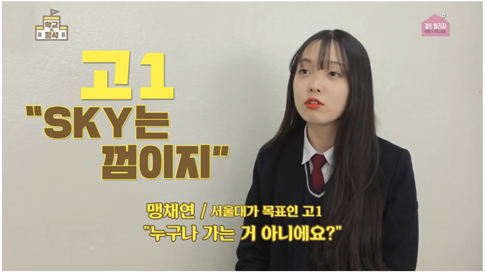
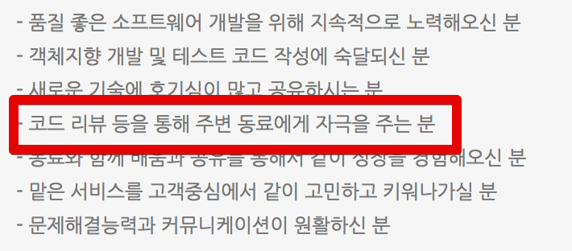

# 2. 취업준비

[국비교육](http://jojoldu.tistory.com/277)을 마치고 본격적으로 취업생 생활을 시작하게 됩니다.  
  
4학년 2학기 ~ 5학년 2학기(졸업연기 ㅠㅠ)까지 도합 **1년 6개월을 준비**해서 겨우 취업이 되었습니다.  
그 과정을 천천히 이야기하겠습니다.

## 2-1. 4학년 2학기



6개월정도 서울에서 더 머문뒤, 학교로 복귀하였습니다.  
당시 제 스펙은

* 국비교욱 수료
* 정보처리기사

이 2가지가 전부였습니다.  


이 시기는 네이버, 다음, 쿠팡, 티몬, 줌인터넷, 11번가 등등 **자체 서비스를 하는 기업**만 지원하겠다는 아주 거만한 생각을 했었습니다.


## 2-2. 5학년 1학기


## 2-3. 5학년 2학기


대망의 5학년 2학기가 되었습니다.  
이번에도 안되면 6학년이라며 친구들이 저를 초등학생이라고 부르기 시작한 시기입니다.  


## 2-4. 서비스 기업 취업 팁


### 간단한 면접 예시

가장 흔한 면접 질문이 **세션과 쿠키의 차이점은?** 입니다.  
여기서 취업준비생 분들은 흔히 "세션은 서버에 저장되는 값이며, 쿠키는 클라이언트에 저장되는 값입니다." 라고 대답합니다.  
  
좋은 서비스 회사는 여기서부터 본격적으로 질문이 시작됩니다.  
  
질문1) 

```java

String user = httpSession.getAttribute("user");
```

> 여기서 session의 값을 가져오는 key는 ```"user"```입니다.  
사용자 A가 접속해도 ```"user"```로 값을 가져오고, 사용자 B가 접속해도 ```"user"```로 가져오는데 **어떻게 A와 B가 접속했을때 서로 다른 결과값**을 받을수 있나요?  

질문2)

> 본인이 만든 프로젝트는 톰캣을 내렸다가 올리면 로그인이 풀려있지 않나요?  
톰캣을 내렸다가 올려도 로그인이 풀리지 않으려면 어떻게 해야할까요?  

질문3)
> 세션은 서버에 저장되고, 쿠키는 클라이언트에 저장된다고 하셨는데, 그럼 쿠키가 안되는 상황에서는 세션은 사용할 수 있을까요? 없을까요?

> [이전 포스트](http://jojoldu.tistory.com/118)에 위 면접 질문에 관한 힌트를 정리했으니 한번 참고해보세요!  
이외에 웹의 동작방식에 대한 전반적인 지식을 얻고 싶으시다면 [웹을 지탱하는 기술](http://book.naver.com/bookdb/book_detail.nhn?bid=6646793) 책을 꼭 읽어보세요.  
너무나 중요한 내용을 잘 설명한 책입니다.  
다만 절판되서 중고로 구할수밖에 없습니다 (중고가격이 5만원이나 합니다 ㅠ)

경력분들에겐 너무 쉬운 질문들입니디만, 취업준비중이신 분들에게 물어보면 이 질문에 대답하시는 분들이 거의 없었습니다.  
코딩 테스트만 공부하시면 이런 기술면접에서 완전 털립니다.  
Java 웹 백엔드 개발자를 기준으로 다음의 내용 정도는 꼭 알아놓으시길 추천합니다.

* Java 기본
  * [JAVA 프로그래밍 면접 이렇게 준비한다](http://book.naver.com/bookdb/book_detail.nhn?bid=8655189)
* 사용자가 브라우저에서 URL을 입력하면 어떤 과정을 거쳐 결과 페이지로 이동하는지
* DBMS의 인덱스 작동 방식
  * [MySQL 인덱스 정리](http://jojoldu.tistory.com/243)
  * [SQL 첫걸음](http://book.naver.com/bookdb/book_detail.nhn?bid=9738902)
  * [SQL 레벨업](http://book.naver.com/bookdb/book_detail.nhn?bid=10160776)


## 2-5. 첫 직장으로 완전 초기 스타트업은 어떨까?

> 여기에서 말하는 초기 스타트업이란 **기존 개발자가 0~1명, 설립된지 1년 미만**의 스타트업을 얘기합니다.  

사람마다 다를 수 있다는 점을 먼저 말씀드리며,  
개인적으로는 **반대**합니다.  
저는 개발자로서 좋은 첫 직장의 첫 번째 조건으로 **코드 리뷰 문화**를 꼽습니다.  
두번째 조건으로 **트래픽**을 얘기합니다.  
이 2개가 **회사의 명성/복지/연봉/기술스택**보다 훨씬 더 중요하다고 생각하고 주변에도 항상 그렇게 얘기하고 있습니다.  
  
**초기 스타트업은 이 2개를 만족하지 못합니다**.  
초기 스타트업은 **시니어 개발자분들이 본인의 역량을 뽐내는 곳**이지, **신입이 배울 수 있는 곳이 아닙니다**.  
물론 예외적으로 초기 스타트업에 **엄청난 고수 시니어분이 계시고 그분 옆에서 지속적으로 가르침을 받을 수 있다면** 얘기가 다르지만, 그럴 확률이 굉장히 낮습니다.  
(만약 확실하게 고수 시니어분 옆에서 배울수 있는 기회가 있다면 바로 입사하시면 됩니다.)  
  
그래서 모든 조건들 중에 최우선적으로 보셔야할 것은 **코드 리뷰 문화**입니다.  
이 외에는 솔직히 신입때는 무시하셔도 됩니다.  
시간이 흘러 이직하실때 굉장히 좋은 대우로 이직하실수 있습니다.  
  
여기서 주의하실 점은, **코드리뷰는 팀마다 다를수 있다**는 것입니다.  
"A회사는 코드리뷰를 한다" 가 사실은 "A회사의 a팀은 코드리뷰를 한다" 일 수도 있습니다.  
무조건 A 회사에 지원했다가 **코드리뷰를 하지 않는 팀에 입사**하게 될 수도 있습니다.  
예를 들어 카카오 스토리의 경우 [좋은 코드리뷰 문화](http://tech.kakao.com/2016/02/04/code-review/)로 유명합니다.  
하지만 카카오의 모든 팀이 코드리뷰가 잘되는지는 확인해봐야겠죠?
  
요즘은 많은 회사가 팀 단위로 채용을 하고 있기 때문에, **팀의 채용 공고에 코드리뷰가 포함**되어 있는지 꼭꼭 확인해보시길 추천드립니다.



(요렇게 채용 공고에 포함되어있는지 꼭꼭! 확인해보세요.)  

## 2-6. 중소/중견 SI 취업팁

여기서 중견 SI란, **매출액 500억 이상인 SI 회사**를 얘기합니다.  
물론 다들 좋은 서비스 기업으로 가고 싶으시겠지만, 그럴 경우 경우의 수가 너무 적기 때문에 중소/중견 SI 지원 역시 한가지 방법입니다.  
  
주변의 중소/중견 SI에서 서류 심사를 하셨던 분들의 이야기를 들어보면 **Spring Framework 사용 여부 & 정보처리기사**로 많이 거른다고 합니다.  
이게 말도 안되는 조건이지만, 회사 입장에선 **프레임워크를 가르칠만큼 여력이 없기 때문**입니다.  
그래서 기본기 보다는, 당장 프로젝트에서 쓸 기술을 배웠느냐 여부가 굉장히 큰 요소로 작용한다고 합니다.  


## 2-7. 추천 스타트업

우아한형제들, 쿠팡등은 스타트업이지만 너무 유명합니다.  
그 외에 추천 스타트업이 있다면 토스, 야놀자, 푸드테크, 드라마앤컴퍼니(리멤버), 빙글, VCNC(비트윈), 8퍼센트 등이 좋은 개발문화를 가진 스타트업으로 유명합니다.  
이외에 커리어 쌓기 좋은 회사의 채용 정보는 [Github](https://github.com/jojoldu/junior-recruit-scheduler)에서 꾸준히 업데이트 하고 있으니 참고하세요!

> 좀 더 자세한 컨설팅을 받고 싶으시다면 [OKKY](https://okky.kr/)의 공동 대표님이시자, [eBrain](http://ebrain.kr/)의 대표님이신 [노상범](https://www.facebook.com/sbroh)님께 메세지를 보내시길 추천드립니다.  
굉장히 상세하게 취업과 커리어에 대해 상담해주십니다.