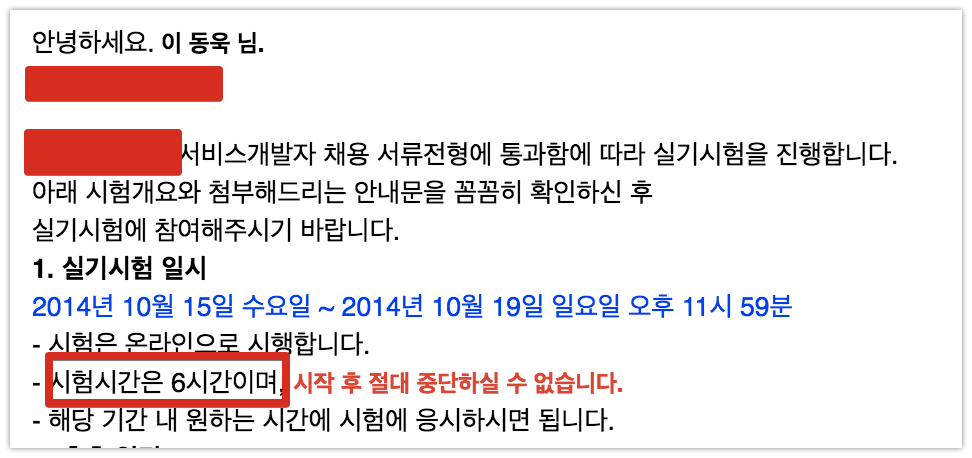

# 3. 첫 직장, 첫번째 이직

1년 6개월만에 드디어 취업에 성공했습니다.  
막상 입사해보니 개발자 동기 12명 중, 제가 가장 나이가 많았습니다. (28살)  
  
절 뽑아준 회사엔 너무나 죄송스럽지만, 취업하면서 목표로 한 것은 "**최대한 빨리 서비스 기업으로 옮기기**" 였습니다.  
그래서 신입사원 교육이 있던 시기(2월초)부터 이력서를 작성하고 제출했습니다.  
이게 올바른 태도는 아니라고 생각합니다.  
하지만 저는 정말 서비스 기업에서 일해보고 싶었습니다.  
조금만 긴장 풀어버리면 영영 못 옮길수도 있다는 무서움에 이직준비는 입사하자마자 바로 준비했습니다.  
  
첫 직장의 모든 행동은 **이직**에 맞췄습니다.  

## 3-1. 첫 프로젝트 참가

신입 사원 교육이 끝나고, 회사에서 저희 동기들에게 한가지 제안을 했습니다.  
막바지인 대형 프로젝트에 3명이 파견을 가야한다는 것이였습니다.  
근무지도 분당이였기에 출근 시간이 1시간 30분으로 늘어나고 친해진 동기들과 떨어져야 하는 상황이긴했지만 저는 어떻게든 커리어를 쌓고 싶었기에 바로 신청했습니다.  
  
**"몇백억 프로젝트 참여"는 이력서에 굉장한 메리트**라고 생각했습니다.  
하지만 이건 큰 착각 이였습니다.  
몇백억 혹은 몇천억 규모의 대형 프로젝트에서 **신입 개발자가 할 수 있는 개발은 없습니다**.  
개발은 모두 대리 ~ 차장급 분들이 진행하시고, 저희는 문서출력, 엑셀 작성, 사용자 테스트 등 **개발과 전혀 무관한 일**만 진행했습니다.  
너무나 당연한게, 이제 막 학교 졸업한 **신입에게 대형 프로젝트의 개발을 맡길일이 없었던 것**이죠.  
  
더군다나 대규모 트래픽/대용량 데이터, 실시간 서비스 운영등은 SI 대형 프로젝트와 전혀 관련이 없었습니다.  
**SI에서 대형 프로젝트란 돈과 인력이 대규모로 투입된 프로젝트**를 얘기하는 것이였습니다.  
당시에 이를 모르고 참여했다가 코드 한줄 못 짜보고 3개월을 보냈습니다.  
  
> 대기업 XX의 **1조** 프로젝트에 참여한 지인은 HTML 팝업창만 했습니다.  
(해당 대기업의 공채 개발자였습니다.)

물론 그 회사에 계속 있을 계획이라면 도움이 됩니다.  
아무래도 **대형 프로젝트**에서만 경험할 수 있는 프로세스들이 있고, 프로젝트 참여한 PM/리드 개발자분들과 친해지면 계속 참여할 기회가 많아질 수 있습니다.  
  
하지만 개발 실력을 키우고, 서비스 기업으로 옮긴다는 측면에서 도움이 되냐고 물어보신다면 물음표입니다.  
실제로 제가 처음 이직할때 작성한 이력서에는 이 프로젝트 이야기는 1도 작성하지 않았습니다.  
**코드 한줄 작성하지 않은 프로젝트를 어떻게 개발 이력서에 쓰나요**.  
  
파견나간지 하루만에 개발은 하나도 못할것이란걸 알게 되고, 매일 아침 8시에 도착해서 Java, 디자인패턴, Servlet을 공부했습니다.  
출근시간만 1시간 30분이 걸려서 그 이상 일찍오는 것은 힘들었습니다.  
  
그리고 주말마다 스터디에 참석했습니다.  
스터디는 주로 2군데서 찾았습니다.  

* [코드 초보 스터디](http://cafe.naver.com/javachobostudy)
* [하코사](http://cafe.naver.com/hacosa)
  
코드 초보 스터디는 Java & JSP & Servlet 등 백엔드 개발자들이 모인곳이고, 하코사는 프론트엔드 개발자분들이 모인 곳이라 필요한 기술들이 있을때마다 스터디를 개설하거나 참석했습니다.  
(ex: Javascript & jQuery는 하코사에서, 디자인패턴은 코초스에서)  
  
> 하코사에서는 Git & Github, Nodejs 등의 스터디도 올라와서 백엔드라고 꼭 코드초보스터디에서만 스터디를 찾을 필요는 없으실것 같습니다.
  
파견 나가있던 시기가 상반기 취업 시즌이라 퇴근 후에는 이력서를 계속 제출했습니다.  
여전히 네이버/다음/쿠팡/줌인터넷/이베이/티몬만 제출했습니다.  
이번 대형 프로젝트 경험으로 SI 대기업은 전혀 고려하지 않고, 오직 서비스 기업에만 제출했습니다.  

> 참고로 경력 만 2년 미만이실 경우 보통 신입으로 지원합니다.  
일반적으로 경력직이라 하면 만 2년이상의 경력직을 얘기합니다.  
물론 지원 조건에 **몇년 이상의 경력** 이란 내용이 없다면 그냥 지원하시면 됩니다.  
왜 지원했냐고 욕하는 사람 없으니 밑져야 본전이란 마음으로 지원하세요!

3개월의 시간이 지나 프로젝트가 종료되고 본사로 복귀하게 됩니다.  
그리고 지원했던 상반기 이력서들은 모두 탈락하였습니다.  
마음을 다잡고 다시 시작하게 됩니다.

## 3-2. 두번째 프로젝트 참가

이미 동기들은 프로젝트가 한창이였기에, 저는 대리님 혼자서 진행하던 사내 프로젝트 관리 시스템 구축에 참여하게 되었습니다.  
대리님 옆에서 처음으로 브라우저 디버깅을 배웠습니다.  
항상 ```alert```으로 디버깅 하다가 크롬의 디버깅 모드는 신세계였습니다.  
브라우저의 javascript는 이렇게 디버깅하는구나 하고 감탄했던 기억이 납니다.  
3개월간 문서정리, 단순 테스트만 하다가 이클립스로 개발을 시작하니 너무 즐거웠습니다.  
  
업무시간엔 대리님과 함께 프로젝트를 진행하고, 저녁에는 개인 공부를 진행했습니다.  
생활이 넉넉한 편은 아니였던지라, 저녁은 회사 돈으로 해결하자란 생각으로 야근을 자처했습니다.  
헌데 항상 저녁에 남아서 공부하고 있으면 다른 분들이 오셔서 이런 말들을 하셨습니다.  
  
"개발은 중요하지 않다."  
"개발은 누구나 한다."  
"업무와 영업이 중요하다."  
  
등등의 이야기가 저는 참 듣기 싫었습니다.  
실제로 이쪽 업계에선 그럴수 있겠지만, 그게 개발자로서 올바른 자세라곤 생각하지 않았습니다.  
그런 얘기를 들을때마다 "그럼 네이버/카카오는 제비뽑기로 개발자 뽑나" 란 생각을 했습니다.
  
사람 기운 빠지게 하는 이야기를 들을때마다 임백준님이 쓰신 책들을 보고 위로를 받았습니다.

* [뉴욕의 프로그래머](http://book.naver.com/bookdb/book_detail.nhn?bid=3082260)
* [행복한 프로그래밍](http://book.naver.com/bookdb/book_detail.nhn?bid=124224)

이 책에 나온 개발자들처럼 나도 될수있다, 되고싶다 란 생각으로 계속 공부했습니다.(유치하죠?)  
  
그럼에도 멘탈 관리가 안될때가 있었습니다.  
바로 회식입니다.  
저는 **무의미한 이야기로 늦게까지 술 먹는 것을 정말 싫어합니다**.  
본사에서는 신입사원이 왔기 때문에 회식이 정말 자주 있었습니다.  
최대한 빠질려고 했지만, 그래도 빠지면 안되는 회식들에는 참석하는데 그때마다 스트레스였습니다.  
  
이렇게 술먹는데 계속 시간을 낭비하는게 너무 아까워서 미칠것 같았습니다.  
이럴 시간이 없는데, 왜 자꾸 시간을 버리게 만드는건지, 답답한 마음이였습니다.  
새벽 4시에 회식이 끝난후 집에 들어온 날에, 너무 화가나서 집에 도착하자마자 집 벽을 주먹으로 때리고 소리를 질렀습니다.  
한참 소리지르고 나서, "2년 안에 서비스 기업으로 못가면 짐싸서 대구 간다" 라는 다짐을 했습니다.  
  
2년이란 구체적인 제한이 생기니 좀 더 의지가 강해졌습니다.  
하반기가 시작되기 전까지 **스프링으로 게시판 만들기**를 목표로 정했습니다.  
국비교육에서 게시판을 만들었음에도 

* 국비교육 게시판의 코드를 설명할 수가 없다.
* 나 혼자 만든게 아니라서 면접관들이 믿어주지 않을것 같다.
* 하나의 게시판을 혼자 만들면서 다시 정리 하고 싶다.

란 이유로 본격적으로 게시판을 만들기 시작했습니다.  
한창 더운 시기인 6월부터는 **주말에도 회사에 나왔습니다**.  
집 에어컨을 사용하기엔 전기세가 너무 많이 나왔기에 에어컨 빵빵하게 회사에서 공부하잔 계획이였습니다.  
가끔씩 주말에 출근하시는 팀장님들이 사주시는 점심식사나 간식등으로 식비도 아낄수 있어서 1석 2조였습니다.  
  
생애 처음으로 쿠팡의 서류가 통과됐습니다.  


## 3-3. 세번째 프로젝트 및 첫번째 이직


파워빌더로 구축된 기존 프로젝트를 전자정부로 전환하는 차세대 프로젝트였습니다.  

온라인 코딩테스트는 1주일의 시간을 주고, **원하는 시간대에 시작해서 6시간 동안** 치루면 됐습니다.  



당연히 평일에는 야근으로 치룰수 없기에 주말에 각잡고 6시간 동안 풀면 되겠다고 생각했습니다.  
하지만 역시 전 운이 안따라주기에 하필 **그 주말에 전사 체육대회**가 있었습니다.  
토요일 하루종일 체육 대회가 진행되는데, 신입이다보니 모든 종목에 참여해야만 했습니다.  

면접지와 파견지가 그렇게 멀지 않아서, 택시타면 10분이면 갈 수 있었기에, 

1차 면접은 

## 3-4. 연봉 팁

연봉과 관련해서 한가지 팁을 드리자면 **퇴직금 포함**인 곳은 가시면 안됩니다.  
**퇴직금 별도**인 곳으로 가셔야 합니다.  
(중견급 이상의 회사에선 기본적으로 **퇴직금 별도**입니다.)  
둘의 차이는 다음과 같습니다.

* 퇴직금 포함
  * **연봉안에 퇴직금이 포함**
  * 2400 / 13 (12개월 + 퇴직금) = 월 184
  * 세전 184 -> 세후 167 (세전 급여의 약 90%)
  * 수습의 경우 세전 147 (184의 80%) -> 세후 133 (세전 급여의 약 90%)
* 퇴직금 별도
  * **연봉안에 퇴직금이 미 포함**
  * 2400 / 12 (12개월) = 월 200
  * 세전 200 -> 세후 180 (세전 급여의 약 90%)
  * 수습의 경우 세전 160 (200의 80%) -> 세후 144 (세전 급여의 약 90%)

즉, 퇴직금 별도인 회사라면 연봉 2400일 경우 정사원일 경우 180, 수습일 경우 144가 실제 통장에 들어옵니다.

> 좀 더 다양하고 자세한 연봉과 실급여을 알고 싶으시면 [2018년 연봉 실수령액 표](http://job.cosmosfarm.com/ko/calculator/salary)을 보시면 됩니다.  
수습의 경우 급여의 80%로 계산하시면 됩니다.

그리고 1~3년차일때는 **적금보다는 본인에게 투자**하는게 더 낫다고 생각합니다.  
제 통장에 처음 들어온 급여는 144만원이였습니다.(연봉 2400의 수습)  
수습 기간이 끝난 후에는 180만원이 되었지만, 이 돈을 모으는건 의미가 없다고 생각했습니다.  


차라리 아낌없이 코딩 관련 공부에 투자하고 연봉을 올리는게 낫다는 생각이였습니다.  
월세, 관리비, 보험료, 3끼 식사비, 교통비, 폰요금, 생필품, 경조사 등등 다 제외하고 나면 180 기준으로 약 30~40만원 정도의 여유금을 전부 세미나, 책, 스터디에 사용했습니다.  
그리고 첫 이직시에 기존 연봉에서 1200을 올려서 갈 수 있었습니다.  

충분히 괜찮은 유료 교육임을 확신하게 되면 비싸더라도 들으시는걸 추천드립니다.  
**혼자서 삽질하는 시간이 훨씬 더 아깝습니다**.  
충분히 좋은 유료 교육이 있다면, **돈을 지불하는게 아니라 시간을 사는거**라고 생각하세요.  
주니어 일때는 아낌없이 본인의 공부를 위해 돈을 지불하시는걸 적극 추천드립니다.

## 3-5. 코딩테스트 팁

저도 코딩 테스트는 정말 싫어하고, 효율성에 대해서는 의문입니다.  
일단 제가 알고리즘을 못하는데 이런 팁을 쓸 자격이 있나란 생각이 계속 들었지만, 제가 그랬던것처럼 시작하기엔 막막하고, 더 중요한 공부가 있어 깊게 파기엔 부담스러우신 분들을 위해 남깁니다.  
  
아래 팁은 모두 [Codility](https://www.codility.com/) 기준입니다.  
(전회사, 현회사 모두 Codility로 코딩테스트를 봤습니다.)

* 구글에서 검색해서 나온 코드를 쓰지마세요
  * 온라인 코드 테스트다보니 구글에서 검색해서 나온 코드를 변수명만 바꿔서 제출하시는데 이러시면 탈락할 확률이 높습니다.
  * Codility에선 제출된 코드가 외부에서 검색된 코드와 얼마나 비슷한지 보여주는 지표가 있습니다.
  * 회사마다 다르겠지만, 이런 행위를 치팅으로 보고 바로 탈락시키는 회사가 있습니다. 

* 문제 속의 테스트케이스가 전부가 아닙니다.
  * 인터넷 글을 보면 항상 다 풀었는데 떨어졌다고 하시는 분들이 계시는데 대부분은 딱 **문제에 나온 테스트 케이스 2~3개만 통과된 코드**를 작성하신 분들입니다.
  * 대략 20개 이상의 테스트 케이스가 있다고 보시면 좋습니다.
  * 일반 알고리즘 사이트는 모든 테스트케이스가 통과해야하지만, Codility는 테스트 케이스중 통과한 만큼을 점수로 환산하니 최대한 많은 케이스를 고려해서 제출하세요.

* 꼭 사이트내에서 안푸셔도 됩니다.
  * IDE에서 풀고 코드만 복사해서 넣으셔도 됩니다.
  * 단, 결과가 잘 되는지 실행은 자주 하세요.
  * **실행할 때마다 스냅샷으로 실행 당시의 코드를 저장**하는데, 이 스냅샷들을 보고 어떻게 문제를 해결해나가는지 보시는 면접관 분들도 계십니다.


### 추천 책 & 사이트

국내에는 여러 알고리즘 풀이 사이트가 있습니다.  
개인적으로는 [백준 알고리즘](https://www.acmicpc.net/)을 추천합니다.  
아무래도 [Slack](https://www.acmicpc.net/slack) 을 통해서 정말 문제가 안풀릴때 물어볼 곳이 있고, 최백준(임백준님 아닙니다. 오해하시는 분들이 계셔서..)님께서 직접 사이트의 문제로 [강의](https://startlink.io/)를 하시기 때문에 알고리즘 풀이가 처음인 분들이 시작하시기에 좋습니다.  
  
책은 순서대로 읽으시길 추천드립니다.

* [Hello Coding 그림으로 개념을 이해하는 알고리즘](http://book.naver.com/bookdb/book_detail.nhn?bid=11823284)
  * 주요 알고리즘들을 가장 쉽게 설명한 책입니다.
  * 본격적으로 문제 풀이를 시작하시기전에 읽어보시길 추천드립니다.
* [TopCoder 알고리즘 트레이닝](http://book.naver.com/bookdb/book_detail.nhn?bid=7333164)
  * [탑코더](https://www.topcoder.com/) 라는 해외의 유명한 알고리즘 온라인 대회를 겨냥한 책입니다.
  * 알고리즘 대회에서 자주 나오는 유형들을 **Java**코드로 풀이한 책입니다.
  * 개인적으로는 가장 친절한 설명이 담긴 책이였습니다.

여기까지 다 보시고, 좀 더 깊게 가시고 싶으시다면 아래의 책을 추천합니다.

* [알고리즘 문제해결 전략](http://book.naver.com/bookdb/book_detail.nhn?bid=7058764)

국내에서 **알고리즘 대회**를 준비하시는 분들은 모두 갖고 계신다는 그 책입니다.  
C++코드로 되있어서 C++를 한번도 안해보신 분들은 저항감이 좀 있을 수 있습니다.  
다만, 알고리즘을 제대로 안해보신 분들은 보시면 하나도 이해 안되실겁니다.  
(저는 진짜 어려웠습니다.)  
  
보다가 중간에 포기했던 책이라 꼭 다보시라는 이야기는 어렵지만, 다만 **7장 분할정복**, **8장 동적 계획법**은 꼭 보시고 [알고스팟](https://algospot.com/)에서 책에 나온 문제를 풀어보시길 적극 추천드립니다.  
(코딩 테스트에서 가장 빈도수가 높은 유형입니다.)  
  
물론 회사마다, 팀마다, 경력마다 코딩 테스트의 난이도는 천차만별입니다.  
정말 쉬운 문제들이 나올수도 있고, 반면에 변별력을 위해 어려운 문제가 나올 수도 있습니다.  
이렇게 안해도 합격하시는 분들이 계시기 때문에 이렇게까지 하고 싶지 않으신 분들은 안하셔도 됩니다.  
  
다만, **신입분들은 무조건 준비**하세요.  
경력 분들은 코딩 테스트외에도 판단할 근거가 될 자료가 많은데, 신입 분들은 그럴만한 자료가 잘 없습니다.  
실제로 코딩 테스트 난이도를 보면 **신입 분들 난이도가 경력 보다 어려운 경우**를 자주 봅니다.  
(일반적인 자바 웹 백엔드 개발자 기준입니다. 다른 분야에선 아닐수 있습니다.)  
  
최근의 신입 개발자 분들의 블로그를 보면 특히나 알고리즘 문제를 많이 푸시는게 보여서 더더욱 경쟁이 치열해질것 같습니다.
(같이 스터디하던 동생은 백준 알고리즘 Java 랭킹 7위까지 가는걸 보고 기겁했습니다.)


