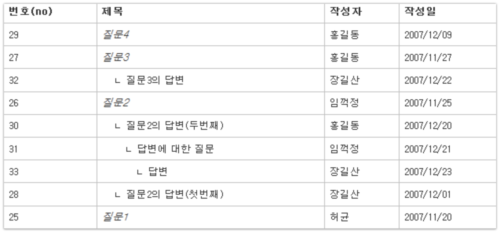

# 4. 두번째 직장 #1

생애 처음으로 **서비스 기업에서 개발**을 시작하게 됐습니다.  


(오예!)  
  

두근두근한 마음을 안고 첫 출근을 했습니다.  
이번 공채로 입사한 개발자 동기는 저 포함해서 3명이였습니다.  
서로 어색한 인사를 나누면서 대기하다가, 각 팀의 팀장님들이 오셔서 각자 데려가셨습니다.  
1~2주의 개발 교육이 있을거라 예상했는데, **개발 교육 없이 바로 팀에 합류**하게 됐습니다.

> 회사의 규모에 따라 서비스 기업이라도 신입 사원 개발 교육이 있을수도/없을수도 있다는 것을 알게 됐습니다.

제 자리에는 모니터 3대와 데스크탑 2대가 **포장이 된 채로** 있었습니다.  
**PC설치부터 OS설치까지 모두 직접** 해야한다는 것입니다.  
'음..?' 라는 생각이 잠깐 스쳤습니다.  
개발자라면서 혼자서 윈도우, 리눅스도 설치 못한다는 말은 부끄러워서 할 수 없었습니다.  
(리눅스 설치를 생애 처음 시작해봤습니다.)  
  
마음을 가다듬고 포장을 뜯기 시작했습니다.  
인터넷망과 내부망 랜선을 각각 PC에 꽂고 2대중 1대는 윈도우를, 1대는 우분투를 설치했습니다.   
각각의 드라이버를 다 잡은뒤 개발 환경을 세팅했습니다.  
개발 환경도 특별히 가이드가 없었지만, Java & Spring으로 개발한다고 하셔서 이전 회사에서 했던것처럼 Java, STS, Maven을 설치했습니다.  
일은 언제부터 시작하는거지? 라는 생각과 함께 첫 날이 마무리됩니다.  

## 4-1. 파일럿 프로젝트

출근 이틀째에 팀장님과 과제에 대해 이야기를 했습니다.  

> 팀장님: 회사에서 책만 보니 심심하지 않나요?
저: 네
팀장님: 책보는것 보다, 개발하시는게 더 편하시죠?
저: 네 ㅎㅎ 개발하는게 훨씬 좋죠 ㅎㅎ

라는 대화가 끝나고 **바로 과제를 받게 되었습니다**.  
**스프링 부트**를 이용해서 게시판을 **2주 안에 만드는 것**이였습니다.  
본격적인 과제 스펙을 전달 받았습니다.  
과제는 **계층형 게시판**이였고, 상세 스펙은 다음과 같습니다.



구현 기능

* 계층형 댓글 게시판
  * 99 Depth까지 가능하도록
  * 댓글이 많아도 속도 저하를 최소화 할 수 있는 방법 적용
* 기본적인 스크립트 공격 방어
* 이미지 등록
* 로그인/회원가입 등 기본적인 회원 기능

필수 기술

* Java 8
* SpringBoot
* Git & Gitlab
* Gradle
* MySQL
* Javascript

선택 기술

* Hibernate
* Grunt/Gulp 등 JS 빌드툴
* Spring의 다양한 어노테이션 / 모듈
* Freemarker 등 템플릿 엔진

(자세히 다 기억이 안나서 확실히 기억나는 부분만 작성했습니다.)  
  
여기서 **필수 기술은 무조건 사용**해야하는 기술이며, 선택은 사용하면 좋고 아니면 어쩔수 없는 기술이란 설명을 들었습니다.  
그리고 프로젝트 발표 때는 **기능과 코드**를 다 같이 리뷰하는 시간이란 이야기도 함께 들었습니다.  

> 여러분도 한번 해보세요.  
진짜 도움 많이 됩니다.  
오라클에선 계층형 쿼리(```start with 조건 connect by```)를 이용하면 되지만, MySQL은  지원이 안되서 직접 구현해야하는데 이걸 고민하는게 생각보다 도움이 많이 됩니다.  
(참고: [managing-hierarchical-data-in-mysql](http://mikehillyer.com/articles/managing-hierarchical-data-in-mysql/))

처음 스펙을 들었을때 헉? 이란 생각이 먼저 들었습니다.  
게시판이 다 거기서 거기지 라는 생각으로 쉽게 생각했는데, 막상 과제 스펙을 보고 조금만 더 공부하고 할걸 이란 생각을 엄청 많이 했습니다 ㅠㅠ  
Git, SpringBoot, Gradle, Hibernate 등 대부분의 기술이 처음인 상황이라 "이들을 공부하고 적용을 함께하면서 기간을 지킬수있나?" 라는 생각이 들었습니다.  
팀장님이나 다른 팀원분들은 **제가 이미 Java & Spring을 1년간 경험**해봤기 때문에 금방 할거라고 생각하던 상황이라 좀 더 공부하겠다는 이야기를 할 수가 없었습니다.  
  
급하다는 생각으로 부랴부랴 개발을 시작했습니다.  
안그래도 시간이 부족했는데, 사고가 한번 났었습니다.

> 팀장님: 어??? 하이버네이트 안쓰세요?
저: 네? MyBatis 썼는데요...?
팀장님: 헉.. MyBatis 쓰시는분 처음봤어요;;  
여태 신입분들이 다 하이버네이트 쓰셔서 당연히 쓰실줄알고 말씀 안드렸는데, 저희 회사 프로젝트 중에 **Mybatis 쓰는 프로젝트 없어요**;;; 하이버네이트로 진행하셔야 해요 ㅠㅠ
저: ......(그런말 없으셨잖아요...)

이 대화가 끝나고 미치겠다란 생각을 하면서 부랴부랴 **Mybatis로 구현된 부분을 다 걷어내고, 하이버네이트로 전환**을 시작했습니다.  
안그래도 허덕대고 있었는데, 이것까지 겹치니 발등에 불이 떨어졌습니다.  
  
2주안에 꼭 만들어야 한다는 이야기를 들어서, 매일 11시까지 진행하고 주말에도 출근해서 개발을 진행했습니다.  
기능 리뷰 이외에 **코드 리뷰**도 함께 하기 때문에 **마감 3일전부터는 자체 코드리뷰**와 발표자료를 만들기 시작했습니다.  
첫 회사에서의 경험으로 어찌됐든 이런 첫 평가가 앞으로의 회사생활에 큰 영향을 끼친다는걸 알기 때문에 발표자료도 잘 준비하려고 했습니다.  
  
대망의 발표날이 다가왔습니다.  
나름 준비가 된 상태라서 혹시 칭찬받지나 않을까 하는 기대감으로 회의실로 입장했습니다.  
그리고 **말로 맞는다**라는게 어떤 의미인지 알게 됐습니다.


> 코드 리뷰 내용은 사정상 공개하지 못하는 점 양해 부탁드립니다.

이렇게 개발을 못하는 사람이라는걸 실시간으로 알려주시는 시간이였습니다.  
2시간 내도록 부족한 점을 듣는데, 등에서 땀이 계속 났습니다.  
"나 그래도 개발은 좀 하는편 아닐까?" 라고 잠깐 착각했던 시간이 있었는데, 이게 완전히 깨지는 시간이였습니다.  
  

마지막 과제는 제가 만든 **프로젝트를 리눅스에 배포**하는 것이였습니다.  
별도의 리눅스 서버를 받지 않고 진행하라는 이야기를 듣고, **VM Ware에 Centos를 설치**해서 그 안에서 코드를 **gradlew로 빌드 하고 부트를 실행**해봤습니다.  
이때 ```nohup &```을 처음으로 알게 됐습니다.  
스프링부트는 별도로 톰캣을 설치하지 않고, Jar를 실행만 하면 배포가 끝나는구나 라고 혼자서 감탄하기도 했습니다.  
  
동기들도 다 과제가 끝나고, 3명이서 같이 신림 백순대를 먹으러 갔습니다.  
서로 만든 프로젝트와 리뷰 시간을 이야기 하다가 깜짝 놀랬습니다.  
  
동기들은 Spring은 커녕 **Eclise를 처음 쓰는데도 2주만에 만들어냈던 것**이였습니다.  
(국비교육도 안받고, 학교에서 C/C++/PHP만 하다가 바로 입사한 케이스였습니다.)  
  
저는 국비교육을 받았고, 약 1년간 SI회사에서 Java & Spring을 했었지만 정말 빡빡했습니다.  
헌데 이 친구들은 정말 **모든게 다 처음인 상황에서 어떻게 2주만에 만든건지**, 코드의 퀄리티를 떠나서 정말 놀랬습니다.  
제가 저 상황이였으면 도저히 그 시간안에 못했을거란 생각에 기분이 좀 다운됐습니다.  
  
그래도 이제 드디어 하나의 허들을 넘었다는 생각에 동기들과 소주한잔하면서 재밌게 이야기하고 그날을 마무리 했습니다.  
  
그리고, 드디어 본격적인 업무에 투입됩니다.

## 4-2. 다시 강의형 스터디로

개발팀의 규칙은 모든 develop 브랜치로 merge는 MR(Merge Request)을 통한 코드리뷰로만 진행되었습니다.  

> Github에선 PR이라고 하는데, Gitlab에선 MR (Merge Request) 라고 합니다.

첫 Feature 개발이 끝나고 MR을 통해 리뷰를 받았습니다.  
저 보다도, **제 코드를 본 리뷰어 분이 더 당황**하셨습니다.  
그리고 "**어? 이거 모르세요?**" 라는 말을 계속 듣게 됩니다.  
  
팀원 분들의 문제가 아니라, 제가 **이미 경력이 1년이 있기에** 어느정도 할줄 안다고 기대를 하셨던 것입니다.  
이 회사에서 **1년 근무하신 분들과 저는 비교할 수 없을만큼 많은 격차**가 있었던 상태였음을 깨닫게 된 것입니다.  
똑같이 1년의 개발 경험을 갖고 있음에도 이렇게 차이가 날 수가 있구나 라는 깨달음과 부끄러움이 함께 왔습니다.  
  
1:1 리뷰든, 단체 리뷰를 하든 리뷰만 했다 하면 얼마나 아는게 없는지 공개하는 상황이 연출되니 너무 참기 힘들었습니다.  
  
그래서 방안을 모색하기 시작했습니다.  
Java, SpringBoot, ORM(Hibernate), Git, Linux, JS 등 모르는게 너무 많았기 때문에 이것들을 모두 한번에 배울수는 없다고 생각해서 **가장 급한 불부터 끄자**고 생각했습니다.  
  
당시에 저희는 개발자가 JS까지 담당하고 있었고,  
모든 서비스는 IE7까지 지원해야만 하고,  
각 서비스의 관리 서비스는 Angular 1, Bower, Grunt, Underscore등 JS 프레임워크들이 많이 적용된 상태였습니다.


네이버카페인 하드코딩하는사람들, 코드초보스터디에서 다음과 같은 강의형 스터디를 주최했습니다.  

* Javascript


## 4-3. 유일한 사수의 팀 이동

조직개편으로 4명이였던 개발팀 인원은 2:2로 나눠지게 되었습니다.  
저는 팀장님과 한팀에서 근무를 계속 하게 되었습니다.  

팀 유일의

정말 좌절했습니다.  
당장 팀이 맡고 있는 서비스는 메인/회원/고객센터/Mail/SMS/이벤트/광고 등등 엄청 많이 있는데 

> 이걸 나 혼자 어떻게 다 하지?  
리눅스에서 Log grep조차 제대로 못하는 상황에서 장애나면 어떻게 해결해야하지?  
Nginx도, 리눅스도, 쉘/파이썬등 스크립트도, 비지니스 도메인 등 어느것 하나 제대로 못하는데 어떡하라는거지

등등 별별 생각이 다들었습니다.  
앞이 깜깜했습니다.  
이때부터 **저녁에 잠이 잘 안왔습니다**.  
매일 자정에 동네 거리를 돌아다녔습니다.  


> 아니 왜 사수를 진작에 안뽑았는거지?  
이 서비스들을 진짜 나혼자 해야하는거라고???  
퇴사해야하나?  
입사한지 1년도 안됐는데 또 퇴사하는게 말이 되나??

중간중간 지원할만한 회사를 찾아보기도 했습니다.  
그렇지만 지원을 못했습니다.  
**이미 첫 회사에서 10개월 만에 퇴사했는데, 두번째 회사에서도 7개월만에 퇴사**하는건 말도 안된다고 생각했습니다.  
커리어가 너무 망가질것 같다고 생각했기 때문에 어떻게든 더 다녀야된다고 생각했습니다.  
  
회사 입장에서 못된 생각이지만, **제가 계속 다니기 위해** 생각을 바꿨습니다.

> 못해도 2년은 버티자. 
서비스 장애나도 내탓이 아니다.  
이렇게 몰아세운 회사탓이다.  

이렇게 생각하니 그래도 마음이 좀 편안해졌습니다.  
에라 모르겠다 란 마음으로 매일 매일 출근하게 됐습니다.  


그렇게 사수가 떠나고, 팀이 담당하던 서비스를 혼자서 개발하는 생활이 시작됩니다.  
본격적인 힘듦이 기다리고 있었습니다.  
다음 편에선 팀내 최고참 개발자가 된 이야기를 전해드리겠습니다.  
긴 글 끝까지 읽어주셔서 감사합니다^^  
  
아래는 제가 서비스 기업에 입사전에 알았다면, 입사후에라도 알았다면 좋았을 팁들입니다.

## 4-4. 서비스 기업 입사 후 팁

짧지만, SI에서의 개발을 경험하고 서비스 기업으로 이직 후에 가장 힘들었고, 아쉬웠던 점 2가지를 공유드리고 싶었습니다.  
서비스 기업을 갔다고해서, 차근차근 알려주는 환경이 아니라면 본인이 혼자서 다 배워야만 합니다.  
그런 상황이 누구든 올 수 있기 때문에 아래 팁들을 참고하시면 좋을것 같습니다.

### 서비스 운영을 위한 전반적인 지식

자체 서비스를 운영하는 회사에선 어플리케이션 코드 작성만으로는 문제해결을 할 수가 없습니다.  
**웹 서비스의 전반적인 지식**이 필요합니다.  
SI에서 **Java/Spring 코드만 작성했었던** 제 입장에서 가장 부족했던 지식이였습니다.  

> 저뿐만 아니라, 주변의 많은 SI 개발자 친구들, 동생들, 형들을 볼때마다 느끼고 있습니다.  
Java & JS만 하는 경우를 정말 많이 봅니다.

이런 내용들은 오프라인 스터디에서도 다루는 주제가 아니기 때문에 좋은 사수를 만나지 않는 이상은 얻을수가 없습니다.  
그래서 이 지식들을 채워줄 좋은 책들을 소개 드립니다.

* [웹 사이트 최적화 기법](http://book.naver.com/bookdb/book_detail.nhn?bid=4587095)
* [대규모 서비스를 지탱하는 기술](http://book.naver.com/bookdb/book_detail.nhn?bid=6468636)
* [서버/인프라를 지탱하는 기술](http://book.naver.com/bookdb/book_detail.nhn?bid=6010115)

3권 모두 **한 영역의 특화된 분들을 위한 책들이 아니라**, 웹 서비스 개발을 하는 개발자를 대상으로 했기 때문에 읽으시는데 크게 부담되지 않습니다.  
  
서비스 기업을 노리시거나, 입사를 앞둔 입장이시라면 위 3권은 꼭 읽어보시길 추천드립니다.  
다른 것보다 최소한 **시니어 개발자분들의 대화가 어떤 의미인지** 이해라도 할 수 있어야 하는데, 이 책들은 그런 면에서 큰 도움을 줍니다.  
  
대규모 트래픽, 대용량 데이터 상황에서의 해결전략에 대한 전반적인 지식을 알 수 있는 가장 쉬운 방법입니다.

### 디버깅 방법

위에서 이야기한 분들이 빠지는 또하나의 함정인데요.  
**만드는 방법에만 집중**하시고 디버깅 하는 방법을 놓치시는걸 자주 봅니다.  
서비스 기업에서 **일의 절반 이상이 디버깅**입니다.  
SI에서 진행할때는 백지에서 제품까지 만드는 일을 반복했었는데, 서비스 기업에서는 운영 환경에서 발생한 문제를 해결하는게 반복된다는걸 배웠습니다.  
(**이클립스 디버깅만 알아선 안됩니다**)

* [IntelliJ 디버깅](http://jojoldu.tistory.com/149)
* [크롬 브라우저 디버깅](https://subicura.com/2018/02/14/javascript-debugging.html)
* [MySQL 실행계획](http://12bme.tistory.com/160)
  * MySQL은 그 어떤 블로그보다도 [Real MySQL](http://book.naver.com/bookdb/book_detail.nhn?bid=6886962)를 보시는게 좋습니다.
* 그 외 각 데몬들의 로그 보는 법
* 시스템 디버깅을 위한 기본적인 리눅스 명령어
  * [All about dev. on Ubuntu](https://www.youtube.com/watch?time_continue=1&v=JbH-xzD7IkE)
  * [만화로 배우는 리눅스 시스템 관리 1](http://book.naver.com/bookdb/book_detail.nhn?bid=10995037)
  