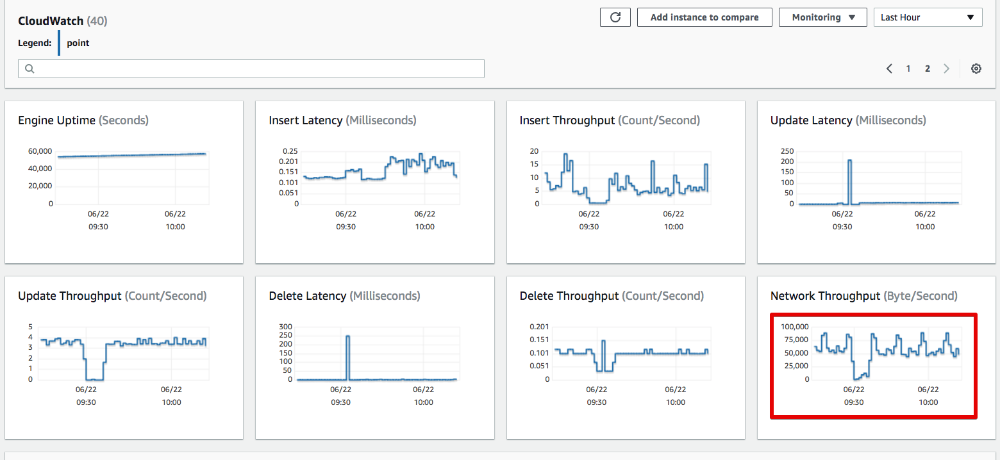

# # 포인트 시스템 개편기 #2 - 오픈 준비

## 7. 성능 테스트

성능 테스트의 경우 네이버에서 만든 Ngrinder와 Pinpoint를 사용했습니다.

성능 테스트는 2번을 진행했습니다.

* 레거시 프로시저를 API로 랩핑한 어플리케이션의 성능 테스트
* 신규 도메인 모델 API의 성능 테스트
  

성능 테스트는 실제로 
신규 포인트 시스템은 **2015년부터 쌓여 있던 포인트 데이터를 모두 신규 도메인으로 마이그레이션 했습니다**.  
대략 메인 테이블 (상세 테이블이 아닌)에 4억건 정도가 쌓인걸 확인하고 

성능 테스트에 대한 튜토리얼 비슷하게 만든 아래 시리즈가 있어 혹시나 성능 테스트를 전혀 안해보신 분들이라면 한번 참고해보셔도 좋을것 같습니다.

* [성능 튜닝 #1 - DB Connection](https://jojoldu.tistory.com/318)
* [성능 튜닝 #2 - 리눅스 커널 파라미터](https://jojoldu.tistory.com/319)
* [성능 튜닝 #3 - Nginx](https://jojoldu.tistory.com/322)
* [성능 튜닝 #4 - Open Files & tcp_max_tw_buckets](https://jojoldu.tistory.com/323)
 
### RDS R3 vs R4

대략 1억건 정도가 마이그레이션 되었을때, 도메인 모델의 변경이 필요한 것을 발견하였습니다.  
이전에 IDC에 구축한 DB에서 1억건 정도의 테이블에 Alter를 쳤을때 10분이내로 끝났던 것이 기억나 바로 ```Alter Table```를 수행했었는데요.  
  
**R4.2xlarge로 선택해서 진행했더니 2시간이 지나서도 끝나지 않았습니다**.  
RDS 사양의 문제인가 싶어 잠깐 최고 사양인 8xlarge로 올려서 수행해도 전혀 개선이 되지 않았습니다.  
왜 이런가 싶어 확인해보니 ```Alter Table```을 수행하는 동안 굉장히 많은 Network Throughput이 발생한 것을 발견하였습니다.  



이상하다 싶어 찾아보니 RDS R3의 경우 로컬 스토리지를 사용하지만, R4는 EBS를 사용하는 것을 확인하였습니다.


([링크](https://www.ec2instances.info/rds/?min_vcpus=32))  
  

혹시나 싶어 R3.2xlarge로 변경 후 ```Alter Table```을 수행하니 10분도 안되는 시간에 완료 되었습니다.  
이후에도 

물론 R4의 사양은 R3보다 훨씬 더 좋습니다.  
아래는 성능 테스트 중에 두 RDS간의 성능을 비교한 핀포인트 결과표입니다.


명확한 비교를 위해 아주 높은 수치로 테스트를 수행했었습니다.  
그만큼 둘의 성능 차이를 확연히 비교할 수 있었는데요.  
R3.8xlarge로 평균 3 ~ 5초 정도 수행되는 Application이 R4.8xlarge로 수행할 경우 평균 2 ~ 3초로 개선되는 것을 확인할 수 있었습니다.  
  
그래서 꼭 R3를 써야하는건 아니고, 상황에 따라 R3와 R4 사이에 선택하시면 좋을것 같습니다.

## 8. QA

저희는 포인트 시스템을 2판으로 구성했습니다.

* 레거시 프로시저를 랩핑한 API 
* 신규 도메인 모델로 구성된 API

같은 기능을 가진 API가 무조건 2개씩 만들어져야만 했습니다.  
이렇게 구성한 이유는 다음과 같습니다.

* 레거시 프로시저를 랩핑한 API가 정상적으로 오픈되면 이후 신규 도메인에 문제가 있어도 

같은 TC (Test Case)로 2번 QA를 진행했습니다.  
이렇게 진행한 이유는 프로시저를 랩핑한 API와 신규 API 2개 모두가 테스트 되어야만 했기 때문입니다.  
기존 레거시 프로시저를 API로 랩핑한 경우에도 저희가 놓친 프로시저가 있는게 아닐지, 다른 서비스와의 연동이 제대로 되는지 등에 대한 검증이 필수였습니다.

## 9. 배포

신규 포인터 시스템의 오픈 단계에서 큰 요구 사항이 있었습니다.  
**서비스의 정기 점검 없이 오픈** 되어야 한다는 것이였습니다.  
즉, 사용자 분들은 **정상적으로 배달의 민족 서비스를 이용하는 과정에서 포인트 시스템이 완전히 교체** 되어야 한다는 것이였습니다.  
  
물론 저희는 이 요구사항을 진작에 들었기 때문에 

총 3단계로 진행했습니다.

1. 레거시 프로시저를 랩핑한 API 오픈
2. 레거시 API를 우선순위로 두고, 구 & 신 API 동시에 이벤트 발송하는 API로 전환
3. 신규 API를 우선순위로 두고, 구 & 신 API 동시에 이벤트 발송하는 API로 전환

### 9-1. 레거시 프로시저를 랩핑한 API 오픈

7월 17일 레거시 프로시저를 랩핑한 API를 선 오픈했습니다.  
이때는 저희가 만든 신규 시스템에서 모든 비지니스 로직은 기존에 사용되던 포인트 시스템의 프로시저를 통해서 처리 되기 때문에 비지니스상 오류는 

그리고 차례로 그동안 포인트 프로시저를 사용했던 다른 시스템들이 API를 사용하는 패치가 진행되었습니다.  
  
1차 버전은 신규 API로 메시지가 발행되지 않는 버전이였습니다.  
실제 저

### 9-2. 레거시 API 우선순위 API로 전환

모든 Endpoint가 프로시저가 아닌 저희가 랩핑한 API로 전환된 것을 확인하고, 일주일간 모니터링을 진행했습니다.  
그리고 7월 25일 2차 버전인 **레거시 API 우선순위 API로 전환**했습니다.  
즉, 프로시저가 성공하고 신규 API 가 실패하면 

대신 실패한 메세지는 로그로 Json 형태 그대로 남기게 하여, 매일 수동으로 다시 SQS로 재전송 하였습니다.  


### 9-3. 신규 API 우선순위 API로 전환