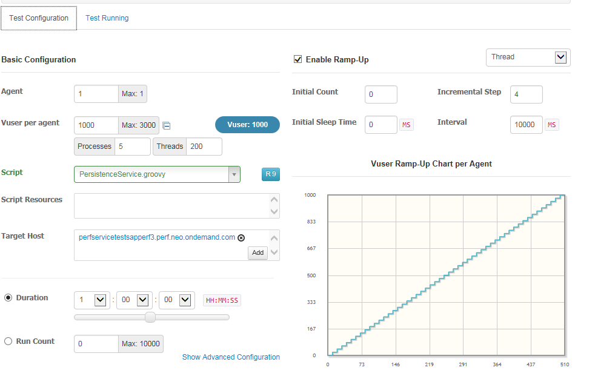
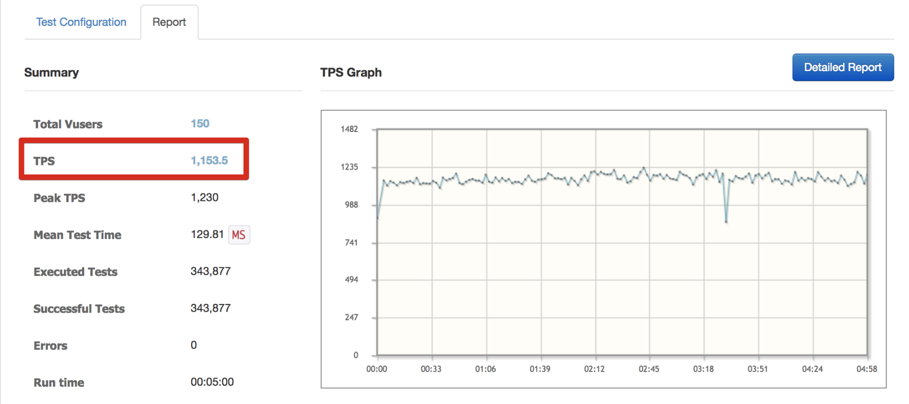
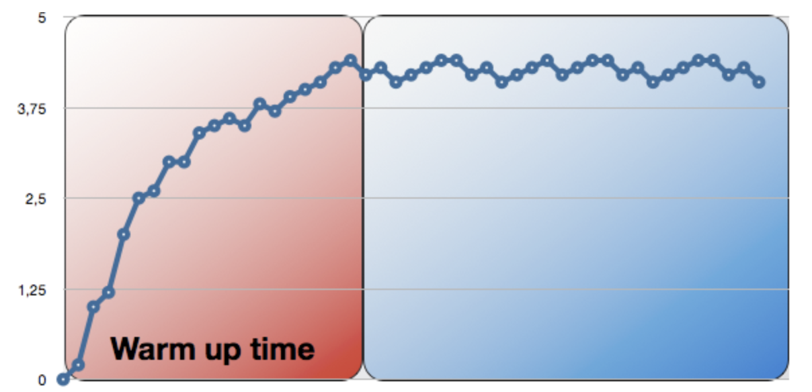
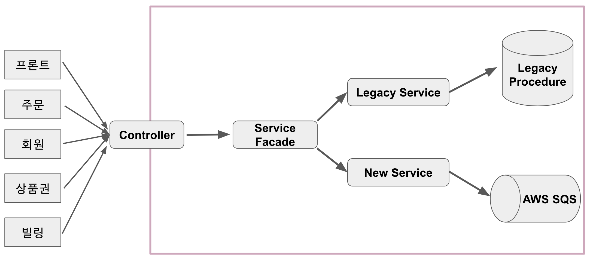
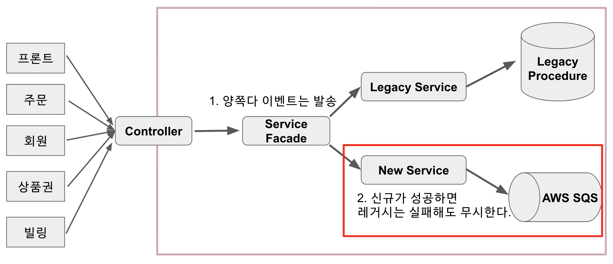
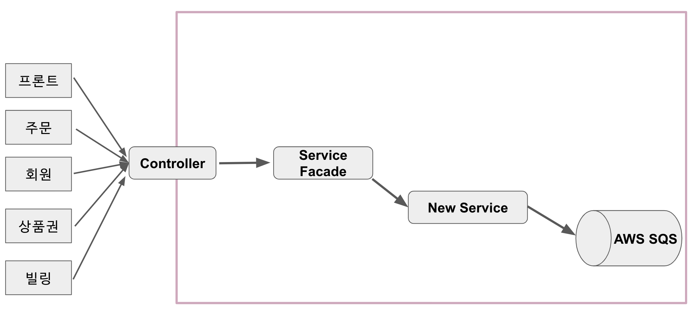

# 포인트 시스템 개편기 #2 - 오픈 준비

기존에 프로시저만 수행되던 시스템을 API 기반으로 전환하기 위해서 **모든 API는 2개씩** 준비해야만 했습니다.  

1. 레거시 프로시저를 랩핑한 API
2. 신규 도메인 모델 API

이렇게 구성한 이유는 다음과 같습니다.

* **롤백의 위험 부담 최소화**

만약 프로시저 랩핑 API가 없다면 다음과 같은 큰 위험이 있습니다.  

* 기존에 포인트를 쓰던 다른 서비스에서 프로시저 실행 -> API 호출로 전환
* 신규 API에 문제가 있어서 **롤백해야하는 상황** 발생
* 포인트 뿐만 아니라 **다른 서비스들도 모두 기존 프로시저 형태로 롤백**해야만함.

이건 너무나 큰 위험입니다.  
그래서 레거시 프로시저를 랩핑한 API가 선 오픈하고 운영 환경에서 충분히 테스트 한 뒤,
다른 서비스들이 하나씩 프로시저를 호출하는 코드를 API를 호출하도록 전환하도록 진행되었습니다.  
  
그래서 모든 준비와 검증을 2번씩 수행했습니다.

## 7. 성능 테스트

성능 테스트의 경우 네이버에서 만든 [Ngrinder](http://naver.github.io/ngrinder/)와 [Pinpoint](https://d2.naver.com/helloworld/1194202)를 사용했습니다.  



(Ngrinder)


(pinpoint)  
  
여러 좋은 툴이 있지만, 이 2개를 선택한 이유는 **익숙해서**입니다.  
Pinpoint는 이미 팀내에서 공식 모니터링툴로 계속해서 사용해오던 상태였으며, Ngrinder는 Spock, Gradle 등으로 Groovy 문법이 눈에 익은 상태여서 테스트 시나리오를 작성하기에 좋은 선택지였습니다.  

> 개인 프로젝트에서도 이 둘을 계속해서 사용해오던 상태였어서 다른 선택지를 굳이 찾을 필요가 없었습니다.

성능 테스트는 두번 진행했습니다.

1. 레거시 프로시저를 랩핑한 API의 성능 테스트
2. 신규 도메인 모델 API의 성능 테스트
  
특히 1번 테스트가 중요했습니다.  
이제는 신규 구축하는 포인트 시스템에서 모든 요청을 처리해야하는데, **기존에 서비스 별로 나눠처리 했던 프로시저 요청**으로는 정확한 부하 예측이 어려웠기 때문입니다.  
  
그래서 **주말 피크타임 주문수 * 5배**의 TPS를 성능 테스트의 기준으로 정했습니다.  
**포인트 적립과 가용 포인트 조회**가 가장 많은 사용이 있을 것이며, 이 요청은 **주문수에 비례**하기 때문에 주문수를 기준으로 정했습니다.  
  
성능 테스트 방식은 대부분 비슷할것 같습니다.

1. 시나리오 부하 테스트 도구 (JMeter, Ngrinder) 을 이용해 원하는 시나리오와 부하를 결정해 테스트 시작
2. 모니터링 도구 (NewRelic, Pinpoint, AWS CloudWatch)를 통해 **병목 지점 확인**
3. 병목 지점 해결 후 다시 1 ~ 2 수행

Ngrinder에서 다음과 같이 User수와 TPS를 조정하며 부하를 주고,



Pinpoint에서는 다음과 같이 각 요청의 응답 중 튀는 것이 있는지, 튄다면 어느 부분에서 많이 소요되었는지, 평균 응답 속도는 얼마나 걸리는지 등등을 확인합니다.


그리고 RDS의 사양은 해당 TPS 기준으로 CPU나 처리되는 쿼리가 얼마나 되는지 등등을 같이 확인합니다.


성능 테스트에 대한 튜토리얼을 개인 블로그에 작성했습니다.  
혹시나 성능 테스트를 전혀 안해보신 분들이라면 한번 참고해보셔도 좋을것 같습니다.

* [성능 튜닝 #1 - DB Connection](https://jojoldu.tistory.com/318)
* [성능 튜닝 #2 - 리눅스 커널 파라미터](https://jojoldu.tistory.com/319)
* [성능 튜닝 #3 - Nginx](https://jojoldu.tistory.com/322)
* [성능 튜닝 #4 - Open Files & tcp_max_tw_buckets](https://jojoldu.tistory.com/323)


### 7-1. 자바 어플리케이션 성능 테스트시 주의 사항

JVM 어플리케이션의 경우 Warm up Time이 존재합니다.



처음 Java 어플리케이션을 실행할 경우 **HotSpot 컴파일러의 최적화 작업으로 성능이 느립니다**.  
이는 성능 테스트시 주의해야할 점인데요.  
**첫번째 테스트 결과만 보면 대부분은 성능이 안좋기 때문**입니다.  
이미 충분히 Warm up한 뒤에 테스트해야만 정상적인 성능 테스트로 볼 수 있습니다.
  
그래서 포인트 시스템의 성능 테스트시 항상 같은 설정으로 **첫번째 테스트는 Warmup용으로 버리고** **2번째 이후 테스트들만 성능 비교**를 하였습니다.  
  
좀 더 자세한 내용을 알고 싶으신 분들은 아래 DZone 기사를 참고해보세요!

* [DZone - why-many-java-performance-test](https://dzone.com/articles/why-many-java-performance-test)


### 7-2. SQS 환경에서 Pintpoint 사용하기

기본적으로 Pintpoint는 HTTP Request가 올때 추적을 시작합니다.  
하지만 SQS와 같은 메세징 큐 서비스를 사용할때는 HTTP Request가 아닙니다.  
그러다보니 **Pintpoint의 기본 설정으로는 추적이 안됩니다**.  
  
Pinpoint에서는 이런 상황을 대비해서 **EntryPoint 설정**이 가능합니다.  


(pinpoint.config)  
  
> entrypoint에는 패키지명을 포함해서 Full Path로 메소드명을 기입해야합니다.  
여러 메소드를 지정해야할 경우 ```,```로 구분해서 등록하시면 됩니다.

위와 같이 설정할 경우 **지정된 메소드가 호출되면 추적**이 시작됩니다.  
저는 ```@SqsListener```가 지정된 메소드들을 모두 entrypoint로 지정했습니다.

```bash
profiler.entrypoint=com.woowabros.point.worker.listener.CommandListener.receiveCommand,com.woowabros.point.worker.listener.CommandListener.receiveCommand.receiveCommandCancel,com.woowabros.point.worker.listener.RefreshListener.receiveRefresh,com.woowabros.point.worker.listener.ExpireListener.receiveExpire
```


> 더 많은 설정 방법은 Pinpoint의 공식 [Document](https://naver.github.io/pinpoint/1.8.0/main.html)를 참고해보세요!
 

  


### 7-3. RDS R3 vs R4

대략 1억건 정도가 마이그레이션 되었을때, 도메인 모델의 변경이 필요한 것을 발견하였습니다.  
1억건 정도면 사실 엄청나게 많은 양은 아닙니다.  
또한 이전에 IDC에 구축한 DB에서 1억건 정도의 테이블에 Alter를 쳤을때 10분이내로 끝나기도 했어서 바로 ```Alter Table```를 수행했었는데요.  
  
**R4.2xlarge 환경에서 진행했더니 2시간이 지나도 끝나지 않았습니다**.  
  
RDS 사양의 문제인가 싶어 잠깐 최고 사양인 **8xlarge로 올려서 수행해도 전혀 개선이 되지 않았습니다**.  
왜 이런가 싶어 다른 팀의 수석님께 이상한것 같다고 여쭤보니 Cloud Watch를 같이 확인해주셨습니다.  
확인 결과!  
놀랍게도 ```Alter Table```을 수행하는 동안 **굉장히 많은 Network Throughput**이 발생한 것을 발견하였습니다.  


이상하다 싶어 RDS Compare 사이트를 찾아보니 RDS **R3의 경우 로컬 스토리지**를 사용하지만, **R4는 EBS**를 사용하는 것을 확인하였습니다.


([RDS Compare](https://www.ec2instances.info/rds/?min_vcpus=32))  
  

혹시나 싶어 **R3**.2xlarge로 변경 후 ```Alter Table```을 수행하니 10분도 안되서 완료 되었습니다.  
  
테스트로 R3와 R4를 번갈아가며 ```Alter Table```을 수행했는데 여전히 **R4에서는 2시간이상, R3에서는 몇분 이내에** 명령어가 수행되었습니다.  

> 아마도 R4에서는 ```Alter Table```을 하기 위해 원격 저장소와 네트워크 통신을 굉장히 많이 수행하다보니 2시간이 넘게 걸린것 같습니다.  
  
위 결론으로 신규 포인트 시스템은 **R3** 시리즈를 선택해 사용중입니다.  

물론 R4의 사양은 R3보다 훨씬 더 좋습니다.  
(위 그림에서 보신것처럼 CPU Processor가 차이 납니다.)  
  
아래는 성능 테스트 중에 두 RDS간의 성능을 비교한 Pintpoint 결과표입니다.


명확한 비교를 위해 높은 수치로 테스트를 수행해보니 성능 차이를 볼 수 있었습니다.  
R3.8xlarge로 **평균 3 ~ 5초** 정도 수행되는 Application이 R4.8xlarge로 수행할 경우 평균 **2 ~ 3초**로 개선되는 것을 확인할 수 있었습니다.  
  
그래서 꼭 R3를 써야하는건 아니고, 상황 및 테스트 결과에 따라 R3와 R4 사이에 선택하시면 좋을것 같습니다.

## 8. QA

QA 역시 성능 테스트와 마찬가지로 레거시 프로시저 API 버전과 신규 도메인 API 버전 2가지를 모두 테스트했습니다.


(TC 목록)  
  
QA 분들께 정말 죄송했던 것이, 구 API와 신 API를 각각 테스트해야한다는 것을 미리 얘기해드리지 못해 안그래도 부족했던 QA 일정을 더 촉박하게 만들었던 점입니다.  


### 8-1. Redis 캐시 갱신 문제

QA 기간 중에, **가끔 가용 포인트가 적립 내역과 다르다**는 내용이 나왔습니다.  
주문을 했는데 해당 내용이 가용 포인트 계산에 포함되지 않는다는 

```java
public class CommandWorkerService {
    @Transactional
    public Optional<PointEvent> earn(CommandMessage message) {
        
        ...
        /**
            point event, detail 등록
        **/

        ...

        redisSender.sendAvailablePoint(message.getUserId());
        
        ...

        return Optional.of(pointEvent);
    }
}
```

```java
public class CommandWorkerService {
    @Transactional
    public Optional<PointEvent> earn(CommandMessage message) {
        ...

        /**
            point event, detail 등록
        **/

        ...

        return Optional.of(pointEvent);
    }
}

public class CommandListener extends LatchListener {

    @SqsListener(value = SqsConstant.COMMAND, deletionPolicy = SqsMessageDeletionPolicy.NEVER)
    public void receiveCommand(@Payload CommandMessage message, Acknowledgment ack) {
        
        ...

        /**
            Service Method 실행 완료
        **/

        redisSender.sendAvailablePoint(message.getUserId());

        ...
    }
}
```

## 9. 오픈

사용자 분들은 **정상적으로 배달의 민족 서비스를 이용하는 과정에서 포인트 시스템이 완전히 교체** 되어야 한다는 것이였습니다.  
  
물론 저희는 이 요구사항을 진작에 들었기 때문에 다음과 같은 오픈 전략을 세웠습니다.

1. 레거시 프로시저를 랩핑한 API 선 오픈
2. 상품권, 회원, 프론트, 주문, 빌링 서비스에서 차례로 프로시저 호출 코드를 API 코드로 전환해서 배포
3. 

총 3단계로 진행했습니다.

1. 레거시 프로시저를 랩핑한 API 오픈
2. 레거시 API를 우선순위로 두고, 구 & 신 API 동시에 이벤트 발송하는 API로 전환
3. 신규 API를 우선순위로 두고, 구 & 신 API 동시에 이벤트 발송하는 API로 전환



(전체 구조)  
  

### 9-1. 레거시 프로시저를 랩핑한 API 오픈


7월 17일 레거시 프로시저를 랩핑한 API를 선 오픈했습니다.  
이때는 저희가 만든 신규 시스템에서 모든 비지니스 로직은 기존에 사용되던 포인트 시스템의 프로시저를 통해서 처리 되기 때문에 비지니스상 오류는 

그리고 차례로 그동안 포인트 프로시저를 사용했던 다른 시스템들이 API를 사용하는 패치가 진행되었습니다.  
  
1차 버전은 신규 API로 메시지가 발행되지 않는 버전이였습니다.  
실제 저

### 9-2. 레거시 API 우선 순위로 전환


모든 Endpoint가 프로시저가 아닌 저희가 랩핑한 API로 전환된 것을 확인하고, 일주일간 모니터링을 진행했습니다.  
그리고 7월 25일 2차 버전인 **레거시 API 우선순위 API로 전환**했습니다.  

이번 버전은 모든 API에 대한 요청은 기존의 프로시저로 처리하되, 신규 도메인 API에도 이벤트 메세지를 발송하도록 구성하였습니다.  


즉, 프로시저가 성공하고 신규 API 가 실패하면 

대신 실패한 메세지는 로그로 Json 형태 그대로 남기게 하여, **어떤 문제가 있어 실패했는지 확인 후**  다시 SQS로 재전송 하였습니다.  


### 9-3. 신규 API 우선순위로 전환



### 9-4. 레거시 API 삭제



## 마무리


신규 포인트 시스템은 3명이서 3개월만에 프로시저 기반의 시스템을 도메인부터 아키텍처까지 완전히 전환시켰습니다.  

그 과정에서 개편을 하면서 가장 큰 역할을 하는게 무엇일까 생각해보면 다음과 같은 답이 나왔습니다.  
  
**다른 팀의 전폭적인 지지와 지원**이 있어야만 빠른 시간내에 개편이 가능하다는 것을 배웠습니다.  
  
* 2주만에 레거시 API와 신규 API를 모두 QA 해주신 QA팀
* 짧은 기간임에도 프로시저 호출 코드를 모두 API코드로 전환해주신 프론트, 상품권, 회원, 주문팀


오픈 뒤에 아주 좋은 타이밍에 월드컵이 있었습니다.  

* [멕시코전으로 배달의민족 역대 최대 주문수 돌파 - 블로터](https://www.bloter.net/archives/313238)

주문수가 역대 최대치가 발생한 만큼 포인트 적립, 사용수 역대 최대치가 발생했는데요.  
장애나 응답 지연 없이 아주 깔끔하게 신규 포인트 시스템은 이벤트에 대응을 하였습니다.    

